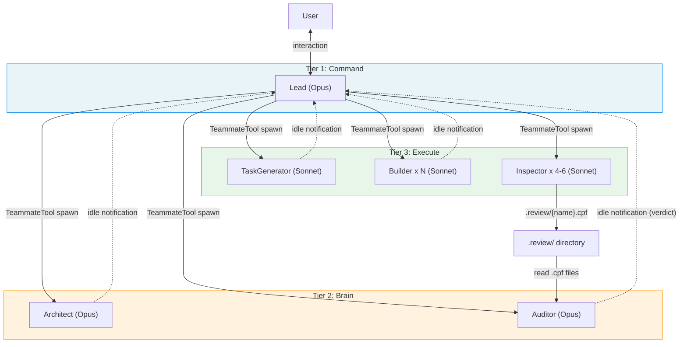
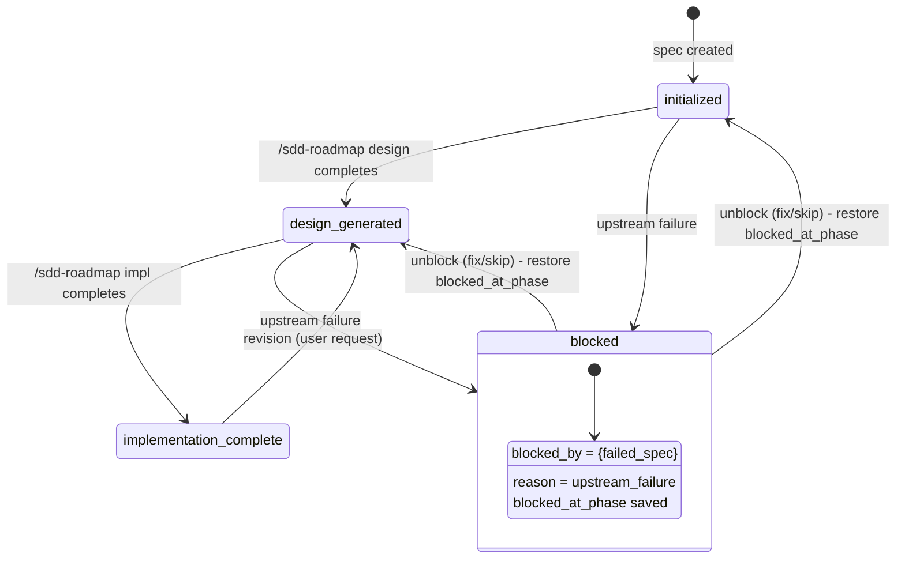
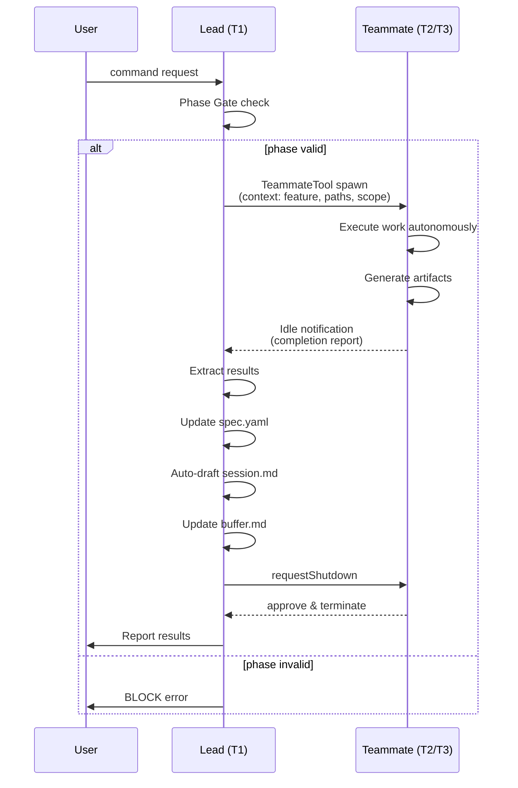
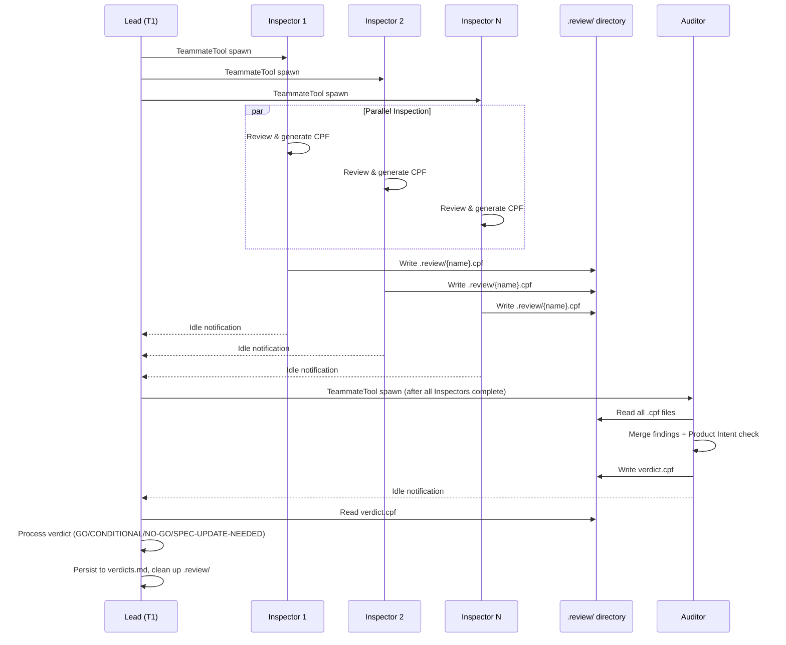

# Core Architecture

## Specifications

### Introduction
SDD フレームワークの基盤アーキテクチャ。Agent Teams モードによる 3-tier hierarchy、Phase Gate による状態遷移制御、spec.yaml 中心の状態管理、アーティファクト所有権モデル、チームメイトライフサイクル管理、Teammate Failure Handling、行動規則、実行規約、Git ワークフローを定義する。全ての他スペックはこのアーキテクチャ定義に依存する。

### Spec 1: 3-Tier Role Hierarchy
**Goal:** Lead (T1/Command), Brain (T2: Architect/Auditor), Execute (T3: TaskGenerator/Builder/Inspector) の3層ロール階層と各ロールの責務を定義

**Acceptance Criteria:**
1. T1 Lead は以下の責務を持つ: ユーザーインタラクション、phase gate チェック、spawn 計画、progress tracking、teammate lifecycle 管理、spec.yaml 更新、Knowledge 集約
2. T2 Architect は design.md + research.md を生成する（設計生成、リサーチ、ディスカバリー）
3. T2 Auditor は Inspector の findings を merge して verdict (GO/CONDITIONAL/NO-GO/SPEC-UPDATE-NEEDED) を出力し、Product Intent チェックを行う
4. T3 TaskGenerator は tasks.yaml を生成する（タスク分解、並列性分析、ファイル所有権、Builder グルーピングを含む）
5. T3 Builder は RED→GREEN→REFACTOR の TDD サイクルで実装し、`[PATTERN]`/`[INCIDENT]` タグを報告する
6. T3 Inspector は個別レビュー観点で CPF findings を出力する（design/impl: 6 inspectors 並列、dead-code: 4 inspectors 並列）
7. T2 ロールは Opus モデルで spawn される
8. T3 ロールは Sonnet モデルで spawn される

### Spec 2: Chain of Command
**Goal:** ロール間の指揮系統とコミュニケーション経路を定義

**Acceptance Criteria:**
1. Lead は `TeammateTool` を使って T2/T3 teammates を spawn する
2. `Task` tool は spawn に使用してはならない（`Task` は isolated subagent を作り、`SendMessageTool` が届かないため）
3. Teammates は作業完了後に structured completion report を最終テキストとして出力する
4. Lead は completion output を読み取り次のアクションを決定する
5. Review pipeline はファイルベース通信を使用する。Inspector は `.review/{name}.cpf` にファインディングスを書き出し、Auditor は `.review/` ディレクトリから `.cpf` ファイルを読み込む
6. SendMessageTool は Lead ↔ Teammate の直接通信に使用する。レビューデータの転送には使用しない

### Spec 3: State Management
**Goal:** spec.yaml を中心とした状態管理モデルを定義

**Acceptance Criteria:**
1. spec.yaml は Lead のみが更新可能（T2/T3 teammates は直接更新不可）
2. Teammates は作業アーティファクト（design.md, tasks.yaml, コード）を生成し、completion report を出力する
3. Lead は completion report から結果を抽出し、spec.yaml のメタデータ（phase, version_refs, changelog）を更新する
4. Pipeline state は spec.yaml が single source of truth（handover には保存しない）

### Spec 4: Artifact Ownership
**Goal:** 各アーティファクトの作成・変更権限と Lead の操作制限を定義

**Acceptance Criteria:**
1. design.md: Lead は read-only、Architect が作成・変更
2. research.md: Lead は read-only、Architect が作成・変更
3. tasks.yaml: Lead はタスクステータス更新（`done` マーキング）のみ、TaskGenerator が作成・構造変更
4. Implementation code: Lead は read-only、Builder が変更
5. Lead は design.md のコンテンツ書き換え、tasks.yaml のタスク定義変更、コードの直接編集を行ってはならない
6. 変更要求は `/sdd-roadmap revise {feature}` 経由（roadmap なしの場合は 1-spec roadmap が自動作成される）
7. コンテンツ変更は必ず担当 teammate 経由でルーティングされる

### Spec 5: Phase Gate System
**Goal:** `initialized` → `design-generated` → `implementation-complete` (+ `blocked`) のフェーズ遷移制御

**Acceptance Criteria:**
1. Teammate spawn 前に Lead は `spec.yaml.phase` が要求されたオペレーションに適切か検証する
2. phase が `blocked` の場合: `"{feature} is blocked by {blocked_info.blocked_by}"` でブロックする
3. phase が未知の値の場合: `"Unknown phase '{phase}'"` でブロックする
4. phase gate 検証失敗時はユーザーにエラーを報告し、teammate を不必要に spawn しない
5. フェーズ遷移は `initialized` → `design-generated` → `implementation-complete` の順序に従う
6. Revision フロー: `implementation-complete` → `design-generated` → (full pipeline) → `implementation-complete`
7. 各 phase gate は次のコマンドによって強制される

### Spec 6: Teammate Lifecycle
**Goal:** spawn → execute → idle notification → dismiss のライフサイクル管理

**Acceptance Criteria:**
1. Lead が `TeammateTool` で teammate を spawn し、spawn prompt にコンテキスト（feature, paths, scope, instructions）を渡す
2. Teammate は自律的に作業を実行する
3. Teammate は structured completion report を最終テキストとして出力する
4. Teammate は自動的に idle になり、idle notification を Lead に送信する
5. Lead は idle notification から結果を抽出する（artifacts created, test results, knowledge tags, blocker info）
6. Lead は spec.yaml メタデータを更新する（phase, version_refs, changelog）
7. Lead は session.md を auto-draft し、decisions.md に記録し、buffer.md を更新する
8. Lead は次のアクションを決定する（次の teammate spawn、ユーザーへのエスカレーション等）
9. Lead は teammate に shutdown request を送り、teammate が approve して終了する

### Spec 7: Review Pipeline Lifecycle
**Goal:** Inspector + Auditor のレビューパイプラインにおけるライフサイクル

**Acceptance Criteria:**
1. Lead は Inspectors を先に spawn する（全て `TeammateTool` 経由）。全 Inspector 完了後に Auditor を spawn する
2. Inspectors は `.review/{name}.cpf` ファイルに CPF findings を書き出す。Auditor は `.review/` ディレクトリから全 `.cpf` ファイルを読み込み、`verdict.cpf` を書き出す
3. Lead は `verdict.cpf` を読み取り、verdicts.md に永続化し、`.review/` ディレクトリを削除する

### Spec 8: Builder Parallel Coordination
**Goal:** 複数 Builder の並列実行とインクリメンタル処理

**Acceptance Criteria:**
1. 複数 Builder が並列実行される場合、Lead は各 Builder の completion report を到着順に読み取る
2. 各 completion 時: tasks.yaml の完了タスクを `done` にマーク、ファイル収集、knowledge tags 保存
3. 次 wave のタスクがアンブロックされた場合、完了した Builder を dismiss して次 wave の Builders を即座に spawn する
4. 最終的な spec.yaml 更新（phase, implementation.files_created）は全 Builders 完了後にのみ行う

### Spec 9: Agent Teams Known Constraints
**Goal:** Agent Teams プラットフォームの既知の制約をドキュメント化

**Acceptance Criteria:**
1. No shared memory: Teammates は会話コンテキストを共有しない。全コンテキストは spawn prompt で渡す。レビューデータはファイルベース (.review/ ディレクトリ) で転送する
2. Messaging is bidirectional: Lead ↔ Teammate, Teammate ↔ Teammate 全てサポート。ただしフレームワークの標準パターンは Lead が idle notification output を読み取る（message-based ではない）
3. フレームワーク標準通信: (1) spawn prompt によるコンテキスト渡し、(2) idle notification による completion report、(3) ファイルベース (.review/) によるレビューデータ転送。SendMessage は Lead ↔ Teammate の direct message 用
4. 同時 teammate 上限: 24（3 pipelines x 7 teammates + headroom）
5. Consensus mode (`--consensus N`) は N pipelines を並列 spawn する（7xN teammates）

### Spec 10: Teammate Failure Handling
**Goal:** Teammate が出力ファイルを生成せずに idle になった場合のハンドリング

**Acceptance Criteria:**
1. ファイルベースレビューは冪等（同一 `.review/` ディレクトリ、同一ファイルパス）
2. Teammate が出力ファイルを生成せずに idle になった場合、Lead は自己判断で retry、skip、または利用可能なファイルから結果を導出する
3. 特別なリカバリモードは不要 — retry は初回と同じフロー

### Spec 11: Behavioral Rules
**Goal:** Lead の自律性と compact 後の行動制約を定義

**Acceptance Criteria:**
1. Compact 操作後は常にユーザーの次の指示を待つ。compact 後に自律的にアクションを開始してはならない
2. Compact 後に進行中だったタスクを、ユーザーが明示的に指示しない限り継続・再開してはならない
3. ユーザーの指示に正確に従い、そのスコープ内で自律的に行動する: 必要なコンテキストを収集し、要求された作業を end-to-end で完了する
4. 質問はエッセンシャルな情報が欠落しているか、致命的に曖昧な場合にのみ行う

### Spec 12: Execution Conventions
**Goal:** Bash コマンド実行、ステアリング参照、インラインスクリプトの規約を定義

**Acceptance Criteria:**
1. Bash の `command` 引数は実行可能ファイルで始めなければならない。`#` コメント行をプリペンドしてはならない。人間可読なコンテキストは Bash tool の `description` パラメータを使用する
2. プロジェクトツール（test, lint, build, format, run）を実行する際は `steering/tech.md` の Common Commands の正確なコマンドパターンを使用する。代替の呼び出し方法を使用してはならない（例: tech.md が `uv run pytest` なら bare `pytest` や `python3 -m pytest` は不可）
3. インラインスクリプティング（`-c` フラグ、heredocs）は `steering/tech.md` のプロジェクトランタイムをプレフィックスする（例: `uv run python -c "..."` であり bare `python -c "..."` ではない）

### Spec 13: Git Workflow
**Goal:** Trunk-based development の Git ワークフローを定義

**Acceptance Criteria:**
1. Trunk-based development: main は常に HEAD
2. 全ての作業はデフォルトで main 上で行う
3. Feature/topic branches はオプショナル。常に main にマージして削除する
4. main は常に最新の状態を維持する
5. マージ済みブランチは即座に削除する（stale branches を残さない）
6. Wave completion 後のコミット: Wave Quality Gate パス後に Lead が直接コミットする
7. Pipeline completion (1-spec roadmap) 後のコミット: 個別パイプライン完了後に Lead が直接コミットする
8. コミットスコープ: 完了した作業の全 spec artifacts + implementation changes
9. コミットメッセージフォーマット: `Wave {N}: {summary}`（multi-spec）または `{feature}: {summary}`（1-spec roadmap）
10. Release flow: `/sdd-release <patch|minor|major> 
` で自動化。エコシステム自動検出（Python, TypeScript, Rust, SDD Framework, Other）
11. Release branch は snapshot であり、main にはマージバックしない

### Spec 14: Settings Configuration
**Goal:** Agent Teams 有効化と基本パーミッションの設定

**Acceptance Criteria:**
1. `settings.json` に `CLAUDE_CODE_EXPERIMENTAL_AGENT_TEAMS=1` が環境変数として設定されている
2. `permissions.allow` にベースラインの Bash パーミッション（`Bash(cat:*)`, `Bash(echo:*)`）が定義されている
3. 設定は JSON 形式で `env` と `permissions` セクションに分かれている

### Non-Goals
- Agent Teams API 自体の実装（Claude Code プラットフォームのスコープ）
- Claude Code 本体の変更
- settings.json の動的更新メカニズム
- 個別コマンド（sdd-design, sdd-impl 等）のオーケストレーションロジック（各 spec のスコープ）
- Handover システムの詳細（session-persistence spec のスコープ）
- Knowledge 蓄積の詳細（knowledge-system spec のスコープ）
- Auto-Fix Loop の詳細（roadmap-orchestration spec のスコープ）
- レビューパイプラインの Inspector/Auditor 内部ロジック（design-review / impl-review spec のスコープ）

## Overview
フレームワーク全体の基盤定義。CLAUDE.md のコアセクション群と settings.json で構成される。全ての他スペック（design-pipeline, steering-system, roadmap-orchestration 等）はこのアーキテクチャ定義に依存する。

CLAUDE.md は Markdown ベースの「フレームワーク定義ドキュメント」として機能し、Lead（T1）が読み込んでフレームワーク全体の振る舞いを規定する。settings.json は Claude Code の Agent Teams 機能を有効化し、ベースラインのパーミッションを設定する。

このスペックは retroactive spec（既存実装の事後仕様化）であり、CLAUDE.md と settings.json の既存実装を正式な設計ドキュメントとして記述する。

## Architecture

### Architecture Pattern & Boundary Map

3-tier hierarchy パターン（Command / Brain / Execute）。各層の境界は以下の通り:

- **Command Layer (T1)**: Lead のみ。ユーザーとの唯一のインターフェース。全状態の所有者。
- **Brain Layer (T2)**: Architect と Auditor。高レベルの意思決定（設計生成、レビュー統合）を担当。Opus モデルで実行。
- **Execute Layer (T3)**: TaskGenerator, Builder, Inspector。具体的な実行作業を担当。Sonnet モデルで実行。複数インスタンスの並列 spawn が可能。

層間の通信は TeammateTool (spawn/shutdown) と idle notification (completion report) が標準。レビューパイプラインはファイルベース (.review/ ディレクトリ) で通信する。

### Phase State Machine

### Teammate Lifecycle Sequence

### Review Pipeline Sequence

### Teammate Failure Handling

ファイルベースレビュープロトコルにより、全 teammate の出力は冪等（同一 `.review/` ディレクトリ、同一ファイルパス）。Teammate が出力ファイルを生成せずに idle になった場合、Lead は自己判断で retry、skip、または利用可能なファイルから結果を導出する。特別なリカバリモードは不要 — retry は初回と同じフロー。

### Technology Stack
| Layer | Choice / Version | Role in Feature | Notes |
|-------|------------------|-----------------|-------|
| Agent API | Claude Code Agent Teams | `TeammateTool` による multi-agent orchestration、ファイルベースレビュー通信 | Experimental (`CLAUDE_CODE_EXPERIMENTAL_AGENT_TEAMS=1`) |
| Configuration | `settings.json` (JSON) | Agent Teams 有効化、Bash パーミッション定義 | |
| Framework Definition | `CLAUDE.md` (Markdown) | フレームワーク全体の振る舞い定義 | テンプレート変数 `{{SDD_VERSION}}` 使用 |
| Model (T1/T2) | Opus | Lead, Architect, Auditor の推論 | 高精度な判断が必要なロール |
| Model (T3) | Sonnet | TaskGenerator, Builder, Inspector の実行 | コスト効率重視のロール |

## System Flows

### Flow 1: Phase Gate Enforcement
1. ユーザーがコマンドを発行する
2. Lead は対象 spec の `spec.yaml.phase` を読み取る
3. phase が `blocked` → `"{feature} is blocked by {blocked_info.blocked_by}"` でブロック
4. phase が未知の値 → `"Unknown phase '{phase}'"` でブロック
5. phase が要求オペレーションに適切でない → エラーを報告
6. phase が適切 → teammate spawn に進む

### Flow 2: Standard Teammate Lifecycle
1. Lead が `TeammateTool` で teammate を spawn（spawn prompt にコンテキストを含む）
2. Teammate が自律的に作業実行
3. Teammate が structured completion report を出力
4. Teammate が idle になり、idle notification を Lead に送信
5. Lead が idle notification から結果を抽出
6. Lead が spec.yaml を更新（phase, version_refs, changelog）
7. Lead が session.md を auto-draft、decisions.md に記録、buffer.md を更新
8. Lead が次のアクションを決定
9. Lead が teammate に `requestShutdown` を送信
10. Teammate が approve して終了

### Flow 3: Builder Parallel Coordination
1. Lead が複数 Builders を並列 spawn
2. 各 Builder が独立して作業を実行
3. Builder の completion report が到着するたびに:
   a. tasks.yaml の完了タスクを `done` にマーク
   b. ファイルを収集
   c. Knowledge tags を保存
4. 次 wave のタスクがアンブロックされた場合、完了した Builder を dismiss して次 wave Builders を即座に spawn
5. 全 Builders 完了後に spec.yaml を最終更新（phase, implementation.files_created）

### Flow 4: Teammate Failure Handling
1. Teammate が出力ファイルを生成せずに idle になったことを検出
2. Lead は自己判断で以下のいずれかを実行:
   a. 同じフローで retry（特別なリカバリモードなし）
   b. skip して利用可能な結果で続行
   c. 利用可能なファイルから結果を導出
3. ファイルベースプロトコルにより冪等: retry は初回と同一パスに同一ファイルを出力

### Flow 5: Review Pipeline (File-Based)
1. Lead が Inspectors を spawn（全て `TeammateTool` 経由）
2. 各 Inspector が並列でレビューを実行し、`.review/{name}.cpf` に findings を書き出す
3. 全 Inspector 完了後、Lead が Auditor を spawn
4. Auditor が `.review/` ディレクトリから全 `.cpf` ファイルを読み込む
5. Auditor が findings を merge し Product Intent チェックを実行
6. Auditor が `verdict.cpf` を `.review/` に書き出す
7. Lead が `verdict.cpf` を読み取り、verdict を処理する
8. Lead が verdicts.md に永続化し、`.review/` ディレクトリを削除する

## Components and Interfaces

| Component | Domain/Layer | Intent | Files |
|-----------|--------------|--------|-------|
| Role Architecture | CLAUDE.md / Framework Core | 3-Tier Hierarchy 定義、各ロールの責務、Tier-Model マッピング | `framework/claude/CLAUDE.md` (§Role Architecture) |
| Chain of Command | CLAUDE.md / Framework Core | TeammateTool/Task tool の使い分け、通信経路、completion report パターン、ファイルベースレビュー通信 | `framework/claude/CLAUDE.md` (§Chain of Command) |
| State Management | CLAUDE.md / Framework Core | spec.yaml 所有権、teammate の artifact 生成→Lead の metadata 更新フロー | `framework/claude/CLAUDE.md` (§State Management) |
| Artifact Ownership | CLAUDE.md / Framework Core | design.md/research.md/tasks.yaml/code の所有権マトリクス、Lead の操作制限 | `framework/claude/CLAUDE.md` (§Artifact Ownership) |
| Phase Gate | CLAUDE.md / Framework Core | phase 遷移制御、blocked/unknown phase ハンドリング、gate enforcement | `framework/claude/CLAUDE.md` (§Phase Gate) |
| Teammate Lifecycle | CLAUDE.md / Framework Core | spawn→execute→idle→dismiss サイクル、Builder 並列 coordination | `framework/claude/CLAUDE.md` (§Teammate Lifecycle) |
| Agent Teams Constraints | CLAUDE.md / Framework Core | No shared memory、messaging 方向性、concurrent limit、consensus mode | `framework/claude/CLAUDE.md` (§Agent Teams Known Constraints) |
| Teammate Failure Handling | CLAUDE.md / Framework Core | ファイルベース冪等性による簡素化されたリトライフロー | `framework/claude/CLAUDE.md` (§Teammate Failure Handling) |
| Review Pipeline | CLAUDE.md / Framework Core | ファイルベース (.review/) による Inspector→Auditor 通信、verdict.cpf 出力 | `framework/claude/CLAUDE.md` (§Review Pipeline Lifecycle, §File-Based Review Protocol) |
| Behavioral Rules | CLAUDE.md / Behavioral | Compact 後の行動制約、自律性スコープ、質問ポリシー | `framework/claude/CLAUDE.md` (§Behavioral Rules) |
| Execution Conventions | CLAUDE.md / Behavioral | Bash コマンドフォーマット、steering 参照、inline script runtime | `framework/claude/CLAUDE.md` (§Execution Conventions) |
| Git Workflow | CLAUDE.md / Workflow | Trunk-based development、branch strategy、commit timing、release flow | `framework/claude/CLAUDE.md` (§Git Workflow) |
| Settings Configuration | Configuration | Agent Teams 環境変数、Bash パーミッション | `framework/claude/settings.json` |

## Revision Notes
### v1.1.0 (2026-02-22) — v0.18.0 Retroactive Alignment
- Review pipeline: SendMessage ベース → ファイルベース (.review/ ディレクトリ)
- Recovery Protocol (Spec 10, 11) → Teammate Failure Handling (Spec 10) に簡素化
- 個別コマンド廃止: 全て /sdd-roadmap 経由
- Agent 定義パス: framework/claude/agents/ → framework/claude/sdd/settings/agents/
