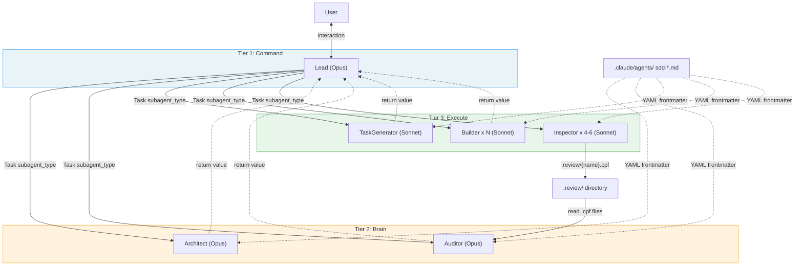
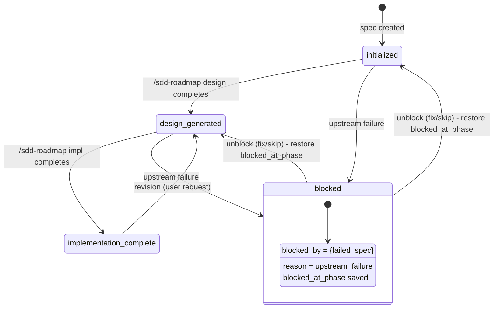
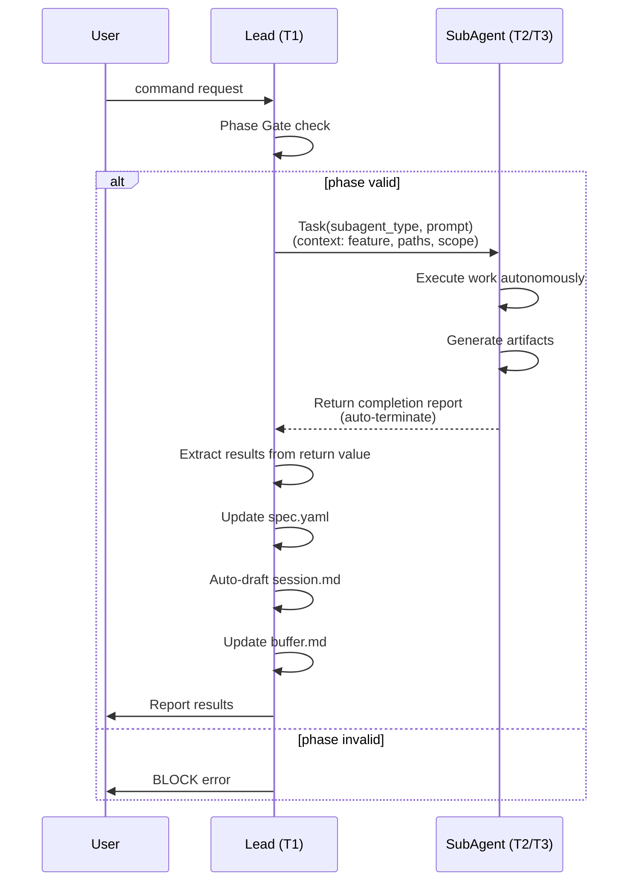
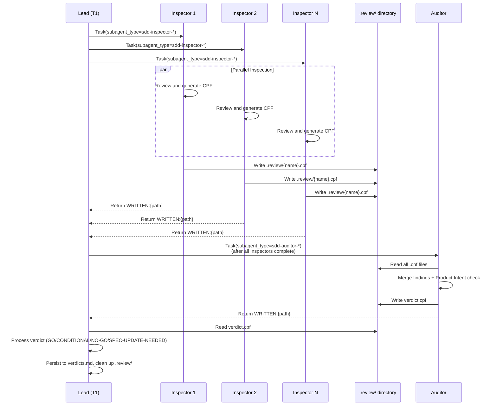

# Core Architecture

## Specifications

### Introduction
SDD フレームワークの基盤アーキテクチャ。SubAgent アーキテクチャによる 3-tier hierarchy、Phase Gate による状態遷移制御、spec.yaml 中心の状態管理、アーティファクト所有権モデル、SubAgent ライフサイクル管理、行動規則、実行規約、Git ワークフローを定義する。全ての他スペックはこのアーキテクチャ定義に依存する。

### Spec 1: 3-Tier Role Hierarchy
**Goal:** Lead (T1/Command), Brain (T2: Architect/Auditor), Execute (T3: TaskGenerator/Builder/Inspector) の3層ロール階層と各ロールの責務を定義

**Acceptance Criteria:**
1. T1 Lead は以下の責務を持つ: ユーザーインタラクション、phase gate チェック、spawn 計画、progress tracking、SubAgent ライフサイクル管理、spec.yaml 更新、Knowledge 集約
2. T2 Architect は design.md + research.md を生成する（設計生成、リサーチ、ディスカバリー）
3. T2 Auditor は Inspector の findings を merge して verdict (GO/CONDITIONAL/NO-GO/SPEC-UPDATE-NEEDED) を出力し、Product Intent チェックを行う
4. T3 TaskGenerator は tasks.yaml を生成する（タスク分解、並列性分析、ファイル所有権、Builder グルーピングを含む）
5. T3 Builder は RED→GREEN→REFACTOR の TDD サイクルで実装し、`[PATTERN]`/`[INCIDENT]` タグを報告する
6. T3 Inspector は個別レビュー観点で CPF findings を出力する（design/impl: 6 inspectors 並列、dead-code: 4 inspectors 並列）
7. T2 ロールは `model: opus` で実行される（エージェント定義 YAML frontmatter で指定）
8. T3 ロールは `model: sonnet` で実行される（エージェント定義 YAML frontmatter で指定）

### Spec 2: Chain of Command
**Goal:** ロール間の指揮系統とコミュニケーション経路を定義

**Acceptance Criteria:**
1. Lead は `Task(subagent_type="sdd-{name}", prompt="...")` を使って T2/T3 SubAgent を起動する
2. SubAgent は作業完了後に structured completion report をテキストとして返す。Lead は Task の戻り値として結果を受け取る
3. Review pipeline はファイルベース通信を使用する。Inspector は `.review/{name}.cpf` にファインディングスを書き出し、Auditor は `.review/` ディレクトリから `.cpf` ファイルを読み込む
4. SubAgent 間の直接メッセージング機能は存在しない。全ての調整は Lead 経由または共有ファイルシステム経由で行う

### Spec 3: State Management
**Goal:** spec.yaml を中心とした状態管理モデルを定義

**Acceptance Criteria:**
1. spec.yaml は Lead のみが更新可能（T2/T3 SubAgent は直接更新不可）
2. SubAgent は作業アーティファクト（design.md, tasks.yaml, コード）を生成し、completion report をテキストとして返す
3. Lead は Task の戻り値から結果を抽出し、spec.yaml のメタデータ（phase, version_refs, changelog）を更新する
4. Pipeline state は spec.yaml が single source of truth（handover には保存しない）

### Spec 4: Artifact Ownership
**Goal:** 各アーティファクトの作成・変更権限と Lead の操作制限を定義

**Acceptance Criteria:**
1. design.md: Lead は read-only、Architect が作成・変更
2. research.md: Lead は read-only、Architect が作成・変更
3. tasks.yaml: Lead はタスクステータス更新（`done` マーキング）のみ、TaskGenerator が作成・構造変更
4. Implementation code: Lead は read-only、Builder が変更
5. Lead は design.md のコンテンツ書き換え、tasks.yaml のタスク定義変更、コードの直接編集を行ってはならない
6. 変更要求は `/sdd-roadmap revise {feature}` 経由（roadmap なしの場合は 1-spec roadmap が自動作成される）
7. コンテンツ変更は必ず担当 SubAgent 経由でルーティングされる

### Spec 5: Phase Gate System
**Goal:** `initialized` → `design-generated` → `implementation-complete` (+ `blocked`) のフェーズ遷移制御

**Acceptance Criteria:**
1. SubAgent 起動前に Lead は `spec.yaml.phase` が要求されたオペレーションに適切か検証する
2. phase が `blocked` の場合: `"{feature} is blocked by {blocked_info.blocked_by}"` でブロックする
3. phase が未知の値の場合: `"Unknown phase '{phase}'"` でブロックする
4. phase gate 検証失敗時はユーザーにエラーを報告し、SubAgent を不必要に起動しない
5. フェーズ遷移は `initialized` → `design-generated` → `implementation-complete` の順序に従う
6. Revision フロー: `implementation-complete` → `design-generated` → (full pipeline) → `implementation-complete`
7. 各 phase gate は次のコマンドによって強制される

### Spec 6: SubAgent Lifecycle
**Goal:** 起動 → 実行 → 結果返却の SubAgent ライフサイクル管理

**Acceptance Criteria:**
1. Lead が `Task(subagent_type="sdd-{name}", prompt="...")` で SubAgent を起動し、prompt にコンテキスト（feature, paths, scope, instructions）を渡す
2. SubAgent は自律的に作業を実行する
3. SubAgent は structured completion report をテキストとして返す
4. SubAgent は作業完了後に自動的に終了する（明示的な shutdown は不要）
5. Lead は Task の戻り値から結果を抽出する（artifacts created, test results, knowledge tags, blocker info）
6. Lead は spec.yaml メタデータを更新する（phase, version_refs, changelog）
7. Lead は session.md を auto-draft し、decisions.md に記録し、buffer.md を更新する
8. Lead は次のアクションを決定する（次の SubAgent 起動、ユーザーへのエスカレーション等）

### Spec 7: Review Pipeline Lifecycle
**Goal:** Inspector + Auditor のレビューパイプラインにおけるライフサイクル

**Acceptance Criteria:**
1. Lead は Inspector SubAgent を起動する（全て `Task(subagent_type=...)` 経由）。全 Inspector 完了後に Auditor SubAgent を起動する
2. Inspectors は `.review/{name}.cpf` ファイルに CPF findings を書き出す。Auditor は `.review/` ディレクトリから全 `.cpf` ファイルを読み込み、`verdict.cpf` を書き出す
3. Lead は `verdict.cpf` を読み取り、verdicts.md に永続化し、`.review/` ディレクトリを削除する

### Spec 8: Builder Parallel Coordination
**Goal:** 複数 Builder の並列実行とインクリメンタル処理

**Acceptance Criteria:**
1. 複数 Builder SubAgent が並列実行される場合、Lead は各 Builder の結果を到着順に読み取る
2. 各 completion 時: tasks.yaml の完了タスクを `done` にマーク、ファイル収集、knowledge tags 保存
3. 次 wave のタスクがアンブロックされた場合、次 wave の Builder SubAgent を即座に起動する
4. 最終的な spec.yaml 更新（phase, implementation.files_created）は全 Builders 完了後にのみ行う

### Spec 9: SubAgent Platform Constraints
**Goal:** SubAgent アーキテクチャのプラットフォーム制約をドキュメント化

**Acceptance Criteria:**
1. No shared memory: SubAgent は Lead の会話コンテキストを受け取らない（CLAUDE.md も受け取らない）。全コンテキストは Task の prompt で渡す。レビューデータはファイルベース (.review/ ディレクトリ) で転送する
2. No peer messaging: SubAgent 間の直接通信は不可。全調整は Lead 経由またはファイルシステム経由
3. フレームワーク標準通信: (1) Task prompt によるコンテキスト渡し、(2) Task 戻り値による completion report、(3) ファイルベース (.review/) によるレビューデータ転送
4. SubAgent は自動終了: 作業完了後に自動的に終了し、Lead に結果を返す。明示的な shutdown/dismiss は不要
5. 各エージェント定義は YAML frontmatter で `tools` を指定し、最小権限の原則に従う。いずれの SubAgent も Task ツールを持たない（SubAgent が他の SubAgent を起動することを禁止）

### Spec 10: SubAgent Failure Handling
**Goal:** SubAgent が正常に結果を返さなかった場合のハンドリング

**Acceptance Criteria:**
1. ファイルベースレビューは冪等（同一 `.review/` ディレクトリ、同一ファイルパス）
2. SubAgent が出力ファイルを生成せずに終了した場合、Lead は自己判断で retry、skip、または利用可能なファイルから結果を導出する
3. 特別なリカバリモードは不要 — retry は初回と同じフロー（同じ Task 呼び出し）

### Spec 11: Output Suppression
**Goal:** Review SubAgent のテキスト出力抑制による Lead コンテキスト保護

**Acceptance Criteria:**
1. Review SubAgent（Inspector/Auditor）は分析結果をファイルに書き出した後、テキスト出力を最小限に抑制する
2. 出力抑制の理由: Lead のコンテキストバジェット保護（トークン効率）。Task の戻り値は Lead のコンテキストに挿入されるため、大量のテキスト出力はトークンを浪費する
3. Inspector/Auditor はファイル書き出し後 `WRITTEN:{path}` のみを返して終了する。全分析はファイルに出力し、テキスト戻り値は最小限にする

### Spec 12: Agent Definition Format
**Goal:** 全 23 エージェント定義ファイルの配置場所とフォーマットを定義

**Acceptance Criteria:**
1. 全エージェント定義ファイルは `.claude/agents/` に配置する（Claude Code の SubAgent 自動検出パス）
2. ファイル名は `sdd-{role}[-{specialization}].md` パターンに従う
3. YAML frontmatter で `name`, `description`, `model`, `tools` を指定する
4. `description` フィールドは SDD フレームワーク固有の文言にする（汎用的な記述を避け、auto-delegation を防止）
5. `tools` フィールドは最小権限の原則に従い、各ロールに必要なツールのみを列挙する
6. いずれのエージェントも `Task` ツールを持たない（SubAgent の再帰的起動を禁止）
7. YAML frontmatter の後にエージェントの instructions（role, mission, execution steps 等）を Markdown で記述する

### Spec 13: Behavioral Rules
**Goal:** Lead の自律性と compact 後の行動制約を定義

**Acceptance Criteria:**
1. Compact 操作後は常にユーザーの次の指示を待つ。compact 後に自律的にアクションを開始してはならない
2. Compact 後に進行中だったタスクを、ユーザーが明示的に指示しない限り継続・再開してはならない
3. ユーザーの指示に正確に従い、そのスコープ内で自律的に行動する: 必要なコンテキストを収集し、要求された作業を end-to-end で完了する
4. 質問はエッセンシャルな情報が欠落しているか、致命的に曖昧な場合にのみ行う

### Spec 14: Execution Conventions
**Goal:** Bash コマンド実行、ステアリング参照、インラインスクリプトの規約を定義

**Acceptance Criteria:**
1. Bash の `command` 引数は実行可能ファイルで始めなければならない。`#` コメント行をプリペンドしてはならない。人間可読なコンテキストは Bash tool の `description` パラメータを使用する
2. プロジェクトツール（test, lint, build, format, run）を実行する際は `steering/tech.md` の Common Commands の正確なコマンドパターンを使用する。代替の呼び出し方法を使用してはならない
3. インラインスクリプティング（`-c` フラグ、heredocs）は `steering/tech.md` のプロジェクトランタイムをプレフィックスする

### Spec 15: Git Workflow
**Goal:** Trunk-based development の Git ワークフローを定義

**Acceptance Criteria:**
1. Trunk-based development: main は常に HEAD
2. 全ての作業はデフォルトで main 上で行う
3. Feature/topic branches はオプショナル。常に main にマージして削除する
4. main は常に最新の状態を維持する
5. マージ済みブランチは即座に削除する（stale branches を残さない）
6. Wave completion 後のコミット: Wave Quality Gate パス後に Lead が直接コミットする
7. Pipeline completion (1-spec roadmap) 後のコミット: 個別パイプライン完了後に Lead が直接コミットする
8. コミットスコープ: 完了した作業の全 spec artifacts + implementation changes
9. コミットメッセージフォーマット: `Wave {N}: {summary}`（multi-spec）または `{feature}: {summary}`（1-spec roadmap）
10. Release flow: `/sdd-release <patch|minor|major> <summary>` で自動化。エコシステム自動検出（Python, TypeScript, Rust, SDD Framework, Other）
11. Release branch は snapshot であり、main にはマージバックしない

### Spec 16: Settings Configuration
**Goal:** SubAgent エージェント定義の配置とベースラインパーミッションの設定

**Acceptance Criteria:**
1. `settings.json` に `CLAUDE_CODE_EXPERIMENTAL_AGENT_TEAMS=1` が環境変数として設定されている（Phase 5 で削除予定。SubAgent は Agent Teams フラグなしで動作するが、既存インストールとの互換性のため残置）
2. `permissions.allow` にベースラインの Bash パーミッション（`Bash(cat:*)`, `Bash(echo:*)`）が定義されている
3. 設定は JSON 形式で `env` と `permissions` セクションに分かれている

### Non-Goals
- SubAgent API 自体の実装（Claude Code プラットフォームのスコープ）
- Claude Code 本体の変更
- settings.json の動的更新メカニズム
- 個別コマンド（sdd-design, sdd-impl 等）のオーケストレーションロジック（各 spec のスコープ）
- Handover システムの詳細（session-persistence spec のスコープ）
- Knowledge 蓄積の詳細（knowledge-system spec のスコープ）
- Auto-Fix Loop の詳細（roadmap-orchestration spec のスコープ）
- レビューパイプラインの Inspector/Auditor 内部ロジック（design-review / impl-review spec のスコープ）
- settings.json からの `AGENT_TEAMS` 環境変数削除（Phase 5 に据え置き）

## Overview
フレームワーク全体の基盤定義。CLAUDE.md のコアセクション群、`.claude/agents/` 配下のエージェント定義ファイル群、および settings.json で構成される。全ての他スペック（design-pipeline, steering-system, roadmap-orchestration 等）はこのアーキテクチャ定義に依存する。

CLAUDE.md は Markdown ベースの「フレームワーク定義ドキュメント」として機能し、Lead（T1）が読み込んでフレームワーク全体の振る舞いを規定する。SubAgent は CLAUDE.md を受け取らないため、各エージェント定義ファイル (`.claude/agents/sdd-*.md`) が自己完結的にロール・ミッション・実行手順を定義する。settings.json はベースラインのパーミッションを設定する。

このスペックは既存 Agent Teams アーキテクチャから SubAgent アーキテクチャへの移行設計であり、CLAUDE.md の全 Agent Teams 固有セクション、23 エージェント定義ファイルの配置・フォーマット変更、および settings.json の更新を含む。

## Architecture

### Architecture Pattern & Boundary Map

3-tier hierarchy パターン（Command / Brain / Execute）。各層の境界は以下の通り:

- **Command Layer (T1)**: Lead のみ。ユーザーとの唯一のインターフェース。全状態の所有者。CLAUDE.md を読み込み、フレームワーク全体を制御する。
- **Brain Layer (T2)**: Architect と Auditor。高レベルの意思決定（設計生成、レビュー統合）を担当。`model: opus` で実行。
- **Execute Layer (T3)**: TaskGenerator, Builder, Inspector。具体的な実行作業を担当。`model: sonnet` で実行。複数インスタンスの並列起動が可能。

層間の通信は `Task(subagent_type=..., prompt=...)` による起動と戻り値が標準。レビューパイプラインはファイルベース (.review/ ディレクトリ) で通信する。



### Agent Definition Format (YAML Frontmatter)

SubAgent は `.claude/agents/` ディレクトリに配置された Markdown ファイルから自動検出される。各ファイルは YAML frontmatter でメタデータを定義し、Markdown 本文で instructions を記述する。

```yaml
---
name: sdd-architect
description: "SDD framework Architect. Generates design.md for spec-driven features. Invoked by sdd-roadmap skill during design phase."
model: opus
tools: Read, Glob, Grep, Write, Edit, WebSearch, WebFetch
---
```

Required fields: `name` (Task の subagent_type と一致), `description` (SDD 固有の文言で auto-delegation 防止)
Optional: `tools`, `model`, 他 Claude Code SubAgent 設定

**Tool Permissions (Minimum Privilege):**

| Agent | Count | model | tools |
|-------|-------|-------|-------|
| sdd-architect | 1 | opus | Read, Glob, Grep, Write, Edit, WebSearch, WebFetch |
| sdd-auditor-* | 3 | opus | Read, Glob, Grep, Write |
| sdd-taskgenerator | 1 | sonnet | Read, Glob, Grep, Write |
| sdd-builder | 1 | sonnet | Read, Glob, Grep, Write, Edit, Bash |
| sdd-inspector-test | 1 | sonnet | Read, Glob, Grep, Write, Bash |
| sdd-inspector-e2e | 1 | sonnet | Read, Glob, Grep, Write, Bash |
| Other inspectors | 15 | sonnet | Read, Glob, Grep, Write |

**Critical constraint**: NO agent receives the Task tool. SubAgent が他の SubAgent を起動することを禁止する。

### Phase State Machine



### SubAgent Lifecycle Sequence



### Review Pipeline Sequence



### SubAgent Failure Handling

ファイルベースレビュープロトコルにより、全 SubAgent の出力は冪等（同一 `.review/` ディレクトリ、同一ファイルパス）。SubAgent が出力ファイルを生成せずに終了した場合、Lead は自己判断で retry（同じ Task 呼び出し）、skip、または利用可能なファイルから結果を導出する。特別なリカバリモードは不要 — retry は初回と同じフロー。

### Output Suppression (Context Budget Protection)

Review SubAgent（Inspector/Auditor）はファイルに分析結果を書き出した後、テキスト出力を `WRITTEN:{path}` のみに抑制する。

**理由**: SubAgent の Task 戻り値は Lead のコンテキストウィンドウに挿入される。大量のレビュー分析テキストが戻り値に含まれると Lead のトークンバジェットを浪費し、後続の作業に支障をきたす。分析結果はファイル（`.review/*.cpf`、`verdict.cpf`）に書き出し、Lead が必要に応じて読み取ることで、コンテキスト消費を最小化する。

### Technology Stack
| Layer | Choice / Version | Role in Feature | Notes |
|-------|------------------|-----------------|-------|
| SubAgent API | Claude Code SubAgent (`Task` tool) | `Task(subagent_type=...)` による multi-agent orchestration、ファイルベースレビュー通信 | YAML frontmatter エージェント定義 |
| Agent Definitions | `.claude/agents/sdd-*.md` (YAML frontmatter + Markdown) | 23 エージェントのロール・ツール・指示を定義 | SubAgent 自動検出パス |
| Configuration | `settings.json` (JSON) | Bash パーミッション定義。`AGENT_TEAMS` env は Phase 5 で削除予定 | |
| Framework Definition | `CLAUDE.md` (Markdown) | フレームワーク全体の振る舞い定義（Lead が読み込む） | テンプレート変数 `{{SDD_VERSION}}` 使用 |
| Model (T1/T2) | Opus | Lead, Architect, Auditor の推論 | 高精度な判断が必要なロール |
| Model (T3) | Sonnet | TaskGenerator, Builder, Inspector の実行 | コスト効率重視のロール |

## System Flows

### Flow 1: Phase Gate Enforcement
1. ユーザーがコマンドを発行する
2. Lead は対象 spec の `spec.yaml.phase` を読み取る
3. phase が `blocked` → `"{feature} is blocked by {blocked_info.blocked_by}"` でブロック
4. phase が未知の値 → `"Unknown phase '{phase}'"` でブロック
5. phase が要求オペレーションに適切でない → エラーを報告
6. phase が適切 → SubAgent 起動に進む

### Flow 2: Standard SubAgent Lifecycle
1. Lead が `Task(subagent_type="sdd-{name}", prompt="...")` で SubAgent を起動（prompt にコンテキストを含む）
2. SubAgent が自律的に作業実行
3. SubAgent が structured completion report をテキストとして返す
4. SubAgent が自動終了する
5. Lead が Task の戻り値から結果を抽出
6. Lead が spec.yaml を更新（phase, version_refs, changelog）
7. Lead が session.md を auto-draft、decisions.md に記録、buffer.md を更新
8. Lead が次のアクションを決定

### Flow 3: Builder Parallel Coordination
1. Lead が複数 Builder SubAgent を並列起動
2. 各 Builder が独立して作業を実行
3. Builder の結果が到着するたびに:
   a. tasks.yaml の完了タスクを `done` にマーク
   b. ファイルを収集
   c. Knowledge tags を保存
4. 次 wave のタスクがアンブロックされた場合、次 wave Builder SubAgent を即座に起動
5. 全 Builders 完了後に spec.yaml を最終更新（phase, implementation.files_created）

### Flow 4: SubAgent Failure Handling
1. SubAgent が出力ファイルを生成せずに終了したことを検出（Task 戻り値にファイルパスが含まれない、またはファイルが存在しない）
2. Lead は自己判断で以下のいずれかを実行:
   a. 同じフローで retry（同じ Task 呼び出し — 特別なリカバリモードなし）
   b. skip して利用可能な結果で続行
   c. 利用可能なファイルから結果を導出
3. ファイルベースプロトコルにより冪等: retry は初回と同一パスに同一ファイルを出力

### Flow 5: Review Pipeline (File-Based)
1. Lead が Inspector SubAgent を起動（全て `Task(subagent_type=...)` 経由）
2. 各 Inspector が並列でレビューを実行し、`.review/{name}.cpf` に findings を書き出す
3. 各 Inspector は `WRITTEN:{path}` のみを返して終了する（コンテキストバジェット保護）
4. 全 Inspector 完了後、Lead が Auditor SubAgent を起動
5. Auditor が `.review/` ディレクトリから全 `.cpf` ファイルを読み込む
6. Auditor が findings を merge し Product Intent チェックを実行
7. Auditor が `verdict.cpf` を `.review/` に書き出す
8. Auditor は `WRITTEN:{path}` のみを返して終了する
9. Lead が `verdict.cpf` を読み取り、verdict を処理する
10. Lead が verdicts.md に永続化し、`.review/` ディレクトリを削除する

## Components and Interfaces

| Component | Domain/Layer | Intent | Files |
|-----------|--------------|--------|-------|
| Role Architecture | CLAUDE.md / Framework Core | 3-Tier Hierarchy 定義、各ロールの責務、Tier-Model マッピング | `framework/claude/CLAUDE.md` (Role Architecture) |
| Chain of Command | CLAUDE.md / Framework Core | SubAgent 起動パターン、通信経路、completion report パターン、ファイルベースレビュー通信 | `framework/claude/CLAUDE.md` (Chain of Command) |
| State Management | CLAUDE.md / Framework Core | spec.yaml 所有権、SubAgent の artifact 生成 → Lead の metadata 更新フロー | `framework/claude/CLAUDE.md` (State Management) |
| Artifact Ownership | CLAUDE.md / Framework Core | design.md/research.md/tasks.yaml/code の所有権マトリクス、Lead の操作制限 | `framework/claude/CLAUDE.md` (Artifact Ownership) |
| Phase Gate | CLAUDE.md / Framework Core | phase 遷移制御、blocked/unknown phase ハンドリング、gate enforcement | `framework/claude/CLAUDE.md` (Phase Gate) |
| SubAgent Lifecycle | CLAUDE.md / Framework Core | 起動 → 実行 → 結果返却サイクル、Builder 並列 coordination | `framework/claude/CLAUDE.md` (SubAgent Lifecycle) |
| SubAgent Constraints | CLAUDE.md / Framework Core | No shared memory、no peer messaging、自動終了、ツール最小権限 | `framework/claude/CLAUDE.md` (SubAgent Platform Constraints) |
| SubAgent Failure Handling | CLAUDE.md / Framework Core | ファイルベース冪等性による簡素化されたリトライフロー | `framework/claude/CLAUDE.md` (SubAgent Failure Handling) |
| Output Suppression | CLAUDE.md / Framework Core | Review SubAgent のテキスト出力抑制によるコンテキストバジェット保護 | `framework/claude/CLAUDE.md` (Output Suppression) |
| Review Pipeline | CLAUDE.md / Framework Core | ファイルベース (.review/) による Inspector → Auditor 通信、verdict.cpf 出力 | `framework/claude/CLAUDE.md` (Review Pipeline Lifecycle, File-Based Review Protocol) |
| Agent Definitions | `.claude/agents/` | 23 エージェントの YAML frontmatter + Markdown instructions | `framework/claude/agents/sdd-*.md` (23 files) |
| Behavioral Rules | CLAUDE.md / Behavioral | Compact 後の行動制約、自律性スコープ、質問ポリシー | `framework/claude/CLAUDE.md` (Behavioral Rules) |
| Execution Conventions | CLAUDE.md / Behavioral | Bash コマンドフォーマット、steering 参照、inline script runtime | `framework/claude/CLAUDE.md` (Execution Conventions) |
| Git Workflow | CLAUDE.md / Workflow | Trunk-based development、branch strategy、commit timing、release flow | `framework/claude/CLAUDE.md` (Git Workflow) |
| Settings Configuration | Configuration | Bash パーミッション。`AGENT_TEAMS` env は Phase 5 削除予定 | `framework/claude/settings.json` |

## Revision Notes

### v1.2.0 (2026-02-22) — Agent Teams → SubAgent Migration

**Architecture migration**: Agent Teams mode (`TeammateTool` / `SendMessageTool` / `idle notification`) から SubAgent architecture (`Task(subagent_type=...)` / return value) への全面移行。

**Affected sections and changes:**

1. **Role Architecture / 3-Tier Hierarchy**
   - Tier table: "Teammate" → 各ロール名で記述（SubAgent は teammate の概念を持たない）
   - Model 指定方法: spawn prompt 内 → YAML frontmatter `model:` フィールド

2. **Chain of Command** (major rewrite)
   - `TeammateTool spawn` → `Task(subagent_type="sdd-{name}", prompt="...")`
   - `Task` tool 使用禁止の注意書き → 削除（SubAgent アーキテクチャでは Task tool がまさに起動手段）
   - `SendMessageTool` 関連記述 → 全て削除（SubAgent は peer messaging 不可）
   - `idle notification` → Task 戻り値

3. **Teammate Lifecycle** → **SubAgent Lifecycle** (renamed + rewritten)
   - spawn → execute → idle notification → dismiss サイクル → 起動 → 実行 → 結果返却 → 自動終了
   - shutdown request/approve → 不要（SubAgent は自動終了）

4. **Agent Teams Known Constraints** → **SubAgent Platform Constraints** (renamed + rewritten)
   - "Messaging is bidirectional" → "No peer messaging"
   - "Concurrent teammate limit: 24" → 削除（SubAgent にはプラットフォーム側の明示的な同時実行制限なし）
   - Consensus mode 記述 → SubAgent では並列 Task 起動として自然に実現
   - 追加: 各エージェントの `tools` 最小権限、Task ツール禁止

5. **Teammate Failure Handling** → **SubAgent Failure Handling** (renamed)
   - "idle without producing output" → "終了したが出力ファイルなし"
   - リトライ: "same flow" → "same Task call"

6. **Output Suppression** (new spec, split from Chain of Command)
   - 理由変更: "idle notification を経由したコンテキスト漏洩防止" → "Lead コンテキストバジェット保護（トークン効率）"
   - メカニズム: Task 戻り値が Lead のコンテキストウィンドウに挿入されるため、大量テキストはトークン浪費

7. **Agent Definition Format** (new spec)
   - パス変更: `sdd/settings/agents/` → `.claude/agents/` (Claude Code SubAgent 自動検出パス)
   - フォーマット変更: HTML comment `<!-- model: opus -->` → YAML frontmatter
   - 追加: `tools` フィールド（最小権限）、`description` フィールド（SDD 固有文言で auto-delegation 防止）

8. **Settings Configuration**
   - `AGENT_TEAMS` env: 残置（Phase 5 削除予定）。SubAgent は Agent Teams フラグなしで動作するが、既存インストールとの互換性のため

9. **Preserved sections** (logic unchanged):
   - State Management, Artifact Ownership, Phase Gate, Behavioral Rules, Execution Conventions, Git Workflow
   - File-based review protocol (.review/ + CPF)
   - Builder parallel coordination
   - Product Intent, Steering Feedback Loop
   - Handover, Knowledge Auto-Accumulation
   - Pipeline Stop Protocol

**Removed concepts:**
- `TeammateTool` (spawn/shutdown/cleanup)
- `SendMessageTool` (direct/broadcast/shutdown_request)
- `idle notification` (replaced by Task return value)
- teammate dismiss/shutdown (SubAgent auto-terminates)
- concurrent teammate limit (no explicit limit in SubAgent model)

### v1.1.0 (2026-02-22) — v0.18.0 Retroactive Alignment
- Review pipeline: SendMessage ベース → ファイルベース (.review/ ディレクトリ)
- Recovery Protocol (Spec 10, 11) → Teammate Failure Handling (Spec 10) に簡素化
- 個別コマンド廃止: 全て /sdd-roadmap 経由
- Agent 定義パス: framework/claude/agents/ → framework/claude/sdd/settings/agents/
