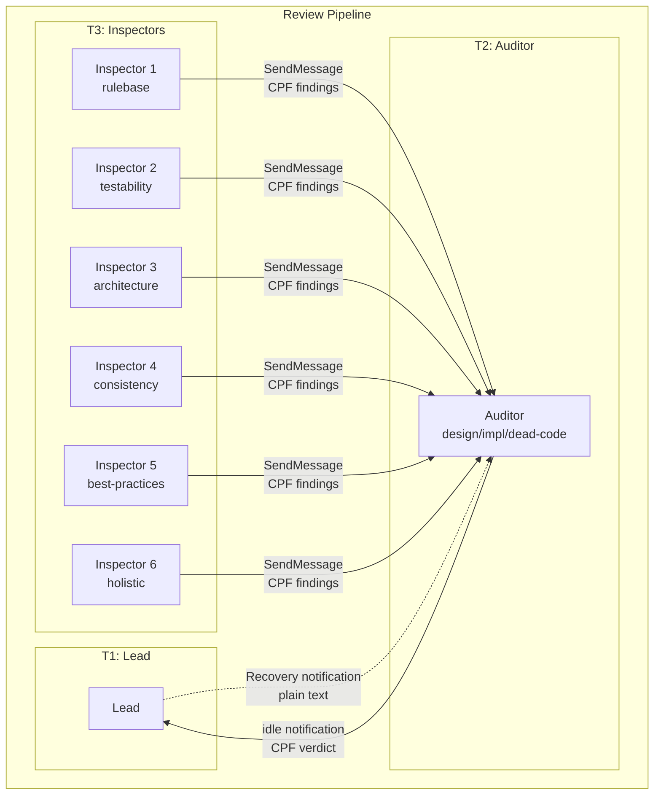
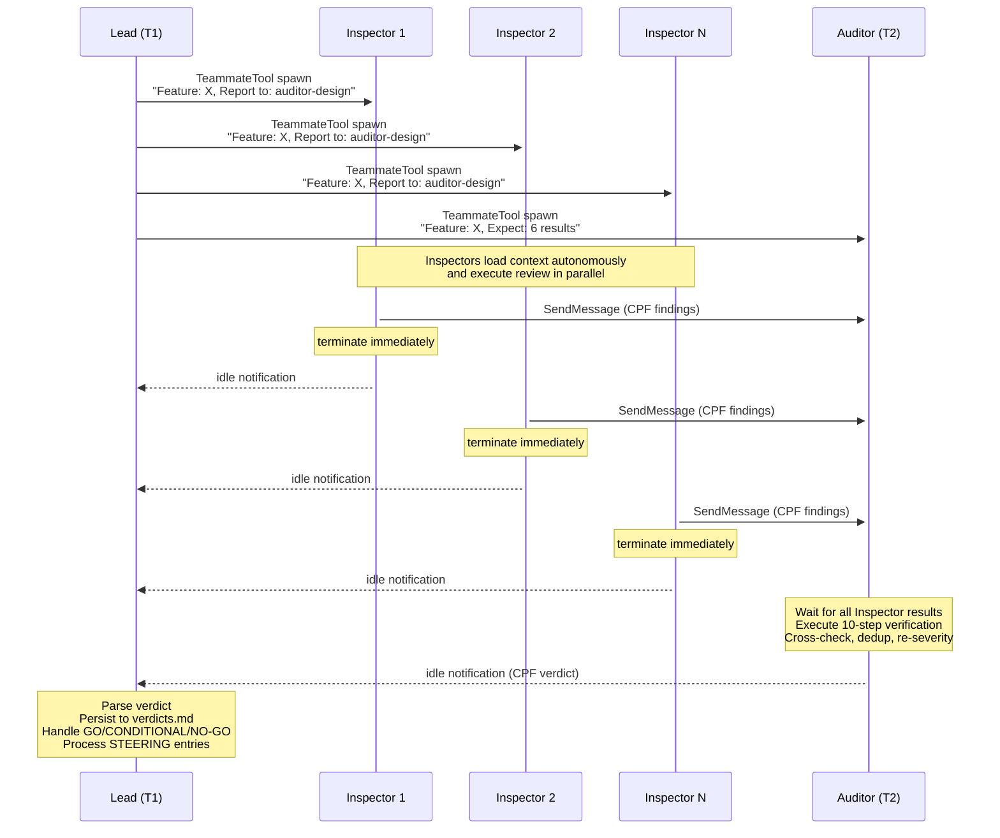
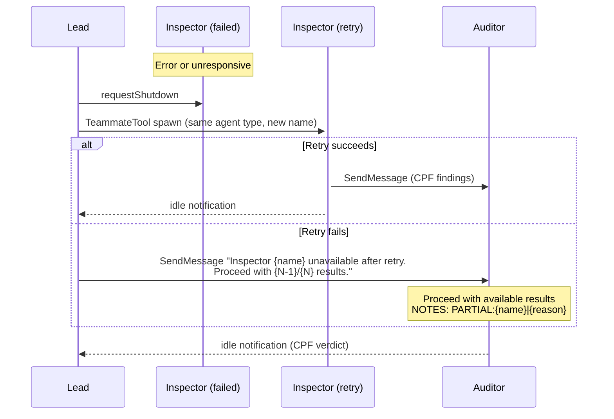
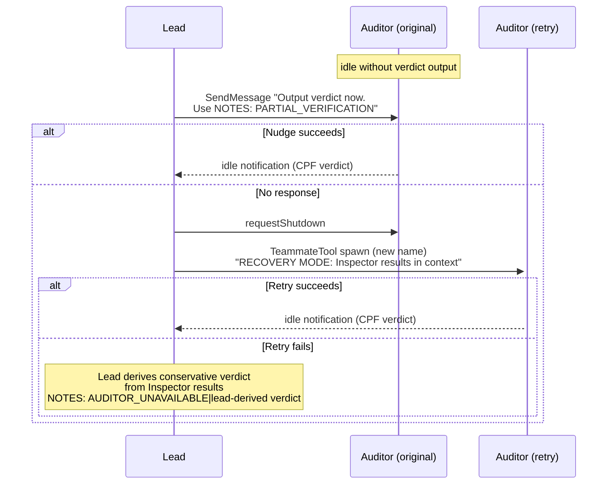
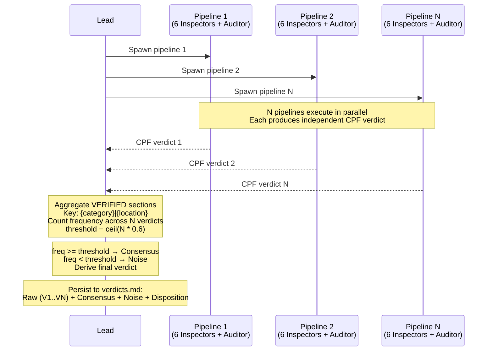
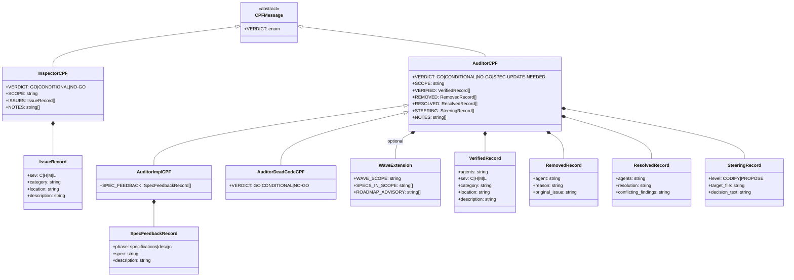

# CPF Protocol Design Document

## Specifications

### Introduction

Compact Pipe-Delimited Format (CPF) は、SDD フレームワークのレビューパイプラインにおけるエージェント間通信プロトコルである。Inspector (T3) が生成した findings を Auditor (T2) に送信し、Auditor が検証・統合して Lead (T1) に verdict を出力する。全レビュータイプ (design/impl/dead-code) および Consensus モードで統一的に使用される、トークン効率の高い構造化テキストフォーマット。

### Spec 1: CPF Core Format Definition

**Goal:** パイプ区切りの構造化テキストフォーマットの記法規則・セパレータ・フィールド順序・重大度コードを定義する。

**Acceptance Criteria:**

1. [constraint] メタデータ行は `KEY:VALUE` 形式（スペースなし）で記述され、パーサーが行頭のキーワード + `:` で判定できる
2. [contract] 構造化レコード行はパイプ `|` でフィールドを区切り、フィールド順序はセクションごとに固定される
3. [contract] 重大度コードは C (Critical) / H (High) / M (Medium) / L (Low) の4段階で、全セクション共通で使用される
4. [behavior] 複数識別子は `+` セパレータで結合される（例: `rulebase+consistency`）
5. [behavior] 空セクションはヘッダーごと省略される（空ヘッダー出力は禁止）
6. [behavior] 装飾文字（`- [`, `] `, `: `, ` - `）は使用禁止。平文のみ許可される
7. [behavior] 自由記述テキスト（NOTES 等）は装飾なしの平文行で記述される

### Spec 2: Inspector CPF Output Schema

**Goal:** Inspector が Auditor に送信する CPF findings の出力スキーマ（VERDICT, SCOPE, ISSUES, NOTES セクション）を定義する。

**Acceptance Criteria:**

1. [contract] Inspector 出力は `VERDICT:{GO|CONDITIONAL|NO-GO}` メタデータ行で開始される
2. [contract] `SCOPE` メタデータ行で対象範囲を示す（`{feature}` / `cross-check` / `wave-1..{N}`）
3. [contract] `ISSUES:` セクションの各行は `{sev}|{category}|{location}|{description}` の4フィールド固定順序である
4. [behavior] `NOTES:` セクションは自由記述の advisory 情報を含み、省略可能である
5. [behavior] 全 Inspector タイプ（design 6種, impl 6種, dead-code 4種）が同一スキーマに準拠する
6. [behavior] Inspector は CPF 出力を SendMessage で Auditor に送信した後、即座に terminate する

### Spec 3: Auditor CPF Verdict Schema

**Goal:** Auditor が Inspector findings を検証・統合して出力する verdict の CPF スキーマ（VERIFIED, REMOVED, RESOLVED, STEERING, SPEC_FEEDBACK, NOTES セクション）を定義する。

**Acceptance Criteria:**

1. [contract] Auditor 出力は `VERDICT:{GO|CONDITIONAL|NO-GO|SPEC-UPDATE-NEEDED}` メタデータ行で開始される（impl Auditor のみ SPEC-UPDATE-NEEDED を使用可能）
2. [contract] `VERIFIED:` セクションの各行は `{agents}|{sev}|{category}|{location}|{description}` の5フィールド固定順序である（Inspector の4フィールドに `{agents}` が先頭追加）
3. [contract] `REMOVED:` セクションの各行は `{agent}|{reason}|{original issue}` の3フィールドで、false positive として除外された findings を記録する
4. [contract] `RESOLVED:` セクションの各行は `{agents}|{resolution}|{conflicting findings}` の3フィールドで、Inspector 間の矛盾を解決した結果を記録する
5. [contract] `STEERING:` セクションの各行は `{CODIFY|PROPOSE}|{target file}|{decision text}` の3フィールドで、Steering Feedback Loop を起動する
6. [contract] `SPEC_FEEDBACK:` セクション（impl Auditor, SPEC-UPDATE-NEEDED 時のみ）の各行は `{phase}|{spec}|{description}` の3フィールドで、spec 欠陥を報告する
7. [behavior] Wave-scoped モード時は `WAVE_SCOPE:`, `SPECS_IN_SCOPE:`, `ROADMAP_ADVISORY:` メタデータ/セクションが追加される
8. [behavior] Dead-code Auditor は SCOPE/STEERING/SPEC_FEEDBACK を持たず、VERIFIED/REMOVED/RESOLVED/NOTES のみ出力する

### Spec 4: Inspector-Auditor Communication Flow

**Goal:** Inspector から Auditor への SendMessage ベースの通信フロー、タイムアウト処理、リカバリープロトコルを定義する。

**Acceptance Criteria:**

1. [constraint] Inspector は `SendMessageTool` で Auditor に CPF findings を送信する（Agent Teams peer communication）
2. [constraint] Auditor は spawn context で指定された Inspector 数（design: 6, impl: 6, dead-code: 1-4）の結果を待機してから検証処理を開始する
3. [behavior] Inspector 全数未到着の場合、Auditor は合理的な待機後に到着分で処理を進める
4. [behavior] Lead からのリカバリー通知（`"Inspector {name} unavailable after retry"`）受信時、Auditor は即座に到着分で処理を進め、NOTES に `PARTIAL:{inspector-name}|{reason}` を記録する
5. [behavior] Auditor が verdict 未出力で idle 化した場合、Lead が Recovery Protocol（nudge → re-spawn → lead-derived verdict）を実行する
6. [behavior] Inspector は CPF 送信後に即座に terminate し、Auditor からの応答を待機しない（一方向通信）

### Spec 5: Consensus Aggregation Format

**Goal:** `--consensus N` モードで複数パイプラインの verdict を周波数ベースで集約するフォーマットとしきい値ルールを定義する。

**Acceptance Criteria:**

1. [contract] N 個の Auditor verdict の VERIFIED セクションから `{category}|{location}` をキーとして findings を集約する
2. [contract] デフォルトしきい値は `ceil(N * 0.6)` で、freq >= threshold の findings が Consensus として確定する
3. [contract] freq < threshold の findings は Noise として分類される
4. [behavior] 全 N 個の verdict が GO の場合のみ Consensus verdict は GO となる
5. [behavior] Consensus に C/H severity の findings がある場合は NO-GO、M/L のみなら CONDITIONAL となる
6. [behavior] Consensus 結果は `verdicts.md` に Raw (全 verdict 原文), Consensus, Noise セクションとして永続化される

### Non-Goals

- バイナリエンコーディングや圧縮プロトコル
- CPF の永続ストレージフォーマット化（verdicts.md への保存は Lead の責務であり CPF 自体の仕様外）
- Inspector 間の直接通信（Inspector 同士は通信しない）
- Lead → Inspector 方向の CPF 通信（Lead は spawn context で plain text を渡す）
- CPF のバージョニングやスキーマ進化プロトコル

## Overview

**Purpose**: CPF は SDD レビューパイプラインにおけるエージェント間通信のトークン効率を最大化し、Inspector の findings を構造化して Auditor に伝達し、Auditor の verdict を Lead に構造化して返すための軽量プロトコルを提供する。

**Users**: Inspector (T3) エージェント、Auditor (T2) エージェント、Lead (T1) エージェント、および Consensus 集約ロジック。

**Impact**: 全レビューコマンド (`/sdd-review design`, `/sdd-review impl`, `/sdd-review dead-code`) の通信基盤として機能し、プロトコル変更は全 19 エージェント定義に影響する。

## Architecture

### Architecture Pattern & Boundary Map

CPF は「データフォーマット + 通信規約」の組み合わせパターン。エージェント間の疎結合を維持しつつ、構造化データの忠実な伝達を保証する。

**Architecture Integration**:
- Selected pattern: Pipe-delimited text protocol（JSON/YAML より低トークンコスト、正規表現で容易にパース可能）
- Domain boundaries: Inspector (生成) / Auditor (消費・変換・生成) / Lead (消費・集約)
- Existing patterns preserved: Agent Teams の SendMessage/idle notification パターンに準拠
- Steering compliance: トークン効率最大化の原則に合致



### Technology Stack

| Layer | Choice / Version | Role in Feature | Notes |
|-------|------------------|-----------------|-------|
| Format | Plain text (pipe-delimited) | データ表現 | JSON/YAML の代替、トークン効率重視 |
| Transport | SendMessageTool (Agent Teams) | Inspector → Auditor 通信 | Peer communication |
| Transport | Idle notification (completion text) | Auditor → Lead 通信 | Agent Teams 標準パターン |
| Parsing | Line-based regex | CPF 解析 | `KEY:VALUE` + `|` split |

## System Flows

### Design/Impl Review Pipeline Flow



### Inspector Recovery Flow



### Auditor Recovery Flow



### Consensus Aggregation Flow



## Specifications Traceability

| Specification | Summary | Components | Interfaces | Flows |
|---------------|---------|------------|------------|-------|
| Spec 1 | CPF Core Format | cpf-format.md | 記法規則, パーサーアルゴリズム | - |
| Spec 2 | Inspector Output | Inspector agents (16種) | VERDICT/SCOPE/ISSUES/NOTES | Design/Impl Review Flow |
| Spec 3 | Auditor Verdict | Auditor agents (3種) | VERDICT/VERIFIED/REMOVED/RESOLVED/STEERING/SPEC_FEEDBACK/NOTES | Design/Impl Review Flow |
| Spec 4 | Communication Flow | SendMessage transport, Recovery Protocol | SendMessage, idle notification | 全 Flow diagrams |
| Spec 5 | Consensus Aggregation | sdd-review SKILL, verdicts.md | frequency key, threshold | Consensus Flow |

## Components and Interfaces

### Summary

| Component | Domain/Layer | Intent | Req Coverage | Key Dependencies |
|-----------|--------------|--------|--------------|-----------------|
| cpf-format.md | Rules | CPF 仕様定義ドキュメント | Spec 1 | - |
| Inspector agents | Agent / T3 | CPF findings 生成 | Spec 2, 4 | cpf-format.md, SendMessageTool |
| Auditor agents | Agent / T2 | CPF verdict 生成 | Spec 3, 4 | cpf-format.md, SendMessageTool, Inspector CPF input |
| sdd-review SKILL | Skill / Orchestration | Review pipeline + Consensus 集約 | Spec 4, 5 | TeammateTool, Auditor verdict output |
| verdicts.md | Artifact / Persistence | Consensus 結果永続化 | Spec 5 | sdd-review SKILL |

### Rules Layer

#### cpf-format.md

| Field | Detail |
|-------|--------|
| Intent | CPF フォーマットの正式仕様を定義 |
| Requirements | Spec 1 |

**Responsibilities & Constraints**
- 記法規則（メタデータ、構造化行、自由記述、識別子リスト、空セクション、重大度コード）の定義
- Writing ルール（セクションヘッダー、装飾禁止、空セクション省略、スペース禁止）
- Parsing アルゴリズム（4ステップ: キーワード判定 → パイプ分割 → `+` 分割 → 欠損セクション処理）

**Format Specification (実際のフォーマット)**:

記法規則テーブル:

| Element | Format | Example |
|---------|--------|---------|
| Metadata | `KEY:VALUE` (no space) | `VERDICT:CONDITIONAL` |
| Structured row | `field1\|field2\|field3` | `H\|ambiguity\|Spec 1\|not quantified` |
| Freeform text | Plain lines (no decoration) | `Domain research suggests...` |
| List identifiers | `+` separated | `rulebase+consistency` |
| Empty sections | Omit header entirely | _(do not output)_ |
| Severity codes | C/H/M/L | C=Critical, H=High, M=Medium, L=Low |

Parsing アルゴリズム:
```
1. Line starts with known keyword + `:` → metadata or section start
2. Lines under a section → split by `|` to extract fields
3. Field containing `+` → split as identifier list
4. Section not present → no data of that type (not an error)
```

### Agent Layer — Inspector CPF Output

#### Inspector CPF Output Schema

| Field | Detail |
|-------|--------|
| Intent | Inspector が findings を構造化 CPF で出力 |
| Requirements | Spec 2, Spec 4 |

**Schema Definition**:
```
VERDICT:{GO|CONDITIONAL|NO-GO}
SCOPE:{feature} | cross-check | wave-1..{N}
ISSUES:
{sev}|{category}|{location}|{description}
NOTES:
{any advisory observations}
```

**Field Specifications**:

| Section | Field | Type | Description |
|---------|-------|------|-------------|
| VERDICT | value | enum | `GO` / `CONDITIONAL` / `NO-GO` |
| SCOPE | value | string | Feature name, `cross-check`, or `wave-1..{N}` |
| ISSUES | sev | enum | `C` / `H` / `M` / `L` |
| ISSUES | category | string | Inspector-type-specific category identifier |
| ISSUES | location | string | ファイルパス:行番号, Spec ID, コンポーネント名等 |
| ISSUES | description | string | 具体的な問題の説明 |
| NOTES | text | freeform | Advisory 情報（統計、カバレッジ率等） |

**Category Values by Inspector Type**:

Design Inspectors:
| Inspector | Typical Categories |
|-----------|-------------------|
| rulebase | `spec-quality`, `template-drift`, `traceability-gap`, `orphan-component` |
| testability | `untestable-ac`, `missing-boundary`, `ambiguous-trigger` |
| architecture | `coupling`, `boundary-violation`, `missing-contract` |
| consistency | `coverage-gap`, `internal-contradiction`, `design-overreach`, `scope-violation` |
| best-practices | `anti-pattern`, `security-gap`, `error-handling` |
| holistic | `cross-cutting`, `blind-spot`, `integration-gap` |

Impl Inspectors:
| Inspector | Typical Categories |
|-----------|-------------------|
| impl-rulebase | `task-incomplete`, `traceability-missing`, `file-missing`, `metadata-mismatch`, `file-unexpected` |
| interface | `signature-mismatch`, `dependency-missing`, `contract-violation` |
| test | `test-failure`, `coverage-gap`, `test-quality` |
| quality | `error-handling-drift`, `naming-violation`, `dead-code` |
| impl-consistency | `pattern-deviation`, `import-pattern`, `cross-feature-mismatch` |
| impl-holistic | `cross-cutting`, `blind-spot`, `integration-gap` |

Dead-Code Inspectors:
| Inspector | Typical Categories |
|-----------|-------------------|
| dead-settings | `dead-config` |
| dead-code | `dead-code` |
| dead-specs | `spec-drift`, `unimplemented-spec` |
| dead-tests | `orphaned-test`, `stale-fixture`, `false-confidence-test` |

**Example (Design Inspector — rulebase)**:
```
VERDICT:CONDITIONAL
SCOPE:my-feature
ISSUES:
H|spec-quality|design.md:Spec 2.AC3|acceptance criterion is not testable - "responds quickly"
M|template-drift|design.md|missing Testing Strategy section
M|traceability-gap|Spec 3.AC2|no design component covers this criterion
L|orphan-component|design.md:CacheManager|no spec traces to this
NOTES:
Overall SDD structure is sound with minor drift in design sections
```

**Example (Impl Inspector — impl-rulebase)**:
```
VERDICT:CONDITIONAL
SCOPE:my-feature
ISSUES:
H|task-incomplete|Task 2.3|checkbox not marked, subtask 2.3.2 missing
H|traceability-missing|Spec 3.AC2|no implementation evidence found for error recovery
M|file-missing|src/validators/config.ts|expected by design but not created
M|metadata-mismatch|spec.yaml|status says "implementing" but all tasks checked
L|file-unexpected|src/utils/helpers.ts|not specified in design
NOTES:
Task completion: 8/10 (80%)
Traceability: 14/18 AC (78%)
```

**Example (Dead-Code Inspector — dead-code)**:
```
VERDICT:CONDITIONAL
SCOPE:cross-check
ISSUES:
H|dead-code|src/utils.py:parse_legacy()|no call sites found, 45 lines
M|dead-code|src/main.py:import os|os never used in this module
L|dead-code|src/helpers.py:deprecated_format()|marked deprecated, only called from tests
NOTES:
4 dead functions identified across 3 modules
```

### Agent Layer — Auditor CPF Verdict

#### Auditor CPF Verdict Schema

| Field | Detail |
|-------|--------|
| Intent | Inspector findings を検証・統合し、verdict を CPF で出力 |
| Requirements | Spec 3, Spec 4 |

**Schema Definition (Design Auditor)**:
```
VERDICT:{GO|CONDITIONAL|NO-GO}
SCOPE:{feature} | cross-check | wave-scoped-cross-check
WAVE_SCOPE:{range}
SPECS_IN_SCOPE:{spec-a},{spec-b}
VERIFIED:
{agents}|{sev}|{category}|{location}|{description}
REMOVED:
{agent}|{reason}|{original issue}
RESOLVED:
{agents}|{resolution}|{conflicting findings}
STEERING:
{CODIFY|PROPOSE}|{target file}|{decision text}
NOTES:
{synthesis observations}
ROADMAP_ADVISORY:
{future wave considerations}
```

**Schema Definition (Impl Auditor)** — Design Auditor に加えて:
```
SPEC_FEEDBACK:
{phase}|{spec}|{description}
```
- SPEC_FEEDBACK は `VERDICT:SPEC-UPDATE-NEEDED` 時のみ出力
- `phase` は `specifications` または `design`

**Schema Definition (Dead-Code Auditor)** — 最小セット:
```
VERDICT:{GO|CONDITIONAL|NO-GO}
VERIFIED:
{agents}|{sev}|{category}|{location}|{description}
REMOVED:
{agent}|{reason}|{original issue}
RESOLVED:
{agents}|{resolution}|{conflicting findings}
NOTES:
{synthesis observations}
```

**Field Specifications (VERIFIED)**:

| Field | Type | Description |
|-------|------|-------------|
| agents | string (`+` separated) | 確認した Inspector 名のリスト |
| sev | enum | Auditor が再評価した重大度 `C`/`H`/`M`/`L` |
| category | string | Inspector 由来のカテゴリ |
| location | string | 問題の場所 |
| description | string | 検証済みの問題説明 |

**Field Specifications (REMOVED)**:

| Field | Type | Description |
|-------|------|-------------|
| agent | string | 元の finding を報告した Inspector |
| reason | string | 除外理由（`false positive`, `over-engineering`, `over-implementation` 等） |
| original issue | string | 元の finding の説明 |

**Field Specifications (RESOLVED)**:

| Field | Type | Description |
|-------|------|-------------|
| agents | string (`+` separated) | 矛盾していた Inspector 名 |
| resolution | string | 解決方法の説明 |
| conflicting findings | string | 矛盾していた findings の要約 |

**Field Specifications (STEERING)**:

| Field | Type | Description |
|-------|------|-------------|
| level | enum | `CODIFY` (自動適用) / `PROPOSE` (ユーザー承認必要) |
| target file | string | Steering ファイル名（例: `tech.md`） |
| decision text | string | 文書化する決定事項 |

**Verdict Determination Logic**:

Design Auditor:
```
IF any Critical issues remain after verification:
    Verdict = NO-GO
ELSE IF >3 High issues OR unresolved conflicts:
    Verdict = CONDITIONAL
ELSE IF only Medium/Low issues:
    Verdict = GO
```

Impl Auditor (追加ルール):
```
IF any Critical issues remain after verification:
    Verdict = NO-GO
ELSE IF spec defect detected (specifications or design is root cause):
    Verdict = SPEC-UPDATE-NEEDED
ELSE IF >3 High issues OR test failures OR interface mismatches:
    Verdict = CONDITIONAL
ELSE IF only Medium/Low issues AND tests pass:
    Verdict = GO
```

Verdict precedence: `NO-GO` > `SPEC-UPDATE-NEEDED` > `CONDITIONAL` > `GO`

**Example (Design Auditor)**:
```
VERDICT:CONDITIONAL
SCOPE:my-feature
VERIFIED:
architecture+testability|C|interface-contract|AuthService→UserStore|missing error type
consistency+rulebase|H|coverage-gap|Spec 3.AC2|no design for error recovery
best-practices+architecture|M|anti-pattern|DataAccess|repository as god-object
testability|L|ambiguous-language|Validation|"appropriately" not quantified
REMOVED:
best-practices|over-engineering|needs caching layer - not required by any AC
architecture|false positive|missing state - covered by implicit initial state in design
RESOLVED:
testability+architecture|severity aligned|testability flagged Critical but architecture confirms acceptable given scope
STEERING:
PROPOSE|tech.md|No ORM until data model complexity demands it
NOTES:
4 findings confirmed by multiple agents (high confidence)
Design is generally well-structured with focused issues
```

**Example (Impl Auditor)**:
```
VERDICT:CONDITIONAL
SCOPE:my-feature
VERIFIED:
interface+test|C|signature-mismatch|module.create_app|param count mismatch causes crash
rulebase|H|traceability-missing|Spec 3.AC2|no implementation for error recovery
quality|M|error-handling-drift|src/api.ts:55|swallowed exception
consistency|L|import-pattern|shared.logger|uses default import vs convention
REMOVED:
quality|over-implementation|needs retry logic - not in design, code is correct without it
test|false positive|missing test - utility file, tested indirectly
RESOLVED:
test+interface|test passes but interface wrong|mock hides actual mismatch
STEERING:
CODIFY|tech.md|console.log only for debugging, no logging framework
NOTES:
Feature tests: 24 passed, 1 failed
Task completion: 9/10 (90%)
```

**Example (Dead-Code Auditor)**:
```
VERDICT:CONDITIONAL
VERIFIED:
code+tests|H|dead-code|src/utils.py:parse_legacy()|no call sites, orphaned test confirms
settings|H|dead-config|config.CACHE_BACKEND|defined but never consumed, no passthrough
specs+code|M|spec-drift|feature-auth|spec says OAuth2, impl uses session-based
tests|M|stale-fixture|tests/conftest.py:mock_legacy_api|fixture for removed API
code|L|unused-import|src/main.py:import os|os never used
REMOVED:
code|dynamic-dispatch|utils.register_handler() - called via decorator registry
tests|indirect-usage|conftest.py:db_session - used by other fixtures transitively
RESOLVED:
code+specs|not-dead-planned|parse_v2() appears dead but spec marks as Wave 2 implementation
NOTES:
3 findings confirmed by cross-domain correlation (high confidence)
Settings agent found clean config passthrough for 12/14 fields
Recommend batch cleanup of 4 unused imports in src/
```

### Orchestration Layer — Consensus Aggregation

#### Consensus Aggregation Logic

| Field | Detail |
|-------|--------|
| Intent | 複数パイプラインの verdict を周波数ベースで集約 |
| Requirements | Spec 5 |

**Aggregation Algorithm**:
```
Input: N Auditor verdicts (each containing VERIFIED section)
Threshold: ceil(N * 0.6)

1. For each VERIFIED finding across all N verdicts:
   key = "{category}|{location}"
   frequency[key] += 1

2. Classify:
   Consensus = { finding | frequency[key] >= threshold }
   Noise     = { finding | frequency[key] < threshold }

3. Determine verdict:
   IF all N verdicts are GO → Consensus verdict = GO
   ELSE IF any C/H finding in Consensus → Consensus verdict = NO-GO
   ELSE IF only M/L findings in Consensus → Consensus verdict = CONDITIONAL
```

**Persistence Format (verdicts.md)**:
```markdown
## [B{seq}] {review-type} | {timestamp} | v{version} | runs:{N} | threshold:{K}/{N}

### Raw
#### V1
{Auditor 1 CPF verdict verbatim}
#### V2
{Auditor 2 CPF verdict verbatim}
...

### Consensus
{findings with freq >= threshold, with frequency annotation}

### Noise
{findings with freq < threshold}

### Disposition
{GO-ACCEPTED | CONDITIONAL-TRACKED | NO-GO-FIXED | SPEC-UPDATE-CASCADED | ESCALATED}

### Tracked (CONDITIONAL only)
{M/L issues from Consensus for persistence}
```

**Example (N=3, threshold=2)**:
```markdown
## [B1] design | 2026-02-20T10:30:00Z | v1.0.0 | runs:3 | threshold:2/3

### Raw
#### V1
VERDICT:CONDITIONAL
SCOPE:my-feature
VERIFIED:
rulebase+consistency|H|coverage-gap|Spec 3.AC2|no design for error recovery
testability|M|ambiguous-language|Validation|"appropriately" not quantified
NOTES:
Design is sound with minor issues

#### V2
VERDICT:CONDITIONAL
SCOPE:my-feature
VERIFIED:
consistency+rulebase|H|coverage-gap|Spec 3.AC2|no design for error recovery
architecture|M|coupling|AuthService→DB|direct database access
NOTES:
Generally well-structured

#### V3
VERDICT:GO
SCOPE:my-feature
NOTES:
No significant issues

### Consensus
H|coverage-gap|Spec 3.AC2|no design for error recovery (freq: 2/3)

### Noise
M|ambiguous-language|Validation|"appropriately" not quantified (freq: 1/3)
M|coupling|AuthService→DB|direct database access (freq: 1/3)

### Disposition
CONDITIONAL-TRACKED

### Tracked
M (noise)|ambiguous-language|Validation|"appropriately" not quantified
M (noise)|coupling|AuthService→DB|direct database access
```

## Data Models

### CPF Message Types



### Severity Code Hierarchy

| Code | Name | Design Review | Impl Review | Dead-Code Review |
|------|------|--------------|-------------|-----------------|
| C | Critical | 実装/テストをブロックする問題 | 本番障害やランタイムエラーを引き起こす問題 | - (dead-code では使用されない) |
| H | High | 実装前に修正すべき問題 | 本番前に修正すべき重大リスク | 未使用の重要コード、設定 |
| M | Medium | 実装中に対処可能な問題 | 品質・保守性に関する問題 | Spec ドリフト、orphaned テスト |
| L | Low | 軽微な改善点 | スタイル、ドキュメント | 未使用 import |

## Error Handling

### Error Strategy

CPF プロトコルのエラーハンドリングはレビューパイプラインの信頼性を保証するために、3 層の段階的回復を採用する。

### Error Categories and Responses

**Inspector Errors (T3)**:
- Inspector が CPF 送信前にエラー → Lead が Recovery Protocol を実行（1 回リトライ）
- リトライ失敗 → Lead が Auditor に `PARTIAL` 通知、Auditor は N-1 結果で続行
- Inspector の CPF が不正フォーマット → Auditor が NOTES にパースエラーを記録、該当 Inspector の結果を除外

**Auditor Errors (T2)**:
- Auditor が verdict 未出力で idle → Lead が nudge メッセージ送信
- Nudge 失敗 → Lead が re-spawn（Inspector CPF を spawn context に埋め込み、RECOVERY MODE）
- Re-spawn 失敗 → Lead が Inspector 結果から conservative verdict を導出（C/H カウントベース）

**Consensus Errors**:
- N 個中一部の Auditor が失敗 → 成功した verdict のみで集約、threshold を再計算
- 全 Auditor 失敗 → Lead がエスカレーション

### Monitoring

- NOTES セクション内の `PARTIAL:` タグで不完全な検証を追跡
- `PARTIAL_VERIFICATION|steps completed: {1..N}` で Auditor の処理範囲を記録
- `AUDITOR_UNAVAILABLE|lead-derived verdict` で Lead 代替 verdict を識別
- verdicts.md の Disposition フィールドで最終処理結果を永続化

## Testing Strategy

### Unit Tests
- CPF パーサー: メタデータ行の `KEY:VALUE` 抽出、パイプ分割、`+` 識別子分割
- Severity code バリデーション: C/H/M/L 以外の入力拒否
- 空セクション省略: 空の ISSUES セクションがヘッダーなしで出力されることの検証

### Integration Tests
- Inspector → Auditor SendMessage: 6 Inspector の CPF が Auditor に正しく到着し解析される
- Auditor verdict → Lead: verdict CPF が Lead のパーサーで正しく解析される
- Recovery flow: Inspector 障害時の PARTIAL 通知と Auditor の部分結果処理

### E2E Tests
- Design review pipeline: `/sdd-review design {feature}` の全フロー (Inspector spawn → CPF 送信 → Auditor verdict → verdicts.md 永続化)
- Consensus mode: `--consensus 3` での3パイプライン実行と集約結果
- Auto-fix loop: NO-GO verdict → fix → re-review のサイクル
