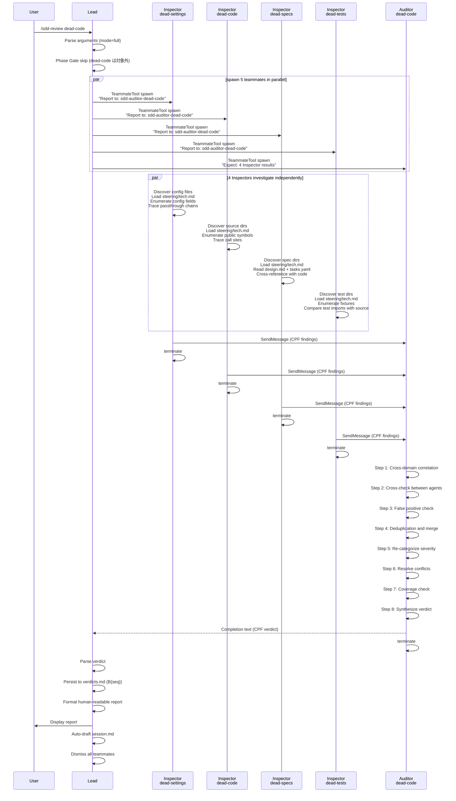
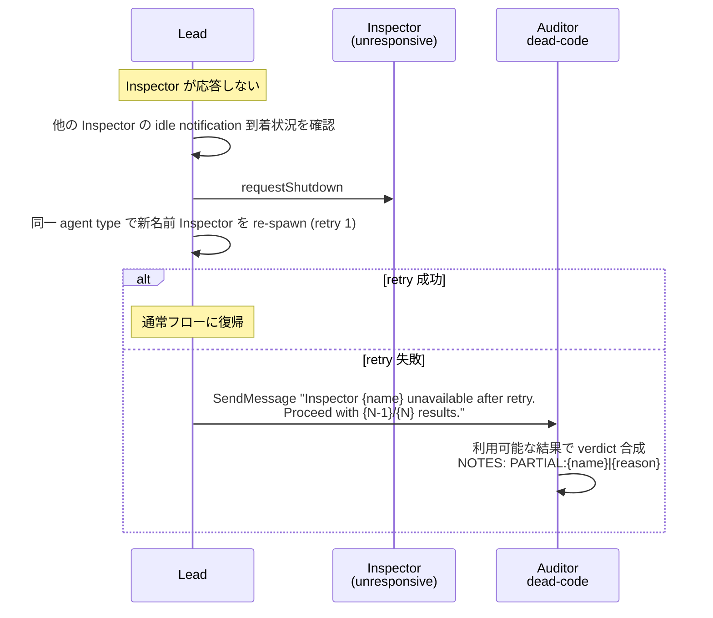
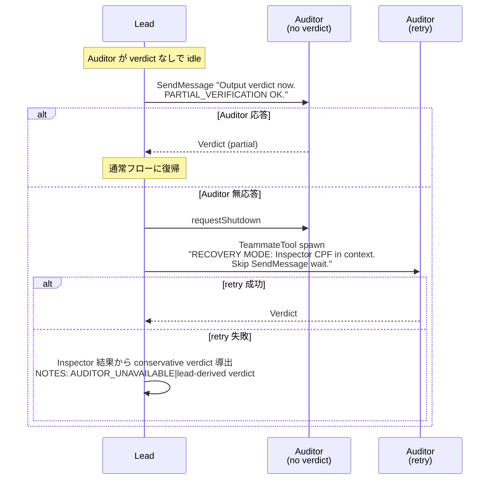

# Dead Code Review

## Specifications

### Introduction
Dead code レビューパイプライン。コードベース全体を対象に、4つの専門 Dead-Code Inspector を並列 spawn し、未使用アーティファクト（設定、コード、仕様、テスト）を独立に検出。各 Inspector は CPF フォーマットで findings を Auditor に SendMessage 送信。Auditor がクロスドメイン相関分析・偽陽性排除・重複排除・severity 再分類を行い、統合 verdict を出力する。Design/Impl review と異なり、Phase Gate なし・Feature scope なし（コードベース全体が対象）の特殊なレビューモード。

### Spec 1: Review Skill (Dead-Code Mode)
**Goal:** sdd-review skill の dead-code モード操作とモード分岐

**Acceptance Criteria:**
1. `dead-code` 引数で dead-code レビューモードが起動される
2. サブモード引数による Inspector 選択が機能する:
   - `dead-code` (引数なし): full モード — 4 Inspector 全員を spawn
   - `dead-code settings`: settings モード — dead-settings Inspector のみ
   - `dead-code code`: code モード — dead-code Inspector のみ
   - `dead-code specs`: specs モード — dead-specs Inspector のみ
   - `dead-code tests`: tests モード — dead-tests Inspector のみ
3. Phase Gate が適用されない（コードベース全体を対象とするため、spec.yaml.phase チェック不要）
4. 選択された Inspector + `sdd-auditor-dead-code` を TeammateTool で並列 spawn
5. Auditor spawn 時に `Expect: N` (N = 選択された Inspector 数) を spawn context に含める
6. Auditor の verdict を completion output から読み取る
7. 全 review teammate を dismiss する
8. Verdict を `verdicts.md` に永続化（バッチ番号付き）
9. Verdict をユーザーに human-readable markdown レポートとして表示:
   - Executive Summary（verdict + severity 別 issue 数）
   - Prioritized Issues テーブル（Critical → High → Medium → Low）
   - Verification Notes（偽陽性排除、conflict 解決）
   - Recommended actions
10. session.md を auto-draft する

### Spec 2: Dead-Settings Inspector
**Goal:** プロジェクト設定の dead config 検出

**Acceptance Criteria:**
1. プロジェクト構造を自律的に探索し、設定ファイル・環境ファイル・設定モジュールを発見
2. `steering/tech.md` から project conventions をロード
3. 設定クラス/モジュールの全フィールドを列挙
4. 各フィールドについて定義→中間レイヤー→最終消費者へのパススルーチェーンをトレース
5. 以下のカテゴリの dead config を検出:
   - デフォルト値があり、パススルーが壊れているが静かに「動作」する設定
   - 定義されているが読み取られない環境変数
   - 常に on/off の Feature flag
   - 削除されたフィーチャー用の設定セクション
   - 複数ファイルにまたがる重複設定エントリ
6. Bash + project runtime で分析スクリプトを実行可能
7. CPF フォーマット (`VERDICT`, `SCOPE`, `ISSUES`, `NOTES`) で findings を Auditor に SendMessage 送信
8. Issue の category は `dead-config` を使用
9. 送信後、即座に terminate（追加メッセージを待たない）

### Spec 3: Dead-Code Inspector
**Goal:** 未使用のコードシンボル（関数・クラス・メソッド・インポート）の検出

**Acceptance Criteria:**
1. プロジェクト構造を自律的に探索し、ソースディレクトリ・エントリポイント・モジュール境界を発見
2. `steering/tech.md` から project conventions をロード
3. public symbols（関数・クラス・メソッド・定数）を列挙
4. 各シンボルの call site を徹底的にトレース
5. exports と usage を比較（`__all__`、public API、re-exports）
6. 以下のカテゴリの dead code を検出:
   - モジュール外から呼ばれない関数/メソッド
   - インスタンス化されないクラス
   - テストからのみ使用され、production path にないコード
   - "将来用" として残されている実際には dead なコード
   - 未使用 import（re-exports と区別）
   - 条件分岐内の dead branch
7. False positive ガード:
   - Dynamic invocation (`getattr()`, decorators, framework hooks, signal handlers) を考慮
   - Entry points (CLI commands, celery tasks, API endpoints, scheduled jobs) を考慮
   - Plugin/extension points（外部消費者から呼ばれるコード）を考慮
   - Abstract/protocol implementations（基底クラスインターフェース経由の呼び出し）を考慮
8. 単純な grep を超えた実際の call relationship のトレース
9. クラスメソッドの継承経由の内部使用を確認
10. プロパティ、デコレータ、メタクラス経由の使用をチェック
11. CPF フォーマットで findings を Auditor に SendMessage 送信
12. Issue の category は `dead-code` を使用
13. 送信後、即座に terminate

### Spec 4: Dead-Specs Inspector
**Goal:** 仕様と実装の整合性検証、spec drift の検出

**Acceptance Criteria:**
1. プロジェクト構造を自律的に探索し、spec ディレクトリと実装ディレクトリを発見
2. `steering/tech.md` から project conventions をロード
3. 各 spec の design.md と tasks.yaml を読み取り、期待される実装を理解
4. Spec の promise と実際の実装をクロスリファレンス
5. tasks.yaml のタスクステータスと実際のコード状態を比較
6. 以下のカテゴリの spec drift を検出:
   - タスクが全てチェック済みだが実際の実装が欠落している spec
   - 対応する spec がない実装済みフィーチャー
   - Spec のインターフェース定義と実際のシグネチャの不一致
   - Spec の依存関係図と実際の import の不一致
   - 部分的・不完全な実装（一部タスク完了、他はスキップ）
   - リネーム/移動されたコードへの陳腐化した spec 参照
7. Spec のインターフェース定義と実際のシグネチャを比較
8. Spec の依存関係図と実際の import 関係を比較
9. spec.yaml の phase と実際の状態を確認
10. CPF フォーマットで findings を Auditor に SendMessage 送信
11. Issue の category は `spec-drift` を使用
12. 送信後、即座に terminate

### Spec 5: Dead-Tests Inspector
**Goal:** 孤立テスト・陳腐化テスト・古いインターフェースに依存するテストの検出

**Acceptance Criteria:**
1. プロジェクト構造を自律的に探索し、テストディレクトリ・conftest ファイル・テストユーティリティを発見
2. `steering/tech.md` から project conventions をロード
3. Fixture 定義を列挙し、全テストファイルでの使用をトレース
4. テストの import とソースを比較し、テスト対象シンボルの存在を確認
5. 以下のカテゴリの dead test artifacts を検出:
   - 定義されているが使用されない fixture（conftest.py 継承チェーン含む）
   - 存在しない関数/クラスを import するテスト
   - 古いインターフェースに依存するテスト（不正なパラメータ名、削除されたメソッド）
   - クラス vs モジュール vs conftest レベルの重複 fixture
   - 削除されたフィーチャー用のテストファイル
   - 実際の実装と一致しない mock オブジェクト
   - 実装に関係なく常にパスするテスト（false confidence）
6. 全レベルの conftest.py fixture を含める
7. 間接的な fixture 使用（他の fixture 経由）をトレース
8. パラメータ化テストの参照をチェック
9. CPF フォーマットで findings を Auditor に SendMessage 送信
10. Issue の category は `orphaned-test` を使用
11. 送信後、即座に terminate

### Spec 6: Dead-Code Auditor (Synthesis)
**Goal:** 4 Inspector の findings をクロスドメイン相関分析し、検証済み統合 verdict を出力

**Acceptance Criteria:**
1. Inspector の結果を SendMessage 経由で受信（spawn context の `Expect: N` に基づき N 件待機）
2. タイムアウト処理: 期待数未満の場合、利用可能な結果で proceed
3. Lead からの Inspector 不可通知（recovery notification）を受信した場合、即座に利用可能な結果で proceed
4. 欠損 Inspector を NOTES に `PARTIAL:{inspector-name}|{reason}` として記録
5. **Step 1: クロスドメイン相関** — 以下の6パターンを検出:
   - Dead function + Orphaned test (Code+Tests confirm) → severity upgrade、単一 finding にマージ
   - Dead config + Spec に言及なし (Settings+Specs confirm) → high confidence dead config
   - Spec に記載あるが実装なし (Specs alone) → tasks.yaml で将来実装予定か確認
   - Unused import + Spec で参照あり (Code+Specs contradict) → 未実装、dead code ではない → 再分類 or 除外
   - Dead function + Spec で参照あり (Code+Specs contradict) → 実装予定、dead ではない → finding 除外
   - Stale test + Dead code (Test+Code confirm) → high confidence removal candidate
6. **Step 2: エージェント間クロスチェック** — 各 finding について:
   - 他エージェントの finding が支持するか矛盾するかを確認
   - 複数エージェントが同一 issue を発見 → confidence 向上
   - 1エージェントのみが発見 → 検証が必要
   - エージェント間の severity 評価の一貫性を確認
7. **Step 3: False positive チェック** — 以下のパターンを確認:
   - Dynamic invocation（`getattr()`, decorators, framework hooks）
   - Entry points（CLI, signal handlers, celery tasks, API endpoints）
   - Test fixtures（parametrize/conftest 継承による使用）
   - Config defaults（明示的パススルーなしでも動作するデフォルト）
   - 将来の実装（spec に記載あるが未実装）
   - Plugin/extension points（外部消費者から呼ばれるコード）
8. **Step 4: 重複排除・マージ** — 同一シンボルの複数 finding を統合
9. **Step 5: Severity 再分類** — Auditor 独自の判断で以下に分類:
   - Critical: 積極的に有害な dead code（セキュリティリスク、誤解を招く、混乱を引き起こす）
   - High: 早期のクリーンアップが必要（メンテナンス負担）
   - Medium: メンテナンス時に対処（軽微な負担）
   - Low: あれば良い（cosmetic cleanup）
10. **Step 6: Conflict 解決** — エージェント間の矛盾を Auditor の判断で解決し、根拠を記録
11. **Step 7: Coverage チェック** — 全ソースディレクトリ、設定ファイル、spec ディレクトリ、テストディレクトリがカバーされているか確認
12. **Step 8: Verdict 合成** — 検証済み findings に基づき:
    - Critical issue あり → NO-GO
    - High issue 3件超 OR 重大な spec drift → CONDITIONAL
    - Medium/Low のみ → GO
    - Auditor は根拠付きでこの判定式をオーバーライド可能
13. CPF フォーマットで verdict を出力:
    - `VERDICT:{GO|CONDITIONAL|NO-GO}` (SPEC-UPDATE-NEEDED は使用しない)
    - `VERIFIED:` セクション（検証済み findings: `{agents}|{sev}|{category}|{location}|{description}`）
    - `REMOVED:` セクション（除外した findings: `{agent}|{reason}|{original issue}`）
    - `RESOLVED:` セクション（解決した矛盾: `{agents}|{resolution}|{conflicting findings}`）
    - `NOTES:` セクション（合成の所見）
    - 空セクションは省略
14. Verdict Output Guarantee: processing budget が不足した場合、残りの検証ステップをスキップし、`NOTES: PARTIAL_VERIFICATION|steps completed: {1..N}` 付きで verdict を即座に出力
15. Verdict 出力後、即座に terminate

### Spec 7: Error Handling and Recovery
**Goal:** Inspector/Auditor の障害時のリカバリ

**Acceptance Criteria:**
1. Inspector Recovery: Inspector が無応答の場合:
   - Lead が他の Inspector の idle notification 到着状況を確認
   - `requestShutdown` で停止を試行
   - 同一 agent type で新名前の Inspector を TeammateTool で再 spawn（1回リトライ）
   - リトライも失敗 → Lead が Auditor に SendMessage で不可通知（`Inspector {name} unavailable after retry. Proceed with {N-1}/{N} results.`）
   - Auditor は利用可能な結果で proceed、NOTES に欠損 Inspector を記録
2. Auditor Recovery: Auditor が verdict なしで idle になった場合:
   - Lead が SendMessage で verdict 出力を催促（`PARTIAL_VERIFICATION` 許可）
   - 応答があれば通常フローに復帰
   - 応答なし → `requestShutdown` で停止、新名前で再 spawn（Inspector CPF を spawn context に埋め込み、`RECOVERY MODE` 指示付き）
   - リトライも失敗 → Lead が Inspector 結果から conservative verdict を導出（`NOTES: AUDITOR_UNAVAILABLE|lead-derived verdict`）
3. 全エージェントが "No Issues" を報告した場合: Auditor がカバレッジを検証し、プロジェクトが真にクリーンか分析不足かを NOTES に記録

### Non-Goals
- コード品質レビュー（impl-review spec のスコープ）
- 設計品質レビュー（design-review spec のスコープ）
- Dead artifact の自動削除（本パイプラインは検出のみ）
- Auto-Fix Loop — このパイプラインは verdict 出力のみを行い、内部に自動修正ロジックを持たない。Wave Quality Gate の一部として実行される場合、post-verdict の Builder re-spawn による remediation は roadmap-orchestration (Lead) の責務
- Consensus mode（dead-code review では `--consensus N` 未対応）

## Overview

Dead code review は SDD フレームワークの3種類のレビュー（design / impl / dead-code）の1つ。他の2種類が feature-scoped（単一 spec 対象）であるのに対し、dead-code review はコードベース全体を対象とする横断的レビュー。Phase Gate を持たず、任意のタイミングで実行可能。

主な用途は2つ:
1. **Wave Quality Gate の一部**: Roadmap の Wave 完了後、Impl Cross-Check Review に続いて実行される品質ゲート
2. **Standalone 実行**: `/sdd-review dead-code` でユーザーが直接起動

4つの Inspector がそれぞれ異なるドメイン（Settings / Code / Specs / Tests）を独立に調査し、Auditor がクロスドメイン相関分析で偽陽性を排除し、高信頼度の findings を統合する。Design/Impl review の6 Inspector パターンと異なり、4 Inspector パターンを採用。また verdict に `SPEC-UPDATE-NEEDED` がなく、`GO / CONDITIONAL / NO-GO` の3種類のみ。

Inspector の検出方法論は「自律的・マルチアングル調査」を基本とし、機械的チェックリストに従わない。各 Inspector は project structure を自力で発見し、`steering/tech.md` から conventions をロードし、Bash + project runtime で分析スクリプトを実行する。

## Architecture

### Agent Topology

```
Lead (T1, Opus)
  |
  |-- spawn (TeammateTool) --> sdd-inspector-dead-settings  (T3, Sonnet)  --+
  |-- spawn (TeammateTool) --> sdd-inspector-dead-code      (T3, Sonnet)  --| SendMessage (CPF)
  |-- spawn (TeammateTool) --> sdd-inspector-dead-specs      (T3, Sonnet)  --|
  |-- spawn (TeammateTool) --> sdd-inspector-dead-tests      (T3, Sonnet)  --|
  |                                                                         v
  |-- spawn (TeammateTool) --> sdd-auditor-dead-code         (T2, Opus)   --> Verdict (completion text)
  |                                                                         |
  <---- read idle notification / verdict -----------------------------------+
```

### Model Assignment

| Agent | Tier | Model | 根拠 |
|-------|------|-------|------|
| Lead | T1 | Opus | オーケストレーション、判断 |
| sdd-auditor-dead-code | T2 | Opus | クロスドメイン相関、severity 判断、偽陽性排除 |
| sdd-inspector-dead-settings | T3 | Sonnet | 設定トレース実行 |
| sdd-inspector-dead-code | T3 | Sonnet | コード解析実行 |
| sdd-inspector-dead-specs | T3 | Sonnet | Spec-コード比較実行 |
| sdd-inspector-dead-tests | T3 | Sonnet | テスト解析実行 |

### Tool Assignment

| Agent | Tools | 根拠 |
|-------|-------|------|
| Inspector (全4種) | Bash, Read, Glob, Grep, SendMessage | コードベース探索 + 分析スクリプト実行 + Auditor への結果送信 |
| Auditor | Read, Glob, Grep, SendMessage | Inspector findings の受信 + 独立検証 |

### Communication Protocol

- **Inspector → Auditor**: SendMessage (CPF フォーマット)。Inspector は findings 送信後に即座に terminate。
- **Lead → Auditor**: spawn context に `Expect: N` を含める。Recovery 時は SendMessage で催促/不可通知。
- **Lead ← Auditor**: Auditor の completion text（idle notification）から verdict を読み取る。

### Mode Selection Matrix

| コマンド | Inspector Set | Inspector 数 | Auditor |
|---------|---------------|-------------|---------|
| `dead-code` | settings, code, specs, tests | 4 | sdd-auditor-dead-code |
| `dead-code settings` | settings | 1 | sdd-auditor-dead-code |
| `dead-code code` | code | 1 | sdd-auditor-dead-code |
| `dead-code specs` | specs | 1 | sdd-auditor-dead-code |
| `dead-code tests` | tests | 1 | sdd-auditor-dead-code |

## System Flows

### Primary Flow: Full Dead-Code Review



### Inspector Recovery Flow



### Auditor Recovery Flow



## Components

### Component 1: sdd-review Skill (Dead-Code Mode Section)

**ファイル**: `framework/claude/skills/sdd-review/SKILL.md`

Dead-code モードは sdd-review skill 内の分岐として実装。Design/Impl review と同じ skill ファイル内に共存。

**責務**:
- 引数パース（`dead-code [settings|code|specs|tests]`）
- モード別 Inspector セットの決定
- TeammateTool による Inspector + Auditor の並列 spawn
- Auditor completion text からの verdict 読み取り
- verdicts.md への永続化
- human-readable レポートの生成・表示
- session.md の auto-draft

**Design/Impl review との差異**:
- Phase Gate なし（Step 2 をスキップ）
- Inspector 数: 4（Design/Impl は 6）
- Verdict に `SPEC-UPDATE-NEEDED` なし
- Auto-Fix Loop なし（パイプラインは verdict 出力のみ。Wave Quality Gate での post-verdict remediation は roadmap-orchestration の責務）
- Feature scope なし（コードベース全体）
- Consensus mode 未対応

### Component 2: sdd-inspector-dead-settings

**ファイル**: `framework/claude/agents/sdd-inspector-dead-settings.md`

**検出方法論**:
設定の「定義 → 中間レイヤー → 最終消費者」パススルーチェーンをトレースし、途切れたチェーンを検出する。特にデフォルト値を持つ設定は、パススルーが壊れていても静かに「動作」するため、最も検出が難しい dead config パターン。

**検出カテゴリ**:
| カテゴリ | 説明 | 典型例 |
|---------|------|-------|
| デフォルト付き壊れたパススルー | 設定が定義され消費者にデフォルトがあるが、実際のパススルーが壊れている | `CACHE_BACKEND` が定義されているが消費者がハードコードされたデフォルトを使用 |
| 未読の環境変数 | `.env` に定義されているがコードで読み取られない | `.env:LEGACY_API_KEY` がコメントアウトされたコードからのみ参照 |
| 固定 Feature flag | 常に on or off の Feature flag | `ENABLE_V2=true` が常に true で条件分岐が dead |
| 削除フィーチャーの設定 | 削除されたフィーチャー用の設定セクション | `[legacy_api]` セクション全体が未使用 |
| 重複設定 | 複数ファイルにまたがる同一設定の重複 | `DEBUG` が settings.py と config.py の両方に定義 |

**出力**: CPF フォーマット、category = `dead-config`

### Component 3: sdd-inspector-dead-code

**ファイル**: `framework/claude/agents/sdd-inspector-dead-code.md`

**検出方法論**:
public symbols を列挙し、call site を徹底的にトレースする。単純な grep を超え、実際の call relationship を追跡。クラスメソッドの継承経由の使用、プロパティ・デコレータ・メタクラス経由の使用を含む。

**検出カテゴリ**:
| カテゴリ | 説明 | 典型例 |
|---------|------|-------|
| 未呼び出し関数/メソッド | モジュール外からの call site がない | `parse_legacy()` — 45行、参照なし |
| 未インスタンス化クラス | インスタンス化されないクラス | `LegacyHandler` クラス全体 |
| テスト専用コード | テストからのみ使用される production コード | `_test_helper()` が production path にない |
| 将来用 dead code | "将来用" として残されているが実際には dead | `parse_v3()` — TODO コメント付きだが参照なし |
| 未使用 import | re-exports と区別した未使用 import | `import os` — os がモジュール内で未使用 |
| Dead branch | 条件分岐内の到達不能コード | `if False:` ブロック |

**False positive ガード**:
- Dynamic invocation: `getattr()`, decorators, framework hooks, signal handlers
- Entry points: CLI commands, celery tasks, API endpoints, scheduled jobs
- Plugin/extension points: 外部消費者から呼ばれるコード
- Abstract/protocol implementations: 基底クラスインターフェース経由の呼び出し

**出力**: CPF フォーマット、category = `dead-code`

### Component 4: sdd-inspector-dead-specs

**ファイル**: `framework/claude/agents/sdd-inspector-dead-specs.md`

**検出方法論**:
Spec ディレクトリの design.md + tasks.yaml を読み取り、実際のコードベースとクロスリファレンス。インターフェース定義、依存関係図、タスクステータスの3軸で整合性を検証。

**検出カテゴリ**:
| カテゴリ | 説明 | 典型例 |
|---------|------|-------|
| 空チェック spec | タスク全チェック済みだが実装が欠落 | tasks.yaml で done だが対応コードなし |
| 孤立実装 | Spec なしの実装済みフィーチャー | `user_export.py` に対応 spec なし |
| インターフェース不一致 | Spec の定義と実際のシグネチャの差異 | Spec: `create(name, email)` vs 実装: `create(data)` |
| 依存関係不一致 | Spec の依存関係図と実際の import の差異 | Spec: A→B→C だが実際は A→C (B をスキップ) |
| 部分実装 | 一部タスク完了、他がスキップ | tasks 2.3-2.5 が done だが対応コードなし |
| 陳腐化参照 | リネーム/移動されたコードへの参照 | Spec: `UserService` だが実装: `UserManager` |

**出力**: CPF フォーマット、category = `spec-drift`

### Component 5: sdd-inspector-dead-tests

**ファイル**: `framework/claude/agents/sdd-inspector-dead-tests.md`

**検出方法論**:
テストディレクトリを探索し、fixture 定義の使用トレース、テスト import の存在確認、mock オブジェクトの実装一致確認を行う。conftest.py の継承チェーンを含む全レベルの fixture を対象とする。

**検出カテゴリ**:
| カテゴリ | 説明 | 典型例 |
|---------|------|-------|
| 未使用 fixture | 定義されているが使用されない fixture | `conftest.py:mock_legacy_api` — 参照なし |
| 存在しないシンボルの import | テストが削除された関数/クラスを import | `from src import LegacyAPI` — LegacyAPI は削除済み |
| 古いインターフェース依存 | 不正なパラメータ名、削除されたメソッド | `test_login` が古いシグネチャで mock |
| 重複 fixture | class vs module vs conftest レベルの重複 | 同一 fixture が conftest と test module の両方に定義 |
| 削除フィーチャーのテスト | 削除されたフィーチャー用のテストファイル全体 | `test_legacy.py` — LegacyAPI テスト全体が孤立 |
| 陳腐化 mock | 実装と一致しない mock オブジェクト | mock が古いシグネチャを再現 |
| False confidence テスト | 実装に関係なくパスするテスト | mock が全てを上書きし、実際のロジックをテストしない |

**出力**: CPF フォーマット、category = `orphaned-test`

### Component 6: sdd-auditor-dead-code

**ファイル**: `framework/claude/agents/sdd-auditor-dead-code.md`

**合成プロセス**: 8-step verification pipeline

| Step | 名称 | 説明 |
|------|------|------|
| 1 | Cross-Domain Correlation | 4ドメイン間の相関パターン検出（6パターン） |
| 2 | Cross-Check Between Agents | エージェント間の一致/矛盾/単独発見の検証 |
| 3 | False Positive Check | 動的呼び出し、エントリポイント等の偽陽性パターン排除 |
| 4 | Deduplication and Merge | 同一シンボルの findings 統合、cross-domain 確認の統合 |
| 5 | Re-categorize Severity | Auditor 独自判断による4段階 severity 再分類 |
| 6 | Resolve Conflicts | エージェント間の矛盾解決、根拠の記録 |
| 7 | Coverage Check | 全ディレクトリ（source, config, spec, test）のカバレッジ確認 |
| 8 | Synthesize Verdict | 検証済み findings に基づく GO/CONDITIONAL/NO-GO 判定 |

**Verdict 判定ロジック**:
```
IF any Critical issues → NO-GO
ELSE IF >3 High issues OR significant spec drift → CONDITIONAL
ELSE IF only Medium/Low → GO
```
Auditor は根拠付きでこの判定式をオーバーライド可能。

**Severity 定義**:
| Level | Code | 定義 | 例 |
|-------|------|------|---|
| Critical | C | 積極的に有害な dead code | silent config、live code を shadow する dead code、false confidence テスト |
| High | H | 早期クリーンアップ推奨 | 明確な dead function/class、孤立テストファイル、混乱を招く spec drift |
| Medium | M | メンテナンス時に対処 | 未使用 import、冗長な config、軽微な spec 不一致 |
| Low | L | cosmetic cleanup | コメントアウトされたコード、未使用 type alias、簡略化可能なテストヘルパー |

**CPF Category 値**: `dead-config`, `dead-code`, `spec-drift`, `orphaned-test`, `unused-import`, `stale-fixture`, `unimplemented-spec`, `false-confidence-test`

**Agent 識別子**: `settings`, `code`, `specs`, `tests`（`+` 区切りで複数エージェント表記: `code+tests`）

**設計原則**:
- 単なるエージェント出力の連結ではなく、積極的なクロスドメイン検証を行う
- 慎重さを攻撃性より優先: dead code 削除にはリスクがある。不確実な findings は warning とし、critical にしない
- false dead code ガード: 動的呼び出し、デコレータ、エントリポイント、フレームワーク規約で使われるコードを確認してからフラグ

## Components and Interfaces

| Component | Domain/Layer | Intent | Files |
|-----------|--------------|--------|-------|
| sdd-review skill | Skill | レビューオーケストレーション（共有） | `framework/claude/skills/sdd-review/SKILL.md` |
| sdd-auditor-dead-code | Agent (T2) | Dead-code verdict 合成 | `framework/claude/agents/sdd-auditor-dead-code.md` |
| sdd-inspector-dead-settings | Agent (T3) | 未使用設定検出 | `framework/claude/agents/sdd-inspector-dead-settings.md` |
| sdd-inspector-dead-code | Agent (T3) | 未使用コード検出 | `framework/claude/agents/sdd-inspector-dead-code.md` |
| sdd-inspector-dead-specs | Agent (T3) | 仕様乖離検出 | `framework/claude/agents/sdd-inspector-dead-specs.md` |
| sdd-inspector-dead-tests | Agent (T3) | テスト陳腐化検出 | `framework/claude/agents/sdd-inspector-dead-tests.md` |

## Revision Notes

### Rev 1.1.0 (2026-02-21)

**変更箇所**: Non-Goals セクション — Auto-Fix Loop の記述を明確化

**変更理由**: D11 decision に基づく。従来の記述（「dead-code review は verdict 表示のみで自動修正を行わない」）はパイプライン内部のスコープとしては正確だが、Wave Quality Gate フロー全体における dead code issue の remediation が一切行われないかのような誤解を招く表現だった。

**変更内容**: パイプラインのスコープ（verdict 出力のみ、内部に自動修正ロジックなし）と、オーケストレーターのスコープ（Lead が post-verdict で Builder re-spawn による remediation を実行）を明確に分離する記述に変更。

**影響範囲**: Non-Goals の記述のみ。仕様（Spec 1-7）、アーキテクチャ、コンポーネント定義に変更なし。実装への影響なし。
