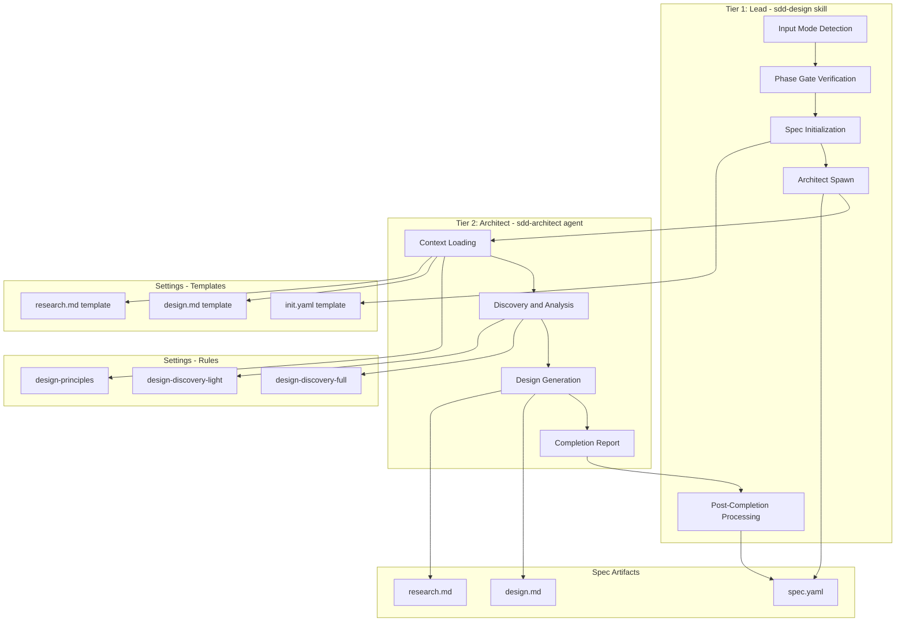
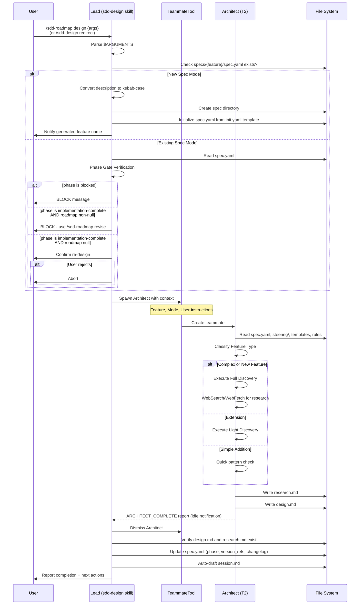
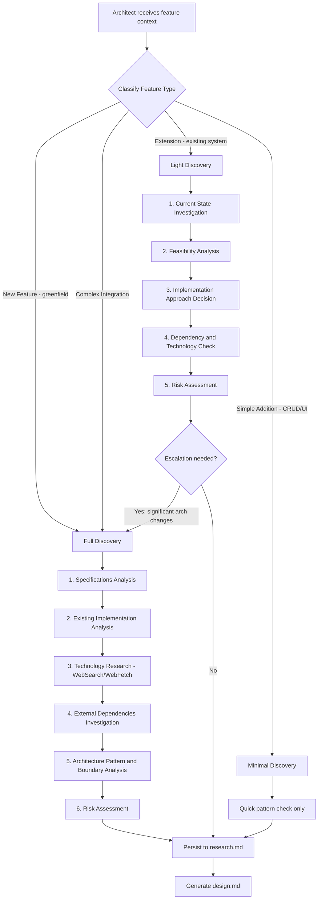
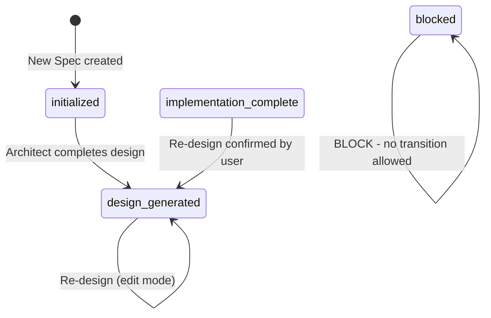

# Design Pipeline

## Specifications

### Introduction

フィーチャー設計生成パイプライン。`/sdd-design` は `/sdd-roadmap design` へのリダイレクトスタブであり、正式なエントリポイントは `/sdd-roadmap design` である。Lead として機能し、入力モード検出・Phase Gate 検証・新規 spec 初期化を行った上で、Architect (T2) を `TeammateTool` で spawn する。Architect は自律的に Discovery（full / light / minimal）を実行し、コードベース分析・外部調査を経て `design.md` と `research.md` を生成する。完了後、Lead が `spec.yaml` のメタデータ（phase, version_refs, changelog）を更新し、session.md を auto-draft する。

本パイプラインはフレームワークの Stage 1（Specification）に位置し、`/sdd-roadmap impl` や `/sdd-roadmap review design` の前提となる。

### Spec 1: Input Mode Detection and Spec Initialization

**Goal:** ユーザー入力を解析し、新規 spec と既存 spec を正しく判別し、新規の場合は spec ディレクトリと spec.yaml を自動初期化する。

**Acceptance Criteria:**

1. `$ARGUMENTS` を parse し、feature name または description を抽出する
2. `{{SDD_DIR}}/project/specs/{feature}/spec.yaml` の存在有無で Existing Spec mode と New Spec mode を判定する
3. 引用符で囲まれた description（例: `"user authentication"`）を受け取った場合、kebab-case の feature name に変換する（例: `user-authentication`）
4. New Spec mode の場合、spec ディレクトリ `{{SDD_DIR}}/project/specs/{feature-name}/` を作成する
5. New Spec mode の場合、`{{SDD_DIR}}/settings/templates/specs/init.yaml` をテンプレートとして `spec.yaml` を初期化する（`feature_name`, `created_at`, `updated_at`, `language` の各フィールドを設定）
6. 生成した feature name をユーザーに通知する
7. 既存の feature name がそのまま渡された場合（例: `auth-flow`）、`spec.yaml` が存在すれば Existing Spec mode として扱い、存在しなければ New Spec mode として扱う

### Spec 2: Phase Gate Verification

**Goal:** 設計生成の前提条件を検証し、不正な状態での Architect spawn を防止する。

**Acceptance Criteria:**

1. `spec.yaml.phase` が `blocked` の場合、`"{feature} is blocked by {blocked_info.blocked_by}"` のメッセージで処理を BLOCK する
2. `spec.yaml.phase` が `implementation-complete` かつ `spec.yaml.roadmap` が non-null の場合、`"/sdd-roadmap revise {feature}"` の使用を促すメッセージで BLOCK する
3. `spec.yaml.phase` が `implementation-complete` かつ `spec.yaml.roadmap` が null の場合、ユーザーに確認を求める（"Re-designing {feature} will invalidate the current implementation. Proceed?"）。拒否された場合は処理を中止する
4. `spec.yaml.phase` が `initialized` または `design-generated` の場合、Phase Gate を通過する（制限なし）
5. Existing Spec mode の場合、spec ディレクトリと spec.yaml の存在を検証する。存在しない場合はエラーメッセージを表示する

### Spec 3: Architect Spawning and Lifecycle Management

**Goal:** Lead が Architect を `TeammateTool` で spawn し、completion report を受け取った後に spec.yaml を正しく更新する。

**Acceptance Criteria:**

1. `TeammateTool` を使用して Architect を spawn する。spawn context に Feature name, Mode (new/existing), User-instructions を含める
2. Architect の context loading（steering, templates, rules, existing code）は Architect 自身が自律的に行う。Lead は事前にこれらのファイルを読み込まない
3. Architect の `ARCHITECT_COMPLETE` レポートを受信し、内容を解析する
4. Architect dismiss 後、`design.md` と `research.md` が spec ディレクトリに存在することを検証する
5. 再編集の場合（`version_refs.design` が non-null）、`spec.yaml.version` の minor を increment する
6. `spec.yaml.version_refs.design` を現在の `version` に設定する
7. `spec.yaml.phase` を `design-generated` に設定する
8. `spec.yaml.orchestration.last_phase_action` を null に設定する
9. `spec.yaml.changelog` に設計生成のエントリを追加する

### Spec 4: Architect Autonomous Workflow

**Goal:** Architect が自律的に Context Loading, Discovery, Design Generation を実行し、構造化された成果物を出力する。

**Acceptance Criteria:**

1. Step 1 として以下のコンテキストを読み込む: `spec.yaml`, 既存 `design.md`（存在する場合）, steering ディレクトリ全体, `design.md` テンプレート, `design-principles.md`, `research.md` テンプレート
2. Version consistency check を実行する: `spec.yaml` から `version` と `version_refs` を読み取り、既存 design.md に Specifications section がある場合は merge mode として認識する
3. Feature type を分類する: New Feature (greenfield), Extension (existing system), Simple Addition (CRUD/UI), Complex Integration の4種
4. 分類結果に応じた Discovery プロセスを実行する（Spec 5 参照）
5. Discovery の findings を `research.md` テンプレートに従って `research.md` に永続化する
6. `design.md` テンプレートの構造に厳密に準拠して設計ドキュメントを生成する
7. Specifications section では observable behavior のみを記述し、内部実装識別子（関数名、変数名、クラス名）を含めない
8. User-instructions が非空の場合、その directives を設計アプローチに組み込む
9. 既存 design.md が存在する場合、reference context として使用する（merge mode）
10. Design rules（Type Safety, Visual Communication, Formal Tone）を適用する
11. `spec.yaml` の `language` フィールドで指定された言語で記述する
12. Specifications Traceability で spec ID を component にマッピングする
13. `spec.yaml` を直接更新しない（Lead が管理）
14. `ARCHITECT_COMPLETE` フォーマットの completion report を出力する（Feature, Mode, Artifacts, Discovery type, Key findings を含む）
15. completion report 出力後、即座に終了する

### Spec 5: Discovery Mode Selection and Execution

**Goal:** Feature type に基づいて適切な Discovery プロセスを選択・実行し、設計の基盤となる調査結果を生成する。

**Acceptance Criteria:**

1. Complex/New Feature の場合、`design-discovery-full.md` の Full Discovery プロセスを実行する
2. Full Discovery は以下の6ステップを含む: (a) Specifications Analysis, (b) Existing Implementation Analysis, (c) Technology Research（WebSearch/WebFetch 使用）, (d) External Dependencies Investigation, (e) Architecture Pattern & Boundary Analysis, (f) Risk Assessment
3. Full Discovery の Technology Research では、最新のアーキテクチャパターン、外部依存関係の検証、公式ドキュメント、パフォーマンスベンチマーク、セキュリティ考慮事項を WebSearch/WebFetch で調査する
4. Extension の場合、`design-discovery-light.md` の Light Discovery プロセスを実行する
5. Light Discovery は以下の5ステップを含む: (a) Current State Investigation, (b) Feasibility Analysis, (c) Implementation Approach Decision（Extend / Create / Hybrid）, (d) Dependency & Technology Check, (e) Risk Assessment
6. Light Discovery は Effort (S/M/L/XL) と Risk (High/Medium/Low) の見積もりを含む
7. Simple Addition の場合、formal discovery をスキップし quick pattern check のみ実行する
8. Light Discovery 中に重大なアーキテクチャ変更、複雑な外部サービス統合、セキュリティ敏感な実装、パフォーマンスクリティカルなコンポーネント、未知の依存関係が発見された場合、Full Discovery にエスカレートする
9. すべての Discovery findings を `research.md` テンプレートに従って永続化する（Summary, Research Log, Architecture Pattern Evaluation, Design Decisions, Risks & Mitigations, References）

### Spec 6: Design Principles Enforcement

**Goal:** 設計ドキュメントが一貫した品質基準に準拠することを保証する。

**Acceptance Criteria:**

1. Type Safety を強制する: パラメータと戻り値に明示的な型定義、型チェック回避の禁止、discriminated unions によるエラーハンドリング
2. Design と Implementation の分離を維持する: Specifications section (WHAT) と Design sections (HOW) を分離、interface/contract の定義のみ（コード不可）、pre/post conditions による振る舞い記述
3. Visual Communication は feature の複雑度に応じたダイアグラム密度を適用する: Simple は基本的な component diagram または省略、Medium は Architecture + Data Flow、High は複数ダイアグラム（Architecture, Sequence, State）
4. Mermaid ダイアグラムは plain Mermaid のみ（カスタムスタイル不可）、Node ID は英数字とアンダースコアのみ、Label に括弧・引用符・スラッシュを含めない
5. Component Design Rules を適用する: Single Responsibility, Clear Boundaries, Dependency Direction, Interface Segregation, Team-safe Interfaces
6. Spec ID は `N.M` 形式の numeric ID のみ（prefix 不可）
7. design.md のセクション順序は Global Ordering に従う: Specifications → Overview → Architecture → System Flows → Specifications Traceability → Components & Interfaces → Data Models → Error Handling → Testing Strategy → Optional sections
8. design.md は self-contained な reviewer artifact として完結させ、`research.md` への参照は background 用途のみとする

### Spec 7: Post-Completion Processing

**Goal:** 設計生成完了後の session 管理・ユーザー報告を行う。

**Acceptance Criteria:**

1. ユーザーが設計フロー中に新しい要件を表明した場合、`steering/product.md` の User Intent section を更新する
2. `{{SDD_DIR}}/handover/session.md` を auto-draft する（Direction, Accomplished, Next Action を含む）
3. ユーザーに完了レポートを提示する: (a) Status: design.md generated, (b) 使用された Discovery type, (c) 次のアクション: `/sdd-roadmap review design {feature}` または `/sdd-roadmap impl {feature}`

### Spec 8: Error Handling

**Goal:** パイプライン中の各種エラーに対して明確なメッセージを提供する。

**Acceptance Criteria:**

1. Existing mode で spec が見つからない場合: `"No spec found. Run /sdd-design \"description\" to create."` を表示する
2. テンプレートファイルが存在しない場合: `"Template missing at {{SDD_DIR}}/settings/templates/specs/"` を表示する
3. Steering ファイルが存在しない場合: 警告を表示して処理を継続する（BLOCK しない）

### Non-Goals

- 設計の自動レビュー（`/sdd-roadmap review design` のスコープ -- design-review spec で定義）
- `tasks.yaml` の生成（`/sdd-roadmap impl` パイプラインの TaskGenerator のスコープ -- task-generation spec で定義）
- 実装コードの生成（Builder のスコープ -- impl-pipeline spec で定義）
- Architect エラー時の自動リトライ（Auto-Fix Loop は `/sdd-review` のスコープ）
- Roadmap revision フロー（`/sdd-roadmap revise` で定義）

## Overview

**Purpose**: Design Pipeline は SDD フレームワークの Stage 1（Specification）を実現する。ユーザーの feature description または既存 spec 名から、構造化された技術設計ドキュメント (`design.md`) と調査記録 (`research.md`) を生成する。

**Users**: Lead（T1）が orchestrator として機能し、Architect（T2）を teammate として spawn する。ユーザーは `/sdd-design`（リダイレクトスタブ）または正式コマンド `/sdd-roadmap design` を通じてパイプラインを起動する。

**Impact**: `spec.yaml` の phase を `initialized` から `design-generated` に遷移させ、後続の `/sdd-roadmap impl` や `/sdd-roadmap review design` を unlock する。

## Architecture

### Architecture Pattern & Boundary Map



**Architecture Integration**:
- **Selected pattern**: Dispatcher-Worker パターン。sdd-design skill が Dispatcher (Lead) として入力検証・lifecycle management を担い、sdd-architect agent が Worker (Architect) として設計生成を自律実行する
- **Domain boundaries**: Lead は spec.yaml の所有権を持ち、Architect は design.md / research.md の所有権を持つ。相互に越境しない
- **Existing patterns preserved**: Agent Teams の `TeammateTool` spawn → completion report → dismiss lifecycle に準拠
- **Steering compliance**: CLAUDE.md の Role Architecture、Artifact Ownership、Phase Gate ルールに完全準拠

### Technology Stack

| Layer | Choice / Version | Role in Feature | Notes |
|-------|------------------|-----------------|-------|
| Agent Framework | Claude Code Agent Teams | Lead-Architect spawn/dismiss lifecycle | `TeammateTool` で spawn |
| Lead Runtime | Claude Opus (T1) | Input detection, Phase Gate, spec.yaml updates | sdd-design skill |
| Architect Runtime | Claude Opus (T2) | Discovery, design generation | sdd-architect agent |
| External Research | WebSearch / WebFetch | Full Discovery での外部調査 | Architect のみ使用 |
| File System | Markdown / YAML | 全 artifacts の永続化 | spec.yaml, design.md, research.md |

## System Flows

### Design Generation Pipeline (Lead to Architect)



### Discovery Mode Selection



## Specifications Traceability

| Specification | Summary | Components | Interfaces |
|---------------|---------|------------|------------|
| 1.1-1.7 | Input mode detection, spec initialization | sdd-design skill | `$ARGUMENTS` parse, init.yaml template |
| 2.1-2.5 | Phase Gate verification | sdd-design skill | spec.yaml phase/roadmap/blocked_info fields |
| 3.1-3.9 | Architect spawn, lifecycle, spec.yaml update | sdd-design skill | TeammateTool spawn, ARCHITECT_COMPLETE report |
| 4.1-4.15 | Architect autonomous workflow | sdd-architect agent | Context files, design.md/research.md output |
| 5.1-5.9 | Discovery mode selection and execution | sdd-architect agent, discovery rules | design-discovery-full.md, design-discovery-light.md |
| 6.1-6.8 | Design principles enforcement | design-principles.md | design.md template structure |
| 7.1-7.3 | Post-completion processing | sdd-design skill | session.md, product.md |
| 8.1-8.3 | Error handling | sdd-design skill | Error message formats |

## Components and Interfaces

| Component | Domain/Layer | Intent | Req Coverage | Key Dependencies | Contracts |
|-----------|--------------|--------|--------------|------------------|-----------|
| sdd-design skill | Skill (T1 Lead) | Architect spawn と phase lifecycle 管理 | 1, 2, 3, 7, 8 | TeammateTool (P0), spec.yaml (P0), init.yaml (P1) | Service |
| sdd-architect agent | Agent (T2) | 設計/調査ドキュメントの自律生成 | 4, 5, 6 | steering/ (P0), templates (P0), rules (P0) | Service |
| design-discovery-full | Rule | 新規/複雑 feature の包括的調査プロセス | 5.1-5.3 | WebSearch (P1), WebFetch (P1) | -- |
| design-discovery-light | Rule | 既存システム拡張の統合重視調査プロセス | 5.4-5.8 | Codebase scan tools (P1) | -- |
| design-principles | Rule | 設計品質基準と documentation standards | 6.1-6.8 | -- | -- |
| design.md template | Template | 設計ドキュメントの構造定義 | 6.7 | -- | -- |
| research.md template | Template | 調査記録の構造定義 | 5.9 | -- | -- |
| init.yaml template | Template | spec.yaml の初期化構造定義 | 1.5 | -- | -- |

### Skill Layer

#### sdd-design skill (Dispatcher)

| Field | Detail |
|-------|--------|
| Intent | `/sdd-design` コマンドのエントリポイント。入力解析、Phase Gate、Architect lifecycle、spec.yaml 更新を担う |
| Requirements | 1, 2, 3, 7, 8 |

**Responsibilities & Constraints**
- ユーザー入力の parse と mode detection（New Spec / Existing Spec）
- Phase Gate 検証（blocked, implementation-complete + roadmap, implementation-complete standalone, initialized/design-generated）
- New Spec の場合の spec directory 作成と spec.yaml 初期化
- `TeammateTool` を使用した Architect spawn（context: Feature, Mode, User-instructions）
- Architect の事前 context loading を行わない（Architect の自律性を尊重）
- `ARCHITECT_COMPLETE` レポートの受信と解析
- Architect dismiss 後の artifact 検証（design.md, research.md の存在確認）
- `spec.yaml` の metadata 更新（phase, version_refs, changelog, orchestration.last_phase_action）
- session.md auto-draft と user 報告

**Dependencies**
- Inbound: User command (`/sdd-design {args}`) (P0)
- Outbound: TeammateTool -- Architect spawn/dismiss (P0)
- Outbound: spec.yaml -- phase/version state management (P0)
- Outbound: init.yaml template -- new spec initialization (P1)
- Outbound: session.md -- post-completion auto-draft (P1)
- Outbound: product.md -- User Intent update (P2)

**Contracts**: Service [x]

##### Service Interface

```
SddDesignSkill:
  execute(arguments: string) -> void
    Step 1: parse_input(arguments) -> {feature: string, mode: "new" | "existing"}
    Step 2: verify_phase_gate(feature) -> "pass" | "block" | "confirm"
    Step 3: spawn_architect(feature, mode, user_instructions) -> ARCHITECT_COMPLETE report
    Step 4: post_completion(feature, report) -> void
```

- Preconditions:
  - `$ARGUMENTS` が非空であること
  - New Spec の場合: `{{SDD_DIR}}/settings/templates/specs/init.yaml` が存在すること
  - Existing Spec の場合: `{{SDD_DIR}}/project/specs/{feature}/spec.yaml` が存在すること
- Postconditions:
  - `spec.yaml.phase` = `design-generated`
  - `design.md` が spec ディレクトリに存在すること
  - `research.md` が spec ディレクトリに存在すること
  - `spec.yaml.version_refs.design` が現在の version を参照していること

##### State Management

- **State model**: spec.yaml.phase の状態遷移 (`initialized` | `design-generated` | `implementation-complete` | `blocked` -> `design-generated`)
- **Persistence**: spec.yaml (YAML file)
- **Concurrency strategy**: 単一パイプライン実行（同一 spec に対する並行設計はなし）

### Agent Layer

#### sdd-architect agent (Worker)

| Field | Detail |
|-------|--------|
| Intent | T2 Brain layer。設計ドキュメント生成の全工程（Context Loading -> Discovery -> Design Generation）を自律実行する |
| Requirements | 4, 5, 6 |

**Responsibilities & Constraints**
- 全コンテキストの自律読み込み: spec.yaml, steering/, design.md template, design-principles.md, research.md template
- Feature type 分類: New Feature / Extension / Simple Addition / Complex Integration
- Discovery 実行: Full（6ステップ）, Light（5ステップ + escalation 判定）, Minimal（quick pattern check）
- research.md テンプレートに従った調査結果の永続化
- design.md テンプレートに厳密に準拠した設計ドキュメント生成
- Specifications section は observable behavior のみ（内部実装識別子の排除）
- 既存 design.md がある場合の merge mode 処理
- spec.yaml を直接更新しない

**Dependencies**
- Inbound: Lead spawn context -- Feature, Mode, User-instructions (P0)
- Outbound: design.md -- generated design document (P0)
- Outbound: research.md -- discovery findings log (P0)
- External: steering/ directory -- project memory (P0)
- External: WebSearch -- external technology research (P1)
- External: WebFetch -- official documentation analysis (P1)
- External: Codebase -- Grep/Glob/Read for code analysis (P1)

**Contracts**: Service [x]

##### Service Interface

```
SddArchitect:
  execute(context: ArchitectContext) -> ARCHITECT_COMPLETE

  ArchitectContext:
    feature: string
    mode: "new" | "existing"
    user_instructions: string  -- may be empty

  ARCHITECT_COMPLETE:
    feature: string
    mode: "new" | "existing"
    artifacts: ["design.md", "research.md"]
    discovery: "full" | "light" | "minimal"
    key_findings: string  -- 2-3 critical insights
```

- Preconditions:
  - spawn context に Feature, Mode が含まれること
  - `{{SDD_DIR}}/project/steering/` が存在すること（警告のみ、ブロックしない）
  - `{{SDD_DIR}}/settings/templates/specs/design.md` が存在すること
  - `{{SDD_DIR}}/settings/rules/design-principles.md` が存在すること
- Postconditions:
  - `design.md` が `{{SDD_DIR}}/project/specs/{feature}/` に書き込まれること
  - `research.md` が `{{SDD_DIR}}/project/specs/{feature}/` に書き込まれること
  - `ARCHITECT_COMPLETE` フォーマットの completion report が出力されること
- Invariants:
  - spec.yaml を変更しない
  - design.md テンプレート構造に準拠する
  - Specifications section に内部実装識別子を含めない

### Rules Layer

#### design-discovery-full

| Field | Detail |
|-------|--------|
| Intent | 新規/複雑な feature 向けの6段階包括的調査プロセスを定義する |
| Requirements | 5.1-5.3 |

**Process Steps**:
1. **Specifications Analysis**: 機能要件の抽出、非機能要件の特定、技術的制約と依存関係の洗い出し
2. **Existing Implementation Analysis**: コードベース構造・アーキテクチャパターンの分析、再利用可能コンポーネントのマッピング、統合ポイントの文書化
3. **Technology Research**: WebSearch で最新パターン・ベストプラクティス・既知の問題を調査。WebFetch で公式ドキュメント・API リファレンス・マイグレーションガイドを分析
4. **External Dependencies Investigation**: 各外部サービス/ライブラリの公式ドキュメント・API signatures・バージョン互換性・レート制限・セキュリティ考慮事項を調査
5. **Architecture Pattern & Boundary Analysis**: パターン候補の比較評価（MVC, Clean, Hexagonal, Event-driven）、ドメイン境界とオーナーシップの特定、スケーラビリティ・保守性の評価
6. **Risk Assessment**: パフォーマンスボトルネック、セキュリティ脆弱性、統合複雑性、技術的負債の特定

**Implementation Notes**
- 外部 API ドキュメント、セキュリティベストプラクティス、パフォーマンス最適化は常に検索する
- 検索戦略: 公式ソース -> 最近のブログ記事 -> Stack Overflow -> 類似 OSS 実装

#### design-discovery-light

| Field | Detail |
|-------|--------|
| Intent | 既存システム拡張向けの統合重視5段階調査プロセスを定義する |
| Requirements | 5.4-5.8 |

**Process Steps**:
1. **Current State Investigation**: 既存コードベースのスキャン（ファイル構造、アーキテクチャパターン）、規約抽出（命名、レイヤリング、依存方向）、統合サーフェスのマッピング
2. **Feasibility Analysis**: 技術的ニーズの特定（データモデル、API、UI）、ギャップと制約の洗い出し
3. **Implementation Approach Decision**: Extend / Create / Hybrid の3つのオプションを評価し、rationale とともに選択
4. **Dependency & Technology Check**: バージョン互換性、API contract 変更の確認。新規ライブラリのみ WebSearch
5. **Risk Assessment**: Effort (S/M/L/XL) と Risk (High/Medium/Low) の見積もり、統合リスクの評価

**Escalation to Full Discovery**: 重大なアーキテクチャ変更、複雑な外部サービス統合、セキュリティ敏感な実装、パフォーマンスクリティカルなコンポーネント、未知の依存関係が発見された場合

#### design-principles

| Field | Detail |
|-------|--------|
| Intent | design.md の品質基準・構造ガイダンス・ダイアグラムルールを定義する |
| Requirements | 6.1-6.8 |

**Core Principles**: Type Safety, Design vs Implementation 分離, Visual Communication, Component Design Rules, Data Modeling Standards, Error Handling Philosophy, Integration Patterns

**Section Authoring Guidance**: Global Ordering, Spec IDs (`N.M` numeric), Technology Stack（impacted layers only）, System Flows（必要時のみ）, Specifications Traceability, Components & Interfaces（detail density rules: full block vs summary-only）, Shared Interfaces, Data Models, Diagram & Text Deduplication, General Deduplication

**Quality Metrics**: Design Completeness Checklist（全要件カバー、component 境界明確、エラーハンドリング、テスト戦略、セキュリティ、パフォーマンス）

### Template Layer

#### design.md template

| Field | Detail |
|-------|--------|
| Intent | 設計ドキュメントの標準構造を定義し、実装者間の解釈ドリフトを防止する |
| Requirements | 6.7 |

**Structure**: Specifications (Introduction, Spec N, Non-Goals) -> Overview -> Architecture (Existing Analysis, Pattern & Boundary Map, Technology Stack) -> System Flows -> Specifications Traceability -> Components and Interfaces -> Data Models -> Error Handling -> Testing Strategy -> Optional Sections (Security, Performance, Migration) -> Supporting References

**Guidelines**: 1000行超は feature 複雑度の過剰を示す。セクション順の入れ替えは可だがヘッダー名は維持。

#### research.md template

| Field | Detail |
|-------|--------|
| Intent | Discovery findings の構造化された永続化フォーマットを提供する |
| Requirements | 5.9 |

**Structure**: Summary (Feature, Discovery Scope, Key Findings) -> Research Log (Topic-based entries) -> Architecture Pattern Evaluation (comparison table) -> Design Decisions (Context, Alternatives, Selected, Rationale, Trade-offs, Follow-up) -> Risks & Mitigations -> References

#### init.yaml template

| Field | Detail |
|-------|--------|
| Intent | 新規 spec の spec.yaml 初期構造を定義する |
| Requirements | 1.5 |

**Fields**: `feature_name`, `created_at`, `updated_at`, `language`, `version` (1.0.0), `changelog` ([]), `version_refs` (design: null, implementation: null), `phase` (initialized), `implementation` (files_created: []), `orchestration` (retry_count: 0, spec_update_count: 0, last_phase_action: null), `blocked_info` (null), `roadmap` (null)

## Data Models

### Domain Model

**spec.yaml** (aggregate root):

| Field | Type | Description |
|-------|------|-------------|
| `feature_name` | string | Feature の kebab-case 識別子 |
| `created_at` | ISO-8601 date | 作成日 |
| `updated_at` | ISO-8601 date | 最終更新日 |
| `language` | string | ドキュメント言語コード |
| `version` | semver string | `MAJOR.MINOR.PATCH` 形式 |
| `changelog` | list | 変更履歴エントリのリスト |
| `version_refs.design` | semver string or null | design.md 生成時の version snapshot |
| `version_refs.implementation` | semver string or null | implementation 完了時の version snapshot |
| `phase` | enum | `initialized`, `design-generated`, `implementation-complete`, `blocked` |
| `orchestration.retry_count` | integer | NO-GO リトライ回数 (max 3) |
| `orchestration.spec_update_count` | integer | SPEC-UPDATE-NEEDED 回数 (max 2) |
| `orchestration.last_phase_action` | string or null | 最後の phase action |
| `blocked_info` | object or null | blocking 情報 (`blocked_by`, `reason`, `blocked_at_phase`) |
| `roadmap` | object or null | roadmap 所属情報 (`wave`, `dependencies`) |

**Phase State Transitions (Design Pipeline scope)**:



**Business Rules**:
- `version_refs.design` が non-null の場合の re-edit -> version minor increment
- `phase` = `blocked` -> 常に BLOCK（Phase Gate で阻止）
- `phase` = `implementation-complete` + `roadmap` non-null -> `/sdd-roadmap revise` へリダイレクト
- `phase` = `implementation-complete` + `roadmap` null -> ユーザー確認必須

### ARCHITECT_COMPLETE Report Format

```
ARCHITECT_COMPLETE
Feature: {feature}
Mode: {new|existing}
Artifacts: design.md, research.md
Discovery: {full|light|minimal}
Key findings: {2-3 critical insights}
```

## Error Handling

### Error Strategy

エラーは発生箇所に応じて即座にユーザーに報告し、不正な状態での teammate spawn を防止する。Architect spawn 前のエラーは Lead が処理し、Architect 内部のエラーは completion report の欠如として Lead が検出する。

### Error Categories and Responses

| Error | Category | Response | Recovery |
|-------|----------|----------|----------|
| Spec not found (existing mode) | User Error | `"No spec found. Run /sdd-design \"description\" to create."` | ユーザーが正しいコマンドで再実行 |
| Template missing | System Error | `"Template missing at {{SDD_DIR}}/settings/templates/specs/"` | テンプレートファイルの復元 |
| Steering missing | Warning | 警告表示して処理継続 | ユーザーが `/sdd-steering` で設定 |
| Phase blocked | Business Logic | `"{feature} is blocked by {blocked_info.blocked_by}"` | upstream spec の解決 |
| Phase impl-complete + roadmap | Business Logic | `"/sdd-roadmap revise {feature}"` の案内 | ユーザーが roadmap revise を実行 |
| User rejects re-design | Business Logic | 処理中止 | ユーザーが再度コマンド実行 |
| design.md/research.md missing after Architect | System Error | Architect の成果物検証失敗 | Architect の再 spawn |

## Testing Strategy

### Unit Tests
- `$ARGUMENTS` の parse: description (引用符付き), feature name (kebab-case), 空入力のハンドリング
- Phase Gate 判定ロジック: 各 phase 状態 x roadmap 状態の組み合わせ
- Version increment ロジック: 初回設計 (null -> version) と再編集 (minor increment)
- Feature name 変換: description -> kebab-case の正規化

### Integration Tests
- New Spec フロー: description 入力 -> spec directory 作成 -> spec.yaml 初期化 -> Architect spawn -> design.md/research.md 検証 -> spec.yaml 更新
- Existing Spec フロー: 既存 feature name -> Phase Gate pass -> Architect spawn (merge mode) -> version increment
- Phase Gate rejection: blocked spec, roadmap-attached impl-complete, user-rejected re-design の各パス
- Architect completion: `ARCHITECT_COMPLETE` report の parse と spec.yaml への反映
- Error paths: missing spec, missing template, missing steering の各エラー応答

### E2E Tests
- `/sdd-design "user authentication"` -> `user-authentication` spec 作成 -> design.md 生成 -> phase = `design-generated`
- `/sdd-design existing-feature` -> 既存 design.md の merge mode -> version minor increment
- `/sdd-design blocked-feature` -> BLOCK message -> no Architect spawn

## Revision Notes
### v1.1.0 (2026-02-22) — v0.18.0 Retroactive Alignment
- `/sdd-design` は `/sdd-roadmap design` へのリダイレクトスタブに変更
- 個別コマンド参照を `/sdd-roadmap` サブコマンドに更新
- Agent 定義パス: `framework/claude/agents/` → `framework/claude/sdd/settings/agents/`
