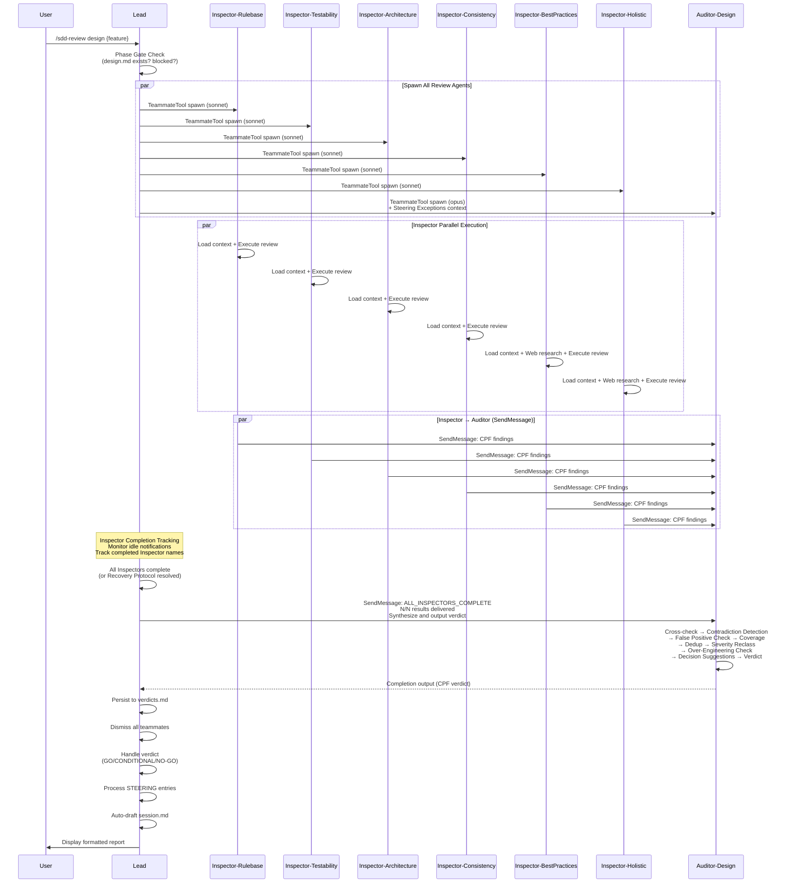
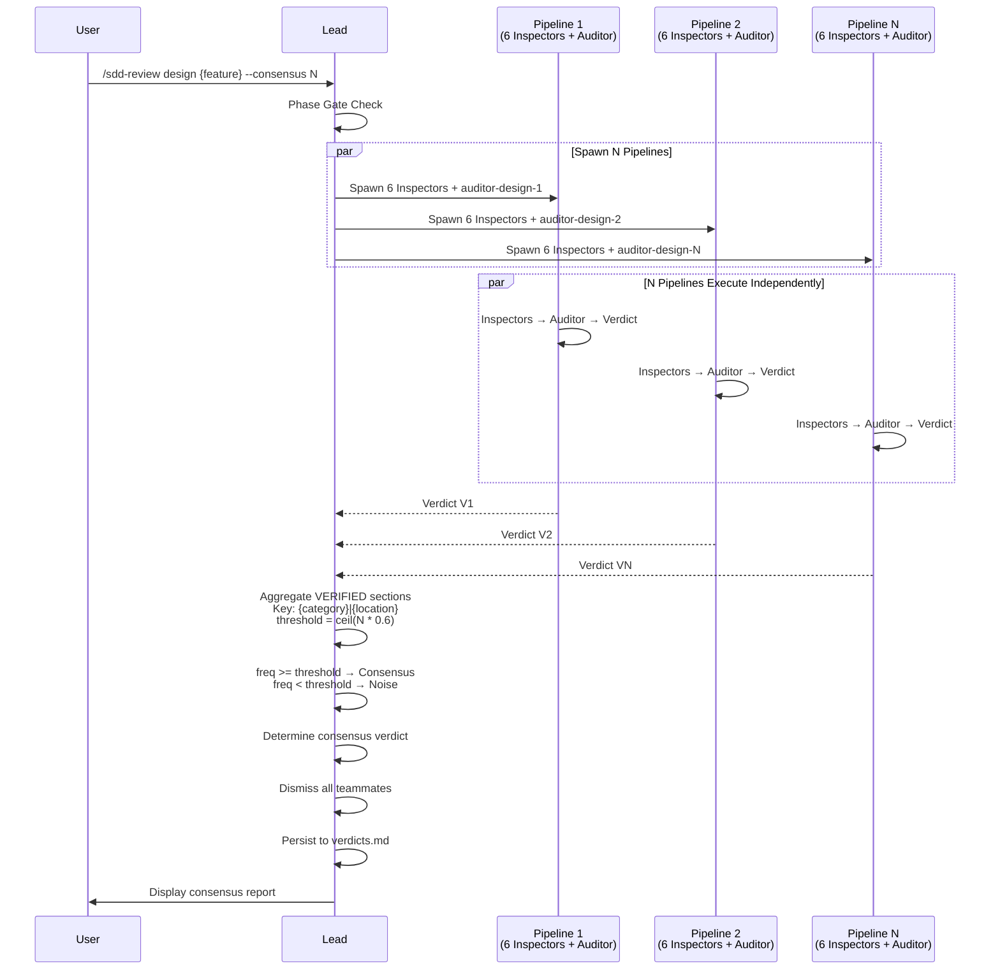

# Design Review

## Specifications

### Introduction

設計レビューパイプラインの完全仕様。`/sdd-review design {feature}` コマンドにより、6つの独立した Design Inspector を並列に spawn し、各 Inspector が CPF (Compact Pipe-Delimited Format) で findings を Design Auditor に SendMessage 経由で送信する。Auditor は findings を cross-check、重複排除、severity 再分類し、統合 verdict を出力する。Lead は verdict を読み取り、verdicts.md に永続化し、verdict に応じた後続アクション（Auto-Fix Loop、STEERING 処理、次フェーズ進行）を実行する。

Consensus mode (`--consensus N`) では N 本のパイプラインを並列実行し、閾値ベースの合意形成で verdict ノイズを低減する。

### Spec 1: Review Pipeline Orchestration
**Goal:** Lead が `/sdd-review design` コマンドを受け取り、6 Inspector + 1 Auditor のレビューパイプラインを spawn・管理する

**Acceptance Criteria:**
1. `design {feature}` 引数で単一 spec の設計レビューモードが起動する
2. `design --cross-check` 引数で全 spec の横断設計レビューが起動する
3. `design --wave N` 引数で wave N までの spec を対象にした wave-scoped 設計レビューが起動する
4. Phase Gate: `specs/{feature}/design.md` の存在を確認し、存在しない場合はエラーメッセージを返す
5. Phase Gate: `spec.yaml.phase` が `blocked` の場合、"{feature} is blocked by {blocked_info.blocked_by}" でブロックする
6. 6 Inspector + 1 Auditor を全て `TeammateTool` で spawn する（`Task` tool は使用しない）
7. Inspector は Sonnet モデル、Auditor は Opus モデルで spawn される
8. Auditor の spawn 時に `session.md` の Steering Exceptions セクションを含める（存在する場合）
9. Auditor の idle notification（verdict 出力を含む）を Lead が読み取る
10. verdict 読み取り後、全レビュー teammate を dismiss する

### Spec 2: Inspector Parallel Execution (6 Agents)
**Goal:** 6つの独立したレビュー視点が並列に設計ドキュメントを検査し、CPF 形式で findings を Auditor に送信する

**Acceptance Criteria:**
1. 6 Inspector が並列に spawn され、各自が独立してコンテキストをロードする
2. 各 Inspector は spawn prompt で feature 名と報告先 Auditor 名を受け取る
3. 各 Inspector は自身の担当領域のみを検査し、他 Inspector の領域と重複しない
4. 各 Inspector は CPF 形式（`VERDICT:`, `SCOPE:`, `ISSUES:`, `NOTES:`）で findings を出力する
5. 各 Inspector は `SendMessageTool` で Auditor に直接 findings を送信する
6. 各 Inspector は findings 送信後、即座に terminate する（追加メッセージを待たない）
7. Single spec mode: 対象 spec の design.md と spec.yaml を読み込む
8. Cross-check mode: 全 spec の design.md を読み込み、横断的な問題を検出する
9. Wave-scoped mode: wave <= N の spec のみをフィルタし、将来 wave の機能不足を flag しない

### Spec 3: Rulebase Inspector
**Goal:** SDD フレームワーク準拠を検証する（テンプレート構造、仕様品質、トレーサビリティ）

**Acceptance Criteria:**
1. Template Conformance Check: design.md が SDD テンプレートの必須セクション（Introduction, Spec N, Non-Goals, Overview, Architecture, Components and Interfaces, Data Models, Error Handling, Testing Strategy）を含むことを検証する
2. Specifications section の各 Spec に Goal と numbered Acceptance Criteria が存在することを確認する
3. Acceptance Criteria が testable かつ specific であること（曖昧な表現の検出: "appropriately", "as needed", "etc."）を検証する
4. Drift Indicator 検出: テンプレートからの欠落セクション、テンプレートにないアドホックセクション、不正なセクションネストを Critical として flag する
5. Traceability Check: 全 design component が spec にトレースでき、orphan component / orphan spec がないことを確認する
6. Specifications section に内部実装詳細（class 名、function signature、DB schema）が含まれていないことを検証する
7. Design sections に新規 acceptance criteria が含まれていないことを検証する（scope creep 検出）

### Spec 4: Testability Inspector
**Goal:** テスト実装者の視点から設計の明確性を評価する（"テストを推測なしに書けるか？"）

**Acceptance Criteria:**
1. Ambiguous Language Detection: "appropriately", "as needed", "etc.", "basically", "usually", "as much as possible", 未定量語（"fast", "many", "few"）を検出する
2. Numeric/Condition Specificity: タイムアウト、制限値、閾値が正確な値で定義されていることを確認する
3. Boundary Condition 検証: 境界条件が明示的（<= vs <, inclusive vs exclusive）であることを確認する
4. Deterministic Outcome 検証: 各入力組み合わせが正確に1つの期待出力を生成することを確認する
5. Mockability 検証: 外部依存関係がモック可能で、依存インターフェースが明確に定義されていることを確認する
6. Edge Case Coverage: null/empty/undefined ケース、エラーシナリオの列挙、concurrent access シナリオが対処されていることを確認する
7. Cross-check mode: 共有コンポーネントの曖昧な振る舞い、統合ポイントのテスト契約不足、不整合なエラーハンドリングパターンを検出する

### Spec 5: Architecture Inspector
**Goal:** コンポーネント境界、インターフェース契約、状態遷移、ハンドオフポイントの設計検証可能性を評価する

**Acceptance Criteria:**
1. Component Responsibility 検証: 各コンポーネントの責務が明確に境界付けされ、重複責務がないことを確認する
2. Interface Contract 検証: 全入力/出力が型と制約で定義され、全エラーケースが列挙されていることを確認する
3. State Transition 検証: 全状態が列挙され、全有効遷移が定義され、無効遷移が明示的に拒否されることを確認する
4. Handoff Point 検証: コンポーネント間のデータフロー方向が明確で、failure シナリオが対処されていることを確認する
5. Dependency Architecture 検証: コンポーネント間依存関係が非循環で、外部依存が分離されていることを確認する
6. 関連 spec の design.md を読み込み、cross-spec の依存関係分析を実施する
7. Cross-check mode: 共有コンポーネントの責務競合、API 互換性、データモデル整合性、循環依存を検出する

### Spec 6: Consistency Inspector
**Goal:** Specifications section と Design sections の間の整合性を検証する（ギャップとスコープクリープの検出）

**Acceptance Criteria:**
1. Specifications Coverage Check: 全 spec と acceptance criterion に対応する design 要素が存在することを確認する
2. Design Overreach Check: 全 design component が spec にトレースバックでき、spec にない機能を導入していないことを確認する
3. Internal Contradiction Detection: Specifications 内、Design sections 内、Specifications-Design 間の矛盾を検出する
4. Non-Goals Respect: design が宣言されたスコープ内に留まり、Non-Goals を遵守していることを確認する
5. Scope Boundary Verification: 他の spec に属する機能が含まれていないことを確認する
6. 関連 spec を読み込み、スコープ重複を検出する
7. Cross-check mode: cross-spec の仕様矛盾、共有仕様の設計乖離、"誰の責任でもない" ギャップを検出する

### Spec 7: Best Practices Inspector
**Goal:** 設計決定を業界標準とベストプラクティスに照らして評価する

**Acceptance Criteria:**
1. Technology Choice Evaluation: 選択技術の適切性、既知の問題、deprecated pattern/API の使用を検出する
2. Design Pattern Assessment: 適用されたデザインパターンの正当性、アンチパターン、スケール/複雑さに対する適切性を評価する
3. Security Best Practices: 既知のセキュリティ懸念、入力検証の十分性、認証/認可パターンの最新性を評価する
4. Performance Considerations: パフォーマンスの落とし穴、キャッシング戦略の適切性、スケーラビリティ懸念を検出する
5. WebSearch/WebFetch を使用して技術選択とパターンを検証する
6. Knowledge context（pattern-*.md, reference-*.md）を読み込んで既知パターンを参照する
7. Steering context（特に tech.md）を参照して技術的制約との整合性を確認する

### Spec 8: Holistic Inspector
**Goal:** 専門 Inspector 間の隙間に落ちる横断的・創発的課題を検出する

**Acceptance Criteria:**
1. 特定のスコープ制限なしに設計全体をレビューする（unconstrained review）
2. Implicit Assumption Scan: コンポーネント間のデータフォーマット仮定、可用性/信頼性仮定、タイミング仮定、スケール仮定を検出する
3. Cross-Cutting Concern Check: セキュリティとアーキテクチャの交差、パフォーマンスとエラーハンドリングの交差、テスタビリティとデータモデルの交差を検出する
4. Feasibility Reality Check: 循環依存、暗黙の順序要件、実装時設計判断の強制、問題に対する不釣り合いな複雑さを検出する
5. "What Could Go Wrong" Sweep: コンポーネントの予期しない障害組み合わせ、未対処のエッジケース、単一障害点を検出する
6. Steering Alignment Gut Check: 設計が Product Intent に奉仕しているか、技術的優雅さのために user value を犠牲にしていないかを確認する
7. 他 Inspector が明らかに検出する単一ドメインの問題ではなく、cross-cutting findings を優先する
8. WebSearch/WebFetch を必要に応じて使用する
9. findings を CPF カテゴリ（blind-spot, implicit-assumption, emergent-risk, feasibility-concern, cross-cutting, missing-context）で分類する

### Spec 9: Design Auditor Synthesis
**Goal:** 6 Inspector の findings を cross-check・検証・統合し、最終 verdict を出力する

**Acceptance Criteria:**
1. 6 Inspector からの CPF 結果を `SendMessageTool` 経由で受信する（全6件到着まで待機）
2. Timeout: 全6件未到着の場合、利用可能な結果で処理を進行する
3. Lead recovery notification 受信時（"Inspector {name} unavailable after retry"）、即座に利用可能な結果で処理を進行し、NOTES に `PARTIAL:{inspector-name}|{reason}` を記録する
4. Cross-Check: 各 finding について、他 Inspector の finding が支持/矛盾するかを確認する
5. Contradiction Detection: 同一箇所について相反する評価があった場合、調査し解決する
6. False Positive Check: 各 finding が実際の問題か、誤解釈か、適切な severity かを検証する
7. Coverage Verification: 全 requirements、全 design components、error handling、cross-spec dependencies がカバーされていることを確認する
8. Deduplication and Merge: 同一問題を複数 Inspector が報告した場合、マージして "confirmed by N agents" と記録する
9. Re-categorize by Verified Severity: Auditor 自身の判断で最終 severity を付与する（C=Critical: 実装/テストをブロック、H=High: 実装前に修正すべき、M=Medium: 実装中に対処、L=Low: 軽微な改善）
10. Over-Engineering Check: premature abstraction、speculative extensibility、pattern overuse、unnecessary indirection、gold-plated architecture、phantom scalability を検出する
11. Decision Suggestions: 意図的な設計選択と判断される findings について、steering（project-wide）または design.md（feature-specific）への Decision 記録を提案する
12. Verdict 判定: Critical issues あり → NO-GO、>3 High issues or unresolved conflicts → CONDITIONAL、Medium/Low のみ → GO（ただし justification 付きで override 可能）
13. STEERING section 出力: CODIFY（既存パターンの文書化）または PROPOSE（新制約の提案）を verdict に含める場合がある
14. CPF 形式で verdict を出力する（VERDICT, SCOPE, VERIFIED, REMOVED, RESOLVED, STEERING, NOTES セクション）
15. Verdict Output Guarantee: 処理バジェットが尽きそうな場合、即座に Step 10 にスキップし `NOTES: PARTIAL_VERIFICATION|steps completed: {1..N}` 付きで verdict を出力する
16. Large-scope review (wave-scoped-cross-check, cross-check) では Inspector 報告の evidence のみで処理し、spec ファイルの再読み込みは行わない

### Spec 10: Consensus Mode
**Goal:** `--consensus N` オプションにより N 本のパイプラインを並列実行し、閾値ベースの合意形成で verdict のノイズを低減する

**Acceptance Criteria:**
1. `--consensus N` 引数で N 本のパイプラインが並列に spawn される
2. 各パイプラインは独立した Inspector set + Auditor を持つ（Auditor 名は `auditor-design-1`, `auditor-design-2`, ... でユニーク化）
3. 各 Inspector は対応するパイプラインの Auditor にのみ報告する
4. 全 N 本の Auditor verdict を収集後、VERIFIED セクションを aggregation する
5. finding のキーは `{category}|{location}` で識別する
6. Default threshold は `ceil(N * 0.6)` で算出する
7. 頻度が threshold 以上の finding は Consensus（確認済み）として扱う
8. 頻度が threshold 未満の finding は Noise として扱う
9. 全 N 本の verdict が GO → consensus verdict は GO
10. Consensus に C/H issue がある → consensus verdict は NO-GO
11. Consensus に M/L issue のみ → consensus verdict は CONDITIONAL
12. N=1（デフォルト）の場合は aggregation をスキップし、単一パイプラインの結果をそのまま使用する
13. Concurrent teammate limit: 7 * N teammates（24 上限を超える N は実行不可）

### Spec 11: Verdict Persistence
**Goal:** Auditor verdict を `verdicts.md` に構造化された形式で永続化し、issue tracking と batch 間の解決追跡を行う

**Acceptance Criteria:**
1. `specs/{feature}/verdicts.md` に verdict を追記する（ファイル不在時は `# Verdicts: {feature}` ヘッダーで新規作成）
2. バッチ番号 `B{seq}` を自動インクリメントする（既存最大値 +1、初回は B1）
3. バッチヘッダー形式: `## [B{seq}] {review-type} | {timestamp} | v{version} | runs:{N} | threshold:{K}/{N}`
4. Raw section: N 本の Auditor CPF verdict を verbatim で記録する（V1, V2, ...）
5. Consensus section: threshold 以上の finding を記録する
6. Noise section: threshold 未満の finding を記録する
7. Disposition 記録: `GO-ACCEPTED`, `CONDITIONAL-TRACKED`, `NO-GO-FIXED`, `SPEC-UPDATE-CASCADED`, `ESCALATED` のいずれか
8. CONDITIONAL の場合: Consensus の M/L issues を Tracked section として追記する
9. 前バッチに Tracked section が存在する場合: 現バッチの Consensus と比較し、解消された issues を `Resolved since B{prev}` として追記する

### Spec 12: Verdict Handling and Auto-Fix Loop
**Goal:** verdict に応じた後続アクション（STEERING 処理、Auto-Fix Loop、次フェーズ進行）を実行する

**Acceptance Criteria:**
1. GO/CONDITIONAL: 設計レビューとして承認（CONDITIONAL の remaining issues は verdicts.md Tracked に永続化済み）。次ステップは `/sdd-impl {feature}`
2. CONDITIONAL は `retry_count` をインクリメントしない（CONDITIONAL = GO として扱う）
3. NO-GO: Auto-Fix Loop を起動する。fix instructions を Auditor verdict から抽出し、Architect を spawn して修正を実施する
4. NO-GO Auto-Fix 後: phase は `design-generated` のまま。修正後に review pipeline を再 spawn する
5. `retry_count` は NO-GO のみでインクリメントする（最大3回）。GO/CONDITIONAL verdict で 0 にリセットする
6. `retry_count` >= 3 の場合: ユーザーにエスカレーションする
7. Aggregate cap: `retry_count + spec_update_count` の合計が 4 に達した場合、ユーザーにエスカレーションする
8. Structural changes（spec split 等）: `--gate` mode ではユーザーにエスカレーション、full-auto mode では auto-fix を実行する
9. Architect failure 時のカスケード: spec 全体をユーザーにエスカレーションする

### Spec 13: STEERING Feedback Processing
**Goal:** Auditor verdict 内の STEERING section を解析し、steering ドキュメントの更新またはユーザー承認を処理する

**Acceptance Criteria:**
1. STEERING section の各行を `{CODIFY|PROPOSE}|{target file}|{decision text}` として parse する
2. CODIFY: `steering/{target file}` を直接更新し、`decisions.md` に STEERING_UPDATE として append する
3. PROPOSE: ユーザーに承認を求める（pipeline を PROPOSE 処理が完了するまでブロック）
4. PROPOSE 承認: `steering/{target file}` を更新し、`decisions.md` に STEERING_UPDATE として append する
5. PROPOSE 拒否: `decisions.md` に STEERING_EXCEPTION（理由と Steering-ref 付き）または USER_DECISION として append する
6. STEERING エントリの処理は verdict handling（GO/NO-GO 等）の後、次フェーズ進行の前に実行する

### Spec 14: Inspector/Auditor Recovery
**Goal:** レビューパイプライン中に Inspector または Auditor が応答不能になった場合のリカバリ手順

**Acceptance Criteria:**
1. Inspector Recovery: 応答不能 Inspector を `requestShutdown` で停止し、同じ agent type で新名前の Inspector を `TeammateTool` で再 spawn する（1回リトライ）
2. Inspector リトライ失敗: Lead が Auditor に SendMessage で "Inspector {name} unavailable after retry. Proceed with {N-1}/{N} results." を送信し、Auditor が利用可能な結果で処理を進行する
3. Auditor Recovery: verdict 未出力で idle → Lead が "Output your verdict now" と SendMessage → verdict 出力なら正常フローに復帰
4. Auditor 1回目の nudge 失敗: `requestShutdown` → 新名前で Auditor を再 spawn（Inspector CPF を spawn context に直接埋め込み、"RECOVERY MODE" 指示付き）
5. Auditor リトライも失敗: Lead が Inspector 結果から conservative verdict を導出し、`NOTES: AUDITOR_UNAVAILABLE|lead-derived verdict` を付与する
6. Auditor が missing Inspector を NOTES に `PARTIAL:{inspector-name}|{reason}` として記録する

### Spec 15: Inspector Completion Trigger
**Goal:** Lead が全 Inspector 完了を検知し、Auditor に明示的な合成トリガーを送信する

**Acceptance Criteria:**
1. Lead は Inspector の idle notification を監視し、完了した Inspector 名を追跡する
2. 全 Inspector 完了（または Inspector Recovery Protocol 処理完了）後、Lead は Auditor に SendMessage を送信する: "ALL_INSPECTORS_COMPLETE: {N}/{N} results delivered. Inspectors: {comma-separated names}. Synthesize and output your verdict now."
3. Inspector が unavailable の場合、トリガーメッセージに "Missing: {names}. Proceed with {available}/{expected} results." を含める
4. トリガー送信後、Lead は Auditor の verdict を completion output から待ち受ける
5. トリガー後も Auditor が verdict 未出力で idle になった場合、既存の Auditor Recovery Protocol に従う
6. この仕様は全3レビュータイプ（design, impl, dead-code）に適用される（共通の sdd-review SKILL.md で実装されるため）

### Non-Goals
- Implementation review（`/sdd-review impl` で `impl-review` spec のスコープ）
- Dead code review（`/sdd-review dead-code` で `dead-code-review` spec のスコープ）
- Builder spawn や implementation code の直接修正（Auto-Fix は Architect 経由のみ）
- spec.yaml の直接更新（Lead のみが更新権限を持つ）

## Overview

**Purpose**: Design review pipeline は Stage 1 (Specification) の品質ゲートとして機能する。design.md の品質を6つの独立した視点から並列検査し、Auditor が統合 verdict を出力することで、implementation に進む前に設計上の問題を検出・修正する。

**Users**: Lead agent が `/sdd-review design {feature}` コマンド経由で起動する。間接的に全ての SDD ユーザー（developer, team lead）が恩恵を受ける。

**Impact**: 設計品質の標準化、レビューの再現性確保、over-engineering の防止、STEERING ドキュメントの継続的改善を実現する。verdict 結果は verdicts.md に永続化され、batch 間の issue 解決追跡が可能。

## Architecture

### Architecture Pattern & Boundary Map

**Pattern**: Parallel Fan-Out / Fan-In + Peer Communication

6 Inspector が Fan-Out で並列実行され、SendMessage 経由で Auditor に Fan-In する。Lead は Auditor の completion output から verdict を読み取る。この pattern は Agent Teams mode のメッセージングプリミティブ（TeammateTool spawn + SendMessageTool peer communication）上に構築されている。

**Boundary Map**:
- **Orchestration Layer** (Lead): Pipeline lifecycle management, phase gate, verdict handling, STEERING processing, verdicts.md persistence
- **Inspection Layer** (6 Inspectors, T3): 独立した並列検査。各 Inspector は自身のスコープのみを検査し、他 Inspector と直接通信しない
- **Synthesis Layer** (Auditor, T2): Cross-check, deduplication, severity reclassification, verdict output
- **Communication Protocol**: CPF format over SendMessage (Inspector → Auditor), completion text (Auditor → Lead)

**Steering Compliance**: Agent Teams architecture に準拠。TeammateTool で spawn、SendMessageTool で peer communication。Task tool は使用しない。

### Technology Stack

| Layer | Choice / Version | Role in Feature | Notes |
|-------|------------------|-----------------|-------|
| Orchestration | Lead (Opus) | Pipeline spawn, verdict handling, persistence | T1 role |
| Synthesis | Auditor (Opus) | Finding cross-check, verdict generation | T2 role, requires higher reasoning |
| Inspection | 6 Inspectors (Sonnet) | Parallel design review | T3 role, sufficient for focused inspection |
| Communication | CPF over SendMessage | Inter-agent structured data transfer | Token-efficient pipe-delimited format |
| Research | WebSearch / WebFetch | Best Practices / Holistic research | bypassPermissions for these 2 Inspectors |
| Persistence | verdicts.md (Markdown) | Verdict history, issue tracking | Append-only batch structure |

## System Flows

### Main Design Review Flow (Single Spec)



### Consensus Mode Flow (--consensus N)



### Verdict Handling Flow

```mermaid
flowchart TD
    V[Auditor Verdict] --> Parse[Parse CPF Output]
    Parse --> Persist[Persist to verdicts.md<br/>B{seq} batch entry]
    Persist --> Check{Verdict?}

    Check -->|GO| Accept[GO-ACCEPTED<br/>Next: /sdd-impl]
    Check -->|CONDITIONAL| Track[CONDITIONAL-TRACKED<br/>M/L issues → Tracked section<br/>Next: /sdd-impl]
    Check -->|NO-GO| Fix{retry_count < 3?<br/>aggregate < 4?}

    Fix -->|Yes| AutoFix[Auto-Fix Loop:<br/>1. Extract fix instructions<br/>2. Dismiss review teammates<br/>3. Spawn Architect with fixes<br/>4. Re-spawn review pipeline]
    Fix -->|No| Escalate[Escalate to User<br/>ESCALATED disposition]

    AutoFix --> Increment[retry_count++]
    Increment --> ReReview[Re-run review pipeline]
    ReReview --> V

    Accept --> Steering[Process STEERING entries]
    Track --> Steering
    Steering --> CheckSTEERING{Has STEERING?}
    CheckSTEERING -->|No| Draft[Auto-draft session.md]
    CheckSTEERING -->|Yes| Route{CODIFY or PROPOSE?}

    Route -->|CODIFY| Apply[Update steering file<br/>Append decisions.md]
    Route -->|PROPOSE| Ask[Present to User]
    Ask -->|Approved| ApplyPropose[Update steering file<br/>Append decisions.md]
    Ask -->|Rejected| Reject[Append decisions.md<br/>STEERING_EXCEPTION]
    Apply --> Draft
    ApplyPropose --> Draft
    Reject --> Draft

    Draft --> Done[Report to User]
```

## Specifications Traceability

| Specification | Summary | Components | Interfaces | Flows |
|--------------|---------|------------|------------|-------|
| 1 | Pipeline orchestration | sdd-review skill (Lead logic) | TeammateTool spawn, completion read | Main Flow |
| 2 | Inspector parallel execution | 6 Inspector agents | SendMessage → Auditor | Main Flow (parallel section) |
| 3 | Rulebase Inspector | sdd-inspector-rulebase | CPF output | Inspector execution |
| 4 | Testability Inspector | sdd-inspector-testability | CPF output | Inspector execution |
| 5 | Architecture Inspector | sdd-inspector-architecture | CPF output | Inspector execution |
| 6 | Consistency Inspector | sdd-inspector-consistency | CPF output | Inspector execution |
| 7 | Best Practices Inspector | sdd-inspector-best-practices | CPF output, WebSearch/WebFetch | Inspector execution |
| 8 | Holistic Inspector | sdd-inspector-holistic | CPF output, WebSearch/WebFetch | Inspector execution |
| 9 | Auditor synthesis | sdd-auditor-design | SendMessage input, CPF verdict output | Auditor synthesis section |
| 10 | Consensus mode | sdd-review skill (Lead logic) | N pipeline aggregation | Consensus Mode Flow |
| 11 | Verdict persistence | sdd-review skill (Lead logic) | verdicts.md write | Verdict Handling Flow |
| 12 | Verdict handling / Auto-Fix | sdd-review skill (Lead logic) | Architect spawn (fix) | Verdict Handling Flow |
| 13 | STEERING processing | sdd-review skill (Lead logic) | steering files, decisions.md | Verdict Handling Flow (STEERING branch) |
| 14 | Recovery protocol | sdd-review skill (Lead logic) | requestShutdown, re-spawn | Recovery (implicit in Main Flow) |
| 15 | Inspector completion trigger | sdd-review skill (Lead logic) | SendMessage to Auditor | Main Flow (completion tracking section) |

## Components and Interfaces

| Component | Domain/Layer | Intent | Req Coverage | Key Dependencies | Contracts |
|-----------|--------------|--------|--------------|-----------------|-----------|
| sdd-review skill | Orchestration | Pipeline lifecycle, verdict handling | 1, 10, 11, 12, 13, 15 | TeammateTool, verdicts.md | Skill |
| sdd-auditor-design | Synthesis | Finding cross-check, verdict output | 9 | SendMessage (input), CPF (output) | Service |
| sdd-inspector-rulebase | Inspection | SDD compliance | 2, 3 | design.md, template, rules | Service |
| sdd-inspector-testability | Inspection | Test clarity | 2, 4 | design.md, steering | Service |
| sdd-inspector-architecture | Inspection | Design verifiability | 2, 5 | design.md, steering, related specs | Service |
| sdd-inspector-consistency | Inspection | Spec-design alignment | 2, 6 | design.md, steering, related specs | Service |
| sdd-inspector-best-practices | Inspection | Industry standards | 2, 7 | design.md, steering, knowledge, WebSearch | Service |
| sdd-inspector-holistic | Inspection | Cross-cutting concerns | 2, 8 | design.md, steering, knowledge, WebSearch | Service |
| design-review rule | Configuration | Review criteria baseline | 3, 4, 5 | None | State |

### Orchestration Layer

#### sdd-review skill (Design Mode)

| Field | Detail |
|-------|--------|
| Intent | `/sdd-review design` コマンドのエントリポイント。引数解析、Phase Gate、pipeline spawn、Inspector completion tracking、Auditor trigger、verdict handling、verdicts.md 永続化、STEERING 処理、Auto-Fix Loop、session.md auto-draft を統括する |
| Requirements | 1, 10, 11, 12, 13, 14, 15 |

**Responsibilities & Constraints**
- 引数解析: `design {feature}`, `design --cross-check`, `design --wave N`, `design {feature} --consensus N`
- Phase Gate: design.md 存在確認、blocked 状態チェック（phase restriction なし）
- Pipeline spawn: 6 Inspector (sonnet) + 1 Auditor (opus) を TeammateTool で一括 spawn
- Inspector completion tracking: 各 Inspector の idle notification を監視し、完了した Inspector 名を内部リストで追跡する
- Inspector completion trigger: 全 Inspector 完了（または Recovery Protocol 処理完了）後、Auditor に "ALL_INSPECTORS_COMPLETE" メッセージを SendMessage で送信する。Inspector が unavailable の場合は "Missing: {names}" を含める
- Consensus mode: N pipeline 並列 spawn、verdict aggregation（各パイプラインで個別に completion trigger を送信）
- Verdict handling: GO/CONDITIONAL/NO-GO に応じた後続アクション
- STEERING processing: CODIFY 自動適用、PROPOSE ユーザー承認
- Auto-Fix Loop: NO-GO → Architect spawn → re-review（max 3 retries）
- verdicts.md persistence: batch entry append
- Error handling: missing spec, missing design.md, wrong phase, blocked

**Dependencies**
- Inbound: User command via Lead (P0)
- Outbound: TeammateTool (P0), verdicts.md (P0), session.md (P1), decisions.md (P1)

**Contracts**: Skill [x]

##### Skill Interface
```
sdd-review:
  parse_arguments($ARGUMENTS: string) -> ReviewConfig
    - mode: "design" | "impl" | "dead-code"
    - feature: string | null
    - cross_check: boolean
    - wave: number | null
    - consensus_n: number (default 1)

  phase_gate(feature: string) -> Result<void, PhaseGateError>
    - Preconditions: specs/{feature}/design.md exists
    - Error: blocked → "{feature} is blocked by {blocked_by}"
    - Error: missing → "Spec '{feature}' not found"

  spawn_pipeline(config: ReviewConfig) -> Pipeline
    - Spawns 6 Inspectors + 1 Auditor via TeammateTool
    - Consensus: N * (6 + 1) teammates

  track_inspector_completion(pipeline: Pipeline, inspector_name: string) -> CompletionStatus
    - Records inspector_name in completed set
    - Returns {completed: string[], remaining: string[], all_complete: boolean}

  send_completion_trigger(pipeline: Pipeline, status: CompletionStatus) -> void
    - Precondition: status.all_complete == true OR all remaining resolved via Recovery Protocol
    - Sends "ALL_INSPECTORS_COMPLETE: {N}/{N} results delivered. Inspectors: {names}. Synthesize and output your verdict now."
    - If unavailable inspectors: appends "Missing: {names}. Proceed with {available}/{expected} results."

  handle_verdict(verdict: CPFVerdict) -> VerdictOutcome
    - GO → proceed
    - CONDITIONAL → persist tracked, proceed
    - NO-GO → auto-fix loop or escalate
```

### Inspection Layer

#### sdd-inspector-rulebase

| Field | Detail |
|-------|--------|
| Intent | SDD テンプレート準拠、仕様品質、トレーサビリティの検証 |
| Requirements | 2, 3 |

**Responsibilities & Constraints**
- Template Conformance: 必須セクションの存在確認、構造的 drift 検出
- Specifications Quality: AC の testability、specific 性、vague language 検出
- Traceability: design component → spec のマッピング、orphan 検出
- WHAT vs HOW 分離: Specifications section に内部実装詳細がないこと、Design sections に新規 AC がないこと

**Dependencies**
- Inbound: Lead spawn prompt (feature name, Auditor name) (P0)
- Outbound: SendMessage to Auditor (P0)
- External: design.md (P0), spec.yaml (P1), design.md template (P0), design-review.md rules (P0)

**Contracts**: Service [x]

##### Service Interface
```
InspectorRulebase:
  execute(feature: string, auditor_name: string) -> void
    - Loads context autonomously
    - Sends CPF findings to Auditor via SendMessage
    - Terminates immediately after sending
```

##### CPF Output Format
```
VERDICT:{GO|CONDITIONAL|NO-GO}
SCOPE:{feature} | cross-check | wave-1..{N}
ISSUES:
{sev}|{category}|{location}|{description}
NOTES:
{advisory observations}
```

**Categories**: `spec-quality`, `template-drift`, `traceability-gap`, `orphan-component`, `responsibility-leak`, `scope-creep`

#### sdd-inspector-testability

| Field | Detail |
|-------|--------|
| Intent | テスト実装者の視点からの設計明確性評価 |
| Requirements | 2, 4 |

**Responsibilities & Constraints**
- Ambiguous Language Detection: 曖昧な修飾語の検出（"appropriately", "as needed", etc.）
- Numeric/Condition Specificity: タイムアウト、制限値、境界条件の具体性確認
- Deterministic Outcomes: 入力→出力の一意性、side effect の観測可能性
- Mockability: 外部依存関係のモック可能性、依存インターフェースの明確性
- Edge Case Coverage: null/empty/undefined、エラーシナリオ、concurrent access

**Dependencies**
- Inbound: Lead spawn prompt (P0)
- Outbound: SendMessage to Auditor (P0)
- External: design.md (P0), spec.yaml (P1), steering/ (P1), design-review.md (P2)

**Categories**: `untestable`, `ambiguous-language`, `missing-spec`, `mockability`, `edge-case-gap`

#### sdd-inspector-architecture

| Field | Detail |
|-------|--------|
| Intent | コンポーネント境界、インターフェース契約、状態遷移の設計検証可能性評価 |
| Requirements | 2, 5 |

**Responsibilities & Constraints**
- Component Responsibilities: 責務の境界、重複、isolation、"god components" 検出
- Interface Contracts: 入力/出力の型・制約、エラーケース列挙、optional/required の明確性
- State Transitions: 全状態列挙、有効/無効遷移、状態不変条件、concurrent 修正
- Handoff Points: データフロー方向、変換ステップ、ownership transfer
- Dependency Architecture: 非循環依存、外部依存の分離

**Dependencies**
- Inbound: Lead spawn prompt (P0)
- Outbound: SendMessage to Auditor (P0)
- External: design.md (P0), spec.yaml (P1), steering/ (P1), related specs (P2)

**Categories**: `interface-contract`, `state-transition`, `component-boundary`, `dependency`, `handoff-gap`

#### sdd-inspector-consistency

| Field | Detail |
|-------|--------|
| Intent | Specifications section と Design sections 間の整合性検証 |
| Requirements | 2, 6 |

**Responsibilities & Constraints**
- Specifications Coverage: 全 spec/AC に対応する design 要素の存在確認
- Design Overreach: spec backing のない design 要素の検出
- Internal Contradiction: spec 内、design 内、spec-design 間の矛盾検出
- Completeness: non-functional specs、error/edge cases、performance/security の反映確認
- Scope Boundary: Non-Goals の遵守、他 spec 機能の侵入検出

**Dependencies**
- Inbound: Lead spawn prompt (P0)
- Outbound: SendMessage to Auditor (P0)
- External: design.md (P0), spec.yaml (P1), steering/ (P1), related specs (P2)

**Categories**: `coverage-gap`, `design-overreach`, `internal-contradiction`, `scope-violation`

#### sdd-inspector-best-practices

| Field | Detail |
|-------|--------|
| Intent | 設計決定の業界標準・ベストプラクティスとの整合性評価 |
| Requirements | 2, 7 |

**Responsibilities & Constraints**
- Technology Choice Evaluation: 技術の適切性、代替案、既知の問題、deprecated 検出
- Design Pattern Assessment: パターンの正当性、アンチパターン、SOLID 原則
- Security Best Practices: OWASP、入力検証、認証/認可パターン
- Performance Considerations: パフォーマンスの落とし穴、キャッシング、スケーラビリティ
- 研究深度は自律的に判断（複雑さ、技術の新規性、リスクレベル、steering のギャップに基づく）
- `permissionMode: bypassPermissions` でネットワークアクセス制限を回避

**Dependencies**
- Inbound: Lead spawn prompt (P0)
- Outbound: SendMessage to Auditor (P0)
- External: design.md (P0), spec.yaml (P1), steering/ (P1), knowledge/ (P2), WebSearch/WebFetch (P1)

**Categories**: `security-concern`, `anti-pattern`, `deprecated-tech`, `best-practice-divergence`, `performance-risk`

#### sdd-inspector-holistic

| Field | Detail |
|-------|--------|
| Intent | 専門 Inspector 間のスコープの隙間に落ちる横断的・創発的課題の検出 |
| Requirements | 2, 8 |

**Responsibilities & Constraints**
- Unconstrained scope: 特定のチェックリストなしに設計全体を holistic に読み通す
- Implicit Assumption Scan: データフォーマット仮定、可用性仮定、タイミング仮定、スケール仮定
- Cross-Cutting Concern: 複数の設計領域にまたがる問題（security + architecture, performance + error handling 等）
- Feasibility Reality Check: 循環依存、暗黙の順序要件、不釣り合いな複雑さ
- "What Could Go Wrong" Sweep: 予期しない障害組み合わせ、未対処エッジケース、単一障害点
- Steering Alignment Gut Check: Product Intent への奉仕 vs 技術的優雅さ
- 他 Inspector が明らかに検出する問題は重複報告しない
- `permissionMode: bypassPermissions` でネットワークアクセス制限を回避

**Dependencies**
- Inbound: Lead spawn prompt (P0)
- Outbound: SendMessage to Auditor (P0)
- External: design.md (P0), spec.yaml (P1), steering/ (P1), knowledge/ (P2), WebSearch/WebFetch (P2)

**Categories**: `blind-spot`, `implicit-assumption`, `emergent-risk`, `feasibility-concern`, `cross-cutting`, `missing-context`

### Synthesis Layer

#### sdd-auditor-design

| Field | Detail |
|-------|--------|
| Intent | 6 Inspector の findings を cross-check・検証・統合し、最終 verdict を CPF 形式で出力する |
| Requirements | 9 |

**Responsibilities & Constraints**
- 6 Inspector 結果の待機と受信（SendMessage 経由）
- 10-step verification process: Cross-Check → Contradiction Detection → False Positive Check → Coverage Verification → Deduplication → Severity Reclassification → Conflict Resolution → Over-Engineering Check → Decision Suggestions → Verdict Synthesis
- Over-engineering bias guard: AI 生成レビューの抽象化過剰傾向に対抗する
- Verdict Output Guarantee: 処理バジェット不足時は即座に verdict を出力する
- Large-scope budget strategy: Inspector evidence のみで処理（spec ファイル再読み込みなし）
- 不足 Inspector 結果の場合: `PARTIAL:{name}|{reason}` を NOTES に記録

**Dependencies**
- Inbound: 6 Inspector SendMessage results (P0), Lead spawn context + Steering Exceptions (P0)
- Outbound: Completion text with CPF verdict to Lead (P0)
- External: design.md (P1, for single-feature re-verification only)

**Contracts**: Service [x]

##### Verdict Output Format (CPF)
```
VERDICT:{GO|CONDITIONAL|NO-GO}
SCOPE:{feature} | cross-check | wave-scoped-cross-check
WAVE_SCOPE:{range}                          (wave-scoped mode only)
SPECS_IN_SCOPE:{spec-a},{spec-b}            (wave-scoped mode only)
VERIFIED:
{agents}|{sev}|{category}|{location}|{description}
REMOVED:
{agent}|{reason}|{original issue}
RESOLVED:
{agents}|{resolution}|{conflicting findings}
STEERING:
{CODIFY|PROPOSE}|{target file}|{decision text}
NOTES:
{synthesis observations}
ROADMAP_ADVISORY:                           (wave-scoped mode only)
{future wave considerations}
```

**Verdict Formula**:
```
IF any Critical issues remain after verification → NO-GO
ELSE IF >3 High issues OR unresolved conflicts → CONDITIONAL
ELSE IF only Medium/Low issues → GO
```
Auditor MAY override with justification.

**Severity Definitions**:
| Severity | Code | Meaning |
|----------|------|---------|
| Critical | C | 実装またはテストをブロックする。先に修正必須 |
| High | H | 実装前に修正すべき。強く推奨 |
| Medium | M | 実装中に対処可能。進行可 |
| Low | L | 軽微な改善。オプション |

### Configuration Layer

#### design-review rule

| Field | Detail |
|-------|--------|
| Intent | レビュー基準のベースラインルール定義。Inspector が参照する共通チェックリスト |
| Requirements | 3, 4, 5 |

**Structure**:
- Mode 1 (Single Review): SDD Compliance (0), Specifications Clarity (1), Specifications Consistency (2), Design Verifiability (3), Test Observability (4)
- Mode 2 (Cross-Check): Terminology Unification (1.1), Conflicting Expectations (1.2), Dependency Clarity (1.3), Shared Resource Access (2.1), API Compatibility (2.2), Data Model Consistency (2.3), Independence Assessment (3.1), Circular Dependency Detection (3.2), Shared Component Ownership (3.3)
- Severity Classification: Critical (blocked/unreliable) → C/H, Warning (possible but risky) → M/L

## Data Models

### Verdict Batch Entry (verdicts.md)

各 verdict は batch entry として verdicts.md に追記される:

```markdown
## [B{seq}] design | {ISO-8601 timestamp} | v{version} | runs:{N} | threshold:{K}/{N}

### Raw
#### V1
{Auditor 1 CPF verdict verbatim}

#### V2 (consensus mode only)
{Auditor 2 CPF verdict verbatim}

### Consensus (consensus mode only)
{findings with freq >= threshold}

### Noise (consensus mode only)
{findings with freq < threshold}

### Disposition
{GO-ACCEPTED | CONDITIONAL-TRACKED | NO-GO-FIXED | SPEC-UPDATE-CASCADED | ESCALATED}

### Tracked (CONDITIONAL only)
{M/L issues from Consensus section}

### Resolved since B{prev} (if previous batch had Tracked)
{issues no longer present in current Consensus}
```

### Inspector CPF Output Schema

```
VERDICT:{GO|CONDITIONAL|NO-GO}
SCOPE:{feature} | cross-check | wave-1..{N}
ISSUES:
{sev}|{category}|{location}|{description}
NOTES:
{advisory observations}
```

### Auditor CPF Output Schema

```
VERDICT:{GO|CONDITIONAL|NO-GO}
SCOPE:{feature} | cross-check | wave-scoped-cross-check
WAVE_SCOPE:{range}
SPECS_IN_SCOPE:{spec-a},{spec-b}
VERIFIED:
{agents}|{sev}|{category}|{location}|{description}
REMOVED:
{agent}|{reason}|{original issue}
RESOLVED:
{agents}|{resolution}|{conflicting findings}
STEERING:
{CODIFY|PROPOSE}|{target file}|{decision text}
NOTES:
{synthesis observations}
ROADMAP_ADVISORY:
{future wave considerations}
```

### Consensus Aggregation Model

| Field | Description |
|-------|-------------|
| finding_key | `{category}\|{location}` — finding の一意識別子 |
| frequency | N 本の verdict 中での出現回数 |
| threshold | `ceil(N * 0.6)` — Consensus に必要な最小頻度 |
| status | `Consensus` (freq >= threshold) or `Noise` (freq < threshold) |

## Error Handling

### Error Strategy

各レイヤーで独立したエラーハンドリングを実施し、パイプライン全体の resilience を確保する。Inspector/Auditor の障害は Recovery Protocol で対処し、設計上の問題は verdict メカニズムで分類・追跡する。

### Error Categories and Responses

**Phase Gate Errors** (pipeline 起動前):
- Missing spec: "Spec '{feature}' not found. Run `/sdd-design \"description\"` first."
- Missing design.md: "Design required. Run `/sdd-design {feature}` first."
- Blocked spec: "{feature} is blocked by {blocked_info.blocked_by}."
- No specs found (cross-check): "No specs found. Create specs first."

**Inspector Errors** (pipeline 実行中):
- Inspector unresponsive: Recovery Protocol (requestShutdown → re-spawn with new name, 1 retry)
- Inspector retry failure: Lead → Auditor SendMessage "Inspector {name} unavailable after retry. Proceed with {N-1}/{N} results."
- Missing context (no design.md): Inspector reports error and terminates
- Missing template: Inspector warns and proceeds with available context

**Auditor Errors** (pipeline 実行中):
- Auditor idle without verdict: Lead sends nudge SendMessage → "Output your verdict now"
- Auditor nudge failure: requestShutdown → re-spawn with RECOVERY MODE (Inspector CPF embedded in spawn context)
- Auditor retry failure: Lead derives conservative verdict from Inspector results (`NOTES: AUDITOR_UNAVAILABLE|lead-derived verdict`)
- Processing budget exhaustion: Auditor outputs partial verdict (`NOTES: PARTIAL_VERIFICATION|steps completed: {1..N}`)

**Auto-Fix Loop Errors**:
- retry_count >= 3: Escalate to user
- aggregate cap (retry + spec_update) >= 4: Escalate to user
- Architect failure during fix: Escalate entire spec to user
- Structural changes: Escalate in `--gate` mode, auto-fix in full-auto mode

### Monitoring

- verdict 結果は verdicts.md に永続化され、batch 間の trend が追跡可能
- Auto-Fix Loop の retry_count / spec_update_count は verdict 判定のたびに評価
- session.md auto-draft により各コマンド完了時点の状態が記録される
- decisions.md に STEERING_UPDATE / STEERING_EXCEPTION が append-only で記録される

## Testing Strategy

### Agent Definition Verification
- 各 Inspector agent 定義に正しい tools リスト（Read, Glob, Grep, SendMessage）が含まれること
- Best Practices / Holistic Inspector に追加 tools（WebSearch, WebFetch）と `permissionMode: bypassPermissions` が含まれること
- Auditor agent 定義に正しい tools リスト（Read, Glob, Grep, SendMessage）と `model: opus` が含まれること

### Pipeline Integration Tests
- Single spec mode: 6 Inspector + 1 Auditor の spawn、CPF 送受信、verdict 出力の E2E フロー
- Cross-check mode: 複数 spec の横断レビューが正しく動作すること
- Wave-scoped mode: wave <= N のフィルタリングが正しく動作すること
- Consensus mode (N=2): 2 パイプラインの並列実行と verdict aggregation

### Verdict Persistence Tests
- verdicts.md の batch 番号が正しくインクリメントされること
- CONDITIONAL verdict の Tracked section が正しく永続化されること
- 前バッチとの比較で Resolved issues が正しく検出されること

### Recovery Tests
- Inspector 障害時の re-spawn と Auditor への通知
- Auditor 障害時の nudge → re-spawn → Lead-derived verdict のカスケード
- Partial verification (Inspector 欠損) での verdict 出力

### Auto-Fix Loop Tests
- NO-GO → Architect spawn → re-review の循環が正しく動作すること
- retry_count の正しいインクリメントとリセット
- Escalation threshold (3 retries, aggregate 4) での正しいユーザーエスカレーション

### Inspector Completion Trigger Tests
- 全6 Inspector 正常完了時: Lead が全名前を追跡し、"ALL_INSPECTORS_COMPLETE: 6/6" トリガーを Auditor に送信すること
- Inspector 1件 unavailable 時: トリガーメッセージに "Missing: {name}. Proceed with 5/6 results." が含まれること
- トリガー送信後に Auditor が verdict を出力すること
- トリガー送信後に Auditor が idle (verdict 未出力) の場合、Auditor Recovery Protocol に遷移すること
- Consensus mode: 各パイプラインが独立して completion trigger を送信すること

## Revision Notes

### v1.1.0 — Spec 15: Inspector Completion Trigger (2026-02-21)

**背景**: Agent Teams では各 SendMessage が新しいターンを生成するため、Auditor は6件の Inspector 結果が全て到着したことを確実に検知できない。Lead は Inspector の idle notification から全員の完了状態を既に把握しているため、Lead から Auditor への明示的なトリガーで合成開始タイミングを確定する。

**変更内容**:
- Specifications: Spec 15 追加（Inspector Completion Trigger）
- System Flows: Main Design Review Flow に Inspector completion tracking ステップと Lead → Auditor trigger SendMessage を追加
- Components: sdd-review skill の Requirements, Intent, Responsibilities に Inspector completion tracking と trigger 送信を追加。Skill Interface に `track_inspector_completion` と `send_completion_trigger` メソッドを追加
- Specifications Traceability: Spec 15 の行を追加
- Testing Strategy: Inspector Completion Trigger Tests セクションを追加

**適用範囲**: この仕様は sdd-review SKILL.md で共通実装されるため、全3レビュータイプ（design, impl, dead-code）に適用される。

**既存仕様との関係**:
- Spec 9 (Auditor Synthesis): Auditor の "全6件到着まで待機" は、Lead からの completion trigger 受信で完了条件が明確化される
- Spec 14 (Recovery Protocol): Inspector Recovery Protocol 処理完了後にトリガーが送信される。Auditor Recovery Protocol はトリガー送信後の安全ネットとして維持される

**決定根拠**: D14 decision (decisions.md) 参照
