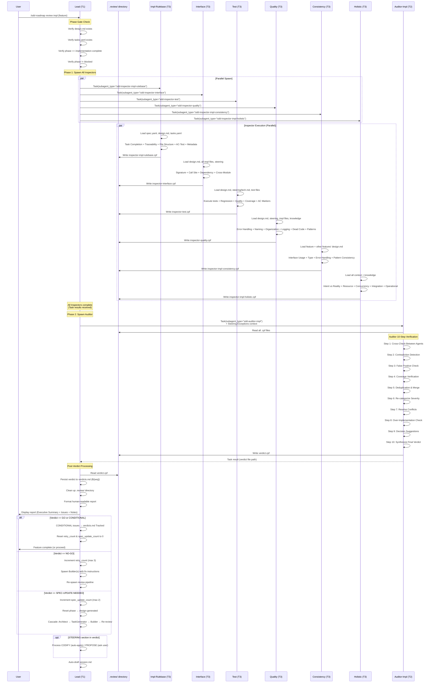
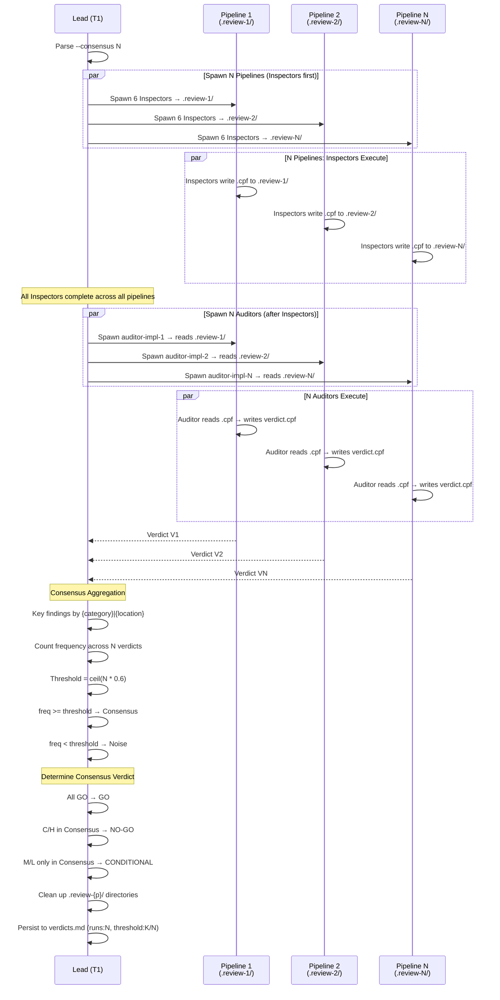

# Implementation Review

## Specifications

### Introduction
実装レビューパイプラインの完全仕様。`/sdd-roadmap review impl {feature}` コマンドにより、6つの独立した Implementation Inspector を並列に spawn し、各 Inspector が CPF (Compact Pipe-Delimited Format) で findings を `.review/{inspector-name}.cpf` ファイルに書き出す。全 Inspector 完了後に Implementation Auditor を spawn し、Auditor は `.review/` ディレクトリから全 `.cpf` ファイルを読み込み、cross-check、重複排除、severity 再分類し、統合 verdict を `.review/verdict.cpf` に書き出す。Lead は `verdict.cpf` を読み取り、verdicts.md に永続化し、`.review/` ディレクトリをクリーンアップした後、verdict に応じた後続アクション（Auto-Fix Loop、STEERING 処理、次フェーズ進行）を実行する。

Consensus mode (`--consensus N`) では N 本のパイプラインを並列実行し、各パイプラインが独自の `.review-{p}/` ディレクトリを使用して、閾値ベースの合意形成で verdict ノイズを低減する。

### Spec 1: Review Skill (Impl Mode)
**Goal:** `/sdd-roadmap review impl` コマンドの実装レビューモードオーケストレーション

**Acceptance Criteria:**
1. `impl {feature}` 引数で実装レビューモードが起動する
2. `impl {feature} {tasks}` で特定タスクのみスコープ指定できる
3. `impl --cross-check` で全 spec の横断レビューが実行できる
4. `impl --wave N` で Wave スコープレビューが実行できる
5. Phase Gate: `design.md` と `tasks.yaml` の存在を確認し、`phase` が `implementation-complete` であることを検証する
6. `phase` が `blocked` の場合は "{feature} is blocked by {blocked_info.blocked_by}" でブロックする
7. Standard 6 Inspector + Web プロジェクトの場合は E2E Inspector（計 6 or 7）を `Task(subagent_type=...)` で spawn する。全 Inspector 完了後に Auditor を `Task(subagent_type="sdd-auditor-impl")` で spawn する
8. 各 Inspector に "Feature: {feature}" のコンテキストと `.review/` ディレクトリパスを渡す
9. 各 Inspector は `.review/{inspector-name}.cpf` に CPF findings を書き出す。書き出し後 `WRITTEN:{file_path}` のみ出力して terminate。分析テキストは出力しない（Lead コンテキストバジェット保護）
10. Auditor spawn 時に `handover/session.md` の Steering Exceptions セクションを含める
11. Auditor は `.review/` ディレクトリから全 `.cpf` ファイルを読み込み、`.review/verdict.cpf` に verdict を書き出す
12. Lead は `.review/verdict.cpf` を読み取り、verdicts.md に永続化し、`.review/` をクリーンアップする

### Spec 2: Consensus Mode
**Goal:** `--consensus N` オプションによる複数パイプライン並列実行と合意形成

**Acceptance Criteria:**
1. `--consensus N` 指定時、N 個のパイプラインを並列 spawn する (各パイプライン: 6 or 7 Inspector + 1 Auditor)
2. 各パイプラインの Auditor に一意の名前を付与する: `auditor-impl-1`, `auditor-impl-2`, ...
3. 各パイプラインは独自の `.review-{p}/` ディレクトリを使用する（`.review-1/`, `.review-2/`, ...）。各 Inspector は対応するパイプラインの `.review-{p}/` に findings を書き出し、Auditor は同ディレクトリから読み込み・書き出す
4. 各パイプラインで Inspector 全完了後に Auditor を spawn する（順次 spawn）
5. N 個の Auditor verdict を全て読み取る
6. VERIFIED セクションの findings を `{category}|{location}` をキーに集約する
7. 閾値 (デフォルト: ceil(N*0.6)) 以上の frequency で出現する finding を Consensus に分類する
8. 閾値未満の finding を Noise に分類する
9. 合意 verdict の決定: 全 N 個が GO → GO、Consensus に C/H issue → NO-GO、Consensus に M/L のみ → CONDITIONAL
10. N=1 (デフォルト) の場合は集約をスキップし、単一パイプラインとして直接実行する
11. Concurrent teammate limit: 7 * N teammates（Web プロジェクトの場合は 8 * N）（24 上限を超える N は実行不可）

### Spec 3: Rulebase Inspector (`sdd-inspector-impl-rulebase`)
**Goal:** Spec 準拠検証 -- タスク完了、spec traceability、ファイル構造の検証

**Acceptance Criteria:**
1. `spec.yaml`, `design.md`, `tasks.yaml` を自律的に読み込む
2. **Task Completion Check**: 各タスクの `done` ステータスを tasks.yaml で確認し、未完了タスクを "Task not marked complete" でフラグする
3. **Specifications Traceability**: design.md の各 Specification について、実装ファイル内に対応するコードの存在を Grep で検証し、"Spec not implemented" / "Partial implementation" でフラグする
4. **File Structure Verification**: design.md で定義されたファイルパスの存在を Glob で確認し、"Missing file" / "Unexpected file" でフラグする
5. **AC-Test Traceability**: テストファイル内の `AC: {feature}.S{N}.AC{M}` マーカーを Grep で検索し、各 AC のテストカバレッジ率を報告する。マーカーが一切見つからない場合は advisory として報告する
6. **Spec Metadata Integrity**: spec.yaml のステータスと tasks.yaml の実際の完了状態の整合性を確認する
7. Wave-Scoped Cross-Check Mode: `roadmap.wave <= N` の spec のみスコープに含め、将来 wave の機能不足をフラグしない
8. CPF findings を `.review/inspector-impl-rulebase.cpf` に書き出し、`WRITTEN:.review/inspector-impl-rulebase.cpf` のみ出力して terminate する。全ての分析は内部で実施し、テキスト出力しない（Lead コンテキストバジェット保護）
9. Severity は C/H/M/L の 4 段階、カテゴリは `task-incomplete`, `traceability-missing`, `file-missing`, `file-unexpected`, `metadata-mismatch` 等

### Spec 4: Interface Inspector (`sdd-inspector-interface`)
**Goal:** インターフェース契約検証 -- 設計定義と実装コードの文字レベル一致確認

**Acceptance Criteria:**
1. design.md からインターフェース定義を抽出し、spec.yaml からファイルパスを特定し、全実装ファイルを Read で読み込む
2. Steering コンテキスト (`product.md`, `tech.md`, `structure.md`) を読み込む
3. **Signature Verification**: design.md の各 function/method について、パラメータ名・型・順序・数・return type・default value を実装コードと EXACTLY に比較する
4. **Call Site Verification**: 各インターフェースの全呼び出し箇所を Grep で検索し、引数の数・順序・型の互換性を確認する
5. **Dependency Import Verification**: design.md の Outbound 依存関係について、実際のソースファイルの export と import の一致を確認する
6. **Cross-Module Interface Check**: feature 内のモジュール間インターフェースが設計と一致することを確認する
7. Common Failure Modes の検出: 引数数不一致、引数順序間違い、return type 不一致、Optional/Required の混同、型境界不一致
8. Mock を信頼せず、ACTUAL source code を読んで比較する (Core Philosophy: "DO NOT TRUST mocks")
9. CPF findings を `.review/inspector-interface.cpf` に書き出し、`WRITTEN:.review/inspector-interface.cpf` のみ出力して terminate する。全ての分析は内部で実施し、テキスト出力しない（Lead コンテキストバジェット保護）
10. カテゴリは `signature-mismatch`, `call-site-error`, `dependency-wrong` 等。signature mismatch は Critical として分類

### Spec 5: Test Inspector (`sdd-inspector-test`)
**Goal:** テスト実行・カバレッジ・品質評価

**Acceptance Criteria:**
1. design.md (Testing Strategy セクション), spec.yaml, steering `tech.md` (テストコマンド) を読み込む
2. **Test File Existence**: 各実装ファイルに対応するテストファイルの存在を Glob で確認する
3. **Test Execution**: `steering/tech.md` Common Commands のテストコマンドを Bash で実行し、pass/fail/skip/error 数を記録する
4. **Regression Check**: フルテストスイートを実行し、既存テストの regression を検出する
5. **Mock Quality Check**: mock が呼び出し引数を検証しているか、mock の return value が現実的か確認し、"False positive risk" でフラグする
6. **Assertion Quality**: テストが具体的な期待値を assert しているか、edge case をテストしているか確認し、"Weak assertions" でフラグする
7. **Integration vs Unit Balance**: integration test の存在を確認し、unit test のみの場合 "Missing integration tests" でフラグする
8. **Coverage Assessment**: coverage tool が設定されている場合に実行し、カバレッジパーセンテージを報告する
9. **AC Marker Coverage**: テストファイル内の `AC: {feature}.S{N}.AC{M}` マーカーを Grep し、coverage < 80% の場合 severity H でフラグする。Stale マーカーは severity L でフラグする
10. **Design Testing Strategy Alignment**: 実際のテストと design.md の Testing Strategy セクションを比較し、不足カテゴリを "Strategy not implemented" でフラグする
11. tools に `Bash` を含み、`permissionMode: bypassPermissions` でテスト実行の権限を持つ
12. CPF findings を `.review/inspector-test.cpf` に書き出し、`WRITTEN:.review/inspector-test.cpf` のみ出力して terminate する。全ての分析は内部で実施し、テキスト出力しない（Lead コンテキストバジェット保護）

### Spec 6: Quality Inspector (`sdd-inspector-quality`)
**Goal:** コード品質評価 -- エラー処理、命名、コード組織、steering 準拠

**Acceptance Criteria:**
1. design.md, spec.yaml, steering コンテキスト、全実装ファイル、knowledge の incident エントリを読み込む
2. **Error Handling Pattern Check**: design.md の Error Handling セクションと実装を比較し、エラー型、エラー境界、伝播戦略の drift を検出する。空 catch ブロック (swallowed exception) をフラグする
3. **Naming Convention Check**: steering conventions に基づき、変数/関数/クラス/ファイルの命名規則違反を検出する
4. **Code Organization Check**: design.md Architecture セクションとの乖離（モジュール境界違反、循環依存、レイヤリング違反）を検出する
5. **Logging and Monitoring Pattern Check**: steering `tech.md` のログパターンとの乖離、機密データのログ出力を検出する
6. **Dead Code and Unused Imports**: 未使用 import、到達不能コード、コメントアウトされたコード、未使用変数/関数を検出する
7. **Design Pattern Compliance**: design.md で指定されたデザインパターン（singleton, factory 等）の正確な実装を検証する
8. Cross-Check Mode で feature 横断の品質一貫性を評価する
9. CPF findings を `.review/inspector-quality.cpf` に書き出し、`WRITTEN:.review/inspector-quality.cpf` のみ出力して terminate する。全ての分析は内部で実施し、テキスト出力しない（Lead コンテキストバジェット保護）
10. カテゴリは `error-handling-drift`, `dead-code`, `naming-violation`, `logging-violation`, `pattern-violation`, `organization-drift` 等

### Spec 7: Consistency Inspector (`sdd-inspector-impl-consistency`)
**Goal:** クロスフィーチャー整合性検証 -- インターフェース使用、型境界、エラー処理、パターンの一貫性

**Acceptance Criteria:**
1. 対象 spec の design.md, spec.yaml, 実装ファイルに加え、他 feature の design.md も読み込む
2. **Integration Points 特定**: 共有モジュール/ライブラリの使用箇所、feature 外部への import/export を特定する
3. **Interface Usage Consistency**: 共有モジュールの呼び出しパターン（import 方法、呼び出し規約）が feature 間で統一されているか検証する
4. **Type Consistency at Boundaries**: feature 間で受け渡される型（Optional/nullable 含む）の一致を確認する
5. **Error Handling Consistency**: 同一例外に対する catch/handle ロジックが feature 間で一致しているか確認する
6. **Pattern Consistency**: 初期化、クリーンアップ、コンフィグアクセス、ロギングのパターンが統一されているか検証する
7. **Shared Resource Access Patterns**: database、cache、config、logging への統一的なアクセスパターンを検証する
8. Cross-Check Mode で全 feature の体系的な一貫性評価を実行する
9. 単一 feature の場合は他の codebase との比較でレビュー（比較対象がない場合は skip して報告）
10. CPF findings を `.review/inspector-impl-consistency.cpf` に書き出し、`WRITTEN:.review/inspector-impl-consistency.cpf` のみ出力して terminate する。全ての分析は内部で実施し、テキスト出力しない（Lead コンテキストバジェット保護）
11. カテゴリは `type-mismatch`, `interface-inconsistency`, `error-handling-inconsistency`, `import-pattern` 等

### Spec 8: Holistic Inspector (`sdd-inspector-impl-holistic`)
**Goal:** 横断的・創発的実装課題の検出 -- 他 Inspector の死角をカバーする制約なしレビュー

**Acceptance Criteria:**
1. design.md, spec.yaml, steering コンテキスト、全実装ファイル、knowledge の incident/pattern エントリを読み込む
2. **スコープ無制限**: 他の Inspector が持つ制約（「このドメインのみ」）を持たず、全角度からレビューする
3. **Design Intent vs Implementation Reality**: インターフェース一致を超えて、コードが設計の「意図」を実現しているか（正しいアルゴリズム、正しい実行順序、正しいセマンティクス）を確認する
4. **Resource and Lifecycle Audit**: ファイル/接続/ハンドルの open/close、エラーフローでの cleanup パス、unbounded growth を検出する
5. **Concurrency and Timing Review**: race condition、順序依存性の未強制、同期なし共有可変状態を検出する
6. **Integration Seam Inspection**: モジュール間のデータ互換性仮定、エラー伝播完全性、暗黙的結合（globals, singletons, env vars）を検出する
7. **Operational Readiness**: 障害モードの graceful/catastrophic 評価、設定処理の堅牢性、ハードコード値の検出、本番デバッグ可能性を評価する
8. tools に `WebSearch`, `WebFetch` を含み、ライブラリ/API のランタイム動作を検証する権限を持つ
9. `permissionMode: bypassPermissions` で WebSearch/WebFetch のネットワークアクセス制限を回避する
10. 他の Inspector が明らかに検出する問題は重複報告を避け、cross-cutting な findings を優先する
11. CPF findings を `.review/inspector-impl-holistic.cpf` に書き出し、`WRITTEN:.review/inspector-impl-holistic.cpf` のみ出力して terminate する。全ての分析は内部で実施し、テキスト出力しない（Lead コンテキストバジェット保護）
12. カテゴリは `blind-spot`, `semantic-drift`, `resource-leak`, `race-condition`, `implicit-coupling`, `integration-gap`, `operational-risk`

### Spec 8a: E2E Inspector (`sdd-inspector-e2e`, Web Projects Only)
**Goal:** Web プロジェクトにおける E2E 機能テスト + ビジュアルデザイン評価

**Acceptance Criteria:**
1. Web プロジェクト（steering/tech.md に React, Next.js, Vue, Angular, Svelte, Express, Django+templates, Rails, FastAPI+frontend 等の Web スタック指標を含む）の場合のみ spawn される
2. playwright-cli を使用して design.md の Acceptance Criteria ベースのユーザーフロー E2E テストを実行する（Phase A）
3. スクリーンショットキャプチャとマルチモーダル解析でビジュアルデザイン評価を実施する（Phase B）
4. steering/ui.md のデザインシステム基準と spec の design.md を参照する
5. playwright-cli 未インストール時は GO verdict + `NOTES: SKIPPED|playwright-cli not installed` で非ブロッキング終了する
6. CPF findings を `.review/inspector-e2e.cpf` に書き出し、`WRITTEN:.review/inspector-e2e.cpf` のみ出力して terminate する。全ての分析は内部で実施し、テキスト出力しない（Lead コンテキストバジェット保護）
7. カテゴリは `e2e-flow`, `e2e-visual-system`, `e2e-visual-quality`
8. tools: Bash, Read, Glob, Grep。permissionMode: bypassPermissions

### Spec 9: Implementation Auditor (`sdd-auditor-impl`)
**Goal:** 6 Inspector の findings を cross-check・検証・合成し、最終 verdict を出力する

**Acceptance Criteria:**
1. `.review/` ディレクトリから全 `.cpf` ファイルを読み込む（6 or 7 Inspector の findings。E2E Inspector が存在する場合を含む）。利用可能な `.cpf` ファイルが期待数未満の場合、存在するファイルで処理を進行し、NOTES に `PARTIAL:{inspector-name}|not-available` を記録する
2. **Step 1 - Cross-Check Between Agents**: findings 間の支持・矛盾を検出し、複数 agent 確認で confidence 上昇、単一 agent 発見で要検証とする
3. **Spec Defect Detection**: 複数 agent が仕様を unimplementable と判定した場合、`specifications` or `design` phase に分類する。曖昧な場合は `specifications` を優先する
4. **Step 2 - Contradiction Detection**: Agent 間の矛盾パターン（signature matches vs call fails、all passing vs wrong arg count 等）を 5 つのルールで解決する
5. **Step 3 - False Positive Check**: 各 finding の actual applicability を検証し、common false positives（optional parameters flagging、intentional deviations、feature-specific patterns）を除去する
6. **Step 4 - Coverage Verification**: agents が design 記載の全ファイル、全インターフェース、全エラーシナリオ、全タスク、cross-feature integration points をカバーしたか確認する
7. **Step 5 - Deduplication and Merge**: 同一 issue を "confirmed by N agents" でマージし、類似 issue を統合する
8. **Step 6 - Re-categorize by Verified Severity**: Auditor 独自の判断で Critical/High/Medium/Low に再分類する
9. **Step 7 - Resolve Conflicts**: Inspector 間のコンフリクトを解決する。single-feature かつ 3 件以下の場合のみソースコードを読む。cross-check/wave-scoped では Inspector evidence のみで判断し、解決不能なものは `UNRESOLVED` とする
10. **Step 8 - Over-Implementation Check**: scope creep、defensive excess、premature utility、config externalization、unrequested abstraction、phantom resilience の 6 パターンを検出する。Inspector の推奨事項に対しても "design に指定があるか?" を適用する
11. **Step 9 - Decision Suggestions**: 実装選択を Steering Decision（project-wide）または Spec Design Decision（feature-specific）として文書化を提案する
12. **Step 10 - Synthesize Final Verdict**: Critical → NO-GO、Spec defect → SPEC-UPDATE-NEEDED、>3 High/test failure/interface mismatch → CONDITIONAL、M/L のみかつテスト pass → GO。優先度: NO-GO > SPEC-UPDATE-NEEDED > CONDITIONAL > GO。正当化があればオーバーライド可能
13. **Verdict Output Guarantee**: verdict 出力が最優先義務。processing budget 枯渇時は即座に Step 10 に飛び、`NOTES: PARTIAL_VERIFICATION|steps completed: {1..N}` で出力する
14. **Budget Strategy for Large-Scope**: wave-scoped-cross-check/cross-check では Steps 1-6 を Inspector evidence のみで実行し、ソースファイルを読まない
15. **Simplicity Bias**: AI complexity bias（過剰なエラー処理、ヘルパー、設定可能化の推奨）に対抗し、"Does the design specify this?" で判断する
16. CPF verdict を `.review/verdict.cpf` に書き出す: `VERDICT`, `SCOPE`, `VERIFIED`, `REMOVED`, `RESOLVED`, `SPEC_FEEDBACK`, `STEERING`, `NOTES`, `ROADMAP_ADVISORY` (wave-scoped のみ)
17. **STEERING セクション**: `CODIFY` (暗黙パターンの文書化、自動適用) / `PROPOSE` (新制約、ユーザー承認必要) の 2 レベル
18. `WRITTEN:{verdict_file_path}` のみ出力して terminate する。全ての合成は内部で実施する（Lead コンテキストバジェット保護）

### Spec 10: Verdict Persistence
**Goal:** verdicts.md への verdict 永続化と issue tracking

**Acceptance Criteria:**
1. `specs/{feature}/verdicts.md` にバッチエントリを追記する（存在しない場合は `# Verdicts: {feature}` ヘッダーで新規作成）
2. バッチ番号 B{seq} をインクリメント（既存の最大値 +1、または 1 から開始）
3. バッチヘッダー: `## [B{seq}] impl | {timestamp} | v{version} | runs:{N} | threshold:{K}/{N}`
4. Raw セクション: N 個の Auditor CPF verdict を V1, V2, ... として verbatim 記録する
5. Consensus セクション: freq >= threshold の findings を記録する
6. Noise セクション: freq < threshold の findings を記録する
7. Disposition: `GO-ACCEPTED`, `CONDITIONAL-TRACKED`, `NO-GO-FIXED`, `SPEC-UPDATE-CASCADED`, `ESCALATED` のいずれか
8. CONDITIONAL の場合: Consensus の M/L issues を Tracked セクションに追記する
9. 前バッチに Tracked セクションが存在する場合: 現在の Consensus と比較し、解消された issues を `Resolved since B{prev}` として記録する

### Spec 11: Verdict Handling & Auto-Fix Loop
**Goal:** verdict に基づく後処理 -- human-readable レポート、auto-fix loop、STEERING 処理

**Acceptance Criteria:**
1. `.review/verdict.cpf` の CPF output を human-readable markdown レポートに変換する: Executive Summary (verdict + severity 別 issue 数)、Prioritized Issues table (Critical → Low)、Verification Notes、Recommended actions
2. レポートをユーザーに表示する
3. **Auto-Fix Loop (NO-GO)**: `retry_count` をインクリメント (max 3)、Builder(s) を fix instructions 付きで spawn、fix 後に review pipeline を再 spawn する
4. **Auto-Fix Loop (SPEC-UPDATE-NEEDED)**: `spec_update_count` をインクリメント (max 2)、`orchestration.last_phase_action = null` にリセット、`phase = design-generated` に設定、Architect (SPEC_FEEDBACK 付き) → TaskGenerator → Builder のカスケードを実行する
5. **Aggregate Cap**: `retry_count + spec_update_count` が 4 に達した場合はユーザーにエスカレーションする
6. GO/CONDITIONAL verdict で `retry_count` と `spec_update_count` を 0 にリセットする
7. CONDITIONAL = GO として扱い、remaining issues を verdicts.md Tracked セクションに永続化する
8. **STEERING 処理**: verdict 後、次フェーズ進行前に実行する。CODIFY → steering ファイル更新 + decisions.md 追記。PROPOSE → ユーザーに提示し承認/拒否を記録する
9. コマンド完了後に `handover/session.md` を auto-draft する

### Non-Goals
- 設計レビュー（design-review spec のスコープ、`/sdd-roadmap review design`）
- Dead code レビュー（dead-code-review spec のスコープ、`/sdd-roadmap review dead-code`）
- テストの実行自体（Test Inspector が Bash 経由で実行するが、テストフレームワーク自体の設計は対象外）
- Agent API の実装（フレームワークが提供する Task tool を使用するのみ）

## Overview

Stage 2 (Implementation) の品質ゲート。設計レビュー（design-review spec）と同じ 6+1 Inspector-Auditor パターンを踏襲するが、実装コードの品質に特化した Inspector セットを使用する。Web プロジェクトでは E2E Inspector が追加され、6 or 7 Inspector 構成となる。

**Purpose**: Implementation review pipeline は design.md の設計通りに実装が行われているか、品質基準を満たしているかを6つの独立した視点から並列検査する。各 Inspector が `.review/` ディレクトリに CPF findings を書き出し、Auditor が統合 verdict を出力することで、implementation 完了後の品質ゲートとして機能する。

レビューの基本単位は **feature** (single spec) だが、`--cross-check`/`--wave N` による複数 spec 横断レビューと、`--consensus N` による統計的合意形成もサポートする。

**Verdict 意味論**:
- `GO`: 問題なし。Feature complete として進行可能
- `CONDITIONAL`: GO と同等。M/L の残存 issues は verdicts.md の Tracked セクションに永続化される
- `NO-GO`: Critical issues が存在。Auto-Fix Loop で Builder を re-spawn して修正を試みる (max 3 回)
- `SPEC-UPDATE-NEEDED`: 仕様自体に欠陥。Architect レベルからの全カスケード再実行 (max 2 回)

## Architecture

### Architecture Pattern & Boundary Map

**Pattern**: Parallel Fan-Out / Fan-In + File-Based Communication

6 Inspector（Web プロジェクトでは E2E Inspector を加えて 6 or 7）が Fan-Out で並列実行され、`.review/` ディレクトリへのファイル書き出しで findings を永続化する。全 Inspector 完了後に Auditor が spawn され、`.review/` ディレクトリから `.cpf` ファイルを読み込んで Fan-In 合成を行い、`verdict.cpf` を書き出す。Lead は `verdict.cpf` から verdict を読み取る。この pattern は SubAgent の `Task(subagent_type=...)` spawn とファイルシステムベースのデータ転送上に構築されている。

**Boundary Map**:
- **Orchestration Layer** (Lead): Pipeline lifecycle management, phase gate, verdict handling, STEERING processing, verdicts.md persistence, `.review/` directory cleanup
- **Inspection Layer** (6 or 7 Inspectors, T3): 独立した並列検査。各 Inspector は自身のスコープのみを検査し、他 Inspector と直接通信しない。findings を `.review/{inspector-name}.cpf` に書き出す。E2E Inspector は Web プロジェクトのみ追加
- **Synthesis Layer** (Auditor, T2): `.review/` から `.cpf` ファイルを読み込み、Cross-check, deduplication, severity reclassification, verdict を `.review/verdict.cpf` に書き出す
- **Communication Protocol**: CPF format over filesystem (Inspector → `.review/` → Auditor), verdict file (Auditor → `.review/verdict.cpf` → Lead)

**Steering Compliance**: SubAgent architecture に準拠。`Task(subagent_type=...)` で spawn。レビューデータ転送はファイルベース（`.review/` ディレクトリ）。

```
6(+1) Fan-Out/Fan-In Review Pipeline (File-Based)
==================================================

  Lead (T1, Dispatcher)
    |
    |── Task(subagent_type=...) ──┬── Inspector-Impl-Rulebase (T3, Sonnet)  ──┐
    |   (Phase 1: Inspectors)    ├── Inspector-Interface (T3, Sonnet)        │
    |                            ├── Inspector-Test (T3, Sonnet)             ├── .review/{name}.cpf ──→ .review/ directory
    |                            ├── Inspector-Quality (T3, Sonnet)          │
    |                            ├── Inspector-Impl-Consistency (T3, Sonnet) │
    |                            ├── Inspector-Impl-Holistic (T3, Sonnet)    │
    |   (Web projects)           └── Inspector-E2E (T3, Sonnet)             ┘
    |
    |   (All Inspectors complete → Task results received)
    |
    |── Task(subagent_type="sdd-auditor-impl") ── Auditor-Impl (T2, Opus)
    |   (Phase 2: Auditor)       ├── Read .review/*.cpf
    |                            ├── 10-step verification
    |                            └── Write .review/verdict.cpf
    |
    ├── Read .review/verdict.cpf
    ├── Persist to verdicts.md
    ├── Clean up .review/ directory
    ├── Display report to user
    ├── Auto-Fix Loop (if NO-GO/SPEC-UPDATE-NEEDED)
    └── Process STEERING entries
```

Inspector は全て並列実行（互いに独立）。各 Inspector は自律的にコンテキストを読み込み、独自の視点でレビューを実行し、CPF フォーマットで `.review/{inspector-name}.cpf` にファイル出力する。E2E Inspector は Web プロジェクトの場合のみ spawn される。全 Inspector 完了後に Auditor が spawn され、`.review/` ディレクトリから `.cpf` ファイルを読み込んで cross-check と合成を行い、`verdict.cpf` を書き出す。Lead は `verdict.cpf` から verdict を読み取る。

### Technology Stack

| Layer | Choice / Version | Role in Feature | Notes |
|-------|------------------|-----------------|-------|
| Orchestration | Lead (Opus) | Pipeline spawn, verdict handling, persistence | T1 role |
| Synthesis | Auditor (Opus) | Finding cross-check, verdict generation | T2 role, requires higher reasoning |
| Inspection | 6 Inspectors (Sonnet) + E2E Inspector (Web のみ) | Parallel implementation review | T3 role, sufficient for focused inspection。Web プロジェクトでは playwright-cli ベース E2E Inspector が追加 |
| Communication | CPF over filesystem (`.review/`) | Inter-agent structured data transfer | Token-efficient pipe-delimited format, file-based |
| Lifecycle | Task(subagent_type=...) | Spawn | Lead が全 SubAgent を管理 |
| Persistence | verdicts.md (Markdown) | Verdict 履歴 & issue tracking | Batch 番号付き追記 |

### Communication Protocol

Inspector → Auditor 間の通信は **CPF (Compact Pipe-Delimited Format)** をファイルシステム経由で使用する。

Inspector CPF output (`.review/{inspector-name}.cpf`):
```
VERDICT:{GO|CONDITIONAL|NO-GO}
SCOPE:{feature} | cross-check | wave-1..{N}
ISSUES:
{sev}|{category}|{location}|{description}
NOTES:
{advisory observations}
```

Auditor CPF output (`.review/verdict.cpf`):
```
VERDICT:{GO|CONDITIONAL|NO-GO|SPEC-UPDATE-NEEDED}
SCOPE:{feature} | cross-check | wave-scoped-cross-check
VERIFIED:
{agents}|{sev}|{category}|{location}|{description}
REMOVED:
{agent}|{reason}|{original issue}
RESOLVED:
{agents}|{resolution}|{conflicting findings}
SPEC_FEEDBACK:
{phase}|{spec}|{description}
STEERING:
{CODIFY|PROPOSE}|{target file}|{decision text}
NOTES:
{synthesis observations}
```

## System Flows

### Main Flow: Single Feature Implementation Review



### Consensus Mode Flow



### Verdict Handling Flow

```mermaid
flowchart TD
    V[Auditor Verdict] --> Parse[Read .review/verdict.cpf<br/>Parse CPF Output]
    Parse --> Persist[Persist to verdicts.md<br/>B{seq} batch entry]
    Persist --> Cleanup[Clean up .review/ directory]
    Cleanup --> Check{Verdict?}

    Check -->|GO| Accept[GO-ACCEPTED<br/>Next: Feature complete]
    Check -->|CONDITIONAL| Track[CONDITIONAL-TRACKED<br/>M/L issues → Tracked section<br/>Next: Feature complete]
    Check -->|NO-GO| Fix{retry_count < 3?<br/>aggregate < 4?}
    Check -->|SPEC-UPDATE-NEEDED| SpecFix{spec_update_count < 2?<br/>aggregate < 4?}

    Fix -->|Yes| AutoFix[Auto-Fix Loop:<br/>1. Extract fix instructions<br/>2. Spawn Builder with fixes<br/>3. Re-spawn review pipeline]
    Fix -->|No| Escalate[Escalate to User<br/>ESCALATED disposition]

    SpecFix -->|Yes| SpecCascade[SPEC-UPDATE Cascade:<br/>1. Reset phase → design-generated<br/>2. Architect + SPEC_FEEDBACK<br/>3. TaskGenerator → Builder<br/>4. Re-review]
    SpecFix -->|No| Escalate

    AutoFix --> Increment[retry_count++]
    Increment --> ReReview[Re-run review pipeline]
    ReReview --> V

    SpecCascade --> SpecIncrement[spec_update_count++]
    SpecIncrement --> ReReview

    Accept --> Steering[Process STEERING entries]
    Track --> Steering
    Steering --> CheckSTEERING{Has STEERING?}
    CheckSTEERING -->|No| Draft[Auto-draft session.md]
    CheckSTEERING -->|Yes| Route{CODIFY or PROPOSE?}

    Route -->|CODIFY| Apply[Update steering file<br/>Append decisions.md]
    Route -->|PROPOSE| Ask[Present to User]
    Ask -->|Approved| ApplyPropose[Update steering file<br/>Append decisions.md]
    Ask -->|Rejected| Reject[Append decisions.md<br/>STEERING_EXCEPTION]
    Apply --> Draft
    ApplyPropose --> Draft
    Reject --> Draft

    Draft --> Done[Report to User]
```

## Components and Interfaces

### Component Overview

| Component | Domain/Layer | Intent | Files |
|-----------|--------------|--------|-------|
| sdd-roadmap review | Skill (Dispatcher) | レビューオーケストレーション（design/impl/dead-code 共有）| `framework/claude/skills/sdd-roadmap/SKILL.md` |
| sdd-auditor-impl | SubAgent (T2, Opus) | Impl verdict 合成 -- 10-step verification process | `.claude/agents/sdd-auditor-impl.md` |
| sdd-inspector-impl-rulebase | SubAgent (T3, Sonnet) | SDD 準拠チェック -- タスク完了、traceability、ファイル構造 | `.claude/agents/sdd-inspector-impl-rulebase.md` |
| sdd-inspector-interface | SubAgent (T3, Sonnet) | インターフェース契約検証 -- signature、call site、依存関係 | `.claude/agents/sdd-inspector-interface.md` |
| sdd-inspector-test | SubAgent (T3, Sonnet) | テスト品質 -- 実行、カバレッジ、mock品質、AC markers | `.claude/agents/sdd-inspector-test.md` |
| sdd-inspector-quality | SubAgent (T3, Sonnet) | コード品質 -- エラー処理、命名、組織、logging、dead code | `.claude/agents/sdd-inspector-quality.md` |
| sdd-inspector-impl-consistency | SubAgent (T3, Sonnet) | クロスフィーチャー整合性 -- 型、パターン、共有リソースアクセス | `.claude/agents/sdd-inspector-impl-consistency.md` |
| sdd-inspector-impl-holistic | SubAgent (T3, Sonnet) | 横断的課題 -- semantic drift、resource leak、race condition、blind spot | `.claude/agents/sdd-inspector-impl-holistic.md` |
| sdd-inspector-e2e | SubAgent (T3, Sonnet, Web のみ) | E2E 機能テスト + ビジュアルデザイン評価 -- playwright-cli ベース（Web プロジェクト条件付き） | `.claude/agents/sdd-inspector-e2e.md` |
| verdicts.md | Artifact | Verdict 履歴 & issue tracking | `specs/{feature}/verdicts.md` |

### Inspector Detail Matrix

| Inspector | Tools | permissionMode | Reads Source Code | Runs Commands | Key Categories |
|-----------|-------|---------------|-------------------|---------------|----------------|
| impl-rulebase | Read, Glob, Grep | default | Grep で検索のみ | No | task-incomplete, traceability-missing, file-missing, file-unexpected, metadata-mismatch |
| interface | Read, Glob, Grep | default | Yes (全ファイル Read) | No | signature-mismatch, call-site-error, dependency-wrong |
| test | Read, Glob, Grep, Bash | bypassPermissions | Yes | Yes (テスト実行) | test-failure, missing-test-file, false-positive-risk, weak-assertion, strategy-gap |
| quality | Read, Glob, Grep | default | Yes (全ファイル Read) | No | error-handling-drift, dead-code, naming-violation, logging-violation, pattern-violation |
| impl-consistency | Read, Glob, Grep | default | Yes (feature + 他 feature) | No | type-mismatch, interface-inconsistency, error-handling-inconsistency, import-pattern |
| impl-holistic | Read, Glob, Grep, WebSearch, WebFetch | bypassPermissions | Yes (全ファイル + knowledge) | No (WebSearch/Fetch のみ) | blind-spot, semantic-drift, resource-leak, race-condition, implicit-coupling, integration-gap, operational-risk |
| e2e (Web のみ) | Bash, Read, Glob, Grep | bypassPermissions | Yes | Yes (playwright-cli) | e2e-flow, e2e-visual-system, e2e-visual-quality |

### Auditor Verification Steps

| Step | Name | 概要 | Source File Access |
|------|------|------|-------------------|
| 1 | Cross-Check Between Agents | 支持・矛盾の検出、confidence 評価 | No |
| 2 | Contradiction Detection | 5 パターンの矛盾解決ルール | No |
| 3 | False Positive Check | 誤検出除去（optional params、intentional deviations 等）| No |
| 4 | Coverage Verification | agents のカバレッジ確認 | No |
| 5 | Deduplication & Merge | 同一/類似 issue の統合 | No |
| 6 | Re-categorize Severity | Auditor 独自判断での severity 再分類 | No |
| 7 | Resolve Conflicts | Inspector 間コンフリクト解決。single-feature かつ <=3 件のみソース参照可 | Conditional |
| 8 | Over-Implementation Check | 6 パターンの過剰実装検出 + Agent 推奨事項への適用 | No |
| 9 | Decision Suggestions | Steering Decision / Spec Design Decision の提案 | No |
| 10 | Synthesize Final Verdict | Verdict 決定 (NO-GO > SPEC-UPDATE-NEEDED > CONDITIONAL > GO) | No |

### Auditor Verdict Decision Logic

```
IF any Critical issues remain after verification:
    Verdict = NO-GO
ELSE IF spec defect detected in Step 1:
    Verdict = SPEC-UPDATE-NEEDED
ELSE IF >3 High issues OR test failures OR interface mismatches:
    Verdict = CONDITIONAL
ELSE IF only Medium/Low issues AND tests pass:
    Verdict = GO

Precedence: NO-GO > SPEC-UPDATE-NEEDED > CONDITIONAL > GO
Override: Auditor MAY override with justification
```

### Spec Defect Detection Signals

| Signal | Classified Phase | Rationale |
|--------|-----------------|-----------|
| 複数 agent が仕様を unimplementable と判定 | `specifications` | AC が矛盾または不可能 |
| Interface が設計契約を実装不可と判定 | `design` | アーキテクチャ/インターフェース不一致 |
| Test が実際の動作と仕様の矛盾を検出 | `specifications` | AC が現実と不一致 |
| Design component が存在しない spec ID を参照 | `design` | トレーサビリティ破損 |
| AC が曖昧で実装が一つの解釈を選択 | `specifications` | AC の精密化が必要 |
| Design が orphan component を指定 | `design` | spec 裏付けなしの過剰設計 |
| Consistency が仕様レベルの依存関係違反を検出 | `specifications` | Spec 依存関係の欠陥 |

### Over-Implementation Detection Patterns

| Pattern | Symptom | Auditor Action |
|---------|---------|----------------|
| Scope creep | 設計にない機能の実装 | Flag as over-implementation |
| Defensive excess | 設計が指定しないケースのエラー処理 | Downgrade or remove finding |
| Premature utility | 単一用途の helper/utility 抽出 | Suggest inline |
| Config externalization | 設計でハードコードの値を外部化 | Flag as over-implementation |
| Unrequested abstraction | 設計が concrete を指定する箇所の interface/base class | Suggest concrete |
| Phantom resilience | 設計にない retry/fallback/circuit-breaker | Flag as over-implementation |

### STEERING Output Levels

| Level | Meaning | Lead の処理 | Pipeline ブロック |
|-------|---------|------------|------------------|
| `CODIFY` | 既存の暗黙パターンの文書化 | steering ファイル直接更新 + decisions.md 追記 | No |
| `PROPOSE` | 将来の作業に影響する新制約 | ユーザーに提示して承認/拒否 | Yes |

### Operation Modes

| Mode | Arguments | Inspector Scope | Auditor Scope Field |
|------|-----------|----------------|---------------------|
| Single Feature | `impl {feature}` | 単一 feature の実装ファイル | `SCOPE:{feature}` |
| Task-Scoped | `impl {feature} {tasks}` | 指定タスクのファイルのみ | `SCOPE:{feature}` |
| Cross-Check | `impl --cross-check` | 全 spec の実装ファイル | `SCOPE:cross-check` |
| Wave-Scoped | `impl --wave N` | wave <= N の全 spec | `SCOPE:wave-scoped-cross-check` |
| Consensus | `impl {feature} --consensus N` | N 並列パイプライン | Aggregated consensus |

### Error Handling

| Error Condition | Response |
|----------------|----------|
| Spec not found | "Spec '{feature}' not found. Run `/sdd-roadmap design \"description\"` first." |
| design.md missing | "Design required. Run `/sdd-roadmap design {feature}` first." |
| Phase != implementation-complete | "Phase is '{phase}'. Run `/sdd-roadmap impl {feature}` first." |
| Phase == blocked | "{feature} is blocked by {blocked_info.blocked_by}." |
| No specs found (cross-check) | "No specs found. Create specs first." |
| Inspector が `.cpf` ファイル未出力で idle | Lead が自身の判断でリトライ（同じフローで再 spawn）、スキップ、または利用可能な結果で続行 |
| Auditor が `verdict.cpf` 未出力で idle | Lead が再 spawn（`.review/` に `.cpf` ファイルが残存しているため冪等復旧）。リトライ失敗時は Inspector 結果から conservative verdict を導出（`NOTES: AUDITOR_UNAVAILABLE\|lead-derived verdict`） |
| retry_count >= 3 | User escalation |
| spec_update_count >= 2 | User escalation |
| Aggregate cap >= 4 | User escalation |

## Testing Strategy

本 spec はフレームワーク定義ファイル（Markdown agent definitions）で構成されるため、従来のユニットテストではなく、以下の検証方法を適用:

### Agent Definition Verification
- 各 Inspector SubAgent 定義（`.claude/agents/sdd-inspector-*.md`）に正しい tools リスト（Read, Glob, Grep, Bash）が含まれること
- Holistic Inspector に追加 tools（WebSearch, WebFetch）と `permissionMode: bypassPermissions` が含まれること
- Test Inspector に `Bash` と `permissionMode: bypassPermissions` が含まれること
- Auditor SubAgent 定義（`.claude/agents/sdd-auditor-impl.md`）に正しい tools リスト（Read, Glob, Grep, Bash）と `model: opus` が含まれること

### Pipeline Integration Tests
- Single spec mode: 6 Inspector spawn → `.review/` ファイル書き出し → Auditor spawn → verdict.cpf 書き出しの E2E フロー
- Cross-check mode: 複数 spec の横断レビューが正しく動作すること
- Wave-scoped mode: wave <= N のフィルタリングが正しく動作すること
- Consensus mode (N=2): 2 パイプラインの並列実行（各 `.review-{p}/` ディレクトリ）と verdict aggregation

### Verdict Persistence Tests
- verdicts.md の batch 番号が正しくインクリメントされること
- CONDITIONAL verdict の Tracked section が正しく永続化されること
- 前バッチとの比較で Resolved issues が正しく検出されること

### Failure Recovery Tests
- Inspector が `.cpf` ファイル未出力で idle → Lead がリトライまたはスキップで対処すること
- Auditor が `verdict.cpf` 未出力で idle → Lead が再 spawn（`.review/` に `.cpf` ファイルが残存しているため冪等復旧）すること
- Auditor リトライ失敗 → Lead が Inspector 結果から conservative verdict を導出すること
- Partial verification (Inspector 欠損) での verdict 出力

### Auto-Fix Loop Tests
- NO-GO → Builder spawn → re-review の循環が正しく動作すること
- SPEC-UPDATE-NEEDED → Architect → TaskGenerator → Builder → re-review のカスケードが正しく動作すること
- retry_count / spec_update_count の正しいインクリメントとリセット
- Escalation threshold (3 retries, 2 spec updates, aggregate 4) での正しいユーザーエスカレーション

## Dependencies

| Dependency | Type | Description |
|------------|------|-------------|
| core-architecture | Framework | 3-tier hierarchy, Task tool (SubAgent spawn), Phase Gate, SubAgent Failure Handling |
| cpf-protocol | Protocol | Inspector → `.review/` → Auditor 間のファイルベース通信フォーマット |
| design-review | Sibling | 同一 sdd-review skill を共有（`/sdd-roadmap review`）。設計レビュー用の Inspector/Auditor セット |
| dead-code-review | Sibling | 同一 sdd-review skill を共有（`/sdd-roadmap review`）。Dead code レビュー用の Inspector/Auditor セット |
| steering-system | Data | product.md, tech.md, structure.md (Inspector/Auditor が参照) |
| session-persistence | Integration | session.md auto-draft, decisions.md recording, Steering Exceptions |
| tdd-execution | Auto-Fix | NO-GO 時の Builder re-spawn |
| design-pipeline | Auto-Fix | SPEC-UPDATE-NEEDED 時の Architect re-spawn |
| task-generation | Auto-Fix | SPEC-UPDATE-NEEDED 時の TaskGenerator re-spawn |

## Revision Notes

### v1.1.0 (2026-02-22) — v0.18.0 Retroactive Alignment
- Review pipeline: SendMessage ベース → ファイルベース (.review/ ディレクトリ)
- Inspector → .review/{name}.cpf 書き出し、Auditor → .cpf 読み込み + verdict.cpf 書き出し
- Spawn: 同時 → 順次（Inspector 全完了後に Auditor spawn）
- Agent 定義パス: framework/claude/agents/ → framework/claude/sdd/settings/agents/
- コマンド参照: /sdd-review → /sdd-roadmap review
- Recovery Protocol 廃止 → Teammate Failure Handling

### v1.2.0 (2026-02-22) — v0.18.2 + v0.19.0 Retroactive Alignment
- **v0.18.2**: 全 Inspector（Spec 3〜8）および Auditor（Spec 9）に出力抑制ルールを追加。CPF ファイル書き出し後 `WRITTEN:{file_path}` のみ出力して terminate する。全ての分析はテキスト出力せず内部で実施（コンテキスト漏洩防止）
- **v0.19.0**: E2E Inspector (`sdd-inspector-e2e.md`) を Web プロジェクト条件付きで追加（Spec 8a）。playwright-cli ベースの E2E 機能テスト（Phase A）+ スクリーンショットキャプチャによるビジュアルデザイン評価（Phase B）。Inspector 数: 6 → 6 or 7（Web プロジェクト時）。Concurrent limit: 7×N → 7 or 8 × N。Spec 1 AC 7、Spec 2 AC 1、Spec 9 AC 1、Overview、Architecture、Component Overview、Inspector Detail Matrix、Technology Stack を更新

### v1.3.0 — SubAgent Migration
- Agent file path: `sdd/settings/agents/` → `.claude/agents/` (YAML frontmatter format)
- Spawn mechanism: `TeammateTool` → `Task(subagent_type=...)` for all 7 Inspectors (incl. E2E) + Auditor
- Communication: idle notification → Task result
- Output suppression rationale: idle notification leak prevention → Lead context budget protection
- `dismiss`/`shutdown` references removed (not applicable to SubAgent model)
- Behavioral content unchanged
