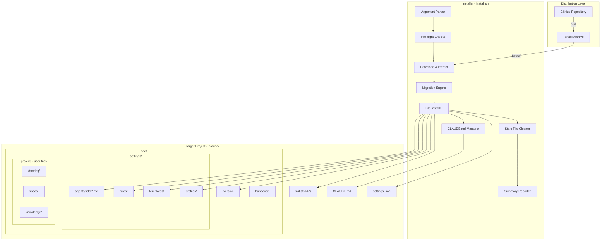
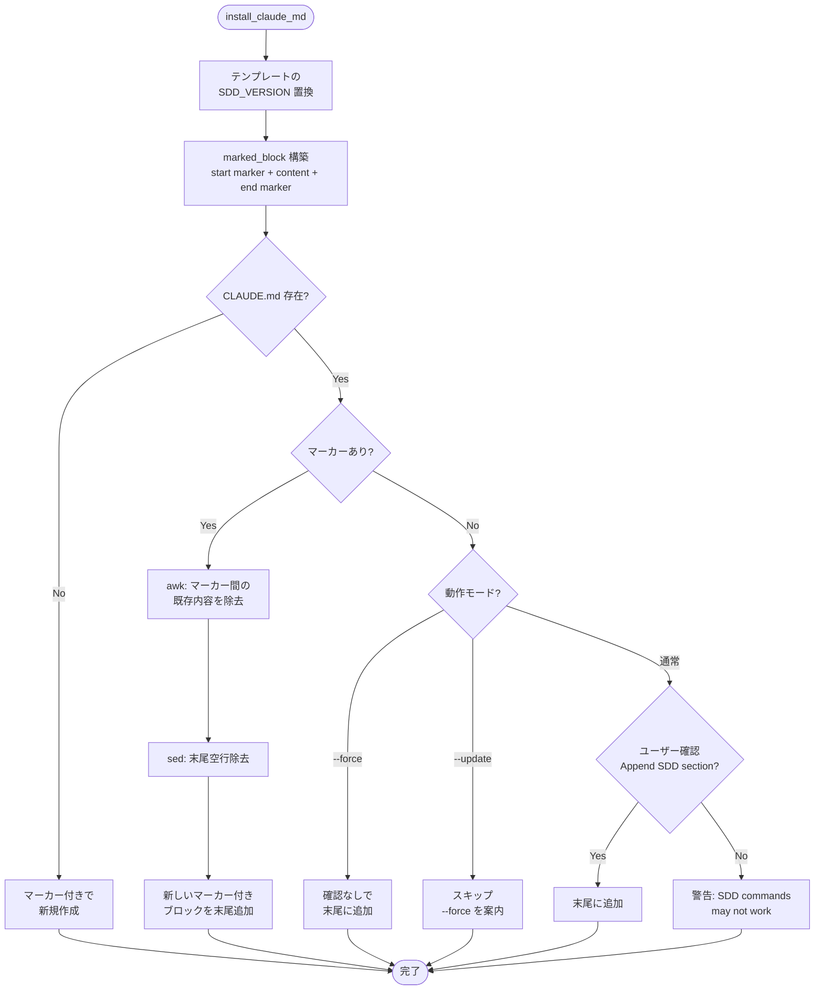

# Installer

## Specifications

### Introduction
SDD フレームワークの配布・インストール・アップデート・アンインストールを担う POSIX sh スクリプト。`curl | sh` ワンライナーで GitHub リポジトリから tarball をダウンロードし、プロジェクトの `.claude/` ディレクトリにフレームワークファイルを展開する。マーカーベースの CLAUDE.md セクション管理、セマンティックバージョニングによるマイグレーション、stale ファイルクリーンアップを提供する。

### Spec 1: Fresh Installation
**Goal:** 未インストール環境へのフレームワーク初回セットアップ

**Acceptance Criteria:**
1. `.git` ディレクトリの存在をプリフライトチェックし、不在の場合はエラー終了する（`--force` で回避可能）
2. GitHub リポジトリから `main` ブランチの tarball をダウンロードし、一時ディレクトリに展開する
3. 展開されたアーカイブに `framework/` ディレクトリが存在することを検証する
4. `framework/claude/skills/` 配下の全ファイルを `.claude/skills/` にコピーする
5. `framework/claude/sdd/settings/agents/` 配下の全ファイルを `.claude/sdd/settings/agents/` にコピーする
6. `framework/claude/sdd/settings/rules/` を `.claude/sdd/settings/rules/` にコピーする
7. `framework/claude/sdd/settings/templates/` を `.claude/sdd/settings/templates/` にコピーする
8. `framework/claude/sdd/settings/profiles/` を `.claude/sdd/settings/profiles/` にコピーする
9. CLAUDE.md にマーカーで囲まれたフレームワークセクションを注入する（Spec 6 参照）
10. `settings.json` をインストールする（既存時はプロンプト表示、Spec 7 参照）
11. `VERSION` ファイルの内容を `.claude/sdd/.version` に書き込む
12. インストール完了後、インストールされたファイル数のサマリーと Quick start ガイドを表示する
13. 一時ディレクトリを `trap EXIT` で確実にクリーンアップする

### Spec 2: Update Mode (`--update`)
**Goal:** 既存環境のフレームワーク更新（ユーザーファイル保持）

**Acceptance Criteria:**
1. `--update` フラグで起動した場合、`UPDATE=true` として動作する
2. skills, agents（`.claude/sdd/settings/agents/`）, rules, templates, profiles の全フレームワークファイルを上書きする
3. CLAUDE.md のマーカー間セクションを新バージョンの内容で置換する
4. `settings.json` は更新せず保持する（"Preserving existing .claude/settings.json" を表示）
5. ユーザーファイル（`project/steering/`, `project/specs/`, `project/knowledge/`, `handover/`）は一切変更しない
6. 旧バージョンに存在して新バージョンに存在しないフレームワークファイルを自動削除する（Spec 8 参照）
7. バージョン遷移を表示する（"Version: X.Y.Z -> A.B.C"）
8. CLAUDE.md にマーカーが存在しない場合、スキップしてユーザーに `--force` の使用を案内する

### Spec 3: Force Mode (`--force`)
**Goal:** 確認プロンプトなしの強制インストール

**Acceptance Criteria:**
1. `--force` フラグで起動した場合、`FORCE=true` として動作する
2. 既存ファイルを確認なしで上書きする
3. `.git` がない環境でもインストールを実行する
4. CLAUDE.md にマーカーが存在しない場合、既存内容の後にマーカー付きセクションを追加する
5. `settings.json` を確認なしで上書きする
6. stale ファイルクリーンアップも `--update` と同様に実行する

### Spec 3b: Local Development Install (`--local`)
**Goal:** ローカルの `framework/` ディレクトリからの開発用インストール（GitHub ダウンロード不要）

**Acceptance Criteria:**
1. `--local` フラグで起動した場合、tarball のダウンロードをスキップし、ローカルの `framework/` ディレクトリを直接参照する
2. カレントディレクトリに `framework/` が存在することを検証する。不在の場合はエラー終了する
3. `framework/VERSION` ファイルからバージョンを読み取る
4. ファイルコピー以降の処理は通常インストール（または `--update` / `--force`）と同一の流れで実行する
5. `--local` は `--update`、`--force` と組み合わせ可能

### Spec 4: Version-Specific Install (`--version`)
**Goal:** 特定バージョンのインストール

**Acceptance Criteria:**
1. `--version vX.Y.Z` で GitHub tags からの tarball URL を構築する（`refs/tags/{VERSION}.tar.gz`）
2. バージョン未指定時は `refs/heads/main.tar.gz` を使用する
3. ダウンロードした tarball 内の `VERSION` ファイルからバージョンを読み取る
4. インストール済みバージョン（`.claude/sdd/.version`）と新バージョンを比較表示する
5. `--version` は `--update` や `--force` と組み合わせ可能

### Spec 5: Uninstall (`--uninstall`)
**Goal:** フレームワークファイルの完全削除（ユーザーファイル保持）

**Acceptance Criteria:**
1. `--uninstall` フラグで起動した場合、即座にアンインストール処理に入る（ダウンロード不要）
2. `.claude/skills/sdd-*/` ディレクトリを削除する
3. `.claude/commands/sdd-*.md` を削除する（レガシークリーンアップ）
4. `.claude/sdd/settings/agents/sdd-*.md` を削除する
5. `.claude/sdd/settings/rules/` と `.claude/sdd/settings/templates/` を削除する
6. `.claude/sdd/.version` を削除する
7. CLAUDE.md からマーカー間のフレームワークセクションを削除する（ユーザーコンテンツは保持）
8. マーカー削除後に CLAUDE.md が空になった場合、ファイル自体を削除する
9. マーカー削除後の末尾空行を除去する
10. 空になったディレクトリ（`.claude/skills`, `.claude/commands`, `.claude/sdd/settings/agents`, `.claude/sdd/settings`, `.claude/sdd`）を `rmdir` で削除する
11. `settings.json` は削除せず、カスタマイズが含まれている可能性を警告する
12. ユーザーファイル（`.claude/sdd/project/`）が保持されたことを報告する

### Spec 6: CLAUDE.md マーカーベースセクション管理
**Goal:** ユーザーの既存コンテンツを保持しつつ、フレームワークセクションを安全に注入・更新・削除する

**Acceptance Criteria:**
1. マーカーは `<!-- sdd:start -->` と `<!-- sdd:end -->` のペアを使用する
2. テンプレート内の `{{SDD_VERSION}}` プレースホルダーを実際のバージョン番号で置換する
3. CLAUDE.md が存在しない場合: マーカー付きコンテンツのみで新規作成する
4. CLAUDE.md にマーカーが存在する場合: マーカー間の既存内容を `awk` で除去し、末尾空行を `sed` で除去し、新しいマーカー付きブロックを末尾に追加する
5. CLAUDE.md にマーカーがない場合（ユーザー独自ファイル）:
   - 通常モード: ユーザーに確認プロンプトを表示し、承認時に末尾に追加する
   - `--force`: 確認なしで末尾に追加する
   - `--update`: スキップし、`--force` の使用を案内する
6. アンインストール時: マーカー間を `awk` で削除し、末尾空行を `sed` で除去する
7. ユーザーがマーカー外に記述した内容は全操作（インストール/更新/アンインストール）で保持される

### Spec 7: settings.json 管理
**Goal:** デフォルト設定の管理（Agent Teams 設定は v0.20.0 で削除済み）

**Acceptance Criteria:**
1. `settings.json` が存在しない場合: フレームワークのデフォルト設定をコピーする
2. `settings.json` が存在し `--update` の場合: 既存を保持する
3. `settings.json` が存在し `--force` の場合: 確認なしで上書きする
4. `settings.json` が存在し通常モードの場合: 上書き確認プロンプトを表示する
5. 上書き拒否時: 設定ファイルの手動確認を案内する（Agent Teams 設定は v0.20.0 で削除済み）
6. アンインストール時: `settings.json` は削除せず、カスタマイズ残存の可能性を警告する

### Spec 8: Stale ファイルクリーンアップ
**Goal:** バージョンアップ時に不要になったフレームワークファイルを自動削除する

**Acceptance Criteria:**
1. `--update` または `--force` 時のみ実行する
2. `.claude/skills/sdd-*/` 配下の各ディレクトリについて、ダウンロードソースに対応するディレクトリが存在しなければディレクトリごと削除する
3. `.claude/sdd/settings/agents/` 配下の `sdd-*.md` ファイルについて、ソースに対応するファイルが存在しなければ削除する
4. `.claude/sdd/settings/rules/` 配下の `*.md` ファイルについて、ソースに存在しなければ削除する
5. `.claude/sdd/settings/templates/` 配下の全ファイルについて、ソースに存在しなければ削除する
6. `.claude/sdd/settings/profiles/` 配下の `*.md` ファイルについて、ソースに存在しなければ削除する
7. ファイル削除後、空になったディレクトリを `find -depth -type d -empty -delete` で再帰的に削除する
8. ユーザー作成の skills（`sdd-*` プレフィックスなし）は削除対象外とする
9. 削除されたファイルは個別に警告メッセージを表示する

### Spec 9: Legacy マイグレーション
**Goal:** 旧バージョンからの段階的なマイグレーションパス

**Acceptance Criteria:**
1. マイグレーションはインストール済みバージョンに基づいて条件的に実行する（`version_lt` 関数によるセマンティックバージョン比較）
2. **v0.4.0 マイグレーション（`.kiro` → `.claude/sdd`）:**
   - `.kiro/` ディレクトリが存在する場合のみ実行する
   - `steering`, `specs`, `knowledge` ディレクトリを `.claude/sdd/project/` に移動する
   - 移動先が既に存在する場合はスキップして警告する
   - `.kiro/settings/rules/` と `.kiro/settings/templates/` を削除する
   - `.kiro/` が空になれば削除、残ファイルがあれば手動確認を促す
   - マイグレーション後 `UPDATE=true` に設定して以降の処理を更新モードにする
   - マーカーなしの旧 CLAUDE.md を削除し、マーカー付きで再作成する
3. **v0.7.0 マイグレーション（Coordinator 廃止、3-tier アーキテクチャ）:**
   - `sdd-coordinator.md` エージェントファイルを削除する
   - `handover/coordinator.md` が存在する場合:
     - `conductor.md` が既にあれば内容をマージ（"Migrated Pipeline State" セクション追加）
     - なければ `conductor.md` にリネーム
   - `coordinator.md` を削除する
4. **v0.9.0 マイグレーション（Handover リデザイン）:**
   - `handover/conductor.md` → `session.md` にリネーム
   - `handover/state.md` → `session.md` にリネーム（conductor.md がない場合のフォールバック）
   - `handover/log.md` → `decisions.md` にリネーム
5. **v0.10.0 マイグレーション（Format unification + Planner 廃止）:**
   - `sdd-planner.md`, `sdd-tasks.md`, `templates/specs/tasks.md`, `templates/specs/init.json` を削除する
   - 全 spec ディレクトリの `spec.json` を `spec.yaml` に変換する（`sed` ベースの best-effort 変換）
   - 変換時に `orchestration` と `blocked_info` フィールドを追加する
   - 既存の `tasks.md` は保持し、次回の `/sdd-roadmap impl` で TaskGenerator が再生成することを案内する
6. **v0.15.0 マイグレーション（commands → skills）:**
   - `.claude/commands/sdd-*.md` ファイルを全削除する
   - `.claude/commands/` ディレクトリが空になった場合、ディレクトリ自体を削除する
7. **v0.18.0 マイグレーション（agents パス変更）:**
   - `.claude/agents/sdd-*.md` ファイルが存在する場合、`.claude/sdd/settings/agents/` に移動する
   - 移動先ディレクトリが存在しない場合は `mkdir -p` で作成する
   - `.claude/agents/` ディレクトリが空になった場合、ディレクトリ自体を削除する
8. **v0.20.0 マイグレーション（Agent Teams → SubAgent アーキテクチャ）:**
   - `settings.json` から `CLAUDE_CODE_EXPERIMENTAL_AGENT_TEAMS=1` エントリを削除する（SubAgent アーキテクチャでは不要）
   - `.claude/agents/` ディレクトリが残存する場合は削除する（v0.18.0 マイグレーション未適用の環境向けフォールバック）
9. 各マイグレーションはバージョン順に連鎖実行する（v0.4.0 → v0.7.0 → v0.9.0 → v0.10.0 → v0.15.0 → v0.18.0 → v0.20.0）
9. 0.0.0（未インストール）からの新規インストール時は全マイグレーションが条件チェックで自動スキップされる

### Spec 10: ユーザーインタラクション
**Goal:** 対話的・非対話的環境の両方で適切に動作する

**Acceptance Criteria:**
1. TTY 接続時はカラー出力（ANSI エスケープ: Red, Green, Yellow, Cyan, Bold）を有効にする
2. 非 TTY 時はカラーコードを空文字列に設定する
3. `confirm()` 関数は stdin が TTY の場合は直接読み取り、パイプ経由の場合は `/dev/tty` から読み取る
4. TTY も `/dev/tty` も利用不可の場合は確認をデフォルト拒否（return 1）とする
5. `--help` / `-h` で使用方法、オプション一覧、ファイル構成を表示して終了する
6. 不明なオプションはエラーメッセージと usage を表示する
7. メッセージは4種のヘルパー関数で統一フォーマット出力する: `info`, `warn`, `error`, `success`

### Non-Goals
- パッケージマネージャー統合（npm, pip, Homebrew 等）
- Windows / PowerShell 対応
- 自動アップデートチェック（cron / daemon）
- `.claude/sdd/project/` 配下のユーザーファイルの移行や変更
- `settings.local.json` の管理
- `--yes` / `-y` フラグによる自動承認（現在は `--force` が代替）
- tarball の署名検証やチェックサム検証

## Overview

`install.sh` は約530行の POSIX sh スクリプトで、sync-sdd フレームワークの配布メカニズムを提供する。

**Purpose**: プロジェクトに対して SDD フレームワーク（skills, agents, rules, templates, CLAUDE.md）を1コマンドでセットアップ・更新・削除する。

**Users**: Claude Code を使用する開発者が、プロジェクトルートで `curl | sh` ワンライナーを実行して利用する。

**Impact**: プロジェクトの `.claude/` ディレクトリ配下にフレームワークファイル群を配置し、CLAUDE.md にフレームワーク指示を注入することで、Claude Code の SDD ワークフローを有効化する。

## Architecture

### Architecture Pattern & Boundary Map



**Architecture Integration:**
- 単一スクリプトアーキテクチャ: 外部依存なし（`curl`, `tar`, POSIX sh のみ）
- テンポラリディレクトリ分離: ダウンロードと展開を `mktemp -d` + `trap EXIT` で管理
- マーカーベース注入: CLAUDE.md のユーザーコンテンツとフレームワークコンテンツを HTML コメントマーカーで分離

### Technology Stack

| Layer | Choice / Version | Role in Feature | Notes |
|-------|------------------|-----------------|-------|
| Shell | POSIX sh (`/bin/sh`) | スクリプト実行環境 | Bash 依存なし、`set -eu` で安全性確保 |
| Download | `curl -LsSf` | tarball ダウンロード | リダイレクトフォロー、サイレント、エラー時 fail |
| Archive | `tar xzf` | tarball 展開 | gzip 圧縮対応 |
| Text Processing | `awk`, `sed` | CLAUDE.md マーカー処理 | POSIX 準拠のみ使用 |
| Hosting | GitHub | tarball 配布 | `archive/refs/heads/` と `archive/refs/tags/` |

## System Flows

### メインインストールフロー

```mermaid
flowchart TD
    START([curl -LsSf ... | sh]) --> PARSE[引数パース]
    PARSE --> UNINSTALL_CHECK{--uninstall?}

    UNINSTALL_CHECK -->|Yes| UN_SKILLS[skills/sdd-*/ 削除]
    UN_SKILLS --> UN_LEGACY[commands/sdd-*.md 削除]
    UN_LEGACY --> UN_AGENTS[sdd/settings/agents/sdd-*.md 削除]
    UN_AGENTS --> UN_SETTINGS[sdd/settings/ 削除]
    UN_SETTINGS --> UN_VERSION[sdd/.version 削除]
    UN_VERSION --> UN_CLAUDE{CLAUDE.md に<br/>マーカーあり?}
    UN_CLAUDE -->|Yes| UN_AWK[awk でマーカー間削除]
    UN_AWK --> UN_TRAIL[末尾空行除去]
    UN_TRAIL --> UN_EMPTY{CLAUDE.md 空?}
    UN_EMPTY -->|Yes| UN_RMFILE[ファイル削除]
    UN_EMPTY -->|No| UN_KEEP[ユーザーコンテンツ保持]
    UN_CLAUDE -->|No| UN_SKIP[スキップ]
    UN_RMFILE & UN_KEEP & UN_SKIP --> UN_RMDIR[空ディレクトリ削除]
    UN_RMDIR --> UN_WARN[settings.json 残存警告]
    UN_WARN --> UN_DONE([完了])

    UNINSTALL_CHECK -->|No| GIT_CHECK{.git 存在?}
    GIT_CHECK -->|No & !force| GIT_ERR([エラー終了])
    GIT_CHECK -->|Yes or force| DOWNLOAD[tarball ダウンロード]

    DOWNLOAD --> EXTRACT[tar 展開]
    EXTRACT --> VALIDATE{framework/ 存在?}
    VALIDATE -->|No| DL_ERR([エラー終了])
    VALIDATE -->|Yes| READ_VER[バージョン読み取り]

    READ_VER --> MIGRATION[マイグレーション実行<br/>v0.4.0 → v0.7.0 → v0.9.0<br/>→ v0.10.0 → v0.15.0 → v0.18.0 → v0.20.0]

    MIGRATION --> INSTALL_FW[フレームワークファイル<br/>コピー]
    INSTALL_FW --> INSTALL_CLAUDE[CLAUDE.md 注入]
    INSTALL_CLAUDE --> INSTALL_SETTINGS[settings.json 処理]
    INSTALL_SETTINGS --> INSTALL_SDD_SETTINGS[sdd/settings/ コピー]
    INSTALL_SDD_SETTINGS --> WRITE_VER[.version 書き込み]
    WRITE_VER --> STALE_CHECK{update or force?}
    STALE_CHECK -->|Yes| STALE_CLEAN[stale ファイル<br/>クリーンアップ]
    STALE_CHECK -->|No| SUMMARY
    STALE_CLEAN --> SUMMARY[サマリー表示]
    SUMMARY --> DONE([完了])
```

### CLAUDE.md マーカーベース注入フロー



### バージョン比較・マイグレーションフロー

```mermaid
flowchart TD
    START([バージョン読み取り]) --> READ_NEW[tarball VERSION 読み取り]
    READ_NEW --> READ_INST[.claude/sdd/.version 読み取り]
    READ_INST --> COMPARE[バージョン表示<br/>installed → new]

    COMPARE --> MIG_04{installed < 0.4.0?}
    MIG_04 -->|Yes| KIRO[.kiro → .claude/sdd<br/>マイグレーション]
    MIG_04 -->|No| MIG_07
    KIRO --> MIG_07

    MIG_07{installed < 0.7.0?}
    MIG_07 -->|Yes| COORD[coordinator.md 削除<br/>handover マージ/リネーム]
    MIG_07 -->|No| MIG_09
    COORD --> MIG_09

    MIG_09{installed < 0.9.0?}
    MIG_09 -->|Yes| HANDOVER[conductor/state.md → session.md<br/>log.md → decisions.md]
    MIG_09 -->|No| MIG_10
    HANDOVER --> MIG_10

    MIG_10{installed < 0.10.0?}
    MIG_10 -->|Yes| FORMAT[planner 削除<br/>spec.json → spec.yaml 変換]
    MIG_10 -->|No| MIG_15
    FORMAT --> MIG_15

    MIG_15{installed < 0.15.0?}
    MIG_15 -->|Yes| SKILLS[commands/sdd-*.md 削除<br/>commands/ ディレクトリ削除]
    MIG_15 -->|No| MIG_18
    SKILLS --> MIG_18

    MIG_18{installed < 0.18.0?}
    MIG_18 -->|Yes| AGENTS[.claude/agents/sdd-*.md を<br/>.claude/sdd/settings/agents/ に移動]
    MIG_18 -->|No| MIG_20
    AGENTS --> MIG_20

    MIG_20{installed < 0.20.0?}
    MIG_20 -->|Yes| SUBAGENT[settings.json から<br/>AGENT_TEAMS 設定削除<br/>.claude/agents/ 残存確認・削除]
    MIG_20 -->|No| DONE([マイグレーション完了])
    SUBAGENT --> DONE
```



## Components and Interfaces

| Component | Domain/Layer | Intent | Spec Coverage | Key Dependencies |
|-----------|--------------|--------|---------------|------------------|
| Argument Parser | CLI | コマンドラインオプション解析 | 1, 2, 3, 3b, 4, 5, 10 | POSIX sh `case` |
| Pre-flight Checker | Validation | git リポジトリ検証 | 1 | `.git` ディレクトリ |
| Downloader | Network | tarball ダウンロードと展開 | 1, 4 | `curl`, `tar`, `mktemp` |
| Version Manager | Core | バージョン読み取り・比較・書き込み | 2, 4, 9 | `version_lt()` |
| Migration Engine | Core | レガシーバージョンからのマイグレーション | 9 | `version_lt()` |
| File Installer | Core | ファイルコピーとディレクトリ管理 | 1, 2, 3 | `install_file()`, `install_dir()` |
| CLAUDE.md Manager | Core | マーカーベースセクション管理 | 6 | `awk`, `sed` |
| settings.json Handler | Core | 設定ファイル管理 | 7 | `install_file()`, `confirm()` |
| Stale File Cleaner | Maintenance | 旧ファイル検出・削除 | 8 | `remove_stale()`, `find` |
| Summary Reporter | Output | インストール結果表示 | 1, 2, 10 | `find`, `wc` |
| User Interaction | I/O | カラー出力、確認プロンプト | 10 | TTY 検出, `confirm()` |

### Core Layer

#### version_lt() -- セマンティックバージョン比較

| Field | Detail |
|-------|--------|
| Intent | 2つのセマンティックバージョン文字列を比較し、第1引数 < 第2引数なら 0 (true) を返す |
| Specs | 4, 9 |

**Responsibilities & Constraints:**
- `major.minor.patch` 形式の比較（patch 省略時は 0 とみなす）
- `cut` コマンドで各パートを分離
- 純粋な数値比較（プレリリースラベル非対応）

#### install_file() -- 単一ファイルインストール

| Field | Detail |
|-------|--------|
| Intent | ソースファイルをデスティネーションにコピーする（モード別の上書き制御付き） |
| Specs | 1, 2, 3 |

**Responsibilities & Constraints:**
- 既存ファイルがあり `--force` でも `--update` でもない場合はスキップして警告
- デスティネーションの親ディレクトリを `mkdir -p` で自動作成

#### install_dir() -- ディレクトリ一括インストール

| Field | Detail |
|-------|--------|
| Intent | ソースディレクトリ配下の全ファイルを再帰的にインストールする |
| Specs | 1, 2, 3 |

**Responsibilities & Constraints:**
- `find -type f` で全ファイルを列挙
- 各ファイルの相対パスを保持して `install_file()` に委譲
- ソースディレクトリが存在しない場合は何もしない

#### install_claude_md() -- CLAUDE.md マーカー管理

| Field | Detail |
|-------|--------|
| Intent | テンプレートからマーカー付きブロックを構築し、CLAUDE.md に注入・更新する |
| Specs | 6 |

**Responsibilities & Constraints:**
- `{{SDD_VERSION}}` を `sed` で置換
- 3つのケース分岐: ファイル不在 / マーカー存在 / マーカー不在
- `awk` でマーカー間のコンテンツを除去、`sed` で末尾空行を除去
- ユーザーコンテンツ（マーカー外）は全操作で保持

#### remove_stale() -- stale ファイル検出・削除

| Field | Detail |
|-------|--------|
| Intent | ローカルに存在するがソースに存在しないフレームワークファイルを削除する |
| Specs | 8 |

**Responsibilities & Constraints:**
- 3引数: ローカルディレクトリ、ソースディレクトリ、glob パターン
- パターンマッチするファイルのみ対象（ユーザーファイル保護）
- 削除時は個別に警告メッセージ出力

### Migration Layer

#### migrate_kiro_to_sdd() -- v0.4.0 マイグレーション

| Field | Detail |
|-------|--------|
| Intent | レガシー `.kiro/` ディレクトリ構造を `.claude/sdd/project/` に移行する |
| Specs | 9 (AC-2) |

**Responsibilities & Constraints:**
- `steering`, `specs`, `knowledge` の3ディレクトリを移動
- 移動先が既存の場合はスキップ（データ損失防止）
- `.kiro/settings/` 配下のフレームワークファイルを削除
- マイグレーション後 `UPDATE=true` に切り替え
- マーカーなし旧 CLAUDE.md を削除して再作成を促す

## Data Models

### インストール先ディレクトリ構造

```
project-root/
└── .claude/
    ├── CLAUDE.md                          # マーカー管理
    │   └── <!-- sdd:start --> ... <!-- sdd:end -->
    ├── settings.json                      # フレームワーク設定（SubAgent アーキテクチャ; Agent Teams 設定は v0.20.0 で削除）
    ├── settings.local.json                # ユーザーローカル設定 (installer 管理外)
    ├── skills/
    │   └── sdd-*/SKILL.md                 # 9 skills
    └── sdd/
        ├── .version                       # インストール済みバージョン
        ├── settings/                      # フレームワーク管理
        │   ├── agents/
        │   │   └── sdd-*.md               # 22 agent definitions
        │   ├── rules/*.md
        │   ├── templates/
        │   │   ├── specs/
        │   │   ├── steering/
        │   │   ├── steering-custom/
        │   │   └── knowledge/
        │   └── profiles/*.md
        ├── project/                       # ユーザー管理 (installer 不可侵)
        │   ├── steering/
        │   ├── specs/
        │   └── knowledge/
        └── handover/                      # ユーザー管理 (installer 不可侵)
```

### フレームワークファイル vs ユーザーファイルの分類

| Category | Path Pattern | Update 時 | Uninstall 時 |
|----------|-------------|-----------|-------------|
| Framework | `.claude/skills/sdd-*/` | 上書き | 削除 |
| Framework | `.claude/sdd/settings/agents/sdd-*.md` | 上書き | 削除 |
| Framework | `.claude/sdd/settings/` | 上書き | 削除 |
| Framework | `.claude/sdd/.version` | 上書き | 削除 |
| Managed | `.claude/CLAUDE.md` (マーカー間) | 置換 | マーカー間削除 |
| Managed | `.claude/settings.json` | 保持 | 保持 (警告) |
| User | `.claude/sdd/project/` | 不可侵 | 不可侵 |
| User | `.claude/sdd/handover/` | 不可侵 | 不可侵 |
| User | `.claude/settings.local.json` | 不可侵 | 不可侵 |

### CLI オプションフラグ

| Flag | Variable | Default | 効果 |
|------|----------|---------|------|
| (none) | -- | -- | 通常インストール（プロンプト付き） |
| `--update` | `UPDATE=true` | `false` | フレームワーク更新、ユーザーファイル保持、settings.json 保持 |
| `--force` | `FORCE=true` | `false` | 確認なし上書き、git チェック回避 |
| `--local` | `LOCAL=true` | `false` | ローカル `framework/` から直接インストール（開発用、ダウンロード不要） |
| `--version <tag>` | `VERSION=<tag>` | `""` | タグ指定ダウンロード |
| `--uninstall` | `UNINSTALL=true` | `false` | フレームワーク削除 |
| `--help` / `-h` | -- | -- | usage 表示して終了 |

## Error Handling

### Error Strategy
POSIX sh の `set -eu` により、未定義変数アクセスとコマンド失敗で即座にスクリプト終了する。`trap EXIT` で一時ディレクトリを確実にクリーンアップする。

### Error Categories and Responses

| Error | Detection | Response |
|-------|-----------|----------|
| git リポジトリ外での実行 | `.git` 不在 | エラーメッセージ + `--force` の案内 + exit 1 |
| tarball ダウンロード失敗 | `curl` の非ゼロ終了 | URL とバージョンタグの確認を促す + exit 1 |
| 不正な tarball 内容 | `framework/` ディレクトリ不在 | エラーメッセージ + exit 1 |
| 不明なオプション | `case` の `*` マッチ | エラーメッセージ + usage 表示 |
| 非対話環境でのプロンプト | `/dev/tty` 不可 | デフォルト拒否 (return 1) |

## Testing Strategy

### Manual Test Cases
- 新規プロジェクト（`.claude/` 不在）への初回インストール
- 既存の CLAUDE.md（ユーザーコンテンツあり）へのマーカー注入
- `--update` でのフレームワーク更新（ユーザーファイル保持確認）
- `--version v0.16.0` での過去バージョンインストール
- `--uninstall` でのクリーンアンインストール（ユーザーファイル残存確認）
- `--force` での確認スキップ動作
- `--local` でのローカル開発インストール（ダウンロードスキップ確認）
- stale ファイルクリーンアップの動作確認
- 各バージョンからのマイグレーションパス検証
- v0.18.0 マイグレーション: `.claude/agents/` → `.claude/sdd/settings/agents/` の自動移行確認
- 非 git ディレクトリでのエラー処理
- パイプ経由（非対話）での実行

## Revision Notes

### v1.2.0 — SubAgent Migration
- **Spec 7**: ゴールを「Agent Teams 設定を含む」→「デフォルト設定の管理（Agent Teams 設定は v0.20.0 で削除済み）」に更新
- **Spec 7 AC-5**: 上書き拒否時の案内から `CLAUDE_CODE_EXPERIMENTAL_AGENT_TEAMS=1` 手動追加の言及を削除
- **Spec 9 AC-8 新設**: v0.20.0 マイグレーション（Agent Teams → SubAgent; settings.json からの AGENT_TEAMS 設定削除）
- **Spec 9 AC-9 (旧 AC-8)**: マイグレーション連鎖に v0.20.0 を追加
- **Data Models**: settings.json のコメントを SubAgent アーキテクチャに更新
- **System Flows**: マイグレーション実行ラベルに v0.20.0 を追加、バージョン比較フロー図に MIG_20 ノード追加

### v1.1.0 (2026-02-22) — v0.18.0 Retroactive Alignment
- `--local` フラグ追加（開発用ローカルインストール）
- v0.18.0 マイグレーション: .claude/agents/ → .claude/sdd/settings/agents/ の自動移行
- Agent インストール先: .claude/agents/ → .claude/sdd/settings/agents/
