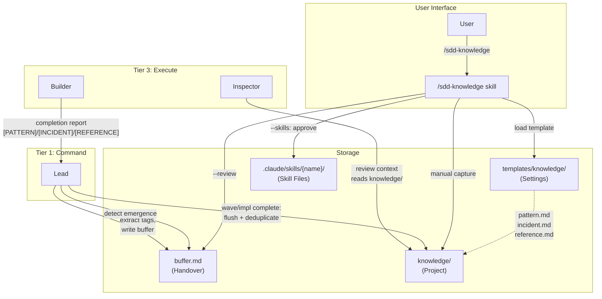
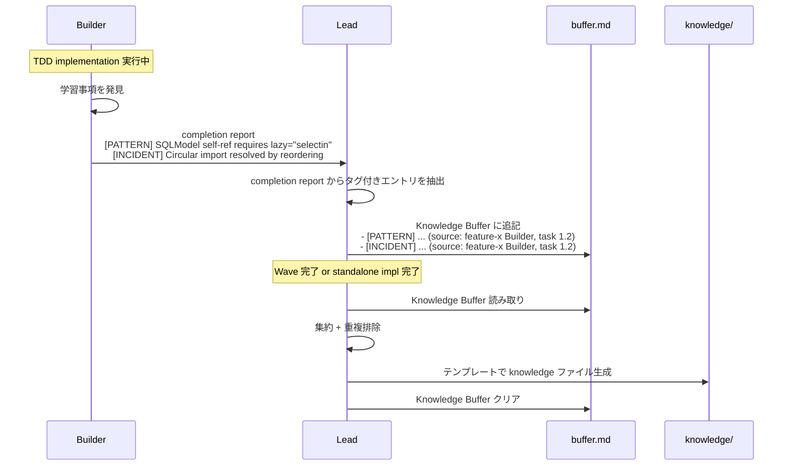
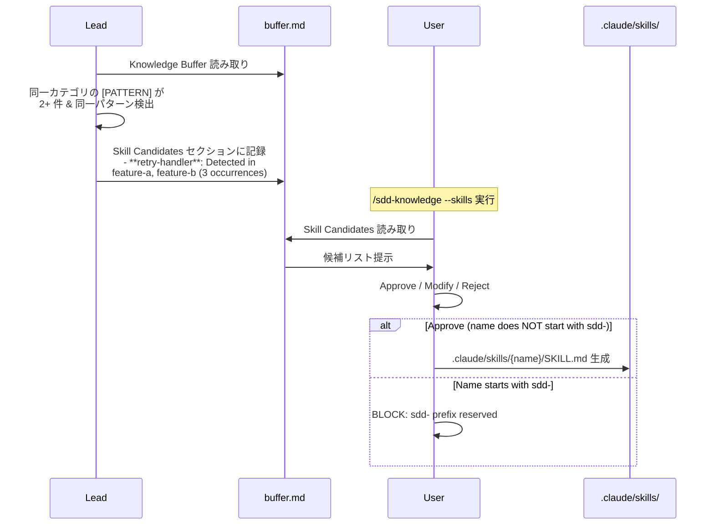
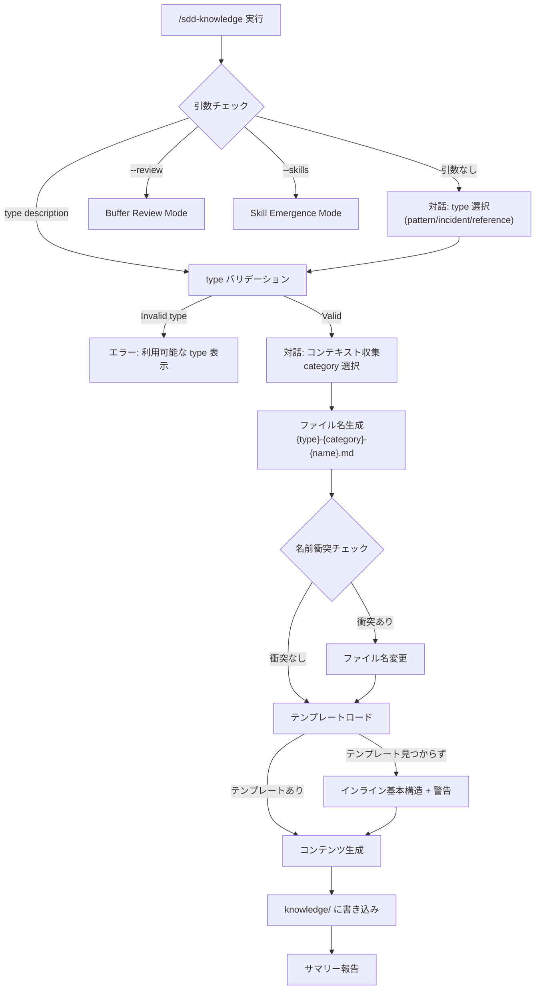
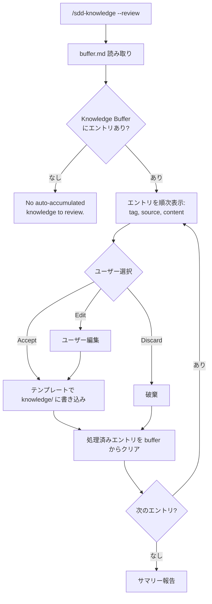

# Knowledge System

## Specifications

### Introduction

SDD フレームワークにおける再利用可能な知識の蓄積・管理・活用システム。Builder/Inspector が開発中に発見した学習事項を `[PATTERN]`/`[INCIDENT]`/`[REFERENCE]` タグで報告し、Lead が `buffer.md` に一時蓄積した後、Wave 完了時またはスタンドアロン `/sdd-impl` 完了時に `knowledge/` ディレクトリへ永続化する。さらに、蓄積されたパターンから Skill emergence（スキル候補の自動検出）を行い、ユーザー承認を経て新しいスキルファイルを生成する。`/sdd-knowledge` スキルがこのシステム全体の管理 UI を提供する。

### Spec 1: Manual Knowledge Capture
**Goal:** ユーザーが対話的に knowledge エントリを作成できるようにする

**Acceptance Criteria:**
1. `/sdd-knowledge` を引数なしで実行すると、knowledge type（`pattern`/`incident`/`reference`）の対話的選択を促す
2. `/sdd-knowledge {type} {description}` で type と description を直接指定して知識エントリを作成できる
3. type が `pattern`/`incident`/`reference` 以外の場合、利用可能な type を表示して再入力を促す
4. type に応じた対話でコンテキスト情報を収集する:
   - `incident`: What happened? Root cause? Detection phase? Category?
   - `pattern`: What pattern? When to apply? Applicable phases? Category?
   - `reference`: What to document? Source URL? Category?
5. カテゴリは `state`/`api`/`async`/`data`/`security`/`integration` の6種から選択
6. ファイル名は `{type}-{category}-{kebab-case-name}.md` の命名規則で生成される
7. `{{SDD_DIR}}/project/knowledge/` 内の既存ファイルと名前衝突がないか確認する
8. `{{SDD_DIR}}/settings/templates/knowledge/{type}.md` テンプレートをロードしてコンテンツを生成する
9. テンプレートが見つからない場合、インライン基本構造を使用し警告を表示する
10. 完了時にサマリー（作成/レビュー件数）を報告する

### Spec 2: Knowledge Auto-Accumulation
**Goal:** Builder/Inspector の completion report から知識タグを自動収集し、buffer.md に蓄積する

**Acceptance Criteria:**
1. Builder は completion report に `[PATTERN]`/`[INCIDENT]`/`[REFERENCE]` タグ付きエントリを含められる
2. Inspector は review 実施時に `knowledge/` ディレクトリの既存 knowledge をコンテキストとして参照する
3. Lead は Builder/Inspector の completion report からタグ付きエントリを抽出する
4. 抽出されたエントリを `{{SDD_DIR}}/handover/buffer.md` の Knowledge Buffer セクションに書き込む
5. buffer.md の各エントリは `- [{TAG}] {description} (source: {spec} {role}, task {N})` 形式で記録する
6. `BUILDER_BLOCKED` 時のブロッカー情報は `[INCIDENT]` として buffer.md に自動記録する
7. Lead は buffer.md に対して排他的書き込みアクセスを持つ（並列書き込み競合なし）

### Spec 3: Knowledge Flush (Persistence)
**Goal:** buffer.md の一時データを knowledge/ ディレクトリに永続化する

**Acceptance Criteria:**
1. Wave 完了時（roadmap モード）に、Lead が buffer.md の Knowledge Buffer を読み取る
2. スタンドアロン `/sdd-impl` 完了時にも Knowledge Buffer の flush を実行する
3. flush 処理では集約（aggregate）と重複排除（deduplicate）を行う
4. 永続化先は `{{SDD_DIR}}/project/knowledge/` ディレクトリ
5. 永続化時にテンプレート（`pattern.md`/`incident.md`/`reference.md`）を使用してファイルを生成する
6. flush 完了後、buffer.md の Knowledge Buffer セクションをクリアする
7. roadmap 内で実行中の場合、flush は Wave Quality Gate 通過後（commit 前）に行う

### Spec 4: Buffer Review Mode
**Goal:** ユーザーが auto-accumulated な知識を対話的にレビュー・管理できる

**Acceptance Criteria:**
1. `/sdd-knowledge --review` で buffer.md の Knowledge Buffer セクションを読み取る
2. バッファが空の場合、「No auto-accumulated knowledge to review.」と表示する
3. バッファ内の各エントリをユーザーに提示する: タグ、ソース、コンテンツを含む
4. 各エントリに対して **Accept**（knowledge/ に書き込み）、**Edit**（編集後に書き込み）、**Discard**（破棄）を選択できる
5. Accept/Edit 選択時はテンプレートを使用して knowledge/ にファイルを書き込む
6. 処理済みエントリを Knowledge Buffer からクリアする

### Spec 5: Skill Emergence Detection
**Goal:** 蓄積パターンからスキル候補を自動検出し、ユーザー承認を経てスキルファイルを生成する

**Acceptance Criteria:**
1. buffer.md の Knowledge Buffer に同一カテゴリかつ同一 description pattern の `[PATTERN]` が2件以上存在する場合、Skill candidate として検出する
2. 検出された Skill candidate を buffer.md の Skill Candidates セクションに `- **{name}**: Detected in {specs} ({N} occurrences)` 形式で記録する
3. Skill candidate は `/sdd-knowledge --skills` または Wave 完了時にユーザーに提示する
4. Lead はユーザー承認なしに Skill ファイルを自動作成しない
5. `/sdd-knowledge --skills` で Skill Candidates セクションを読み取り表示する
6. Skill candidate がない場合、「No Skill candidates detected yet.」と表示する
7. 各候補に対して **Approve**（Skill ファイル生成）、**Modify**（編集後に生成）、**Reject**（破棄）を選択できる
8. Approve 時、skill-name が `sdd-` プレフィックスで始まる場合は BLOCK する（フレームワーク予約名前空間）
9. Approved Skill は `.claude/skills/{skill-name}/SKILL.md` に生成する
10. 生成後、「Skill created, available via `/{skill-name}`」と報告する

### Spec 6: Knowledge Templates
**Goal:** 3種の knowledge type それぞれに構造化テンプレートを提供する

**Acceptance Criteria:**
1. Pattern テンプレートは Metadata（Category, Keywords, Applicable Phases）、Pattern Summary、Problem Context（When to Apply, Symptoms）、Solution（Core Principle, Implementation Approach, Key Points）、Examples（Good/Anti-Pattern）、Application Checklist、Related Patterns、References を含む
2. Incident テンプレートは Metadata（Discovered Phase, Should Detect At, Category, Keywords, Severity）、Problem Summary、Concrete Example（Specified/Missing/Happened/Why Overlooked）、Detection Points by Phase（specifications/design/tasks/impl）、General Checklist、Related Patterns、Lessons Learned を含む
3. Reference テンプレートは Metadata（Category, Keywords, Last Verified, Source）、Overview、Quick Reference（テーブル形式）、Key Points、Common Gotchas、Code Snippets、Related References、Sources を含む
4. 全テンプレートの Category は共通で `state`/`api`/`async`/`data`/`security`/`integration` の6種
5. Pattern の命名規則は `pattern-{category}-{name}.md`
6. Incident の命名規則は `incident-{category}-{name}.md`（テンプレート上は `{category}-{pattern-name}.md` だが実運用では `incident-` prefix 付与）
7. Reference の命名規則は `reference-{category}-{name}.md`
8. 全テンプレートは `{{SDD_DIR}}/settings/templates/knowledge/` に配置される

### Spec 7: Review Integration
**Goal:** 知識エントリを `/sdd-review` でコンテキストとして活用する

**Acceptance Criteria:**
1. Inspector（特に best-practices）は `knowledge/pattern-*.md` を glob で検索し、関連パターンをレビューコンテキストに含める
2. Inspector は `knowledge/reference-*.md` を glob で検索し、参考資料をレビューに活用する
3. `/sdd-review design` は detection phase や category でフィルタ可能
4. `/sdd-review impl` は `incident-*` でフィルタし、common pitfalls をチェック対象に含める

### Non-Goals
- Knowledge の自動適用（参照のみ、自動修正は行わない）
- Knowledge ファイルのバージョン管理（作成後の変更追跡は対象外）
- Knowledge の cross-project 同期（ポータブルだが自動転送はしない）
- Knowledge エントリの自動削除・アーカイブ

## Overview

Knowledge System は SDD フレームワークの学習ループを担う。開発プロセスで得られた知見（成功パターン、障害事例、技術参照情報）を構造化して蓄積し、後続の設計・実装・レビューで再利用可能にする。

システムは3つの経路で知識を取り込む: (1) Builder/Inspector の自動報告から buffer.md への蓄積、(2) `/sdd-knowledge` による手動キャプチャ、(3) buffer review による蓄積済みデータの確認・承認。全ての知識は最終的に `{{SDD_DIR}}/project/knowledge/` に Markdown ファイルとして永続化される。Knowledge は SDD Artifact の中で唯一「Portable（プロジェクト横断で再利用可能）」と位置づけられている。

Skill emergence は蓄積パターンの二次利用として機能する。同一カテゴリの `[PATTERN]` が複数 spec にまたがって出現した場合、それをスキル候補として検出し、ユーザーの承認を経て Claude Code のスキルファイルに昇格させる。

## Architecture

### Architecture Pattern & Boundary Map



**Architecture Integration**:
- **Data flow pattern**: Tag extraction → Buffer staging → Flush persistence（段階的永続化）
- **Ownership boundaries**: buffer.md は Lead 排他書き込み。knowledge/ はテンプレート経由の構造化書き込み。Skill ファイルはユーザー承認必須
- **Agent Teams integration**: Builder の completion report が知識の一次ソース。Inspector は knowledge/ を読み取り専用で参照
- **Handover integration**: buffer.md は Handover システムの一部であり、セッション間でデータを永続化する

### Technology Stack

| Layer | Choice / Version | Role in Feature | Notes |
|-------|------------------|-----------------|-------|
| Storage | Markdown files | Knowledge entries, templates, buffer | Human-readable, Git-tracked |
| Template Engine | Placeholder substitution | Template → knowledge file 生成 | `{{VARIABLE}}` 形式 |
| Skill Interface | Claude Code Skills (`.claude/skills/`) | `/sdd-knowledge` コマンド提供 | SKILL.md 形式 |
| Agent Communication | Agent Teams (TeammateTool) | Builder → Lead tag 伝達 | completion report 経由 |

## System Flows

### Auto-Accumulation Flow (Builder → knowledge/)



### Skill Emergence Detection Flow



### Manual Capture Flow



### Buffer Review Flow



## Components and Interfaces

| Component | Domain/Layer | Intent | Req Coverage | Files |
|-----------|--------------|--------|--------------|-------|
| sdd-knowledge skill | Skill / UI | 知識管理の統合 UI（手動キャプチャ、バッファレビュー、Skill emergence） | S1, S4, S5 | `framework/claude/skills/sdd-knowledge/SKILL.md` |
| Pattern Template | Template / Storage | パターン知識の構造化テンプレート | S6 | `framework/claude/sdd/settings/templates/knowledge/pattern.md` |
| Incident Template | Template / Storage | インシデント知識の構造化テンプレート | S6 | `framework/claude/sdd/settings/templates/knowledge/incident.md` |
| Reference Template | Template / Storage | リファレンス知識の構造化テンプレート | S6 | `framework/claude/sdd/settings/templates/knowledge/reference.md` |
| Auto-Accumulation (CLAUDE.md) | Framework / Protocol | Builder/Inspector → buffer.md → knowledge/ のデータフロー定義 | S2, S3 | `framework/claude/CLAUDE.md` (Knowledge Auto-Accumulation section) |
| Builder Agent | Agent / T3 | `[PATTERN]`/`[INCIDENT]`/`[REFERENCE]` タグ報告 | S2 | `framework/claude/agents/sdd-builder.md` |
| Inspector Agent (best-practices) | Agent / T3 | knowledge/ からのコンテキスト読み取り | S7 | `framework/claude/agents/sdd-inspector-best-practices.md` |
| buffer.md | Handover / Storage | Knowledge Buffer + Skill Candidates の一時保管 | S2, S3, S4, S5 | `{{SDD_DIR}}/handover/buffer.md` |
| knowledge/ directory | Project / Storage | 永続化された knowledge エントリ | S1, S3, S4 | `{{SDD_DIR}}/project/knowledge/` |

### Skill Layer

#### sdd-knowledge Skill

| Field | Detail |
|-------|--------|
| Intent | ユーザーが knowledge エントリを手動作成、バッファレビュー、Skill emergence 管理を行う統合コマンド |
| Requirements | S1, S4, S5 |

**Responsibilities & Constraints**
- 3つのモードを引数パターンで切り替え: 手動キャプチャ（デフォルト）、`--review`、`--skills`
- テンプレートからの knowledge ファイル生成
- ファイル名衝突チェック
- `sdd-` namespace の保護（Skill 生成時）
- Lead が直接ハンドルする（teammate spawn 不要）

**Dependencies**
- Inbound: User → コマンド引数 (Required)
- Outbound: `{{SDD_DIR}}/project/knowledge/` → 書き込み先 (Required)
- Outbound: `{{SDD_DIR}}/settings/templates/knowledge/` → テンプレート参照 (Required)
- Outbound: `{{SDD_DIR}}/handover/buffer.md` → バッファ読み取り/書き込み (Required)
- Outbound: `.claude/skills/{name}/SKILL.md` → Skill 生成先 (Optional)

**Service Interface**
```
Mode Detection:
  "" → Manual Capture (interactive type selection)
  "{type} {description}" → Manual Capture (type + description)
  "--review" → Buffer Review
  "--skills" → Skill Emergence Management
```

### Template Layer

#### Pattern Template

| Field | Detail |
|-------|--------|
| Intent | 成功パターンとベストプラクティスを構造化して記録する |
| Requirements | S6 |

**Template Structure**:
- **Metadata**: Category, Keywords, Applicable Phases (`design`/`tasks`/`impl`)
- **Pattern Summary**: パターン名 + 簡潔な説明
- **Problem Context**: When to Apply（適用条件）、Symptoms Without This Pattern（パターンなしの症状）
- **Solution**: Core Principle、Implementation Approach（擬似コード/構造）、Key Points
- **Examples**: Good Example（推奨）、Anti-Pattern（回避すべき例）
- **Application Checklist**: チェックリスト形式の適用確認項目
- **Related Patterns**: 関連パターンテーブル
- **References**: 参考資料リスト

#### Incident Template

| Field | Detail |
|-------|--------|
| Intent | 開発中に発見された問題パターンを記録し、将来のレビューで参照する |
| Requirements | S6 |

**Template Structure**:
- **Metadata**: Discovered Phase, Should Detect At, Category, Keywords, Severity (`high`/`medium`/`low`)
- **Problem Summary**: 一行サマリー + 背景説明
- **Concrete Example**: What Was Specified、What Was Missing、What Happened（コード例）、Why It Was Overlooked
- **Detection Points by Phase**: specifications/design/tasks/impl 各フェーズでのチェック項目
- **General Checklist**: 類似パターンに適用可能な汎用チェックリスト
- **Related Patterns**: 類似問題パターンテーブル
- **Lessons Learned**: 学んだ教訓リスト

#### Reference Template

| Field | Detail |
|-------|--------|
| Intent | 技術情報、API サマリー、クイックリファレンスを集約する |
| Requirements | S6 |

**Template Structure**:
- **Metadata**: Category, Keywords, Last Verified (日付), Source (URL)
- **Overview**: タイトル + 簡潔な説明
- **Quick Reference**: テーブル形式の参照データ
- **Key Points**: トピック別の重要ポイント
- **Common Gotchas**: 落とし穴テーブル（Gotcha, Impact, Mitigation）
- **Code Snippets**: コード例
- **Related References**: 関連リファレンスリンク
- **Sources**: 出典リスト

### Protocol Layer (CLAUDE.md defined)

#### Auto-Accumulation Protocol

| Field | Detail |
|-------|--------|
| Intent | Builder/Inspector → buffer.md → knowledge/ のライフサイクル管理 |
| Requirements | S2, S3 |

**Responsibilities & Constraints**
- Lead が buffer.md に排他的書き込みアクセスを持つ
- Builder completion report からのタグ抽出は Lead の責任
- flush 処理は Wave 完了時（roadmap）またはスタンドアロン impl 完了時にトリガー
- roadmap 内での flush は Wave Quality Gate 通過後、commit 前

**Data Flow Protocol**:
1. **Tag Reporting**: Builder が completion report に `[PATTERN]`/`[INCIDENT]`/`[REFERENCE]` タグを含める
2. **Tag Extraction**: Lead が completion report を読み取り、タグ付きエントリを抽出
3. **Buffer Write**: Lead が `buffer.md` Knowledge Buffer セクションに追記
4. **Emergence Check**: Lead が buffer.md 内の `[PATTERN]` エントリを走査し、同一カテゴリ 2+ 件で Skill candidate 検出
5. **Flush**: Wave/impl 完了時に集約・重複排除・テンプレートによるファイル生成
6. **Clear**: flush 完了後に Knowledge Buffer をクリア

## Data Models

### Domain Model

```
Knowledge Entry (Aggregate)
├── type: pattern | incident | reference
├── category: state | api | async | data | security | integration
├── name: kebab-case identifier
├── metadata: type-specific fields
└── content: structured sections per template

Knowledge Buffer (Transient)
├── entries[]: tagged learnings
│   ├── tag: [PATTERN] | [INCIDENT] | [REFERENCE]
│   ├── description: free-text
│   └── source: {spec} {role}, task {N}
└── skill_candidates[]:
    ├── name: proposed skill name
    ├── specs: list of specs where detected
    └── occurrences: count
```

### Logical Data Model

**Knowledge Entry**:
- 一意キー: `{type}-{category}-{name}` (ファイル名)
- 格納先: `{{SDD_DIR}}/project/knowledge/{type}-{category}-{name}.md`
- テンプレート参照: `{{SDD_DIR}}/settings/templates/knowledge/{type}.md`

**Buffer Entry**:
- 格納先: `{{SDD_DIR}}/handover/buffer.md` (Knowledge Buffer section)
- 形式: `- [{TAG}] {description} (source: {spec} {role}, task {N})`
- ライフサイクル: 書き込み → レビュー/flush → クリア

**Skill Candidate**:
- 格納先: `{{SDD_DIR}}/handover/buffer.md` (Skill Candidates section)
- 形式: `- **{name}**: Detected in {specs} ({N} occurrences)`
- 昇格先: `.claude/skills/{name}/SKILL.md`

### buffer.md Physical Format

```markdown
# Handover Buffer
**Updated**: {timestamp}

## Knowledge Buffer
- [PATTERN] {description} (source: {spec} {role}, task {N})
- [INCIDENT] {description} (source: {spec} {role}, task {N})
- [REFERENCE] {description} (source: {spec} {role}, task {N})

## Skill Candidates
- **{name}**: Detected in {specs} ({N} occurrences)
```

## Error Handling

### Error Strategy

全てのエラーはユーザーに情報を提示して回復を促す方針。自動リトライは行わない。

### Error Categories and Responses

| Error | Category | Response |
|-------|----------|----------|
| Invalid knowledge type | User Input | 利用可能な type (`pattern`/`incident`/`reference`) を表示して再入力を促す |
| Template missing | System | インライン基本構造を使用し、テンプレート不在の警告を表示 |
| Empty knowledge buffer (`--review`) | Informational | 「No auto-accumulated knowledge to review.」を表示し、手動キャプチャを提案 |
| Empty skill candidates (`--skills`) | Informational | 「No Skill candidates detected yet.」を表示 |
| Filename conflict | Validation | 別名を生成するか、ユーザーに選択を促す |
| `sdd-` prefix in skill name | Namespace Protection | BLOCK: フレームワーク予約名前空間のため生成を拒否 |

## Testing Strategy

### Unit Tests (Knowledge Templates)
- Pattern テンプレートの全セクションが `{{PLACEHOLDER}}` 形式で定義されている
- Incident テンプレートの Detection Points by Phase が4フェーズ全てを含む
- Reference テンプレートの Metadata に Last Verified と Source フィールドが存在する
- 全テンプレートの Category が6種共通であること

### Integration Tests (Auto-Accumulation Flow)
- Builder completion report → Lead タグ抽出 → buffer.md 書き込みの end-to-end フロー
- Wave 完了時の flush: buffer.md → knowledge/ への永続化 + buffer クリア
- Skill emergence: 同一カテゴリ [PATTERN] 2+ 件 → Skill Candidates セクション更新
- Buffer review: Accept → knowledge/ 書き込み + buffer クリア

### Integration Tests (Skill Emergence)
- `sdd-` prefix 検出による BLOCK 動作
- Approve → `.claude/skills/{name}/SKILL.md` 生成
- Reject → エントリ破棄、Skill ファイル非生成

### Integration Tests (Review Integration)
- Inspector が `knowledge/pattern-*.md` を glob 検索しレビューコンテキストに含める
- Inspector が `knowledge/reference-*.md` を参照する
- `incident-*` フィルタによる common pitfalls チェック
