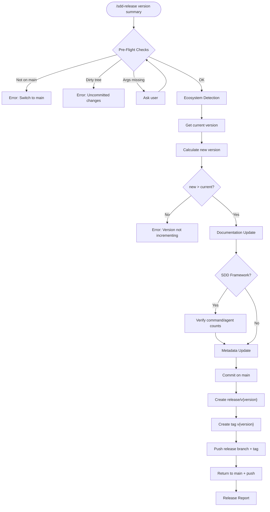
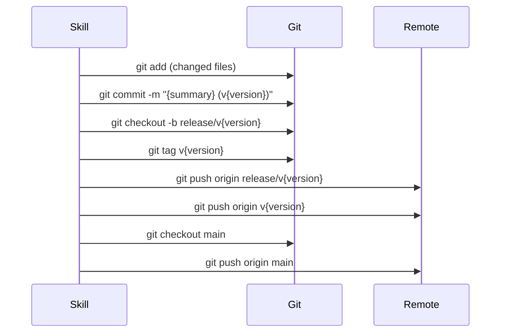

# Release Automation

## Specifications

### Introduction
バージョンリリースの完全自動化。エコシステム自動検出（Python hatch-vcs / Python standard / TypeScript / Rust / SDD Framework / Other の6種）、semver バージョンバンプ（patch/minor/major/explicit）、ドキュメント・メタデータの一括更新、trunk-based development に基づく git release flow（commit on main → release branch → tag → push）を単一スキルで実行する。

### Spec 1: Pre-Flight Validation
**Goal:** リリース開始前の前提条件を検証し、安全にリリースを実行可能な状態を保証する

**Acceptance Criteria:**
1. `main` ブランチ上であることを検証する。他ブランチの場合は "Switch to main branch first" でエラー終了
2. working tree が clean であることを確認する。dirty の場合は "Uncommitted changes detected" でエラー終了
3. エコシステム検出を実行し（Spec 2）、エコシステム固有のソースから現在のバージョンを取得する
4. 新バージョンを算出する: bump type (`patch`/`minor`/`major`) の場合は該当セグメントをインクリメント、explicit version (`v1.2.3` / `1.2.3`) の場合はそのまま使用
5. 新バージョンが現在のバージョンより大きいことを検証する
6. 引数 (`$0`: version, `$1+`: summary) が欠けている場合はユーザーに問い合わせる

### Spec 2: Ecosystem Auto-Detection
**Goal:** プロジェクトの設定ファイルからエコシステムを自動判定し、バージョンソースとメタデータ更新対象を決定する

**Acceptance Criteria:**
1. 優先順位に基づく first-match 方式で判定する（Priority 1 が最優先）
2. **Priority 1 — Python (hatch-vcs)**: `pyproject.toml` + `[tool.hatch.version] source = "vcs"` → バージョンは `git describe --tags`、メタデータ更新スキップ
3. **Priority 2 — Python (standard)**: `pyproject.toml` （hatch-vcs以外）→ `[project] version` フィールド
4. **Priority 3 — TypeScript**: `package.json` → `version` フィールド + lock file 同期
5. **Priority 4 — Rust**: `Cargo.toml` → `[package] version` フィールド
6. **Priority 5 — SDD Framework**: `framework/claude/CLAUDE.md` 存在 → `VERSION` ファイル、更新対象は `VERSION`, `README.md`, `install.sh`
7. **Priority 6 — Other**: 上記いずれにも非該当 → `git describe --tags` またはユーザー問い合わせ

### Spec 3: Documentation Update
**Goal:** バージョン参照を含むドキュメントファイルを新バージョンで一括更新する

**Acceptance Criteria:**
1. `README.md` 内の旧バージョン参照を検索し、新バージョンに更新する
2. `CHANGELOG.md` が存在する場合、リリースエントリを追加する
3. **SDD Framework 限定**: `framework/claude/CLAUDE.md` 内のコマンド数・エージェント数の整合性を検証・自動更新する

### Spec 4: Ecosystem Metadata Update
**Goal:** エコシステム固有のメタデータファイルを新バージョンで更新する

**Acceptance Criteria:**
1. **Python (hatch-vcs)**: メタデータ更新なし（git tag から自動導出）
2. **Python (standard)**: `pyproject.toml` の `version` フィールドを更新
3. **TypeScript**: `package.json` の `version` を更新 + `package-lock.json` 同期
4. **Rust**: `Cargo.toml` の `version` フィールドを更新
5. **SDD Framework**: `VERSION`, `README.md` (`--version` 行), `install.sh` (ヘッダーコメント) を更新
6. **Other**: ユーザー指定ファイルに対して更新を適用

### Spec 5: Git Release Flow
**Goal:** trunk-based development に準拠した git release flow を実行する

**Acceptance Criteria:**
1. 全変更ファイルをステージし、`{summary} (v{version})` のメッセージでコミット
2. `git checkout -b release/v{version}` でリリースブランチを作成
3. `git tag v{version}` でタグを作成
4. `git push origin release/v{version}` と `git push origin v{version}` でプッシュ
5. `git checkout main` で main に戻り、`git push origin main` でプッシュ
6. release branch はスナップショットであり、main にマージバックしない

### Spec 6: Release Report
**Goal:** リリース完了後のサマリーを出力する

**Acceptance Criteria:**
1. 検出されたエコシステム、バージョン遷移、リリースブランチ名、タグ名、コミットサマリー、変更ファイル一覧を表示する

### Non-Goals
- CI/CD パイプラインのトリガー
- パッケージレジストリへの公開（PyPI, npm, crates.io 等）
- CHANGELOG.md の自動生成
- release branch の main へのマージバック
- 複数エコシステムの同時検出

## Overview
`/sdd-release` は Lead が直接実行するスキル（T2/T3 spawn 不要）。trunk-based development を採用し、main が常に HEAD。release branch は特定バージョンのスナップショット。

## Architecture

### Ecosystem Detection Priority

```
Priority 1: pyproject.toml + [tool.hatch.version] source=vcs  → Python (hatch-vcs)
Priority 2: pyproject.toml (without hatch-vcs)                 → Python (standard)
Priority 3: package.json                                        → TypeScript
Priority 4: Cargo.toml                                          → Rust
Priority 5: framework/claude/CLAUDE.md                          → SDD Framework
Priority 6: (none of the above)                                 → Other
```

### Ecosystem-Specific File Updates

| Ecosystem | Version Source | Metadata Files Updated | Doc Files Updated |
|-----------|---------------|----------------------|-------------------|
| Python (hatch-vcs) | `git describe --tags` | なし（tag 駆動） | README.md, CHANGELOG.md |
| Python (standard) | `pyproject.toml` version | `pyproject.toml` | README.md, CHANGELOG.md |
| TypeScript | `package.json` version | `package.json`, `package-lock.json` | README.md, CHANGELOG.md |
| Rust | `Cargo.toml` version | `Cargo.toml` | README.md, CHANGELOG.md |
| SDD Framework | `VERSION` file | `VERSION`, `README.md`, `install.sh` | README.md, CHANGELOG.md, CLAUDE.md |
| Other | `git describe --tags` or user | ユーザー指定 | README.md, CHANGELOG.md |

## System Flows

### Main Release Flow



### Git Operations Sequence



## Components and Interfaces

| Component | Domain/Layer | Intent | Files |
|-----------|--------------|--------|-------|
| sdd-release skill | Skill | リリース自動化の全フロー定義 | `framework/claude/skills/sdd-release/SKILL.md` |

### Error Handling

| Error Condition | Message | Recovery |
|----------------|---------|----------|
| main ブランチ以外 | "Switch to main branch first" | ユーザーが手動で main に切替 |
| dirty working tree | "Uncommitted changes detected" | ユーザーが commit/stash |
| バージョン逆行 | "New version must be greater than current" | 正しいバージョンを指定 |
| エコシステム未検出 | Other にフォールスルー | ユーザーに問い合わせ |
| 引数不足 | インタラクティブに問い合わせ | ユーザーが入力 |
