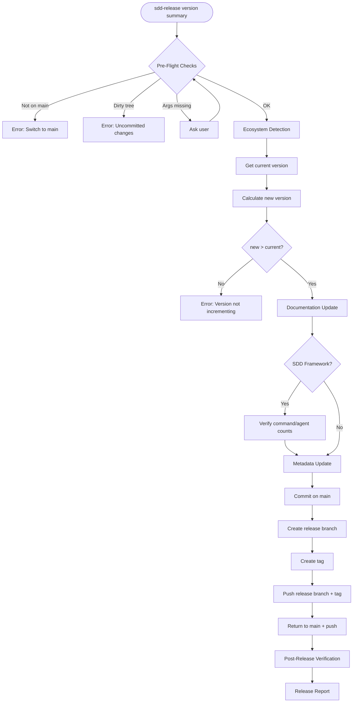
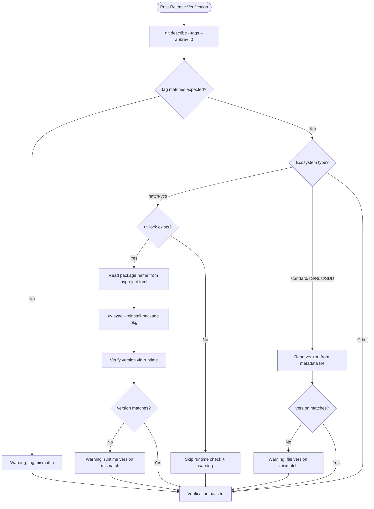
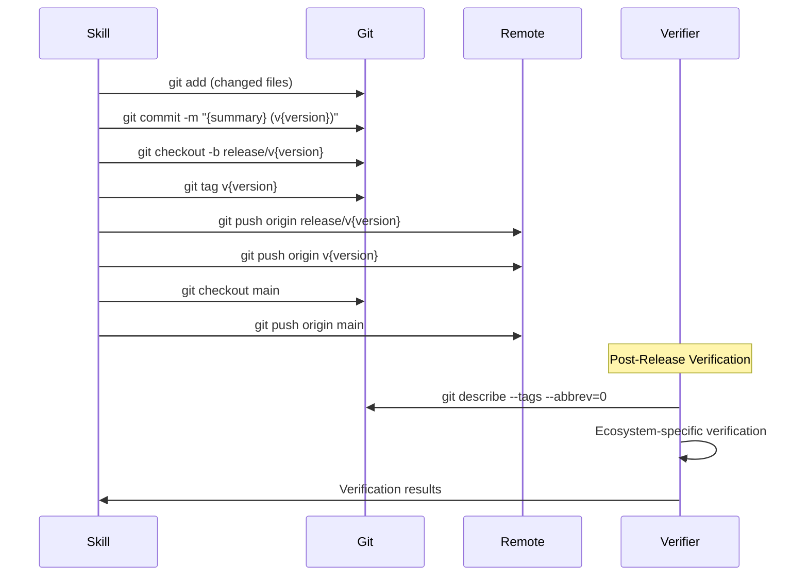

# Release Automation

## Specifications

### Introduction
バージョンリリースの完全自動化。エコシステム自動検出（Python hatch-vcs / Python standard / TypeScript / Rust / SDD Framework / Other の6種）、semver バージョンバンプ（patch/minor/major/explicit）、ドキュメント・メタデータの一括更新、trunk-based development に基づく git release flow（commit on main → release branch → tag → push）、リリース後のバージョン検証を単一スキルで実行する。

### Spec 1: Pre-Flight Validation
**Goal:** リリース開始前の前提条件を検証し、安全にリリースを実行可能な状態を保証する

**Acceptance Criteria:**
1. `main` ブランチ上であることを検証する。他ブランチの場合は "Switch to main branch first" でエラー終了
2. working tree が clean であることを確認する。dirty の場合は "Uncommitted changes detected" でエラー終了
3. エコシステム検出を実行し（Spec 2）、エコシステム固有のソースから現在のバージョンを取得する
4. 新バージョンを算出する: bump type (`patch`/`minor`/`major`) の場合は該当セグメントをインクリメント、explicit version (`v1.2.3` / `1.2.3`) の場合はそのまま使用
5. 新バージョンが現在のバージョンより大きいことを検証する
6. 引数 (`$0`: version, `$1+`: summary) が欠けている場合はユーザーに問い合わせる

### Spec 2: Ecosystem Auto-Detection
**Goal:** プロジェクトの設定ファイルからエコシステムを自動判定し、バージョンソースとメタデータ更新対象を決定する

**Acceptance Criteria:**
1. 優先順位に基づく first-match 方式で判定する（Priority 1 が最優先）
2. **Priority 1 — Python (hatch-vcs)**: `pyproject.toml` + `[tool.hatch.version] source = "vcs"` → バージョンは `git describe --tags`、メタデータ更新スキップ
3. **Priority 2 — Python (standard)**: `pyproject.toml` （hatch-vcs以外）→ `[project] version` フィールド
4. **Priority 3 — TypeScript**: `package.json` → `version` フィールド + lock file 同期
5. **Priority 4 — Rust**: `Cargo.toml` → `[package] version` フィールド
6. **Priority 5 — SDD Framework**: `framework/claude/CLAUDE.md` 存在 → `VERSION` ファイル、更新対象は `VERSION`, `README.md`, `install.sh`
7. **Priority 6 — Other**: 上記いずれにも非該当 → `git describe --tags` またはユーザー問い合わせ

### Spec 3: Documentation Update
**Goal:** バージョン参照を含むドキュメントファイルを新バージョンで一括更新する

**Acceptance Criteria:**
1. `README.md` 内の旧バージョン参照を検索し、新バージョンに更新する
2. `CHANGELOG.md` が存在する場合、リリースエントリを追加する
3. **SDD Framework 限定**: `framework/claude/CLAUDE.md` 内のコマンド数・エージェント数の整合性を検証・自動更新する

### Spec 4: Ecosystem Metadata Update
**Goal:** エコシステム固有のメタデータファイルを新バージョンで更新する

**Acceptance Criteria:**
1. **Python (hatch-vcs)**: メタデータ更新なし（git tag から自動導出）
2. **Python (standard)**: `pyproject.toml` の `version` フィールドを更新
3. **TypeScript**: `package.json` の `version` を更新 + `package-lock.json` 同期
4. **Rust**: `Cargo.toml` の `version` フィールドを更新
5. **SDD Framework**: `VERSION`, `README.md` (`--version` 行), `install.sh` (ヘッダーコメント) を更新
6. **Other**: ユーザー指定ファイルに対して更新を適用

### Spec 5: Git Release Flow
**Goal:** trunk-based development に準拠した git release flow を実行する

**Acceptance Criteria:**
1. 全変更ファイルをステージし、`{summary} (v{version})` のメッセージでコミット
2. `git checkout -b release/v{version}` でリリースブランチを作成
3. `git tag v{version}` でタグを作成
4. `git push origin release/v{version}` と `git push origin v{version}` でプッシュ
5. `git checkout main` で main に戻り、`git push origin main` でプッシュ
6. release branch はスナップショットであり、main にマージバックしない

### Spec 6: Release Report
**Goal:** リリース完了後のサマリーを出力する

**Acceptance Criteria:**
1. 検出されたエコシステム、バージョン遷移、リリースブランチ名、タグ名、コミットサマリー、変更ファイル一覧を表示する
2. Spec 7 の検証結果をレポートに含める。全検証がパスした場合は成功ステータスを表示する
3. 検証で警告が発生した場合、レポートの末尾に警告セクションを追加し、手動確認を促す

### Spec 7: Post-Release Verification
**Goal:** リリースフロー完了後、バージョンが全レベルで正しく反映されていることを検証する

**Acceptance Criteria:**
1. **Git タグ検証**: `git describe --tags --abbrev=0` の出力が `v{version}` と一致することを確認する。不一致の場合は警告を出力する
2. **Python (hatch-vcs) 検証**: パッケージメタデータを再構築してからランタイムでバージョンを確認する。具体的には、プロジェクトの同期コマンドでパッケージを再インストールした後、ランタイムでパッケージのバージョンを取得し、リリースバージョンとの一致を確認する。不一致の場合は警告を出力する
3. **Python (hatch-vcs) メタデータ再構築**: lock ファイルの存在を確認し、存在する場合はプロジェクト設定からパッケージ名を読み取り、同期コマンドで対象パッケージのメタデータを再構築する。lock ファイルが存在しない場合はランタイム検証をスキップし、Git タグ検証のみ実施する
4. **Python (standard) 検証**: プロジェクト設定ファイルのバージョンフィールドがリリースバージョンと一致することを確認する
5. **TypeScript 検証**: パッケージ設定ファイルのバージョンフィールドがリリースバージョンと一致することを確認する
6. **Rust 検証**: パッケージ設定ファイルのバージョンフィールドがリリースバージョンと一致することを確認する
7. **SDD Framework 検証**: バージョンファイルの内容がリリースバージョンと一致することを確認する
8. **Other 検証**: Git タグ検証のみ実施する（メタデータファイルがユーザー定義のため）
9. 検証は全ての Git 操作（push 含む）が完了した後に実施する。検証失敗はリリースの取り消しを行わず、警告として報告する

### Non-Goals
- CI/CD パイプラインのトリガー
- パッケージレジストリへの公開（PyPI, npm, crates.io 等）
- CHANGELOG.md の自動生成
- release branch の main へのマージバック
- 複数エコシステムの同時検出
- 検証失敗時のリリース自動ロールバック

## Overview
`/sdd-release` は Lead が直接実行するスキル（T2/T3 spawn 不要）。trunk-based development を採用し、main が常に HEAD。release branch は特定バージョンのスナップショット。リリース後の検証ステップにより、バージョンが正しく反映されていることを自動確認する。

## Architecture

### Ecosystem Detection Priority

```
Priority 1: pyproject.toml + [tool.hatch.version] source=vcs  → Python (hatch-vcs)
Priority 2: pyproject.toml (without hatch-vcs)                 → Python (standard)
Priority 3: package.json                                        → TypeScript
Priority 4: Cargo.toml                                          → Rust
Priority 5: framework/claude/CLAUDE.md                          → SDD Framework
Priority 6: (none of the above)                                 → Other
```

### Ecosystem-Specific File Updates

| Ecosystem | Version Source | Metadata Files Updated | Doc Files Updated |
|-----------|---------------|----------------------|-------------------|
| Python (hatch-vcs) | `git describe --tags` | なし（tag 駆動） | README.md, CHANGELOG.md |
| Python (standard) | `pyproject.toml` version | `pyproject.toml` | README.md, CHANGELOG.md |
| TypeScript | `package.json` version | `package.json`, `package-lock.json` | README.md, CHANGELOG.md |
| Rust | `Cargo.toml` version | `Cargo.toml` | README.md, CHANGELOG.md |
| SDD Framework | `VERSION` file | `VERSION`, `README.md`, `install.sh` | README.md, CHANGELOG.md, CLAUDE.md |
| Other | `git describe --tags` or user | ユーザー指定 | README.md, CHANGELOG.md |

### Post-Release Verification Strategy

| Ecosystem | Git Tag Check | Metadata Refresh | Runtime/File Check |
|-----------|--------------|------------------|--------------------|
| Python (hatch-vcs) | `git describe --tags --abbrev=0` | `uv sync --reinstall-package {pkg}` (uv.lock 存在時) | ランタイムで `importlib.metadata.version` 実行 |
| Python (standard) | `git describe --tags --abbrev=0` | 不要 | `pyproject.toml` version フィールド読み取り |
| TypeScript | `git describe --tags --abbrev=0` | 不要 | `package.json` version フィールド読み取り |
| Rust | `git describe --tags --abbrev=0` | 不要 | `Cargo.toml` version フィールド読み取り |
| SDD Framework | `git describe --tags --abbrev=0` | 不要 | `VERSION` ファイル読み取り |
| Other | `git describe --tags --abbrev=0` | 不要 | なし |

## System Flows

### Main Release Flow



### Post-Release Verification Flow



### Git Operations Sequence



## Components and Interfaces

| Component | Domain/Layer | Intent | Files |
|-----------|--------------|--------|-------|
| sdd-release skill | Skill | リリース自動化の全フロー定義（検証ステップ含む） | `framework/claude/skills/sdd-release/SKILL.md` |

### Error Handling

| Error Condition | Message | Recovery |
|----------------|---------|----------|
| main ブランチ以外 | "Switch to main branch first" | ユーザーが手動で main に切替 |
| dirty working tree | "Uncommitted changes detected" | ユーザーが commit/stash |
| バージョン逆行 | "New version must be greater than current" | 正しいバージョンを指定 |
| エコシステム未検出 | Other にフォールスルー | ユーザーに問い合わせ |
| 引数不足 | インタラクティブに問い合わせ | ユーザーが入力 |
| Git タグ検証失敗 | "Warning: git tag mismatch — expected v{version}, got {actual}" | 手動確認を促す |
| hatch-vcs ランタイム検証失敗 | "Warning: runtime version mismatch — expected {version}, got {actual}" | 手動でパッケージを再インストール |
| uv.lock 不在 (hatch-vcs) | "Warning: uv.lock not found — skipping runtime verification" | Git タグ検証のみ実施 |
| パッケージ名取得失敗 | "Warning: could not read package name from pyproject.toml — skipping runtime verification" | Git タグ検証のみ実施 |
| メタデータファイル検証失敗 | "Warning: file version mismatch in {file} — expected {version}, got {actual}" | 手動確認を促す |

## Revision Notes

### v1.0.0 → v1.1.0: Post-Release Verification の追加

**動機**: taskflow v0.3.0 リリース時のインシデント。hatch-vcs プロジェクトで `importlib.metadata.version()` がタグ作成後も旧バージョン (`0.2.1.dev0+g335b23266.d20260220`) を返した。原因は editable install のメタデータキャッシュ。Lead が誤って `uv pip install -e .` を試みたが、正しい方法は `uv sync --reinstall-package {pkg}` であった。

**変更内容**:
1. **Spec 7 追加**: Post-Release Verification — 全エコシステムでリリース後のバージョン検証を実施
2. **Spec 6 更新**: Release Report に検証結果の統合を追加（AC 2, 3）
3. **Architecture 更新**: Post-Release Verification Strategy テーブルを追加
4. **System Flows 更新**: Main Release Flow に Verify ステップを追加、Post-Release Verification Flow を新規追加、Git Operations Sequence に Verifier を追加
5. **Error Handling 更新**: 検証関連の警告メッセージを追加
6. **Non-Goals 更新**: 検証失敗時のリリース自動ロールバックを明示的に除外
7. **Introduction 更新**: 「リリース後のバージョン検証」を追加

**設計判断**:
- 検証失敗はエラーではなく警告として扱う（リリース自体は完了済みのため）
- hatch-vcs の `uv sync --reinstall-package` は `uv.lock` 存在時のみ実行（非 uv 環境ではスキップ）
- パッケージ名は `pyproject.toml` の `[project] name` から動的取得
- 検証ステップは全 Git 操作完了後に実行（push 含む）
