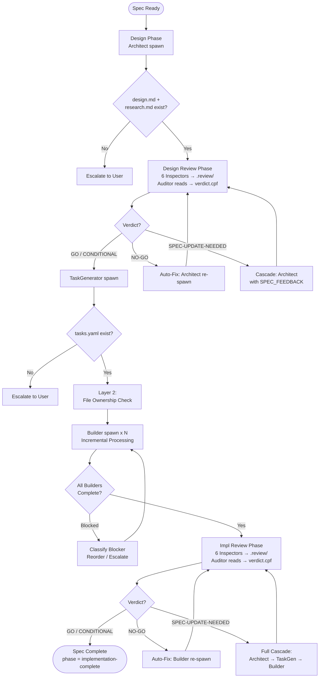
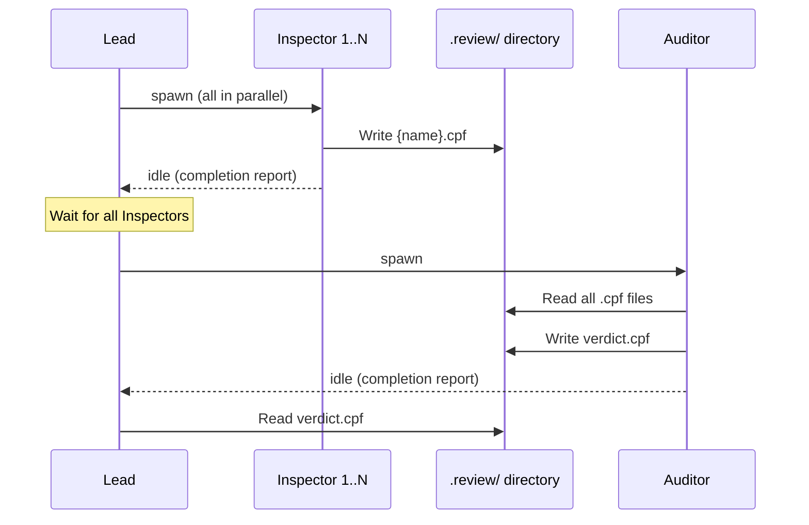

# Roadmap Orchestration

## Specifications

### Introduction
マルチフィーチャーロードマップの作成・実行・更新・改訂・削除を統合的に管理するオーケストレーションシステム。`/sdd-roadmap` を統合エントリポイントとして、ライフサイクルサブコマンド（design, impl, review）とマネジメントサブコマンド（run, revise, create, update, delete）を提供する。SDD フレームワーク最大の skill であり、Wave スケジューリング、DAG 依存関係検証、Cross-Spec ファイル所有権解決、並列パイプライン実行、Auto-Fix ループ（NO-GO/SPEC-UPDATE-NEEDED verdict への自動修復）、Blocking/Unblocking Protocol（失敗伝播と復旧）、Wave Quality Gate（累積スコープのクロスチェックと Dead Code Review）を包括する。個別コマンド（`/sdd-design`, `/sdd-impl`, `/sdd-review`）はリダイレクトスタブとして `/sdd-roadmap` の対応サブコマンドに転送する。

### Spec 1: Roadmap Router (Unified Entry Point)
**Goal:** `/sdd-roadmap` を全 spec ライフサイクル操作の統合エントリポイントとする

**Acceptance Criteria:**
1. ライフサイクルサブコマンド（`design`, `impl`, `review`）を認識し、Single-Spec Roadmap Ensure を経由して実行する
2. マネジメントサブコマンド（`run`, `revise`, `create`, `update`, `delete`）を認識し、直接実行する
3. 引数なし / `-y` フラグでの自動検出モードをサポートする（roadmap.md 存在チェック → Run/Update/Reset 提示、または Create 開始）
4. 個別コマンド（`/sdd-design`, `/sdd-impl`, `/sdd-review`）からのリダイレクトを受け付ける
5. 不明なサブコマンドに対してヘルプメッセージを表示する

### Spec 2: Single-Spec Roadmap Ensure
**Goal:** ライフサイクルサブコマンド実行時のロードマップ自動作成・自動登録

**Acceptance Criteria:**
1. ライフサイクルサブコマンド（design, impl, review）検出時に `roadmap.md` の存在を確認する
2. ロードマップが存在する場合: 対象 spec の enrollment を検証する
   - `spec.yaml.roadmap` が non-null → サブコマンド実行に進む
   - spec 未発見かつ `design` サブコマンド → 自動追加（ディレクトリ作成、spec.yaml 初期化、Wave N+1 設定、roadmap.md 更新）
   - spec 未発見かつ `impl`/`review` → BLOCK: "Spec '{feature}' not found"
   - spec 存在だが `roadmap` が null → BLOCK: "not enrolled in the roadmap"
   - `review dead-code` / `review --cross-check` / `review --wave N` → enrollment チェック不要
3. ロードマップが存在しない場合:
   - `review dead-code` / `review --cross-check` / `review --wave N` → BLOCK: "No roadmap found"
   - それ以外 → 1-spec ロードマップを自動作成（spec ディレクトリ + spec.yaml + roadmap.md）
4. **1-Spec Roadmap Optimizations**: `roadmap.md` が 1 spec のみを含む場合:
   - Wave Quality Gate をスキップ（1 spec でのクロスチェックは無意味）
   - Cross-Spec File Ownership Analysis をスキップ（重複不可能）
   - Wave レベルの dead-code review をスキップ（ユーザーは `/sdd-roadmap review dead-code` で手動実行可能）
   - コミットメッセージ形式: `{feature}: {summary}`（`Wave 1: {summary}` ではない）

### Spec 3: Roadmap Creation (Create Mode)
**Goal:** ステアリング分析に基づくユーザー対話型ロードマップ作成

**Acceptance Criteria:**
1. ステアリング（product.md, tech.md, structure.md）を読み込み、スペック候補を提案する
2. ユーザーとの対話で Wave 構成を決定する（依存関係ベースの順序付け）
3. `-y` フラグで対話スキップ（自動承認）をサポートする
4. 各 spec のディレクトリと skeleton `design.md` を生成する
5. 各 `spec.yaml` に `roadmap: {wave: N, dependencies: [...]}` を設定する
6. `roadmap.md` を Wave Overview, Dependencies, Execution Flow セクション付きで生成する
7. `steering/product.md` の User Intent → Spec Rationale セクションを更新する
8. `session.md` を auto-draft する

### Spec 4: Pipeline Execution (Run Mode)
**Goal:** ロードマップ内全スペックのフルパイプライン自動実行

**Acceptance Criteria:**
1. `roadmap.md` と全 `spec.yaml` を読み込み、パイプライン状態を再構築する
2. DAG 検証（トポロジカルソート）を実行し、循環依存を検出した場合は BLOCK する
3. Cross-Spec ファイル所有権解析を実施する（Layer 1: design.md ベース、Layer 2: tasks.yaml ベース）。1-Spec Roadmap の場合はスキップ
4. 同一 Wave 内の独立 spec を並列スケジューリングする
5. 各 spec に対して 5 フェーズパイプラインを実行する: Design → Design Review → TaskGen → Builder(s) → Impl Review
6. Design Review / Impl Review は roadmap run において必須とする
7. Builder incremental processing をサポートする（完了毎に tasks.yaml 更新、次 wave Builder 即座 spawn）
8. `--consensus N` オプションで N 回並列レビューパイプラインを実行する
9. 各フェーズ完了後に `session.md` を auto-draft する
10. 1-Spec Roadmap の場合は Wave Quality Gate をスキップする

### Spec 5: Full-Auto / Gate Mode
**Goal:** パイプライン進行の自動/手動制御モード切替

**Acceptance Criteria:**
1. Full-Auto モード（デフォルト）: GO/CONDITIONAL で自動進行、NO-GO で自動修復、Wave 遷移自動
2. Gate モード（`--gate`）: Design Review 完了時にユーザー承認を要求する
3. Gate モード: Impl Review 完了時にユーザー承認を要求する
4. Gate モード: Wave 遷移時にユーザー承認を要求する
5. Gate モード: 構造変更（spec 分割、Wave 再構成）時にユーザーへエスカレーションする
6. Full-Auto モード: 構造変更も自動修復する（Gate モードとの差分）

### Spec 6: Auto-Fix Loop
**Goal:** NO-GO / SPEC-UPDATE-NEEDED verdict に対する自動修復サイクル

**Acceptance Criteria:**
1. NO-GO (design review) → Architect を fix instructions 付きで re-spawn し、phase は `design-generated` のまま維持する
2. NO-GO (impl review) → Builder(s) を fix instructions 付きで re-spawn する
3. SPEC-UPDATE-NEEDED → `orchestration.last_phase_action = null` をリセットし、`phase = design-generated` に設定。Architect（SPEC_FEEDBACK 付き）→ TaskGenerator → Builder のフルカスケードを実行する（差分なし、全タスク再実装）
4. `retry_count` は NO-GO のみでインクリメント（最大 3）。CONDITIONAL ではカウントしない
5. `spec_update_count` は SPEC-UPDATE-NEEDED のみでインクリメント（最大 2）。`retry_count` とは独立
6. GO/CONDITIONAL verdict で `retry_count` と `spec_update_count` を両方 0 にリセットする
7. 集約上限: `retry_count + spec_update_count` が 4 に達した時点でユーザーへエスカレーションする
8. 修復後は review teammates を dismiss し、新しい review pipeline（Inspectors → Auditor、ファイルベース）を再 spawn する
9. NO-GO (Wave Quality Gate) → findings をファイルパスにマッピングし、file ownership records から責任 Builder を特定して fix instructions 付きで re-spawn する
10. Architect 修復失敗時はスペック全体をユーザーへエスカレーションする
11. 構造変更（spec 分割等）は decisions.md に `DIRECTION_CHANGE` として記録する

### Spec 7: Wave Quality Gate
**Goal:** Wave 完了後のクロススペック品質保証ゲート

**Acceptance Criteria:**
1. Wave 完了条件: Wave 内全 spec が `implementation-complete` または `blocked` であること
2. Impl Cross-Check Review を累積スコープ（Wave 1..N）で実行する（6 impl Inspectors が `.review-wave-{N}/` に CPF ファイル書き出し → Auditor が読み取り `verdict.cpf` 書き出し）
3. `verdicts-wave.md` から前 Wave の解決済み issues を読み込み、Inspector spawn context に PREVIOUSLY_RESOLVED として含める
4. 解決済み issue が再発した場合は REGRESSION タグを付与し、severity を 1 段階引き上げる
5. Cross-Check verdict を `verdicts-wave.md` にバッチ `[W{wave}-B{seq}]` ヘッダーで永続化する
6. Dead Code Review を全コードベースに対して実行する（4 dead-code Inspectors が `.review-wave-{N}-dc/` に CPF ファイル書き出し → Auditor が読み取り `verdict.cpf` 書き出し）
7. Dead Code verdict を `verdicts-wave.md` にバッチ `[W{wave}-DC-B{seq}]` ヘッダーで永続化する
8. 各ゲートで最大 3 回リトライ（NO-GO → Builder re-spawn → re-review）
9. リトライ枯渇時にユーザーへエスカレーション: Proceed / Abort wave / Manual fix の 3 オプション
10. SPEC-UPDATE-NEEDED → 対象 spec を特定し、Architect → TaskGenerator → Builder カスケードを実行する
11. Post-gate: Knowledge Buffer 集約・knowledge/ への書き出し、buffer.md クリア、Git commit
12. 1-Spec Roadmap の場合は Wave Quality Gate 全体をスキップする

### Spec 8: Blocking/Unblocking Protocol
**Goal:** 失敗スペックの下流への影響伝播と復旧

**Acceptance Criteria:**
1. spec がリトライ枯渇で失敗した場合、依存グラフをトラバースして全下流 spec を特定する
2. 各下流 spec に対して: 現在の phase を `blocked_info.blocked_at_phase` に保存し、`phase = blocked`、`blocked_info.blocked_by = {failed_spec}`、`blocked_info.reason = upstream_failure` を設定する
3. ユーザーに影響範囲を報告し、fix / skip / abort の 3 オプションを提示する
4. **fix**: upstream spec の `phase` が `implementation-complete` であることを検証する。未検証なら `/sdd-roadmap review impl {upstream}` を先に実行する。検証後に downstream の phase を `blocked_at_phase` から復元し、`blocked_info` をクリアする
5. **skip**: upstream spec をパイプラインから除外し、downstream の依存関係が解決されるか評価する
6. **abort**: パイプラインを停止し、全 spec を現状のまま残す

### Spec 9: Roadmap Update Mode
**Goal:** `roadmap.md` と `spec.yaml` 群の差分検出・同期

**Acceptance Criteria:**
1. `roadmap.md` と全 `spec.yaml` を読み込み、現在の状態マップを構築する
2. 6 カテゴリの差分を検出する: Missing spec / Orphaned entry / Wave mismatch / Dependency change / Phase regression / Blocked cascade
3. 各差分の下流影響を依存グラフで分析し、SAFE / WAVE_REORDER / SCOPE_CHANGE に分類する
4. Apply All / Selective / Abort の 3 オプションをユーザーに提示する
5. 変更適用後に DAG を再検証する（循環依存なし）
6. 変更を `decisions.md` に `DIRECTION_CHANGE` として記録する

### Spec 10: Roadmap Revise Mode
**Goal:** 完了済み Wave のスペック修正パイプライン

**Acceptance Criteria:**
1. `roadmap.md` が存在し、対象 spec の `phase` が `implementation-complete` であることを検証する
2. 対象 spec が完了済み Wave に属していることを確認する
3. ユーザーから revision instructions を収集する（引数指定またはインタラクティブ）
4. 依存グラフから直接依存 spec と推移的依存 spec を特定し、影響プレビューをユーザーに表示する
5. `orchestration` をリセットし、`phase = design-generated` に設定する
6. 標準パイプラインを revision context 付きで実行する: Architect（existing モード、REVISION_INSTRUCTIONS 付き）→ Design Review → TaskGenerator → Builder → Impl Review
7. 修正完了後、直接依存 spec ごとに Re-review / Re-implement / Skip を提示する
8. 推移的依存は session.md Warnings にフラグのみ立てる
9. `decisions.md` に `REVISION_INITIATED` として記録する

### Spec 11: Roadmap Delete Mode
**Goal:** ロードマップと全スペックの完全削除

**Acceptance Criteria:**
1. 明示的な "RESET" 確認を要求する
2. `roadmap.md` と全 spec ディレクトリを削除する
3. オプションで Create Mode による再初期化を提供する

### Spec 12: Pipeline Stop/Resume Protocol
**Goal:** パイプライン実行中の中断と再開

**Acceptance Criteria:**
1. ユーザーの stop 要求時に全 active T2/T3 teammates を dismiss する
2. `session.md` に現在の進捗と方向を auto-draft する
3. 完了済み/進行中/未着手の状態をユーザーに報告する
4. `/sdd-roadmap run` で全 `spec.yaml` をスキャンしてパイプライン状態を再構築し、中断地点から再開する
5. 1-Spec Roadmap の場合はサブコマンド（例: `/sdd-roadmap impl {feature}`）で中断フェーズから再開する

### Spec 13: Consensus Mode
**Goal:** N 回並列レビューによる合意形成レビュー

**Acceptance Criteria:**
1. `--consensus N` オプションで N 本のレビューパイプラインを並列 spawn する
2. 各パイプラインにユニーク名の Auditor を割り当てる（`auditor-{type}-{n}`）
3. 各パイプラインは独立した `.review-{p}/` ディレクトリに CPF ファイルを書き出す
4. N 本の verdict を集約し、閾値 `ceil(N * 0.6)` 以上の findings を Consensus とする
5. 全 N verdict が GO → GO、Consensus に C/H → NO-GO、M/L のみ → CONDITIONAL
6. N=1（デフォルト）は集約スキップ、単一パイプラインそのまま

### Non-Goals
- ステアリングの管理（steering-system spec のスコープ）
- Knowledge エントリの個別管理（knowledge-system spec のスコープ）

---

## Overview

フレームワーク最大の skill。プロダクト全体のマルチフィーチャー開発ライフサイクルを管理する中央オーケストレーターとして機能する。`/sdd-roadmap` を統合エントリポイントとし、ライフサイクルサブコマンド（design, impl, review）とマネジメントサブコマンド（run, revise, create, update, delete）を通じて全操作を提供する。個別コマンド（`/sdd-design`, `/sdd-impl`, `/sdd-review`）はリダイレクトスタブとして `/sdd-roadmap` に転送される。

全パイプラインコンポーネント（Architect, Inspector, Auditor, TaskGenerator, Builder）を統合し、Wave ベースの並列実行、Cross-Spec ファイル所有権解決、自動品質保証ゲート、失敗伝播と復旧を実現する。レビューパイプラインはファイルベース通信を使用し、Inspector は `.review/` ディレクトリに CPF ファイルを書き出し、Auditor がそれを読み取って `verdict.cpf` を生成する。

主な責務:
- **Router**: `/sdd-roadmap` を統合エントリポイントとしてサブコマンドをディスパッチ。ライフサイクルサブコマンドは Single-Spec Roadmap Ensure を経由
- **Design**: Architect を spawn して design.md + research.md を生成（`/sdd-roadmap design`）
- **Impl**: TaskGenerator → Builder(s) で TDD 実装（`/sdd-roadmap impl`）
- **Review**: ファイルベースレビューパイプライン（Inspectors → Auditor）（`/sdd-roadmap review`）
- **Create**: ステアリング分析からスペック候補を抽出し、依存関係に基づいた Wave 構成を対話的に決定
- **Run**: DAG 検証済みのパイプラインを full-auto または gate モードで実行。各 spec は Design → Design Review → TaskGen → Builder(s) → Impl Review の 5 フェーズを経る
- **Update**: `roadmap.md` と `spec.yaml` 群の状態を差分検出・同期
- **Revise**: 完了済み Wave の spec に対して revision context 付きの標準パイプラインを再実行
- **Delete**: ロードマップと全 spec の完全削除

8 つのサブコマンドに加え、横断的関心事として Auto-Fix Loop、Wave Quality Gate、Blocking Protocol、Pipeline Stop/Resume、Consensus Mode を管理する。

---

## Architecture

### Roadmap Router Flow

`/sdd-roadmap` はサブコマンドに基づいてモードを判定し、適切なフローにディスパッチする。ライフサイクルサブコマンドは Single-Spec Roadmap Ensure を経由して roadmap の存在と spec の enrollment を保証する。


### Single-Spec Roadmap Ensure Flow

ライフサイクルサブコマンド実行前のロードマップ保証フロー。


### Pipeline Execution Flow

各 spec は以下の 5 フェーズパイプラインを順序実行する。Design Review と Impl Review は roadmap run では必須。レビューフェーズはファイルベース通信を使用する。



### File-Based Review Protocol

レビューパイプラインはファイルベース通信を使用する。Inspector → Auditor 間の SendMessage は不要。



### Wave Quality Gate Flow

Wave 内の全 spec が完了した後に実行される 2 段階の品質ゲート。1-Spec Roadmap の場合は全体をスキップする。各段階でファイルベースレビューを使用し、専用ディレクトリに CPF ファイルを書き出す。


### Auto-Fix Loop State Machine

verdict に基づく修復サイクルの状態遷移。`retry_count` と `spec_update_count` は独立カウンター。


### Blocking Protocol Flow

spec 失敗時の下流への影響伝播と復旧パス。


### Teammate Failure Handling

ファイルベースレビュープロトコルにより、全 teammate 出力は冪等（同じ `.review/` ディレクトリ、同じファイルパス）。teammate が出力ファイルを生成せずに idle になった場合、Lead は自身の判断でリトライ、スキップ、または利用可能なファイルから結果を導出する。特別なリカバリモードは不要 — リトライは初回と同じフロー。

---

## System Flows

### SF-1: Create Mode Flow

1. Lead がステアリングファイル（product.md, tech.md, structure.md）、ルール、テンプレート、既存スペックを読み込む
2. ユーザーにプロダクト理解を確認する
3. ステアリング分析からスペック候補を提案する
4. 依存関係に基づいて Wave 構成（実装順序）を組織する
5. ユーザーとの対話で Wave 構成を洗練する（`-y` フラグで省略可）
6. 各 spec のディレクトリに skeleton `design.md` を生成する
7. 各 `spec.yaml` に `roadmap: {wave: N, dependencies: [...]}` を設定する
8. `roadmap.md` を生成する（Wave Overview, Dependencies, Execution Flow セクション付き）
9. `steering/product.md` の User Intent → Spec Rationale セクションを更新する
10. `session.md` を auto-draft する

### SF-2: Run Mode Flow

#### Step 1: State Loading
1. `roadmap.md` と全 `spec.yaml` を読み込む
2. phase/status フィールドからパイプライン状態を再構築する
3. `spec.yaml.roadmap` フィールドから依存グラフを構築する
4. DAG 検証: トポロジカルソートを実行。循環依存検出時は BLOCK: "Circular dependency detected: {cycle_path}"
5. 1-Spec Roadmap を検出した場合、1-Spec Optimizations フラグを設定する

#### Step 2: Cross-Spec File Ownership Analysis (Layer 1)
> **注**: 1-Spec Roadmap の場合はこの Step 全体をスキップする。

1. 並列実行候補の全 spec の `design.md` Components セクションを読み込む
2. 同一 Wave 内の spec ペアでファイルスコープの重複を検出する
3. 重複解決: **Serialize**（推奨: 重複 spec を Wave 内で順序実行に変換）または **Partition**（ファイル所有権を再割当て、必要に応じて TaskGenerator を file exclusion constraints 付きで re-spawn）
4. 解決後に並列 spec 間のファイル重複がゼロであることを検証する
5. 最終的なファイル所有権割当てを auto-fix routing 用に記録する

#### Step 3: Spec Scheduling
- 同一 Wave、ファイル重複なし、依存関係なしの spec を並列スケジューリングする
- 各 spec の個別パイプライン進捗を追跡する

#### Step 4: Pipeline Execution (per spec)

**Design Phase:**
1. Architect を `TeammateTool` で spawn する（Feature, Mode, User-instructions を context に含める）
2. Architect は自身のコンテキスト（steering, templates, rules, existing code）を自律的に読み込む（Lead は事前読み込みしない）
3. Architect の completion report を読み取る
4. Architect を dismiss する
5. `design.md` と `research.md` の存在を検証する
6. `spec.yaml` を更新: `phase=design-generated`, `version_refs.design={v}`

**Design Review Phase (ファイルベース):**
1. 6 design Inspectors を `TeammateTool` で spawn する
   - Inspector set: rulebase, testability, architecture, consistency, best-practices, holistic
   - 各 Inspector context: "Feature: {feature}, Write findings to: `.review/{inspector-name}.cpf`"
   - Inspectors は各自 `.review/` ディレクトリに CPF ファイルを書き出す
2. 全 Inspector の completion を待つ
3. design Auditor を `TeammateTool` で spawn する
   - Auditor context: "Feature: {feature}, Read CPF files from: `.review/`, Write verdict to: `.review/verdict.cpf`"
   - Auditor は `.review/` から全 CPF ファイルを読み取り、`verdict.cpf` を書き出す
4. Auditor の completion を待ち、`.review/verdict.cpf` を読み取る
5. 全 review teammates（6 Inspectors + Auditor）を dismiss する
6. verdict を `specs/{feature}/verdicts.md` に永続化する
7. verdict 処理: GO/CONDITIONAL → カウンターリセット、次フェーズへ。NO-GO → Auto-Fix Loop。Gate mode → ユーザー承認待ち
8. `STEERING:` エントリを処理する（`decisions.md` に記録）
9. `--consensus N` 有効時は Consensus Mode を適用する（各パイプラインは `.review-{p}/` に書き出し）

**Implementation Phase:**
1. TaskGenerator を `TeammateTool` で spawn する（Feature, Design, Research, Review findings を context に含める）
2. `TASKGEN_COMPLETE` 完了レポートを読み取る
3. TaskGenerator を dismiss する
4. `tasks.yaml` の存在を検証する
5. `tasks.yaml` の execution plan を読み込み、Builder grouping を決定する
6. Layer 2 ファイル所有権チェック（1-Spec Roadmap ではスキップ）: 並列 spec の `tasks.yaml` execution セクションからファイルリストを収集。重複検出 → serialize or partition
7. `tasks.yaml` の tasks セクションから detail bullets を抽出し、Builder spawn prompts を構成する
8. Builder(s) を `TeammateTool` で spawn する（Feature, Tasks, File scope, Design ref, Research ref を context に含める）
9. **Incremental Processing**: 各 Builder 完了時に即座に:
   - completion report を読み取る（files, test results, knowledge tags, blockers）
   - `tasks.yaml` で完了タスクを `done` にマーク
   - knowledge tags を `buffer.md` に格納
   - BUILDER_BLOCKED 時: 原因分類（依存関係不足→再順序/re-spawn、外部ブロッカー→ユーザーエスカレーション、設計ギャップ→エスカレーション）。`[INCIDENT]` として buffer.md に記録
10. 依存タスクが unblock されたら、完了 Builder を dismiss し次 wave Builder を即座に spawn する
11. 全 Builder 完了後: 全 Builder の files を集約し、`spec.yaml` を更新: `phase=implementation-complete`, `implementation.files_created=[...]`, `version_refs.implementation={version}`

**Implementation Review Phase (ファイルベース):**
1. 6 impl Inspectors を `TeammateTool` で spawn する
   - Inspector set: impl-rulebase, interface, test, quality, impl-consistency, impl-holistic
   - 各 Inspector context: "Feature: {feature}, Write findings to: `.review/{inspector-name}.cpf`"
   - Inspectors は各自 `.review/` ディレクトリに CPF ファイルを書き出す
2. 全 Inspector の completion を待つ
3. impl Auditor を `TeammateTool` で spawn する
   - Auditor context: "Feature: {feature}, Read CPF files from: `.review/`, Write verdict to: `.review/verdict.cpf`"
4. Auditor の completion を待ち、`.review/verdict.cpf` を読み取る
5. 全 review teammates を dismiss する
6. verdict を `specs/{feature}/verdicts.md` に永続化する
7. verdict 処理:
   - GO/CONDITIONAL → カウンターリセット。Spec pipeline 完了
   - NO-GO → `retry_count` インクリメント。Builder(s) を fix instructions 付きで re-spawn → re-review（最大 3 リトライ）
   - SPEC-UPDATE-NEEDED → `spec_update_count` インクリメント（最大 2）。`orchestration.last_phase_action = null` リセット、`phase = design-generated` 設定。Architect（SPEC_FEEDBACK 付き）→ TaskGenerator → Builder → re-review のフルカスケード（差分なし、全タスク再実装）
   - Gate mode → ユーザー承認待ち
8. `STEERING:` エントリを処理する
9. `--consensus N` 有効時は Consensus Mode を適用する（各パイプラインは `.review-{p}/` に書き出し）

#### Step 5: Wave Quality Gate (per wave)

> **注**: 1-Spec Roadmap の場合は Step 5 全体をスキップし、直接 Post-gate へ進む。

Wave 完了条件: Wave 内全 spec が `implementation-complete` または `blocked`

**a. Impl Cross-Check Review (wave-scoped, ファイルベース):**
1. `verdicts-wave.md` から前 Wave バッチの解決済み issues を読み込む（PREVIOUSLY_RESOLVED 構築）
2. 6 impl Inspectors を Wave スコープ cross-check context 付きで spawn する
   - 各 Inspector: "Wave-scoped cross-check, Wave: 1..{N}, Previously resolved: {PREVIOUSLY_RESOLVED}, Write findings to: `.review-wave-{N}/{inspector-name}.cpf`"
   - Inspectors は `.review-wave-{N}/` ディレクトリに CPF ファイルを書き出す
3. 全 Inspector completion 後、Auditor を spawn する
   - Auditor: "Wave-scoped cross-check, Wave: 1..{N}, Read from: `.review-wave-{N}/`, Write verdict to: `.review-wave-{N}/verdict.cpf`"
4. verdict を `verdicts-wave.md` にバッチ `[W{wave}-B{seq}]` で永続化する
5. verdict 処理: GO/CONDITIONAL → Dead Code Review へ。NO-GO → Builder re-spawn → re-review（最大 3 リトライ → エスカレーション）。SPEC-UPDATE-NEEDED → 対象 spec 特定 → Architect カスケード

**b. Dead Code Review (full codebase, ファイルベース):**
1. 4 dead-code Inspectors を spawn する
   - Inspectors: dead-settings, dead-code, dead-specs, dead-tests
   - 各 Inspector: "Write findings to: `.review-wave-{N}-dc/{inspector-name}.cpf`"
   - Inspectors は `.review-wave-{N}-dc/` ディレクトリに CPF ファイルを書き出す
2. 全 Inspector completion 後、dead-code Auditor を spawn する
   - Auditor: "Read from: `.review-wave-{N}-dc/`, Write verdict to: `.review-wave-{N}-dc/verdict.cpf`"
3. verdict を `verdicts-wave.md` にバッチ `[W{wave}-DC-B{seq}]` で永続化する
4. verdict 処理: GO/CONDITIONAL → Wave 完了。NO-GO → Builder re-spawn → re-review dead-code（最大 3 リトライ → エスカレーション）

**c. Post-gate:**
1. Knowledge Buffer を `buffer.md` から集約・重複排除し、`knowledge/` に書き出す
2. `buffer.md` をクリアする
3. Git commit: `Wave {N}: {summary of completed specs}`（1-Spec Roadmap の場合: `{feature}: {summary}`）
4. `session.md` を auto-draft する

### SF-3: Revise Mode Flow

1. `roadmap.md` 存在、`spec.yaml.phase == implementation-complete`、完了済み Wave 所属を検証する
2. `blocked` phase の場合は BLOCK する
3. revision instructions を収集する（引数指定またはインタラクティブ）
4. 依存グラフから直接依存・推移的依存を特定し、影響プレビューを表示する
5. ユーザー承認を取得する（拒否時は `USER_DECISION` 記録して abort）
6. `orchestration` をリセット（`last_phase_action = null`, `retry_count = 0`, `spec_update_count = 0`）、`phase = design-generated` に設定する
7. 標準パイプラインを revision context 付きで実行する:
   - Architect: existing モード、REVISION_INSTRUCTIONS 付き。未影響セクションを保持、変更を '## Revision Notes' サブセクションに記録
   - Design Review（ファイルベース）→ TaskGenerator → Builder（全タスク再実装）→ Impl Review（ファイルベース）
8. Auto-fix loop が通常適用される
9. 修正完了後の downstream resolution:
   - 直接依存 spec（`implementation-complete`）ごとに: Re-review / Re-implement / Skip を提示
   - 各決定を `decisions.md` に `USER_DECISION` として記録
   - 推移的依存は `session.md` Warnings にフラグのみ

### SF-4: Update Mode Flow

1. `roadmap.md` と全 `spec.yaml` を読み込み、状態マップ `{spec: {phase, wave, dependencies, version}}` を構築する
2. `roadmap.md` の宣言状態と比較し、6 カテゴリの差分を検出する:
   - Missing spec（spec.yaml はあるが roadmap.md にない）
   - Orphaned entry（roadmap.md にはあるが spec.yaml がない）
   - Wave mismatch（spec.yaml.roadmap.wave と roadmap.md が異なる）
   - Dependency change（spec.yaml.roadmap.dependencies が異なる）
   - Phase regression（完了済み Wave の spec が予期より早い phase）
   - Blocked cascade（spec は blocked だが roadmap では active）
3. 各差分の影響分析: 依存グラフ forward トラバース、Wave 順序整合性チェック、影響分類（SAFE / WAVE_REORDER / SCOPE_CHANGE）
4. Apply All / Selective / Abort をユーザーに提示する
5. 受諾された変更を `roadmap.md` と `spec.yaml` に適用する
6. Wave 再順序の場合は DAG を再検証する（循環依存なし）
7. `decisions.md` に `DIRECTION_CHANGE` として記録する

### SF-5: Delete Mode Flow

1. 明示的な "RESET" 確認を要求する
2. `roadmap.md` と全 spec ディレクトリを削除する
3. オプションで Create Mode による再初期化を提供する

---

## Components and Interfaces

| Component | Domain/Layer | Intent | Files |
|-----------|--------------|--------|-------|
| sdd-roadmap skill | Skill (T1 Lead) | 全モードのオーケストレーション（統合エントリポイント） | `framework/claude/skills/sdd-roadmap/SKILL.md` |
| sdd-design skill | Skill (redirect stub) | `/sdd-roadmap design` へのリダイレクト | `framework/claude/skills/sdd-design/SKILL.md` |
| sdd-impl skill | Skill (redirect stub) | `/sdd-roadmap impl` へのリダイレクト | `framework/claude/skills/sdd-impl/SKILL.md` |
| sdd-review skill | Skill (redirect stub) | `/sdd-roadmap review` へのリダイレクト | `framework/claude/skills/sdd-review/SKILL.md` |
| sdd-architect agent | Agent (T2) | Design 生成・revision | `framework/claude/sdd/settings/agents/sdd-architect.md` |
| sdd-taskgenerator agent | Agent (T3) | タスク分解・execution plan | `framework/claude/sdd/settings/agents/sdd-taskgenerator.md` |
| sdd-builder agent | Agent (T3) | TDD 実装 | `framework/claude/sdd/settings/agents/sdd-builder.md` |
| sdd-auditor-design agent | Agent (T2) | Design verdict 合成 | `framework/claude/sdd/settings/agents/sdd-auditor-design.md` |
| sdd-auditor-impl agent | Agent (T2) | Impl verdict 合成 | `framework/claude/sdd/settings/agents/sdd-auditor-impl.md` |
| sdd-auditor-dead-code agent | Agent (T2) | Dead code verdict 合成 | `framework/claude/sdd/settings/agents/sdd-auditor-dead-code.md` |
| Design Inspector set (6) | Agent (T3) | 設計レビュー視点 | `framework/claude/sdd/settings/agents/sdd-inspector-{rulebase,testability,architecture,consistency,best-practices,holistic}.md` |
| Impl Inspector set (6) | Agent (T3) | 実装レビュー視点 | `framework/claude/sdd/settings/agents/sdd-inspector-{impl-rulebase,interface,test,quality,impl-consistency,impl-holistic}.md` |
| Dead-Code Inspector set (4) | Agent (T3) | Dead code レビュー視点 | `framework/claude/sdd/settings/agents/sdd-inspector-dead-{settings,code,specs,tests}.md` |
| spec.yaml | State | Spec フェーズ・メタデータ管理 | `{{SDD_DIR}}/project/specs/{feature}/spec.yaml` |
| roadmap.md | Artifact | ロードマップ定義 | `{{SDD_DIR}}/project/specs/roadmap.md` |
| verdicts.md | Artifact | Spec-level verdict 永続化 | `{{SDD_DIR}}/project/specs/{feature}/verdicts.md` |
| verdicts-wave.md | Artifact | Wave-level verdict 永続化 | `{{SDD_DIR}}/project/specs/verdicts-wave.md` |
| .review/ | Review I/O | Spec-level レビュー CPF ファイル | `{{SDD_DIR}}/project/specs/{feature}/.review/` |
| .review-wave-{N}/ | Review I/O | Wave Cross-Check CPF ファイル | `{{SDD_DIR}}/project/specs/.review-wave-{N}/` |
| .review-wave-{N}-dc/ | Review I/O | Wave Dead Code CPF ファイル | `{{SDD_DIR}}/project/specs/.review-wave-{N}-dc/` |
| .review-{p}/ | Review I/O | Consensus パイプライン CPF ファイル | `{{SDD_DIR}}/project/specs/{feature}/.review-{p}/` |
| session.md | Handover | セッション引き継ぎ | `{{SDD_DIR}}/handover/session.md` |
| decisions.md | Handover | 決定ログ（append-only） | `{{SDD_DIR}}/handover/decisions.md` |
| buffer.md | Handover | Knowledge Buffer（一時データ） | `{{SDD_DIR}}/handover/buffer.md` |
| design.md | Spec Artifact | スペック設計ドキュメント | `{{SDD_DIR}}/project/specs/{feature}/design.md` |
| tasks.yaml | Spec Artifact | タスク定義・execution plan | `{{SDD_DIR}}/project/specs/{feature}/tasks.yaml` |
| knowledge/ | Knowledge | 集約された patterns/incidents | `{{SDD_DIR}}/project/knowledge/` |

### Inter-Component Communication

| From | To | Method | Data |
|------|----|--------|------|
| Lead | Architect / TaskGenerator / Builder | TeammateTool spawn | Spawn context (feature, paths, instructions) |
| Lead | Inspectors | TeammateTool spawn | Spawn context (feature, review type, scope, output path) |
| Lead | Auditor | TeammateTool spawn (after Inspectors complete) | Spawn context (feature, review type, input/output paths) |
| Inspector | Auditor | ファイルベース（`.review/` ディレクトリ） | CPF findings files |
| Auditor | Lead | ファイルベース（`verdict.cpf`） | Verdict CPF file |
| Teammate | Lead | Idle notification (completion output) | Structured completion report |

### State Transitions (spec.yaml.phase)

```
initialized ──[Architect complete]──→ design-generated
design-generated ──[All Builders complete]──→ implementation-complete
implementation-complete ──[Revise]──→ design-generated
any phase ──[Blocking Protocol]──→ blocked
blocked ──[Unblock: fix/skip]──→ {blocked_at_phase}
```

### Retry Counter Semantics

| Counter | Trigger | Max | Reset | Scope |
|---------|---------|-----|-------|-------|
| `retry_count` | NO-GO verdict | 3 | GO/CONDITIONAL verdict | Per spec (design/impl review), per gate (wave QG) |
| `spec_update_count` | SPEC-UPDATE-NEEDED verdict | 2 | GO/CONDITIONAL verdict | Per spec |
| Aggregate cap | `retry_count + spec_update_count` | 4 | -- | Per spec |

### Concurrent Teammate Limits

| Configuration | Max Teammates | Breakdown |
|---------------|---------------|-----------|
| Standard | 24 | 3 pipelines x 7 teammates + headroom |
| Consensus N | 7 x N | Per pipeline: 6 Inspectors + 1 Auditor |
| Design review | 7 | 6 Inspectors + 1 Auditor (sequential: Inspectors first, then Auditor) |
| Impl review | 7 | 6 Inspectors + 1 Auditor (sequential: Inspectors first, then Auditor) |
| Dead-code review | 5 | 4 Inspectors + 1 Auditor (sequential: Inspectors first, then Auditor) |
| Wave QG (cross-check + dead-code) | 12 | 7 (cross-check) + 5 (dead-code), sequential |

### Review Directory Structure

| Review Type | Directory | Files |
|-------------|-----------|-------|
| Spec-level design/impl review | `.review/` | `{inspector-name}.cpf`, `verdict.cpf` |
| Wave Cross-Check | `.review-wave-{N}/` | `{inspector-name}.cpf`, `verdict.cpf` |
| Wave Dead Code | `.review-wave-{N}-dc/` | `{inspector-name}.cpf`, `verdict.cpf` |
| Consensus pipeline P | `.review-{p}/` | `{inspector-name}.cpf`, `verdict.cpf` |

### File Ownership Model

ファイル所有権は **advisory**（助言的）であり、ファイルシステムレベルでは強制されない。

| Layer | Timing | Source | Resolution |
|-------|--------|--------|------------|
| Layer 1 | Run Mode Step 2 | `design.md` Components | Serialize or Partition |
| Layer 2 | Implementation Phase Step 6 | `tasks.yaml` execution sections | Serialize or Partition (re-spawn TaskGenerator if needed) |

> **注**: 1-Spec Roadmap の場合は Layer 1, Layer 2 ともにスキップ（重複不可能）。

**Serialize**（推奨）: 重複 spec を Wave 内で順序実行に変換する
**Partition**: ファイル所有権を再割当てし、TaskGenerator を file exclusion constraints 付きで re-spawn する

`buffer.md` は Lead の exclusive write access（並列書き込み競合なし）。

### Error Handling

| Error | Response |
|-------|----------|
| No roadmap for run/update | "No roadmap found. Run `/sdd-roadmap create` first." |
| No steering for create | Warn and suggest `/sdd-steering` first |
| Circular dependency detected | BLOCK: "Circular dependency detected: {cycle_path}" |
| Artifact verification failure | Do not update spec.yaml, escalate to user |
| Spec failure (retries exhausted) | Blocking Protocol: block downstream specs, report impact, present options |
| Spec conflicts (file overlap) | Serialize (preferred) or Partition (1-Spec Roadmap ではスキップ) |
| Architect failure during cascade | Escalate entire spec to user |
| User stop request | Pipeline Stop Protocol: dismiss all, auto-draft session.md, report state |
| Teammate fails to produce output | Lead uses own judgment: retry, skip, or derive from available files |
| Unknown subcommand | Display help message with available subcommands |
| Spec not enrolled in roadmap | BLOCK: "{feature} exists but is not enrolled in the roadmap" |

---

## Revision Notes

### v1.1.0 (2026-02-22) — v0.18.0 Retroactive Alignment
- Roadmap Router: `/sdd-roadmap` を統合エントリポイントとして design/impl/review サブコマンド追加（Spec 1, Spec 2 新設）
- 1-Spec Roadmap: 自動作成/自動追加の Ensure ロジック、Wave QG skip（Spec 2 に統合）
- Review pipeline: SendMessage → ファイルベース（`.review/` ディレクトリ）。Inspector → Auditor 間のメッセージ通信を廃止し、CPF ファイル書き出し/読み取りに変更
- Wave Quality Gate ディレクトリ: `.review-wave-{N}/`（Cross-Check）、`.review-wave-{N}-dc/`（Dead Code）、`.review-{p}/`（Consensus）
- Recovery Protocol → Teammate Failure Handling: ファイルベース = 冪等のため、特別なリカバリモード不要。Lead の判断に委任
- Agent 定義パス: `framework/claude/agents/` → `framework/claude/sdd/settings/agents/`
- Non-Goals から個別 spec standalone 実行と単体レビューオーケストレーションを削除（Router に統合済み）
- Spec 番号の再採番（Router/Ensure 追加に伴い +2 シフト）
- Components テーブルにリダイレクトスタブ skill と Review I/O ディレクトリを追加
