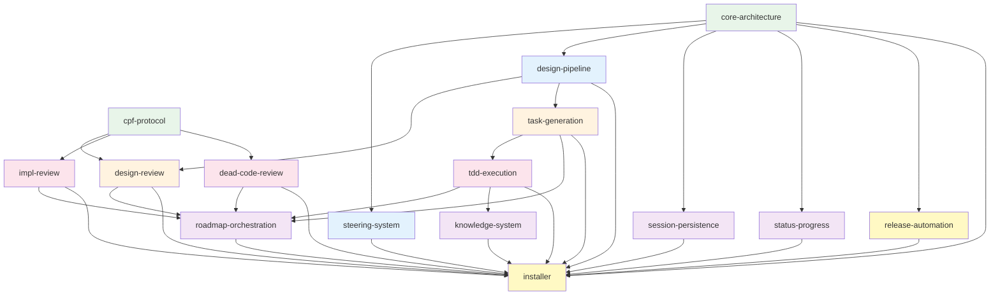

# SDD Framework Roadmap

**Created**: 2026-02-20
**Status**: implementation-complete (retroactive spec creation + v0.18.0 alignment)
**Specs**: 15 | **Waves**: 6

## Wave Overview

### Wave 1: Foundation
基盤となるフレームワークアーキテクチャとエージェント間通信プロトコル。

| Spec | Description | Phase |
|------|-------------|-------|
| `core-architecture` | 3-tier役割定義、phase gate、状態管理、ライフサイクル、Teammate Failure Handling | implementation-complete |
| `cpf-protocol` | Compact Pipe-Delimited Format、Inspector→Auditor通信規約 | implementation-complete |

### Wave 2: Steering & Design
プロジェクトコンテキスト管理と設計生成パイプライン。

| Spec | Description | Phase |
|------|-------------|-------|
| `steering-system` | sdd-steering skill、テンプレート、プロファイル、ステアリング原則 | implementation-complete |
| `design-pipeline` | sdd-design skill、Architect agent、ディスカバリールール、設計テンプレート | implementation-complete |

### Wave 3: Review & Task Decomposition
設計レビューパイプラインとタスク分解。

| Spec | Description | Phase |
|------|-------------|-------|
| `design-review` | sdd-review (design)、6 Inspector + Auditor、design-review rule | implementation-complete |
| `task-generation` | TaskGenerator agent、tasks-generation rule | implementation-complete |

### Wave 4: Execution & Code Review
TDD実装とコードレビューパイプライン。

| Spec | Description | Phase |
|------|-------------|-------|
| `tdd-execution` | sdd-impl (builder phase)、Builder agent、TDD RED→GREEN→REFACTOR | implementation-complete |
| `impl-review` | sdd-review (impl)、6 Inspector + Auditor | implementation-complete |
| `dead-code-review` | sdd-review (dead-code)、4 Inspector + Auditor | implementation-complete |

### Wave 5: Orchestration & Operations
マルチフィーチャーオーケストレーションと運用系機能。

| Spec | Description | Phase |
|------|-------------|-------|
| `roadmap-orchestration` | sdd-roadmap skill、wave scheduling、DAG validation、blocking protocol、auto-fix | implementation-complete |
| `session-persistence` | sdd-handover skill、session.md/decisions.md/buffer.md | implementation-complete |
| `knowledge-system` | sdd-knowledge skill、knowledge templates、skill emergence | implementation-complete |
| `status-progress` | sdd-status skill、phase tracking、impact analysis | implementation-complete |

### Wave 6: Distribution
リリース自動化とインストーラー。

| Spec | Description | Phase |
|------|-------------|-------|
| `release-automation` | sdd-release skill、エコシステム検出、バージョン管理 | implementation-complete |
| `installer` | install.sh、marker-based injection、legacy migration | implementation-complete |

## Dependency Graph

## Execution Flow

全スペックは retroactive (既存実装から逆起こし) のため、フェーズは `implementation-complete`。
今後の改修時は `/sdd-roadmap revise {feature}` で該当スペックを更新し、標準パイプライン (Architect → Review → TaskGen → Builder → Review) を実行。

## Alignment History

### v0.18.0 Retroactive Alignment (2026-02-22)

v0.18.0 の構造変更（Roadmap Router化、ファイルベースレビュー、Agent定義移動、Recovery Protocol廃止）に対し、12 spec の design.md と spec.yaml を Architect 経由で更新。実装は変更なし。

| Spec | Version | Tier | 主な変更 |
|------|---------|------|---------|
| core-architecture | 1.0.0 → 1.1.0 | A | ファイルベースレビュー, Recovery→Teammate Failure Handling |
| design-pipeline | 1.0.0 → 1.1.0 | B | agent パス, コマンド参照 |
| steering-system | 1.0.0 → 1.1.0 | C | コマンド参照 |
| design-review | 1.1.0 → 1.2.0 | A | ファイルベースレビュー, agent パス |
| task-generation | 1.0.0 → 1.1.0 | B | agent パス, コマンド参照 |
| impl-review | 1.0.0 → 1.1.0 | A | ファイルベースレビュー, agent パス |
| dead-code-review | 1.1.0 → 1.2.0 | A | ファイルベースレビュー, agent パス |
| tdd-execution | 1.0.0 → 1.1.0 | B | agent パス, コマンド参照 |
| roadmap-orchestration | 1.0.0 → 1.1.0 | A | Router化, 1-Spec Roadmap, ファイルベースレビュー |
| knowledge-system | 1.0.0 → 1.1.0 | C | コマンド参照 |
| status-progress | 1.0.0 → 1.1.0 | C | コマンド参照 |
| installer | 1.0.0 → 1.1.0 | C | --local flag, agent パス, migration |

未変更: `cpf-protocol` (v1.0.0), `session-persistence` (v1.0.0), `release-automation` (v1.0.0)
