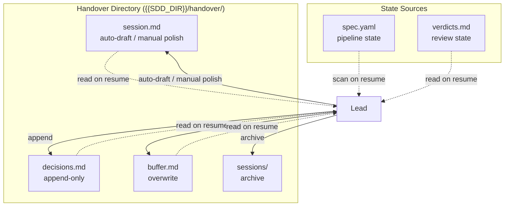
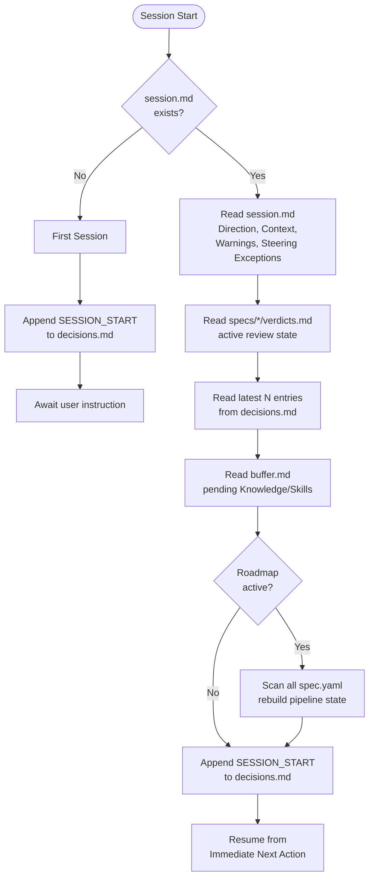
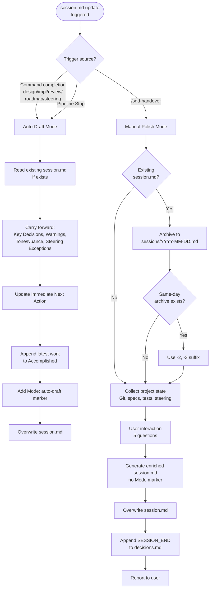

# Session Persistence

## Specifications

### Introduction
セッション永続化システム。Claude Code セッション間のコンテキスト継続性を提供する。3つのファイル（session.md, decisions.md, buffer.md）と1つのアーカイブディレクトリ（sessions/）で構成され、Lead が全ファイルの書き込みを担当する。session.md は auto-draft（自動）と manual polish（`/sdd-handover`）の2モードで更新される。パイプライン状態は spec.yaml が single source of truth であり、handover ファイルには保存しない。

### Spec 1: Session Auto-Draft
**Goal:** コマンド完了毎に session.md を自動更新し、最小限のコンテキストを次セッションに引き継ぐ

**Acceptance Criteria:**
1. design/impl/review/roadmap/steering コマンド完了後に session.md が自動更新される
2. 既存の session.md が存在する場合、Key Decisions, Warnings, Session Context (Tone/Nuance, Steering Exceptions) を carry forward する
3. Immediate Next Action を現在のパイプライン状態に基づいて更新する
4. Accomplished セクションに最新の完了作業を追記する
5. `**Mode**: auto-draft` マーカーを含めて上書きする
6. Pipeline Stop Protocol 実行時も auto-draft が生成される

### Spec 2: Manual Polish (Handover Skill)
**Goal:** `/sdd-handover` によるユーザー対話を通じた高品質なハンドオーバー文書生成

**Acceptance Criteria:**
1. 既存の session.md を `sessions/{YYYY-MM-DD}.md` にアーカイブする
2. 同日アーカイブが存在する場合は `{YYYY-MM-DD}-2.md`, `-3.md` 等のサフィックスを使用する
3. 5つの質問でユーザーコンテキストを収集する: (a) 成果物, (b) 次のアクション, (c) 決定事項・注意事項, (d) トーン・ニュアンス, (e) ステアリングからの意図的逸脱
4. Git 状態、Roadmap/Spec 進捗、テスト結果、ステアリング変更を自動収集する
5. session.md を Mode マーカーなしで上書きする（マーカー不在が manual polish を示す）
6. decisions.md に SESSION_END エントリを追記する
7. ハンドオーバー完了後、ファイル位置・アーカイブ位置・捕捉内容・次セッション自動ロードのリマインダーを報告する

### Spec 3: session.md Format
**Goal:** セッション横断で一貫した構造化フォーマットの定義

**Acceptance Criteria:**
1. ヘッダーに Generated (YYYY-MM-DD), Branch, Session Goal を含む
2. Direction セクションに Immediate Next Action, Active Goals, Key Decisions (前セッション継続 + 今セッション追加), Warnings を含む
3. Session Context セクションに Tone and Nuance, Steering Exceptions を含む
4. Accomplished セクションに作業サマリーと Modified Files を含む
5. Resume Instructions セクションに1-3ステップの再開手順を含む
6. Key Decisions の各項目は decisions.md の D{seq} を参照する

### Spec 4: Decisions Log
**Goal:** append-only の構造化決定ログ

**Acceptance Criteria:**
1. エントリ形式が `[{ISO-8601}] D{seq}: {DECISION_TYPE} | {summary}` に従う
2. 各エントリに Context, Decision, Reason, Impact, Source フィールドを含む
3. STEERING_EXCEPTION タイプには追加の Steering-ref フィールドを含む
4. SESSION_START / SESSION_END タイプでは Reason, Impact フィールドが省略可能
5. 以下の7つの decision type をサポートする: USER_DECISION, STEERING_UPDATE, DIRECTION_CHANGE, ESCALATION_RESOLVED, STEERING_EXCEPTION, SESSION_START, SESSION_END
6. REVISION_INITIATED タイプをサポートする（ユーザー起動の過去 Wave spec 修正）
7. ファイルは append-only であり、既存エントリの上書き・削除は禁止

### Spec 5: Buffer Management
**Goal:** Knowledge Buffer と Skill Candidates の一時データ管理

**Acceptance Criteria:**
1. buffer.md のヘッダーに Updated タイムスタンプを含む
2. Knowledge Buffer セクションに [PATTERN], [INCIDENT], [REFERENCE] タグ付きエントリを含む
3. 各エントリに source 情報（spec, role, task番号）を含む
4. Skill Candidates セクションに候補名、検出元 spec、出現回数を含む
5. Knowledge tag 受信時に buffer.md を上書き更新する
6. Wave 完了時に knowledge/ へ永続化した後、buffer.md をクリアする
7. Lead のみが buffer.md への書き込み権限を持つ（排他制御）

### Spec 6: Session Resume
**Goal:** セッション開始時の状態復元手順

**Acceptance Criteria:**
1. session.md の存在チェックを行い、不在なら初回セッションとしてステップ6にスキップする
2. session.md から Direction, Context, Warnings, Steering Exceptions を読み込む
3. 全 spec の verdicts.md を読み込み、アクティブなレビュー状態（latest batch Tracked）を把握する
4. decisions.md から最新 N 件のエントリを読み込む
5. buffer.md から pending Knowledge/Skill candidates を読み込む
6. Roadmap active 時は全 spec.yaml をスキャンしてパイプライン状態を動的に再構築する
7. decisions.md に SESSION_START を追記する
8. session.md の Immediate Next Action から再開する（初回セッションはユーザー指示を待つ）
9. 新規 Claude Code セッション、conversation compact、`/sdd-handover` resume のいずれでもトリガーされる

### Spec 7: Write Triggers
**Goal:** 各ファイルへの書き込みタイミングの明確な定義

**Acceptance Criteria:**
1. session.md auto-draft: design/impl/review/roadmap/steering コマンド完了時
2. session.md manual polish + decisions.md SESSION_END + sessions/ archive: `/sdd-handover` 実行時
3. decisions.md append: ユーザー決定時、STEERING 変更時、方向変更時
4. buffer.md overwrite: Knowledge tag 受信時
5. buffer.md clear: Wave 完了時（knowledge/ へ flush 後）
6. decisions.md SESSION_START append: セッション開始時

### Non-Goals
- spec.yaml へのパイプライン状態の保存（spec.yaml が single source of truth）
- Knowledge の永続化ロジック（knowledge-system spec のスコープ）
- Steering Feedback Loop の処理（Product Intent spec のスコープ）
- session.md のバージョン管理（sessions/ アーカイブで十分）

## Overview

Session Persistence は SDD フレームワークにおけるセッション横断コンテキスト継続性の基盤である。Lead エージェントが `{{SDD_DIR}}/handover/` ディレクトリ配下の3つのファイルを管理する。

**Purpose**: Claude Code セッション間で方向性、決定事項、警告、トーン/ニュアンスといった非構造的コンテキストを永続化し、次のセッションの Lead がシームレスに作業を再開できるようにする。

**Users**: Lead エージェント（自動書き込み）とユーザー（`/sdd-handover` での manual polish、セッション再開時の自動読み込み）。

**Impact**: パイプライン状態は spec.yaml が管理するため、handover は「対話コンテキスト」に特化する。この分離により、状態の二重管理を回避し、spec.yaml スキャンによる状態再構築と handover ファイルによるコンテキスト復元を独立して行える。

## Architecture

### Architecture Pattern & Boundary Map

Dual-mode write パターン。session.md は auto-draft（Lead が自動生成）と manual polish（`/sdd-handover` でユーザー対話後に生成）の2モードで更新される。decisions.md は append-only ログ。buffer.md は Lead 排他の一時ストレージ。



**Architecture Integration**:
- Selected pattern: File-based persistence with role-exclusive write access
- Domain boundaries: Handover ファイル（対話コンテキスト）と spec.yaml（パイプライン状態）の分離
- Existing patterns preserved: Lead の排他的書き込み権、append-only ログ、CLAUDE.md ベースの振る舞い定義
- New components rationale: sessions/ アーカイブにより manual polish 履歴を保持
- Steering compliance: Lead が全 handover ファイルの唯一のライターであり、並列書き込み競合を回避

### Technology Stack

| Layer | Choice / Version | Role in Feature | Notes |
|-------|------------------|-----------------|-------|
| Storage | Markdown files (`.md`) | 構造化テキストによる永続化 | Human-readable |
| Framework | CLAUDE.md | 振る舞い定義（auto-draft, resume, triggers） | Framework core |
| Skill | sdd-handover SKILL.md | Manual polish UI | User-facing |
| Archive | sessions/ directory | 日付ベースの session.md 履歴 | `/sdd-handover` 時のみ |

## System Flows

### Session Resume Flow

セッション開始時（新規セッション、conversation compact、`/sdd-handover` resume）の状態復元フロー。



### Auto-Draft vs Manual Polish Decision

session.md の更新モード選択フロー。



### Write Trigger Flow

各トリガーからファイルへの書き込みマッピング。

```mermaid
flowchart LR
    subgraph Triggers
        CMD[Command completion]
        HO[/sdd-handover]
        UD[User decision]
        SC[STEERING change]
        DC[Direction change]
        KT[Knowledge tag received]
        WC[Wave completion]
        SS[Session start]
    end

    subgraph Files
        SM[session.md]
        DM[decisions.md]
        BM[buffer.md]
        SA[sessions/ archive]
    end

    CMD -->|auto-draft| SM
    HO -->|manual polish| SM
    HO -->|SESSION_END| DM
    HO -->|archive| SA
    UD -->|append| DM
    SC -->|append| DM
    DC -->|append| DM
    KT -->|overwrite| BM
    WC -->|clear after flush| BM
    SS -->|SESSION_START| DM
```

## Specifications Traceability

| Specification | Summary | Components | Interfaces | Flows |
|--------------|---------|------------|------------|-------|
| Spec 1 | Session auto-draft | CLAUDE.md (Handover section) | Lead write | Auto-Draft flow |
| Spec 2 | Manual polish | sdd-handover SKILL.md | User interaction + Lead write | Manual Polish flow |
| Spec 3 | session.md format | CLAUDE.md (session.md Format) | Markdown structure | - |
| Spec 4 | Decisions log | CLAUDE.md (decisions.md Format, decisions.md Recording) | Append-only write | - |
| Spec 5 | Buffer management | CLAUDE.md (buffer.md Format, Knowledge Auto-Accumulation) | Lead exclusive write | - |
| Spec 6 | Session resume | CLAUDE.md (Session Resume) | Multi-file read + spec.yaml scan | Session Resume flow |
| Spec 7 | Write triggers | CLAUDE.md (Write Triggers) | Event-driven write | Write Trigger flow |

## Components and Interfaces

| Component | Domain/Layer | Intent | Files |
|-----------|--------------|--------|-------|
| CLAUDE.md (Handover section) | Framework | Auto-draft, resume, triggers, format定義 | `framework/claude/CLAUDE.md` |
| sdd-handover skill | Skill | Manual polish UI + アーカイブ | `framework/claude/skills/sdd-handover/SKILL.md` |
| session.md | Artifact | セッションコンテキスト（方向性、決定、警告、ニュアンス） | `{{SDD_DIR}}/handover/session.md` |
| decisions.md | Artifact | Append-only 決定ログ | `{{SDD_DIR}}/handover/decisions.md` |
| buffer.md | Artifact | Knowledge Buffer + Skill candidates 一時データ | `{{SDD_DIR}}/handover/buffer.md` |
| sessions/ | Archive | session.md の日付ベース履歴 | `{{SDD_DIR}}/handover/sessions/` |

### Framework Layer

#### CLAUDE.md Handover Section

| Field | Detail |
|-------|--------|
| Intent | Session Persistence の全振る舞いを定義（auto-draft, resume, triggers, format） |
| Requirements | Spec 1, 3, 4, 5, 6, 7 |

**Responsibilities & Constraints**
- session.md の auto-draft 手順（6ステップ）を定義
- Session Resume 手順（7ステップ）を定義
- Write Triggers テーブルを定義
- decisions.md / buffer.md のフォーマットを定義
- パイプライン状態は spec.yaml に委譲（handover には保存しない）

**Dependencies**
- Inbound: Lead エージェント — 全 handover ファイルの読み書きを実行 (P0)
- Inbound: spec.yaml — パイプライン状態の source of truth (P0)
- Inbound: verdicts.md — レビュー状態の読み込み (P1)
- Outbound: Knowledge system — buffer.md から knowledge/ への flush (P1)

### Skill Layer

#### sdd-handover Skill

| Field | Detail |
|-------|--------|
| Intent | ユーザー対話によるセッションハンドオーバー文書の manual polish |
| Requirements | Spec 2 |

**Responsibilities & Constraints**
- 5ステップの対話プロセス（状態収集 → ユーザー質問 → 文書生成 → ファイル書き込み → 報告）
- アーカイブ管理（同日重複時のサフィックス付与）
- SESSION_END の decisions.md 追記
- Mode マーカーなし（manual polish の識別子）

**Dependencies**
- Inbound: Git 状態、spec.yaml、テスト結果、ステアリング — 自動収集対象 (P1)
- Inbound: 既存 session.md — carry forward 元 (P1)
- Outbound: session.md — 上書き (P0)
- Outbound: decisions.md — SESSION_END 追記 (P0)
- Outbound: sessions/ — アーカイブ (P0)

## Data Models

### session.md Structure

```markdown
# Session Handover
**Generated**: {YYYY-MM-DD}
**Branch**: {branch}
**Session Goal**: {confirmed with user}

## Direction
### Immediate Next Action
{specific command or step}

### Active Goals
{progress toward objectives -- table or bullet list, independent of roadmap}

### Key Decisions
**Continuing from previous sessions:**
{numbered list -- decision + brief rationale, ref decisions.md for details}

**Added this session:**
{same format}

### Warnings
{constraints, risks, caveats for the next Lead}

## Session Context
### Tone and Nuance
{user's temperature, direction nuances}

### Steering Exceptions
{intentional deviations from steering best practices -- reason + decisions.md ref}

## Accomplished
{work completed this session}

### Modified Files
{file list}

## Resume Instructions
{1-3 steps for next session startup}
```

**Mode Marker Rules:**
- auto-draft: `**Mode**: auto-draft` を含む
- manual polish: Mode マーカーなし（不在が manual polish を示す）

### decisions.md Entry Structure

```
[{ISO-8601}] D{seq}: {DECISION_TYPE} | {summary}
- Context: {triggering context}
- Decision: {what was decided}
- Reason: {why this decision was made}
- Impact: {expected impact}
- Source: {who/what initiated}
- Steering-ref: {reference to steering document}  # STEERING_EXCEPTION only
```

**Decision Types:**

| Type | Trigger | Reason/Impact Required |
|------|---------|----------------------|
| `USER_DECISION` | ユーザーが明示的な選択をした時 | Yes |
| `STEERING_UPDATE` | ステアリングが変更された時 | Yes |
| `DIRECTION_CHANGE` | Spec分割、Wave再構成、スコープ変更 | Yes |
| `ESCALATION_RESOLVED` | エスカレーションの結果 | Yes |
| `STEERING_EXCEPTION` | ステアリングからの意図的逸脱 | Yes + Steering-ref |
| `REVISION_INITIATED` | ユーザー起動の過去Wave spec修正 | Yes |
| `SESSION_START` | セッション開始 | Optional |
| `SESSION_END` | `/sdd-handover` 実行 | Optional |

### buffer.md Structure

```markdown
# Handover Buffer
**Updated**: {timestamp}

## Knowledge Buffer
- [PATTERN] {description} (source: {spec} {role}, task {N})
- [INCIDENT] {description} (source: {spec} {role}, task {N})
- [REFERENCE] {description} (source: {spec} {role}, task {N})

## Skill Candidates
- **{name}**: Detected in {specs} ({N} occurrences)
```

**Write Semantics:**
- Knowledge Buffer: Builder/Inspector の completion report から Lead が抽出して追記
- Skill Candidates: 同カテゴリの [PATTERN] が2件以上になったら Lead が自動追加
- Wave 完了時: knowledge/ へ flush → buffer.md クリア

### Write Triggers Table

| Trigger | Target File | Write Mode | Notes |
|---------|-------------|------------|-------|
| Command completion (design/impl/review/roadmap/steering) | session.md | auto-draft (overwrite) | Carry forward + update Next Action/Accomplished |
| `/sdd-handover` | session.md | manual polish (overwrite) | User interaction enrichment |
| `/sdd-handover` | decisions.md | append | SESSION_END entry |
| `/sdd-handover` | sessions/ | archive | Dated copy of previous session.md |
| User decision | decisions.md | append | USER_DECISION with Reason |
| STEERING change | decisions.md | append | STEERING_UPDATE with Reason |
| Direction change | decisions.md | append | DIRECTION_CHANGE with Reason |
| Knowledge tag received | buffer.md | overwrite | Tag extraction from completion report |
| Wave completion (knowledge flush) | buffer.md | overwrite (clear) | After flush to knowledge/ |
| Session start | decisions.md | append | SESSION_START |

## Error Handling

### Error Strategy

| Scenario | Handling | Recovery |
|----------|----------|----------|
| session.md 不在（初回セッション） | Resume ステップ1で検出、ステップ6にスキップ | ユーザー指示を待つ |
| decisions.md 不在 | SESSION_END/SESSION_START を最初のエントリとして作成 | 自動作成 |
| buffer.md 不在 | 読み込みスキップ | 次の Knowledge tag 受信時に新規作成 |
| Git リポジトリ不在 | `/sdd-handover` の Git 状態セクションをスキップ | 部分的な handover を生成 |
| アクティブ spec 不在 | 利用可能なコンテキストで handover を生成 | 部分的な handover |
| 同日アーカイブ重複 | サフィックス付与（-2, -3, ...） | 自動対応 |

## Testing Strategy

### Acceptance Verification

本 spec はフレームワークの振る舞い定義（CLAUDE.md + SKILL.md）であり、従来のユニットテストは適用されない。検証は以下の観点で行う:

- **Format Compliance**: session.md, decisions.md, buffer.md が定義されたフォーマットに従っているか
- **Write Trigger Compliance**: 各トリガーで正しいファイルに正しいモードで書き込まれるか
- **Resume Procedure Compliance**: 7ステップの resume 手順が正しく実行されるか
- **Archive Integrity**: `/sdd-handover` 実行時にアーカイブが正しく生成されるか
- **Append-Only Invariant**: decisions.md が上書きされないこと
- **Mode Marker Invariant**: auto-draft は `**Mode**: auto-draft` を含み、manual polish は含まない
