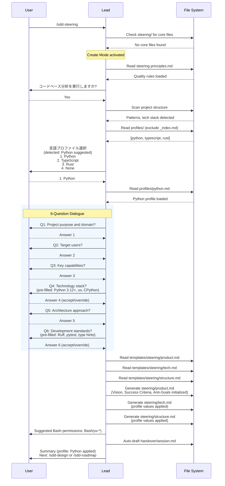
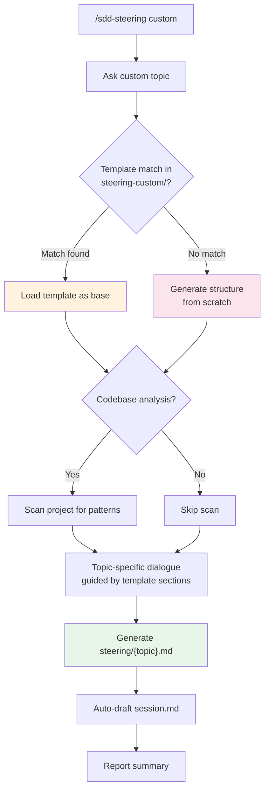
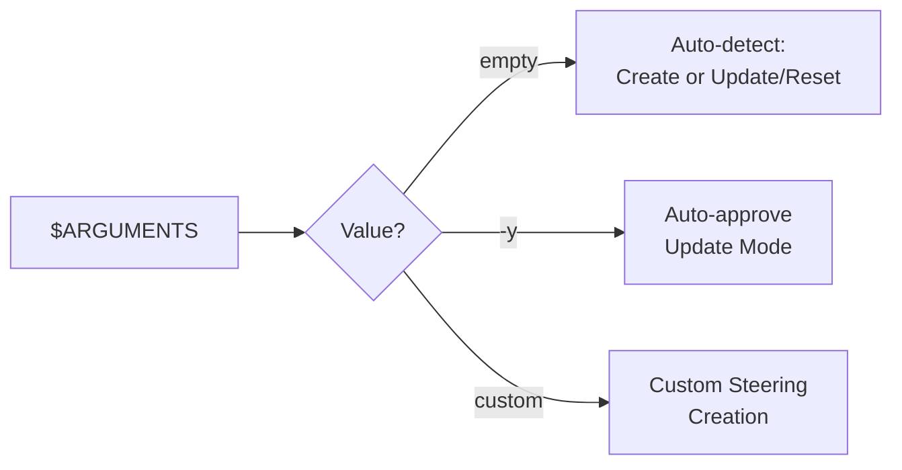

# Steering System

## Specifications

### Introduction

プロジェクトワイドのコンテキスト管理システム。ステアリングドキュメント（product.md, tech.md, structure.md + カスタムファイル）の作成・更新・リセット・カスタム追加を Lead が直接ハンドルする対話型システム。Teammate 委任なし — ユーザーとの対話が必要なため Lead が直接操作する。

ステアリングファイルは「プロジェクトメモリ」として機能し、仕様書（specification）ではない。新しいコードが既存パターンに従う場合、ステアリング更新は不要という Golden Rule に基づく。

### Spec 1: Steering Creation Flow
**Goal:** 6 つの質問による対話的なステアリング生成。コードベース分析と言語プロファイル選択を経て、3 つのコアファイルを生成する。

**Acceptance Criteria:**
1. ステアリングディレクトリ (`{{SDD_DIR}}/project/steering/`) にコアファイル（product.md, tech.md, structure.md）が存在しない場合、Create Mode が自動的に開始される
2. コードベース分析オプション（scan project structure, extract patterns, tech stack）がユーザーに提示され、選択可能である
3. 言語プロファイル選択が提示される: `{{SDD_DIR}}/settings/profiles/` 配下の利用可能プロファイル（`_index.md` を除外）+ "None (fully manual)" オプション
4. コードベース分析で言語が検出された場合、該当プロファイルがサジェストされる
5. 6 つの質問が対話形式で提示される: (1) Project purpose and domain, (2) Target users, (3) Key capabilities, (4) Technology stack, (5) Architecture approach, (6) Development standards
6. プロファイル選択時、質問 (4) と (6) の回答がプロファイル値でプリフィルされ、ユーザーはオーバーライド可能
7. ステアリングファイルは `{{SDD_DIR}}/settings/templates/steering/` 配下のテンプレート（product.md, tech.md, structure.md）から生成される
8. プロファイル選択時、プロファイルの Suggested Permissions セクションに基づき `settings.json` への Bash permissions 推奨が通知される
9. product.md の User Intent セクション（Vision, Success Criteria, Anti-Goals）が対話結果から初期化される
10. 生成完了後、サマリーが表示され、適用されたプロファイル情報が含まれる

### Spec 2: Steering Update/Reset Flow
**Goal:** 既存ステアリングの対話的な更新またはリセット（全削除+再作成）

**Acceptance Criteria:**
1. コアステアリングファイルが存在する場合、Update/Reset Mode が自動的に開始される
2. 既存ステアリングファイルからステータスサマリーが構築・表示される
3. ユーザーに 2 つの選択肢が提示される: Update（対話的な変更）と Reset（全削除+再作成）
4. Update 選択時、変更対象の選択肢が提示される: Product / Tech / Structure / Profile / Everything
5. "Profile" 選択時、プロファイル選択フローが再実行され、tech.md / structure.md が更新される
6. Reset 選択時、"RESET" 文字列による確認が要求される
7. Reset 確認後、全ステアリングファイルが削除され、Create Mode（Spec 1）が実行される
8. 更新完了後、`{{SDD_DIR}}/handover/session.md` が auto-draft される
9. `-y` 引数指定時、Auto-approve update mode として動作する

### Spec 3: Custom Steering Flow
**Goal:** プロジェクト固有のカスタムステアリングファイル（API standards, security 等）の作成

**Acceptance Criteria:**
1. `custom` 引数で Custom Mode が開始される
2. カスタムステアリングのトピックがユーザーに質問される（サジェスト: API standards, testing, security, DB, auth 等）
3. `{{SDD_DIR}}/settings/templates/steering-custom/` 配下のテンプレートとマッチングが行われる（7 テンプレート: api-standards, authentication, database, deployment, error-handling, security, testing）
4. テンプレートマッチ時、そのテンプレートがベース構造として使用され、セクションがプリフィルされる
5. テンプレート不一致時、ゼロから構造が生成される
6. オプションのコードベース分析が提供される
7. テンプレートセクションに基づくトピック固有の対話が実行される
8. カスタムステアリングファイルが `{{SDD_DIR}}/project/steering/{topic}.md` として生成される

### Spec 4: Steering Principles Enforcement
**Goal:** ステアリング品質基準の定義と適用

**Acceptance Criteria:**
1. Golden Rule が適用される: 「新しいコードが既存パターンに従う場合、ステアリング更新は不要」
2. 文書化対象が適切に制限される: 組織パターン、命名規則、インポート戦略、アーキテクチャ決定、技術標準のみ
3. 避けるべき内容が排除される: 完全ファイルリスト、全コンポーネント記述、全依存関係、実装詳細、エージェント固有ツールディレクトリ
4. セキュリティルールが適用される: API キー、パスワード、認証情報、DB URL、内部 IP、シークレットが含まれない
5. 品質基準が遵守される: 単一ドメイン/ファイル、具体例付き、根拠説明、100-200 行が目安
6. 更新時の保全ルールが適用される: ユーザーセクション保持、追加優先（additive by default）、`updated_at` タイムスタンプ追加、変更理由の記録
7. ファイル固有のフォーカスが維持される: product.md は目的・価値・ビジネスコンテキスト、tech.md は主要フレームワーク・標準・規約、structure.md は組織パターン・命名ルール
8. `.claude/sdd/project/specs/` と `.claude/sdd/project/steering/` への軽い参照は許可、その他の `.claude/sdd/` 内部ディレクトリへの言及は回避

### Spec 5: Language Profile System
**Goal:** 言語固有の推奨設定をプロファイルで提供し、ステアリング作成を効率化する

**Acceptance Criteria:**
1. Python, TypeScript, Rust の 3 プロファイルが `{{SDD_DIR}}/settings/profiles/` に存在する
2. 各プロファイルが以下のセクションを定義する: Core Technologies (Language, Package Manager, Runtime), Development Standards (Type Safety, Code Quality, Testing), Structure Conventions (Naming, Import Organization, Module Structure), Common Commands, Suggested Permissions
3. プロファイルインデックス (`_index.md`) がプロファイルシステムの仕組みを説明する
4. プロファイル選択時、tech.md と structure.md に対応する値がプリフィルされる（type safety, code quality, testing, naming, imports, commands）
5. プリフィル値はユーザーがオーバーライド可能（プロファイルは starting point であり制約ではない）
6. 選択されたプロファイル識別子（python, typescript, rust）が `spec.yaml.language` に保存される
7. Python プロファイルは uv を必須とし、`pyproject.toml`、Ruff、pytest を推奨する
8. TypeScript プロファイルは strict mode、ESLint/Prettier または Biome、Vitest/Jest を推奨する
9. Rust プロファイルは clippy、rustfmt、cargo test を推奨する
10. カスタムプロファイル作成が可能（既存プロファイルをコピーして修正）
11. フレームワーク固有プロファイル（Django, Next.js 等）がベース言語プロファイルを拡張可能
12. Version Management セクションが各プロファイルに含まれる（Python: hatch-vcs, TypeScript: package.json, Rust: Cargo.toml）

### Spec 6: Post-Completion Actions
**Goal:** ステアリング操作完了後の標準アクション実行

**Acceptance Criteria:**
1. 操作完了後、`{{SDD_DIR}}/handover/session.md` が auto-draft される
2. サマリーがユーザーに報告される
3. 次のアクションが提案される: `/sdd-design "description"` または `/sdd-roadmap`

### Spec 7: Error Handling
**Goal:** ステアリング操作中のエラーに対する適切な処理

**Acceptance Criteria:**
1. テンプレートファイルが見つからない場合、警告を出しインライン基本構造で代替する
2. ステアリングディレクトリが存在しない場合、自動的に作成される

### Non-Goals
- ステアリングのバージョン管理（spec.yaml で管理するのは spec のみ）
- ステアリング間の依存関係解析
- ステアリングファイルの自動マージ（常にユーザー対話を経由）
- カスタムプロファイルの自動検出（手動作成のみ）
- Teammate への委任（Lead が直接操作する）

## Overview

**Purpose**: Steering System は、SDD フレームワーク内でプロジェクトワイドのコンテキスト（技術スタック、アーキテクチャパターン、開発標準、プロダクトビジョン）を構造化されたドキュメントとして管理する。これにより、Architect / Builder / Inspector / Auditor がプロジェクトの文脈を正確に理解し、一貫性のある設計・実装・レビューを実現する。

**Users**: Lead エージェントが直接操作し、プロジェクトのユーザー（人間の開発者）と対話しながらステアリングを構築する。生成されたステアリングファイルは全エージェント（T1/T2/T3）がプロジェクトメモリとして参照する。Auditor は特に product.md の User Intent セクションを全レビューで参照し、アラインメント・過剰設計・スペック構造のチェックに使用する。

**Impact**: ステアリングは SDD ワークフローの Stage 0（最初のステップ）に位置し、後続の全フェーズ（design, implementation, review）の品質と一貫性に直接影響する。Steering Feedback Loop により、レビュー結果からステアリングが動的に更新される（CODIFY / PROPOSE メカニズム）。

## Architecture

### Architecture Pattern & Boundary Map

```mermaid
graph TD
    subgraph "Skill Layer"
        SKILL[sdd-steering SKILL.md]
    end

    subgraph "Rules Layer"
        PRINC[steering-principles.md]
    end

    subgraph "Template Layer"
        subgraph "Core Templates"
            TPL_P[product.md template]
            TPL_T[tech.md template]
            TPL_S[structure.md template]
        end
        subgraph "Custom Templates x7"
            TPL_API[api-standards.md]
            TPL_AUTH[authentication.md]
            TPL_DB[database.md]
            TPL_DEPLOY[deployment.md]
            TPL_ERR[error-handling.md]
            TPL_SEC[security.md]
            TPL_TEST[testing.md]
        end
    end

    subgraph "Profile Layer"
        IDX[_index.md]
        PROF_PY[python.md]
        PROF_TS[typescript.md]
        PROF_RS[rust.md]
    end

    subgraph "Output - per project"
        OUT_P[steering/product.md]
        OUT_T[steering/tech.md]
        OUT_S[steering/structure.md]
        OUT_C["steering/{custom}.md"]
    end

    SKILL -->|reads| PRINC
    SKILL -->|uses| TPL_P & TPL_T & TPL_S
    SKILL -->|matches| TPL_API & TPL_AUTH & TPL_DB & TPL_DEPLOY & TPL_ERR & TPL_SEC & TPL_TEST
    SKILL -->|selects| PROF_PY & PROF_TS & PROF_RS
    IDX -->|documents| PROF_PY & PROF_TS & PROF_RS
    SKILL -->|generates| OUT_P & OUT_T & OUT_S & OUT_C
    PROF_PY & PROF_TS & PROF_RS -->|pre-fills| OUT_T & OUT_S
```



**Architecture Integration**:
- **Selected pattern**: Template-based generation with interactive dialogue. ステアリングは単一の Skill ファイルがエントリポイントとなり、ルール・テンプレート・プロファイルの 3 層を参照して対話的にドキュメントを生成する
- **Domain boundaries**: Skill Layer（操作ロジック）、Rules Layer（品質基準）、Template Layer（構造テンプレート）、Profile Layer（言語固有デフォルト）の 4 層に分離
- **Existing patterns preserved**: SDD フレームワークの Lead 直接操作パターン（Teammate 委任なし）、テンプレートベース生成、settings/ 配下のルール・テンプレート配置
- **New components rationale**: 各テンプレートはステアリング作成の品質と一貫性を保証するために必要。プロファイルは言語固有のベストプラクティスを体系化し、ステアリング作成を効率化する

### Technology Stack

| Layer | Choice / Version | Role in Feature | Notes |
|-------|------------------|-----------------|-------|
| Skill | SKILL.md (Claude Code Skill format) | エントリポイント、対話ロジック定義 | Lead が直接実行 |
| Rules | Markdown (steering-principles.md) | 品質基準、制約定義 | 全ステアリング操作で参照 |
| Templates | Markdown (10 files) | 構造テンプレート | Core 3 + Custom 7 |
| Profiles | Markdown (3 files + index) | 言語固有デフォルト値 | Python / TypeScript / Rust |
| Output | Markdown (per project) | 生成されたステアリングファイル | `project/steering/` 配下 |

## System Flows

### Steering Creation Flow (Create Mode)



### Update/Reset Decision Flow

```mermaid
flowchart TD
    A[/sdd-steering] --> B{Core files exist?}
    B -->|No| C[Create Mode<br/>See Creation Flow]
    B -->|Yes| D[Build status summary]

    D --> E{User choice}
    E -->|Update| F{Update target?}
    E -->|Reset| G[Require RESET confirmation]

    F -->|Product| H[Product dialogue]
    F -->|Tech| I[Tech dialogue]
    F -->|Structure| J[Structure dialogue]
    F -->|Profile| K[Re-run profile selection]
    F -->|Everything| L[Full update dialogue]

    H --> M[Apply changes<br/>Preserve user sections]
    I --> M
    J --> M
    K --> N[Update tech.md + structure.md<br/>from new profile]
    L --> M

    G --> O{User types RESET?}
    O -->|No| P[Cancel]
    O -->|Yes| Q[Delete all steering files]
    Q --> C

    M --> R[Auto-draft session.md]
    N --> R
    R --> S[Report summary]

    style C fill:#e8f5e9
    style Q fill:#ffebee
    style R fill:#e3f2fd
```

### Custom Steering Flow



### Argument Routing



## Specifications Traceability

| Specification | Summary | Components | Key Files |
|--------------|---------|------------|-----------|
| Spec 1 | Steering Creation Flow | sdd-steering skill, core templates, profiles | SKILL.md, steering/*.md templates, profiles/*.md |
| Spec 2 | Update/Reset Flow | sdd-steering skill, core templates, profiles | SKILL.md, steering/*.md templates |
| Spec 3 | Custom Steering | sdd-steering skill, custom templates | SKILL.md, steering-custom/*.md |
| Spec 4 | Principles Enforcement | steering-principles rule | steering-principles.md |
| Spec 5 | Language Profile System | profile files, profile index | profiles/*.md, _index.md |
| Spec 6 | Post-Completion Actions | sdd-steering skill | SKILL.md |
| Spec 7 | Error Handling | sdd-steering skill | SKILL.md |

## Components and Interfaces

| Component | Domain/Layer | Intent | Spec Coverage | Files |
|-----------|--------------|--------|---------------|-------|
| sdd-steering skill | Skill | ステアリング操作のエントリポイント・対話ロジック | 1, 2, 3, 6, 7 | `framework/claude/skills/sdd-steering/SKILL.md` |
| steering-principles | Rule | ステアリング品質基準・制約定義 | 4 | `framework/claude/sdd/settings/rules/steering-principles.md` |
| product.md template | Core Template | Product Overview の構造テンプレート | 1 | `framework/claude/sdd/settings/templates/steering/product.md` |
| tech.md template | Core Template | Technology Stack の構造テンプレート | 1 | `framework/claude/sdd/settings/templates/steering/tech.md` |
| structure.md template | Core Template | Project Structure の構造テンプレート | 1 | `framework/claude/sdd/settings/templates/steering/structure.md` |
| api-standards template | Custom Template | API 設計パターンのテンプレート | 3 | `framework/claude/sdd/settings/templates/steering-custom/api-standards.md` |
| authentication template | Custom Template | 認証・認可パターンのテンプレート | 3 | `framework/claude/sdd/settings/templates/steering-custom/authentication.md` |
| database template | Custom Template | DB 設計・クエリパターンのテンプレート | 3 | `framework/claude/sdd/settings/templates/steering-custom/database.md` |
| deployment template | Custom Template | デプロイメントパターンのテンプレート | 3 | `framework/claude/sdd/settings/templates/steering-custom/deployment.md` |
| error-handling template | Custom Template | エラーハンドリングパターンのテンプレート | 3 | `framework/claude/sdd/settings/templates/steering-custom/error-handling.md` |
| security template | Custom Template | セキュリティパターンのテンプレート | 3 | `framework/claude/sdd/settings/templates/steering-custom/security.md` |
| testing template | Custom Template | テスト戦略パターンのテンプレート | 3 | `framework/claude/sdd/settings/templates/steering-custom/testing.md` |
| Python profile | Profile | Python 言語固有の推奨設定 | 5 | `framework/claude/sdd/settings/profiles/python.md` |
| TypeScript profile | Profile | TypeScript 言語固有の推奨設定 | 5 | `framework/claude/sdd/settings/profiles/typescript.md` |
| Rust profile | Profile | Rust 言語固有の推奨設定 | 5 | `framework/claude/sdd/settings/profiles/rust.md` |
| Profile index | Profile | プロファイルシステムの仕組み説明 | 5 | `framework/claude/sdd/settings/profiles/_index.md` |

### Skill Layer

#### sdd-steering SKILL.md

| Field | Detail |
|-------|--------|
| Intent | ステアリング操作（create/update/reset/custom）の全フローを制御するエントリポイント |
| Requirements | Spec 1, 2, 3, 6, 7 |

**Responsibilities & Constraints**
- 3 つのモード（Create/Update-Reset/Custom）を引数とステアリング状態から自動判定
- ユーザーとの対話（6 つの質問）を経てステアリングファイルを生成
- Lead が直接操作 — Teammate への委任は禁止
- 操作前に必ず steering-principles.md を読み込み、品質基準を適用

**Dependencies**
- Inbound: Lead agent — `/sdd-steering` コマンド実行 (P0)
- Outbound: steering-principles.md — 品質基準参照 (P0)
- Outbound: Core templates (product/tech/structure) — 構造テンプレート (P0)
- Outbound: Custom templates (7 files) — カスタムステアリング構造 (P1)
- Outbound: Language profiles (3 + index) — 言語固有デフォルト (P1)
- Outbound: handover/session.md — auto-draft 出力 (P1)

**Contracts**: Service [x]

##### Service Interface
```
SteeringSkill:
  detect_mode(arguments: string) -> Mode{Create|UpdateReset|Custom}
  check_steering_state(steering_dir: Path) -> SteeringState{exists: bool, core_files: list, custom_files: list}
  create_steering(dialogue_answers: Answers, profile: Profile?) -> SteeringFiles
  update_steering(target: UpdateTarget, changes: Changes) -> SteeringFiles
  reset_steering(confirmation: string) -> Result<void, Error>
  create_custom(topic: string, template: Template?, dialogue: Answers) -> CustomFile
```
- Preconditions: Lead agent context, `{{SDD_DIR}}` path resolved
- Postconditions: ステアリングファイルが `project/steering/` に生成/更新、session.md が auto-draft
- Invariants: steering-principles.md のルールが常に適用される

### Rules Layer

#### steering-principles.md

| Field | Detail |
|-------|--------|
| Intent | ステアリングファイルの品質基準と制約を定義 |
| Requirements | Spec 4 |

**Responsibilities & Constraints**
- Content Granularity: パターン文書化を推奨、詳細リスト化を禁止
- Security: 機密情報（API keys, passwords, DB URLs）の排除
- Quality Standards: 単一ドメイン/ファイル、具体例、根拠、100-200 行目安
- Preservation: 更新時のユーザーセクション保持、追加優先

**Implementation Notes**
- Golden Rule: 「新しいコードが既存パターンに従う場合、ステアリング更新は不要」
- Bad/Good の比較例を含み、期待されるスタイルを明示
- ファイル固有のフォーカス指針を提供（product.md: 目的/価値、tech.md: 標準/規約、structure.md: パターン/命名）

### Template Layer

#### Core Templates (product.md, tech.md, structure.md)

| Field | Detail |
|-------|--------|
| Intent | ステアリング作成時の構造的な出発点を提供 |
| Requirements | Spec 1 |

**Responsibilities & Constraints**
- product.md template: Product Overview, User Intent (Vision/Success Criteria/Anti-Goals), Spec Rationale, Decision Log の構造を定義
- tech.md template: Architecture, Core Technologies, Key Libraries, Development Standards (Type Safety/Code Quality/Testing), Development Environment, Common Commands, Key Technical Decisions の構造を定義
- structure.md template: Organization Philosophy, Directory Patterns, Naming Conventions, Import Organization, Code Organization Principles の構造を定義
- テンプレートは starting point であり、カスタマイズが前提

**Implementation Notes**
- product.md の末尾注記: 「Lead updates this file as user intent evolves. Auditor references it during every review.」
- tech.md の末尾注記: 「Document standards and patterns, not every dependency」
- structure.md の末尾注記: 「Document patterns, not file trees. New files following patterns shouldn't require updates」

#### Custom Templates (7 files)

| Field | Detail |
|-------|--------|
| Intent | 専門領域ごとのカスタムステアリング作成時の構造テンプレート |
| Requirements | Spec 3 |

**Templates and Coverage:**

| Template | Sections | Key Patterns |
|----------|----------|-------------|
| api-standards.md | Philosophy, Endpoint Pattern, Request/Response, Status Codes, Authentication, Versioning, Pagination/Filtering | RESTful resource-oriented design, canonical error shape |
| authentication.md | Philosophy, Authentication (Method/Flow/Lifecycle/Security), Authorization (Model/Checks/Ownership), Passwords & MFA, API-to-API Auth | AuthN/AuthZ separation, token lifecycle, RBAC/ABAC |
| database.md | Philosophy, Naming & Types, Relationships, Migrations, Query Patterns, Connection & Transactions, Data Integrity, Backup & Recovery | Domain-first modeling, immutable migrations |
| deployment.md | Philosophy, Environments, CI/CD Flow, Deployment Strategies, Zero-Downtime, Rollback, Configuration & Secrets, Health & Monitoring, Incident Response | Rolling/Blue-Green/Canary, 12-factor config |
| error-handling.md | Philosophy, Classification, Error Shape, Propagation, Logging, Retry, Monitoring & Health | Canonical error format, exponential backoff |
| security.md | Philosophy, Input & Output, Authentication & Authorization, Secrets & Configuration, Sensitive Data, Session/Token Security, Logging, Headers & Transport, Vulnerability Posture | Defense in depth, least privilege, fail closed |
| testing.md | Philosophy, Organization, Test Types, Structure (AAA), Mocking & Data, Coverage | Behavior-first testing, minimal mocks |

**Implementation Notes**
- 全テンプレートが末尾に「Focus on patterns and decisions, not [specific exclusion]」の注記を持つ
- steering-principles.md と同じ粒度原則に従う
- テンプレート内の `[...]` プレースホルダーは対話で置換される

### Profile Layer

#### Language Profiles (Python / TypeScript / Rust)

| Field | Detail |
|-------|--------|
| Intent | 言語固有の推奨設定を体系化し、ステアリング作成を効率化 |
| Requirements | Spec 5 |

**Profile Structure (共通):**

| Section | Pre-fills to | Description |
|---------|-------------|-------------|
| Core Technologies | tech.md Core Technologies | Language, Package Manager, Runtime |
| Development Standards | tech.md Development Standards | Type Safety, Code Quality, Testing |
| Structure Conventions | structure.md | Naming, Import Organization, Module Structure |
| Common Commands | tech.md Common Commands | Dev, Build, Test, Lint, Format |
| Suggested Permissions | User notification | `settings.json` Bash permissions |
| Version Management | tech.md | バージョン管理手法 |

**Profile-Specific Values:**

| Aspect | Python | TypeScript | Rust |
|--------|--------|------------|------|
| Language | Python 3.12+ | TypeScript 5.x | Rust (latest stable) |
| Package Manager | uv (required) | npm / pnpm / bun | Cargo |
| Runtime | CPython | Node.js 20+ | Native (compiled) |
| Type Safety | Type hints required | Strict mode, no `any` | Compiler-enforced |
| Linter/Formatter | Ruff | ESLint + Prettier / Biome | clippy + rustfmt |
| Test Framework | pytest | Vitest / Jest | cargo test |
| File Naming | `snake_case.py` | `camelCase.ts` / `kebab-case.ts` | `snake_case.rs` |
| Permissions | `Bash(uv:*)` | `Bash(npm:*)` `Bash(npx:*)` etc. | `Bash(cargo:*)` `Bash(rustup:*)` etc. |
| Version Mgmt | hatch-vcs / setuptools-scm | package.json `version` | Cargo.toml `version` |

**Implementation Notes**
- Python profile は uv を必須とし、`[dependency-groups]` (PEP 735) による dev dependency 管理を推奨
- Python profile は `pyproject.toml` の設定例を含む
- TypeScript profile はファイル命名の選択（camelCase vs kebab-case）をプロジェクト単位で統一することを推奨
- Rust profile は `unsafe` ブロックの最小化とコメントによる正当化を推奨

#### Profile Index (_index.md)

| Field | Detail |
|-------|--------|
| Intent | プロファイルシステム全体の仕組みとフォーマットを説明 |
| Requirements | Spec 5 |

**Responsibilities & Constraints**
- プロファイルの適用フロー説明（提示 → 選択 → プリフィル → カスタマイズ）
- プロファイルフォーマット仕様（必須セクション一覧）
- カスタムプロファイル作成ガイド
- フレームワーク固有プロファイルの拡張方法

## Error Handling

### Error Strategy

ステアリングシステムはファイルベースの操作であるため、エラーは主にファイルシステム関連。回復可能なエラーには代替パスを提供し、ユーザー操作を中断しない。

### Error Categories and Responses

| Error | Category | Response | Recovery |
|-------|----------|----------|----------|
| テンプレートファイル欠損 | File System | 警告を表示 | インライン基本構造で代替 |
| ステアリングディレクトリ欠損 | File System | サイレント回復 | ディレクトリを自動作成 |
| プロファイルファイル欠損 | File System | プロファイル一覧から除外 | "None" オプションで続行可能 |
| Reset 確認不一致 | User Input | 操作キャンセル | ユーザーに再入力を促す |

## Testing Strategy

### Unit Tests (Spec 別検証項目)
- **Spec 1**: コードベース分析なし + プロファイルなしで 3 コアファイルが正常に生成される
- **Spec 1**: プロファイル選択時に tech.md / structure.md の値がプリフィルされる
- **Spec 2**: Update で指定対象のみが変更され、他のファイルは保持される
- **Spec 2**: Reset で "RESET" 以外の入力が拒否される
- **Spec 3**: テンプレートマッチング（7 テンプレート名との照合）が正常に動作する

### Integration Tests (フロー検証)
- **Create then Update**: Create Mode でファイル生成後、Update Mode で部分変更が正常に動作する
- **Create then Reset then Create**: Reset 後の再作成で以前の状態が残らない
- **Profile to Tech/Structure**: プロファイル値が tech.md と structure.md に正しく反映される
- **Custom + Core**: カスタムステアリング追加後もコアファイルが影響を受けない
- **Post-Completion**: 全操作後に session.md auto-draft が正常に実行される
