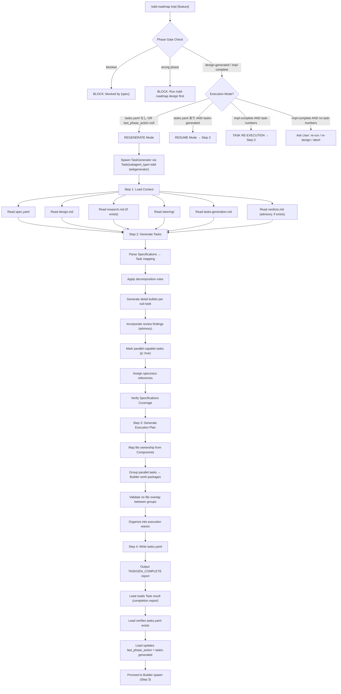
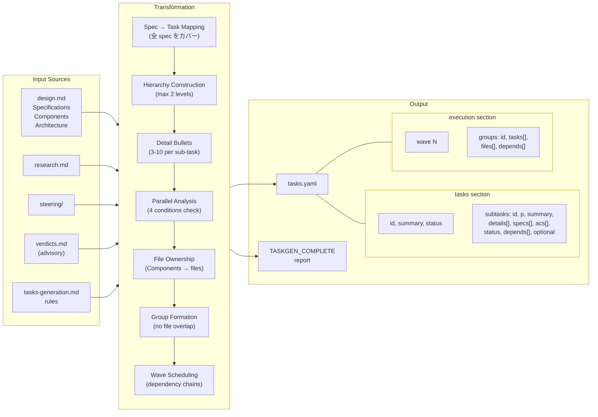

# Task Generation

## Specifications

### Introduction
設計ドキュメント (design.md) から実装タスクリスト (tasks.yaml) への変換パイプライン。TaskGenerator agent が design.md の Specifications と Components を解析し、Builder 向けのタスク定義・並列実行分析・ファイル所有権グルーピング・Wave 構造を含む execution plan を生成する。`/sdd-roadmap impl` (Step 2: REGENERATE モード) がこの変換を orchestrate する。

### Spec 1: TaskGenerator Agent
**Goal:** design.md を入力とし tasks.yaml を自律的に生成する T3 エージェント

**Acceptance Criteria:**
1. Lead から受け取るコンテキスト（feature name, design path, research path, review findings）を元に動作する
2. 実行開始時に spec.yaml, design.md, research.md (存在する場合), steering/, tasks-generation.md を読み込む
3. design.md の Specifications セクションの全 spec を tasks セクションのタスクにマッピングする
4. design.md の Components セクションと Architecture Pattern & Boundary Map をファイル所有権マッピングに使用する
5. 並列実行可能なタスクに `p: true` を設定し、依存関係チェーンに基づく Wave 構造を生成する
6. Builder ワークパッケージ（execution groups）をグループ間のファイル重複なしで構成する
7. tasks.yaml を `{{SDD_DIR}}/project/specs/{feature}/tasks.yaml` に書き出す
8. spec.yaml は更新しない（Lead の責務）
9. `TASKGEN_COMPLETE` 構造化レポートを出力して終了する

### Spec 2: Task Decomposition Rules
**Goal:** design.md から tasks への分解基準を定義

**Acceptance Criteria:**
1. タスク記述は自然言語で機能・成果を記述する（ファイルパス、関数名、型定義などの実装詳細を含まない）
2. 各タスクは前のタスクの出力に基づいて構築され、孤立コードを生成しない
3. 最終タスクは統合タスクとしてシステム全体を結線する
4. spec.yaml の `language` フィールドで指定された言語でタスクを記述する
5. コーディング・テスト・技術セットアップタスクのみを含む（デプロイ、ドキュメント、ユーザーテストは除外）

### Spec 3: Task Hierarchy Structure
**Goal:** タスクの階層構造と ID 体系を定義

**Acceptance Criteria:**
1. 最大2レベル: Level 1 (major tasks: "1", "2", "3"...) と Level 2 (sub-tasks: "1.1", "1.2", "2.1"...)
2. 3レベル以上のネスト ("1.1.1") は禁止
3. Major task の番号は連番で増加し、重複しない
4. Sub-task の番号は major task ごとにリセットされる
5. Major task が単一の sub-task しか持たない場合、sub-task を major level に昇格して構造を簡潔化する
6. Container-only な major task（自身に detail bullets がない）はサマリーを簡潔にし、詳細は sub-tasks に委譲する

### Spec 4: Task Sizing & Detail Bullets
**Goal:** タスクの粒度と detail bullets の基準を定義

**Acceptance Criteria:**
1. Sub-task の作業量目安は 1-3 時間
2. 各 sub-task に 3-10 個の detail bullets（実装ガイダンス）を含む
3. Major task の sub-task 数は論理的なまとまりで決定する（任意の数値制約を強制しない）
4. Design review findings が提供された場合、関連する findings を detail bullets に反映する（anti-pattern への対応、曖昧性の解消など）

### Spec 5: Specifications Mapping & Traceability
**Goal:** design.md の spec ID とタスクの対応関係を保証

**Acceptance Criteria:**
1. 各 sub-task に `specs:` フィールドを必須で含める（数値 spec ID の YAML リスト）
2. specs フィールドには数値 ID のみを記載する（説明文、括弧、ラベルを付加しない）
3. spec ID は `N.M` 形式を使用する（N = design.md の Spec 番号, M = ローカルインデックス）
4. Cross-cutting な spec は関連する全 spec ID をリストする
5. design.md に数値 ID が欠けている spec がある場合、タスク生成を停止し Specifications セクションの修正を求める
6. design.md の Specifications セクションの全 spec がタスクでカバーされていることを検証する（Specifications Coverage チェック）
7. 任意で `acs:` フィールドを追加し、task → AC → test の直接トレーサビリティを提供する（`AC: {feature}.S{N}.AC{M}` テストマーカー規約）

### Spec 6: Parallel Analysis
**Goal:** タスクの並列実行可能性を分析

**Acceptance Criteria:**
1. デフォルトで並列分析を有効にする（`--sequential` フラグで無効化可能）
2. 並列マーク (`p: true`) の4条件を全て満たすタスクのみマーク: (a) 他のタスクへのデータ依存がない、(b) ファイル/リソース競合がない、(c) 他タスクからのレビュー/承認待ちがない、(d) 必要な環境/セットアップが満たされている
3. Architecture Pattern & Boundary Map で定義された境界内で独立して動作するタスクのみを並列候補とする
4. design.md の API/event contracts が競合しないことを確認する
5. Container-only な major tasks には `p: true` を設定せず、sub-task レベルで評価する
6. 並列マーク前の品質チェック: merge/deployment 衝突なし、共有状態の期待が detail bullets に記載、独立テスト可能
7. Sequential モードが指定された場合、`p: true` を完全に省略する

### Spec 7: Execution Plan Generation
**Goal:** tasks を Builder ワークパッケージにグルーピングし Wave 構造を生成

**Acceptance Criteria:**
1. design.md の Components セクションからファイル所有権をマッピングする
2. 並列タスクをグループ間でファイル重複がない Builder ワークパッケージ（execution groups）に分類する
3. 依存関係チェーンに基づいてグループを execution waves に編成する
4. グループ間の順序を `depends` フィールドで表現する
5. 各グループに `id`（アルファベット）, `tasks`（タスク ID リスト）, `files`（ファイルリスト）を含める

### Spec 8: Optional Test Coverage Tasks
**Goal:** MVP 優先時の補助的テストタスクの延期可能化

**Acceptance Criteria:**
1. 設計が機能カバレッジを保証し MVP 迅速デリバリーが優先される場合、テスト特化の follow-up タスクに `optional: true` を設定可能
2. optional マーカーは design.md の Specifications セクションの acceptance criteria を detail bullets で直接参照する sub-task にのみ適用
3. 実装タスクや統合検証タスクは optional にしない

### Spec 9: tasks.yaml Output Format
**Goal:** tasks.yaml の YAML スキーマを定義

**Acceptance Criteria:**
1. トップレベルに `tasks` セクションと `execution` セクションを持つ
2. tasks セクション: `id`, `summary`, `status` (pending/done), `subtasks[]` (id, p, summary, details[], specs[], acs[], status, depends[], optional)
3. execution セクション: `wave[]` (wave番号, groups[]) > groups[] (id, tasks[], files[], depends[])
4. `status` フィールドは `pending` (未着手) または `done` (完了) のみ
5. `depends` フィールドはタスク ID のリスト（タスクレベル）またはグループ ID のリスト（グループレベル）

### Spec 10: /sdd-roadmap impl Integration (REGENERATE Mode)
**Goal:** `/sdd-roadmap impl` が TaskGenerator を spawn し tasks.yaml を取得するフロー

**Acceptance Criteria:**
1. tasks.yaml が存在しない、または `orchestration.last_phase_action` が null の場合に REGENERATE モードを発動
2. Lead が Task(subagent_type="sdd-taskgenerator") で TaskGenerator を spawn し、feature name, design path, research path (存在する場合), review findings (verdicts.md の latest design batch Tracked, 存在する場合) をコンテキストとして渡す
3. TaskGenerator の `TASKGEN_COMPLETE` レポートを Task result として読み取る
4. tasks.yaml の存在を検証する
6. `spec.yaml.orchestration.last_phase_action` を `"tasks-generated"` に更新する

### Non-Goals
- タスクの実行（tdd-execution spec のスコープ: Builder による TDD 実装）
- クロススペックのファイル所有権解決（roadmap-orchestration spec のスコープ: Lead による Layer 2 解決）
- design.md の生成・編集（design-pipeline spec のスコープ: Architect による設計生成）
- tasks.yaml のステータス更新（sdd-impl skill Step 3 で Lead が `done` マーク）

## Overview

Task Generation は SDD フレームワークの Stage 2 (Implementation) の前半を担う変換ステップ。design.md で定義された仕様・コンポーネント・アーキテクチャ境界を、Builder が実装可能な具体的タスクリストと実行計画に変換する。

**Purpose**: 設計と実装の間の橋渡し。設計ドキュメントの抽象的な仕様を、TDD サイクルで実装可能な粒度のタスクに分解し、並列実行の最適化とファイル所有権の衝突回避を保証する。

**Users**: Lead (TaskGenerator の spawn と結果の検証), Builder (tasks.yaml のタスク定義に基づく TDD 実装)

**Impact**: design.md の全仕様が漏れなくタスクにマッピングされ、execution plan により Builder の並列実行が安全に行われる。

## Architecture

### Architecture Pattern & Boundary Map

TaskGenerator は T3 Execute 層のエージェントとして動作し、Lead → TaskGenerator の 1:1 パイプラインで設計からタスクへの変換を実行する。

```
Lead (T1)
  │
  ├── Phase Gate (spec.yaml 検証)
  │
  ├── REGENERATE 判定
  │     │
  │     ▼
  │   TaskGenerator (T3) ── tasks-generation rules
  │     │                      │
  │     │  reads               │ applies
  │     ▼                      ▼
  │   design.md ──────────→ tasks.yaml
  │   research.md (optional)
  │   steering/
  │   verdicts.md (advisory)
  │     │
  │     ▼
  │   TASKGEN_COMPLETE report
  │
  ▼
Builder spawn (tdd-execution scope)
```

**Architecture Integration**:
- Selected pattern: 1:1 Lead-SubAgent pipeline (TaskGenerator は単一インスタンスで動作)
- Domain boundary: TaskGenerator は tasks.yaml の生成のみを担当。spec.yaml の更新は Lead、タスクの実行は Builder
- Existing patterns preserved: SubAgent の `Task(subagent_type="sdd-taskgenerator")` spawn → Task result パターン
- Artifact ownership: tasks.yaml の構造変更は TaskGenerator のみ。Lead は status 更新のみ許可

### Technology Stack

| Layer | Choice / Version | Role in Feature | Notes |
|-------|------------------|-----------------|-------|
| Agent Definition | YAML frontmatter (sdd-taskgenerator.md) | TaskGenerator の振る舞い定義 | model: sonnet |
| Rule Definition | Markdown (tasks-generation.md) | タスク分解・並列化ルール | TaskGenerator が実行時に読み込む |
| Skill Orchestration | Markdown (sdd-roadmap/SKILL.md) | REGENERATE mode で spawn を制御 | Lead が実行 |
| Output Format | YAML (tasks.yaml) | タスク定義と execution plan | 2セクション構成 |
| Agent Infrastructure | Claude Code SubAgent | Task(subagent_type=...) spawn | .claude/agents/ YAML frontmatter format |

## System Flows

### design.md → tasks.yaml Transformation Flow



### TaskGenerator Internal Processing



## Specifications Traceability

| Specification | Summary | Components | Interfaces |
|---------------|---------|------------|------------|
| 1 (TaskGenerator Agent) | T3 エージェントの振る舞い定義 | sdd-taskgenerator agent | Spawn context input, TASKGEN_COMPLETE output |
| 2 (Task Decomposition Rules) | 自然言語記述、統合性、コードのみ | tasks-generation rule | tasks-generation.md Core Principles |
| 3 (Task Hierarchy Structure) | 2レベル、ID 連番、構造簡潔化 | tasks-generation rule | tasks-generation.md Task Hierarchy Rules |
| 4 (Task Sizing & Detail Bullets) | 粒度基準、detail bullets | tasks-generation rule, sdd-taskgenerator agent | tasks-generation.md Flexible Task Sizing |
| 5 (Specs Mapping & Traceability) | spec ID マッピング、カバレッジ検証 | tasks-generation rule | tasks-generation.md Specifications Mapping/Coverage |
| 6 (Parallel Analysis) | 並列実行分析、4条件、品質チェック | tasks-generation rule | tasks-generation.md Parallel Analysis |
| 7 (Execution Plan Generation) | Builder グルーピング、Wave 構造 | sdd-taskgenerator agent, tasks-generation rule | tasks-generation.md Execution Plan Generation |
| 8 (Optional Test Coverage) | 延期可能テストタスク | tasks-generation rule | tasks-generation.md Optional Test Coverage Tasks |
| 9 (tasks.yaml Output Format) | YAML スキーマ定義 | tasks-generation rule | tasks-generation.md YAML Output Format |
| 10 (/sdd-roadmap impl Integration) | REGENERATE mode フロー | sdd-roadmap impl skill | sdd-roadmap SKILL.md Step 2 |

## Components and Interfaces

| Component | Domain/Layer | Intent | Req Coverage | Files |
|-----------|--------------|--------|--------------|-------|
| sdd-taskgenerator agent | Agent (T3 Execute) | design.md → tasks.yaml 変換 | 1, 4, 7 | `.claude/agents/sdd-taskgenerator.md` |
| tasks-generation rule | Rule (Settings) | タスク分解・並列化・出力形式ルール | 2, 3, 4, 5, 6, 7, 8, 9 | `framework/claude/sdd/settings/rules/tasks-generation.md` |
| sdd-roadmap impl (Step 2) | Skill (Orchestration) | REGENERATE mode での TaskGenerator spawn | 10 | `framework/claude/skills/sdd-roadmap/SKILL.md` |

### Agent Layer (T3 Execute)

#### sdd-taskgenerator agent

| Field | Detail |
|-------|--------|
| Intent | design.md を解析し tasks.yaml を生成する T3 エージェント |
| Requirements | 1, 4, 7 |
| Model | sonnet |
| Tools | Read, Write, Edit, Glob, Grep |
| Permission | bypassPermissions |

**Responsibilities & Constraints**
- design.md の Specifications / Components / Architecture を解析してタスクを生成する
- tasks-generation.md のルールを厳密に適用する
- spec.yaml は更新しない（Lead の artifact ownership boundary）
- tasks.yaml の生成のみが成果物（他の artifacts は変更しない）

**Agent Profile**: `.claude/agents/sdd-taskgenerator.md` — Lead が `Task(subagent_type="sdd-taskgenerator")` で spawn する

**Dependencies**
- Inbound: Lead (Task spawn) — feature name, design path, research path, review findings (P0)
- Inbound: design.md — Specifications, Components, Architecture Pattern & Boundary Map (P0)
- Inbound: research.md — 調査記録 (P1, optional)
- Inbound: steering/ — プロジェクトコンテキスト (P1)
- Inbound: verdicts.md — design review findings, advisory (P1, optional)
- Inbound: tasks-generation.md — タスク分解ルール (P0)
- Outbound: tasks.yaml — タスク定義と execution plan (P0)
- Outbound: TASKGEN_COMPLETE report — Lead への完了通知 (P0)

**Input Context (Spawn Prompt)**:
```
Feature: {feature}
Design: {{SDD_DIR}}/project/specs/{feature}/design.md
Research: {{SDD_DIR}}/project/specs/{feature}/research.md (if exists)
Review findings (advisory): from verdicts.md latest design batch Tracked (if exists)
```

**Execution Steps**:
1. **Load Context**: spec.yaml, design.md, research.md (optional), steering/, tasks-generation.md を読み込む
2. **Generate Tasks**: ルール適用、spec マッピング、detail bullets 生成、並列分析、カバレッジ検証
3. **Generate Execution Plan**: ファイル所有権マッピング、グルーピング、Wave 構造生成
4. **Finalize**: tasks.yaml を書き出す

**Completion Report Format**:
```
TASKGEN_COMPLETE
Feature: {feature}
Tasks: {X} major, {Y} sub-tasks
Parallel tasks: {list of p:true tasks}
Specs covered: {all/partial}
Execution: {N} waves, {M} groups
```

### Rule Layer (Settings)

#### tasks-generation rule

| Field | Detail |
|-------|--------|
| Intent | タスク分解・並列化・出力形式の包括的ルールセット |
| Requirements | 2, 3, 4, 5, 6, 7, 8, 9 |

**Responsibilities & Constraints**
- タスク記述の自然言語基準を定義（実装詳細を含まない）
- タスク統合・進行ルールを定義（孤立コード防止、統合タスクでの結線）
- 2レベル階層と ID 体系を定義
- 並列分析の4条件と品質チェックを定義
- Specifications Coverage の必須チェックを定義
- tasks.yaml の YAML スキーマを定義
- Execution Plan Generation のルールを定義

**Rule Sections**:

| Section | 対応 Spec | 内容 |
|---------|----------|------|
| Core Principles §1: Natural Language Descriptions | Spec 2 | Describe (機能、ビジネスロジック) vs Avoid (ファイルパス、関数名) |
| Core Principles §2: Task Integration & Progression | Spec 2 | 前タスク依存、統合タスク、アーキテクチャ境界遵守 |
| Core Principles §3: Flexible Task Sizing | Spec 4 | Sub-task 1-3h, 3-10 details, 論理グルーピング |
| Core Principles §4: Specifications Mapping | Spec 5 | specs フィールド必須、N.M 形式、カバレッジ検証 |
| Core Principles §5: Code-Only Focus | Spec 2 | コーディング・テスト・技術セットアップのみ |
| Optional Test Coverage Tasks | Spec 8 | `optional: true` の適用条件 |
| Task Hierarchy Rules | Spec 3, 6 | 2レベル、連番、並列分析、YAML 出力形式 |
| Execution Plan Generation | Spec 7 | ファイル所有権、グループ形成、Wave 構造 |
| Specifications Coverage | Spec 5 | 全 spec カバー必須、ギャップ時は design phase に戻す |

### Skill Layer (Orchestration)

#### /sdd-roadmap impl (REGENERATE Mode — Step 2)

| Field | Detail |
|-------|--------|
| Intent | TaskGenerator の spawn・結果検証・spec.yaml 更新 |
| Requirements | 10 |

**Responsibilities & Constraints**
- Phase Gate を通過した後の REGENERATE 判定（tasks.yaml なし OR last_phase_action null）
- TaskGenerator を Task(subagent_type="sdd-taskgenerator") で spawn（コンテキスト付与）
- TASKGEN_COMPLETE レポートの読み取り（Task result として取得）
- tasks.yaml 存在の検証
- `spec.yaml.orchestration.last_phase_action` = `"tasks-generated"` への更新

**Execution Modes (Step 2)**:

| Mode | Condition | Action |
|------|-----------|--------|
| REGENERATE | tasks.yaml なし OR last_phase_action null | TaskGenerator spawn → tasks.yaml 生成 |
| RESUME | tasks.yaml あり AND last_phase_action == "tasks-generated" | 既存 tasks.yaml を使用 |
| TASK RE-EXECUTION | phase == impl-complete AND task-numbers 指定 | 既存 tasks.yaml + 指定タスクのみ |
| COMPLETED WITHOUT TASK SPEC | phase == impl-complete AND task-numbers なし | ユーザーに選択肢提示 |

## Data Models

### tasks.yaml Schema

```yaml
# tasks section: タスク定義
tasks:
  - id: "1"                    # Major task ID (連番)
    summary: "..."             # 自然言語の機能記述
    status: pending            # pending | done
    subtasks:
      - id: "1.1"             # Sub-task ID (major.sub)
        p: true                # 並列実行可能 (optional, default false)
        summary: "..."         # 自然言語の機能記述
        details:               # 実装ガイダンス (3-10 items)
          - "..."
          - "..."
        specs: [1.1, 1.2]     # design.md spec ID (mandatory, N.M format)
        acs: [S1.AC1, S1.AC2] # AC ID (optional, test traceability)
        status: pending        # pending | done
        depends: []            # 依存タスク ID リスト
        optional: true         # 延期可能 (optional, test coverage only)

# execution section: Builder ワークパッケージ
execution:
  - wave: 1                    # Wave 番号 (依存関係順)
    groups:
      - id: A                  # グループ ID (アルファベット)
        tasks: ["1.1", "1.2"]  # 割り当てタスク ID
        files:                 # ファイル所有権 (グループ間重複なし)
          - src/auth/handler.py
          - src/auth/models.py
      - id: B
        tasks: ["2.1"]
        files:
          - src/api/routes.py
  - wave: 2
    groups:
      - id: C
        tasks: ["3.1"]
        files:
          - src/core/middleware.py
        depends: [A]           # グループ間依存
```

**Field Reference**:

| Field | Type | Required | Values | Description |
|-------|------|----------|--------|-------------|
| `id` | string | Yes | "N" or "N.M" | タスク識別子 |
| `summary` | string | Yes | 自然言語 | 機能・成果の記述 |
| `status` | string | Yes | pending / done | 実行状態 |
| `p` | boolean | No | true / omit | 並列実行可能フラグ |
| `details` | list[string] | Yes (sub-task) | 3-10 items | 実装ガイダンス |
| `specs` | list[number] | Yes (sub-task) | N.M format | design.md spec ID |
| `acs` | list[string] | No | S{N}.AC{M} | AC トレーサビリティ |
| `depends` | list[string] | No | task/group IDs | 依存関係 |
| `optional` | boolean | No | true / omit | 延期可能フラグ |
| `wave` | integer | Yes (execution) | 1, 2, 3... | Wave 番号 |
| `groups[].id` | string | Yes (execution) | A, B, C... | Builder グループ ID |
| `groups[].tasks` | list[string] | Yes (execution) | task IDs | 割り当てタスク |
| `groups[].files` | list[string] | Yes (execution) | file paths | ファイル所有権 |
| `groups[].depends` | list[string] | No (execution) | group IDs | グループ間依存 |

## Error Handling

### Error Strategy

TaskGenerator のエラーは Lead (sdd-impl skill) が検知し、ユーザーにエスカレーションする。

### Error Categories and Responses

| Category | Trigger | Response |
|----------|---------|----------|
| Missing design.md | design.md が存在しない | Lead が BLOCK: "Run `/sdd-roadmap design {feature}` first." |
| Wrong phase | phase が design-generated/impl-complete でない | Lead が BLOCK: "Phase is '{phase}'. Run `/sdd-roadmap design {feature}` first." |
| Blocked spec | phase == blocked | Lead が BLOCK: "{feature} is blocked by {blocked_info.blocked_by}." |
| Specifications Coverage gap | design.md の spec がタスクにマッピングされていない | TaskGenerator がタスク生成を停止、設計フェーズへの差し戻しを報告 |
| Missing spec ID in design.md | Specifications セクションに数値 ID がない spec がある | TaskGenerator が停止、Specifications セクションの修正を要求 |
| Artifact verification failure | tasks.yaml が生成されない | Lead が spec.yaml を更新しない、ユーザーにエスカレーション |

## Testing Strategy

### Verification Points (Agent/Rule artifacts — no executable tests)

本 spec のアーティファクトは Markdown/YAML ドキュメントであり、従来の自動テストは適用されない。品質は以下の検証ポイントで担保する:

1. **Specifications Coverage**: TaskGenerator が生成する tasks.yaml が design.md の全 spec をカバーしていることの検証（TaskGenerator の Step 2 内で実行）
2. **File Ownership Integrity**: execution groups 間でファイル重複がないことの検証（TaskGenerator の Step 3 内で実行）
3. **Hierarchy Compliance**: 2レベル制限、連番、構造簡潔化ルールの遵守（tasks-generation.md ルールによる制約）
4. **Parallel Safety**: p: true タスクが4条件を全て満たすことの検証（TaskGenerator の Step 2 内で実行）
5. **Integration Test (End-to-End)**: `/sdd-roadmap impl {feature}` 実行時に tasks.yaml が正しく生成され、Builder spawn に進めることの検証（sdd-roadmap impl のフロー全体で検証）

## Revision Notes
### v1.1.0 (2026-02-22) — v0.18.0 Retroactive Alignment
- Agent 定義パス: `framework/claude/agents/sdd-taskgenerator.md` → `framework/claude/sdd/settings/agents/sdd-taskgenerator.md`
- 個別コマンド参照を `/sdd-roadmap` サブコマンドに更新

### v1.2.0 — SubAgent Migration
- Agent file path: `sdd/settings/agents/` → `.claude/agents/` (YAML frontmatter format)
- Spawn mechanism: `TeammateTool` → `Task(subagent_type="sdd-taskgenerator")`
- Communication: idle notification → Task result
- Output suppression rationale: idle notification leak prevention → Lead context budget protection
- Behavioral content unchanged
