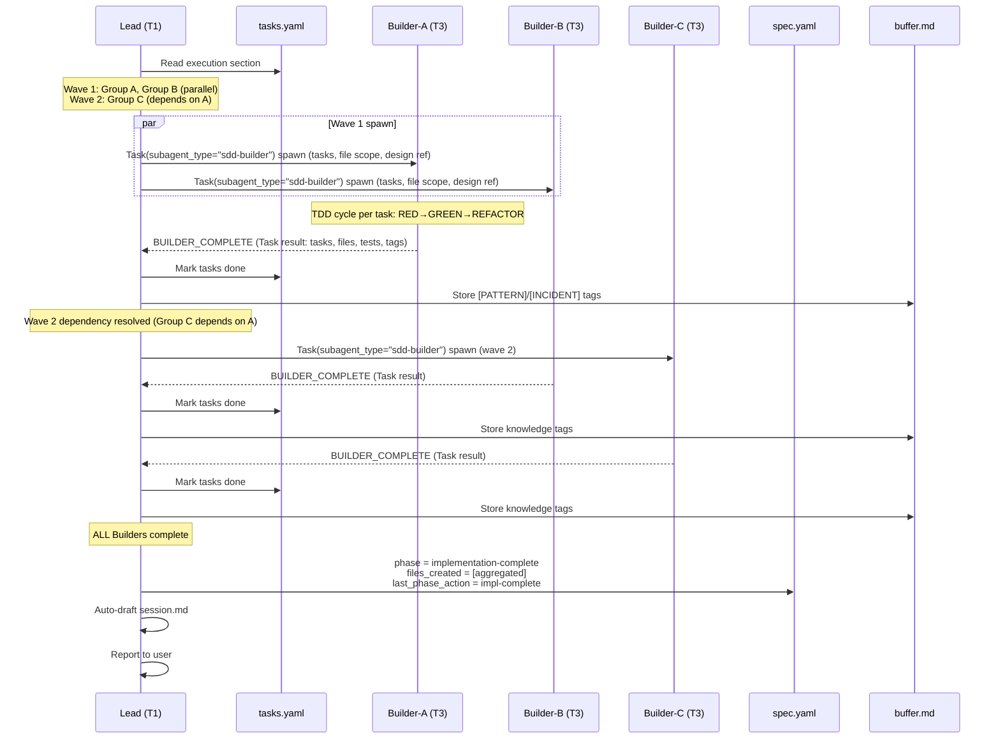
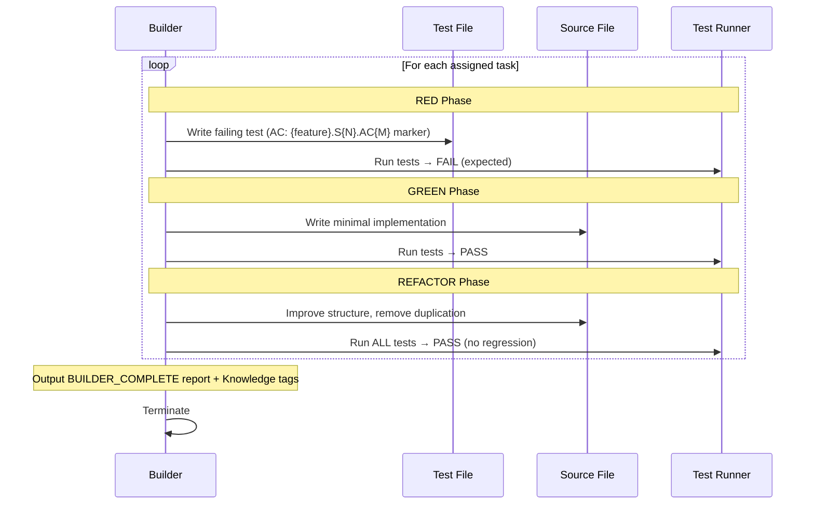
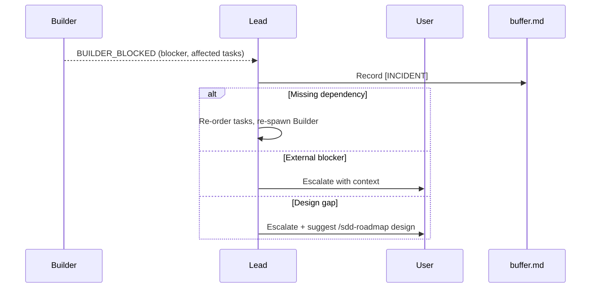

# TDD Execution

## Specifications

### Introduction
TDD (Test-Driven Development) による実装実行パイプライン。`/sdd-roadmap impl` の Step 3 以降のフェーズに相当し、tasks.yaml の execution セクションに基づいて Builder SubAgent を `Task(subagent_type="sdd-builder")` で spawn し、RED→GREEN→REFACTOR サイクルでタスクを実装する。Lead は Builder の Task result を incremental に処理し、タスクステータス更新・Knowledge tag 収集・次 wave Builder の即時 spawn を行う。複数 Builder の並列実行とファイルスコープ分離により、安全な並行開発を実現する。

### Spec 1: Builder Spawning & Work Package Construction
**Goal:** tasks.yaml の execution セクションから Builder ワークパッケージを構築し、Task(subagent_type="sdd-builder") で spawn する

**Acceptance Criteria:**
1. tasks.yaml の `execution` セクションを読み込み、wave ごとの group 定義を抽出する
2. 各 group の `tasks` リストから tasks セクションのタスク定義（ID、summary、detail bullets、specs、depends）を取得する
3. `{task-numbers}` 引数が指定されている場合、指定されたタスク番号のみにフィルタリングする
4. group ごとに spawn prompt を構築する: Feature 名、Task IDs + summaries + detail bullets、File scope（execution group の files）、Design ref パス、Research ref パス（存在する場合）
5. 依存タスクがある group には `Depends on: Tasks {numbers} (wait for completion)` を spawn context に含める
6. 各 group に対して `Task(subagent_type="sdd-builder")` で Builder を spawn する（同一 wave 内の group は並列 spawn）
7. spawn される Builder SubAgent は `sdd-builder` agent 定義（`.claude/agents/sdd-builder.md`、model: sonnet, permissionMode: bypassPermissions）を使用する

### Spec 2: TDD Cycle (RED→GREEN→REFACTOR)
**Goal:** Builder agent 内部での Kent Beck TDD サイクルに基づく実装

**Acceptance Criteria:**
1. **RED phase**: テストを先に書く — 機能の次の小さな部分に対するテストを作成し、コードが存在しないため失敗することを確認する
2. **RED phase**: テスト docstring/comment に traceability marker `AC: {feature}.S{N}.AC{M}` を含める
3. **GREEN phase**: テストが通る最小限の実装を書く — THIS テストのみを pass させることに集中し、over-engineering を避ける
4. **REFACTOR phase**: コード構造と可読性を改善する — 重複を除去し、デザインパターンを適切に適用する
5. **VERIFY step**: 全テスト（新規 + 既存）が pass することを確認し、既存機能へのリグレッションがないことを検証する
6. **MARK COMPLETE step**: タスクが参照する全 AC に対応するテストマーカーが存在することを検証する
7. `optional: true` のタスクは完了をブロックしない

### Spec 3: File Scope Enforcement
**Goal:** 並列 Builder 間のファイル競合を防止するスコープ制御

**Acceptance Criteria:**
1. Builder は spawn 時に割り当てられた file scope 内のファイルのみを変更する
2. file scope 外のファイルの読み取りは許可される（参照のみ）
3. scope 外のファイルへの書き込みが必要な場合、Builder は completion report に conflict を報告し、該当ファイルの作業を停止する
4. ファイル所有権は advisory（助言的）であり、ファイルシステムレベルでは強制されない
5. Cross-spec 統合が明示的にタスクで要求されている場合のみ、他スペックの Builder 所有ファイルへの書き込みが許容される

### Spec 4: Incremental Completion Processing
**Goal:** 複数 Builder の並列実行時、Lead が各 Builder の完了を逐次処理する

**Acceptance Criteria:**
1. 各 Builder の Task result 到着時に、Lead は即座に completion report を読み取る
2. completion report から以下を抽出する: completed tasks リスト、created/modified files、test results (pass/total)、knowledge tags、blocker reports
3. tasks.yaml の該当タスクを `done` に更新する（Lead は task status updates のみ許可）
4. Knowledge tags ([PATTERN], [INCIDENT], [REFERENCE]) を `handover/buffer.md` の Knowledge Buffer に書き込む
5. 次 wave の依存が解消されたタスクがあれば、次 wave Builder を即座に spawn する
6. **最終 spec.yaml 更新は全 Builder 完了後にのみ実行**: `phase` = `implementation-complete`、`implementation.files_created` = 集約ファイルリスト、`version_refs.implementation` = current version、`orchestration.last_phase_action` = `impl-complete`、changelog 更新

### Spec 5: Blocker Classification & Escalation
**Goal:** Builder がブロックされた際の原因分類と適切な対応

**Acceptance Criteria:**
1. Builder は `BUILDER_BLOCKED` レポートを出力する（Feature、Blocker description、Tasks affected、Attempted の構造）
2. Lead は blocker を以下の3カテゴリに分類する:
   - **Missing dependency** (他タスクのコードが未完了): 残タスクの順序を変更し、依存タスクを優先して Builder を re-spawn する
   - **External blocker** (API 不可、環境問題): ユーザーにコンテキスト付きでエスカレーションする
   - **Design gap** (設計通りに実装不可): ユーザーにエスカレーションし、`/sdd-roadmap design {feature}` による再設計を提案する
3. 全ての blocker を `handover/buffer.md` に `[INCIDENT]` タグで記録する
4. blocker 発生時、Lead は spec.yaml を更新せず、ユーザーまたは再構成による解決を待つ

### Spec 6: Builder Completion Report Protocol
**Goal:** Builder → Lead 間の構造化された完了通知プロトコル

**Acceptance Criteria:**
1. 成功時: `BUILDER_COMPLETE` ヘッダー、Feature 名、Tasks completed リスト、Files リスト（created/modified パス）、Tests 結果（pass count/total count）、Phase 情報を出力する
2. ブロック時: `BUILDER_BLOCKED` ヘッダー、Feature 名、Blocker description、Tasks affected リスト、Attempted（試行内容）を出力する
3. Knowledge tags がある場合、completion report の末尾に `[PATTERN]`/`[INCIDENT]`/`[REFERENCE]` タグ付きで含める
4. Builder は report 出力後、即座に terminate する（追加作業なし）
5. Builder は spec.yaml と tasks.yaml を直接更新しない — 全てのメタデータ更新は Lead の責務

### Spec 7: Post-Completion Processing
**Goal:** 全 Builder 完了後の後処理とユーザー報告

**Acceptance Criteria:**
1. standalone モード（roadmap run 外）の場合、Knowledge Buffer の内容を `project/knowledge/` にフラッシュする
2. `handover/session.md` を auto-draft する（Accomplished セクション更新、Next Action 更新）
3. ユーザーに以下を報告する: 実行タスク数とテスト結果、書き込まれた Knowledge entries（あれば）、残タスク数、次のアクション（`/sdd-review impl {feature}` または追加タスクの続行）

### Non-Goals
- タスクの生成・分解（task-generation spec のスコープ）
- 実装コードのレビュー（impl-review spec のスコープ）
- Phase gate チェックと Execution mode 判定（sdd-roadmap impl の Step 1-2）
- Cross-spec ファイル所有権の解決（roadmap-orchestration spec のスコープ）
- Auto-Fix ループの Builder re-spawn（roadmap-orchestration spec の Auto-Fix Loop）

## Overview

Stage 2 (Implementation) の中核実行フェーズ。`/sdd-roadmap impl` が tasks.yaml の execution セクションを解析し、Builder グループを `Task(subagent_type="sdd-builder")` で spawn する。各 Builder は TDD (RED→GREEN→REFACTOR) サイクルでタスクを実装し、構造化された completion report を Task result として出力する。Lead は各 Builder の完了を incremental に処理し、タスクの `done` マーキング、Knowledge tag の buffer.md 蓄積、次 wave Builder の即時 spawn を行う。全 Builder 完了後、spec.yaml を `implementation-complete` に遷移させる。

## Architecture

### Architecture Pattern & Boundary Map

```
Lead (T1, Opus)
  │
  ├── [reads] tasks.yaml execution section
  │     └── wave 1: group A (tasks 1.1, 1.2), group B (tasks 2.1)
  │     └── wave 2: group C (tasks 3.1) depends on [A]
  │
  ├── [spawns] Builder-A (T3, Sonnet) ── file scope: {group A files}
  ├── [spawns] Builder-B (T3, Sonnet) ── file scope: {group B files}
  │     │
  │     └── [on completion] Lead processes report → marks tasks done
  │                         → spawns Builder-C (wave 2 unblocked)
  │
  └── [final] All Builders complete → update spec.yaml
```

### Technology Stack

| Layer | Choice / Version | Role in Feature | Notes |
|-------|------------------|-----------------|-------|
| Orchestration | sdd-roadmap impl (Markdown) | Builder spawn と incremental processing | Step 3-4 |
| Agent | sdd-builder SubAgent | TDD 実装実行 | model: sonnet |
| Agent API | Task(subagent_type=...) | Builder spawn | SubAgent API |
| State | spec.yaml / tasks.yaml | Phase 管理 / タスクステータス | Lead 所有 |
| Knowledge | buffer.md | Tag 蓄積 | Lead exclusive write |

## System Flows

### Lead → Builder TDD Execution Flow



### Builder TDD Cycle (RED→GREEN→REFACTOR)



### Blocker Handling Flow



## Components and Interfaces

| Component | Domain/Layer | Intent | Files |
|-----------|--------------|--------|-------|
| sdd-roadmap impl (Steps 3-4) | Skill / Orchestration | Builder spawn、incremental processing | `framework/claude/skills/sdd-roadmap/SKILL.md` |
| sdd-builder SubAgent | Agent (T3) | TDD サイクル実行 | `.claude/agents/sdd-builder.md` |

### Interface Contracts

#### Spawn Prompt (Lead → Builder)

```
Feature: {feature}
Tasks: {task IDs + summaries + detail bullets}
File scope: {files from execution group}
Design ref: {SDD_DIR}/project/specs/{feature}/design.md
Research ref: {SDD_DIR}/project/specs/{feature}/research.md (if exists)
Depends on: Tasks {numbers} (wait for completion)
```

#### BUILDER_COMPLETE (Builder → Lead)

```
BUILDER_COMPLETE
Feature: {feature}
Tasks completed: {list}
Files: {created/modified file paths}
Tests: {pass count}/{total count}
Phase: {design-generated | implementation-complete}
```

#### BUILDER_BLOCKED (Builder → Lead)

```
BUILDER_BLOCKED
Feature: {feature}
Blocker: {description}
Tasks affected: {list}
Attempted: {what was tried}
```

## Revision Notes
### v1.1.0 (2026-02-22) — v0.18.0 Retroactive Alignment
- Agent 定義パス: `framework/claude/agents/sdd-builder.md` → `framework/claude/sdd/settings/agents/sdd-builder.md`
- `/sdd-impl` は `/sdd-roadmap impl` へのリダイレクトスタブに変更
- 個別コマンド参照を `/sdd-roadmap` サブコマンドに更新

### v1.2.0 — SubAgent Migration
- Agent file path: `sdd/settings/agents/` → `.claude/agents/` (YAML frontmatter format)
- Spawn mechanism: `TeammateTool` → `Task(subagent_type="sdd-builder")`
- Communication: idle notification → Task result
- Output suppression rationale: idle notification leak prevention → Lead context budget protection
- Behavioral content unchanged
